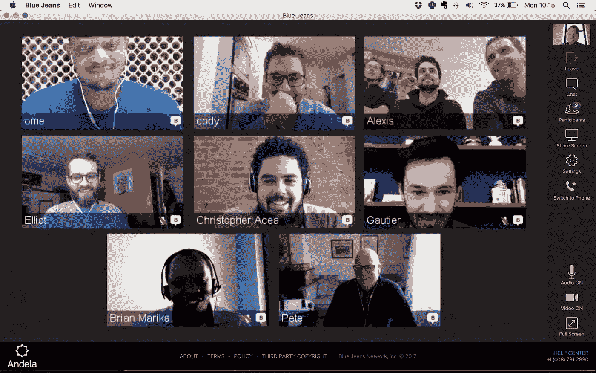
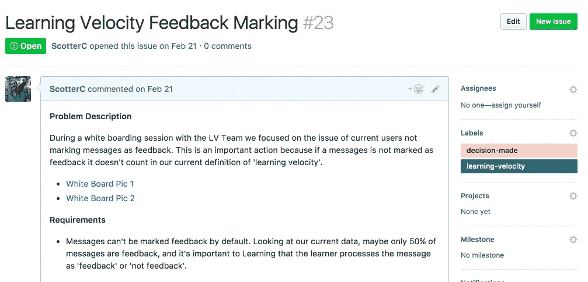

# 工程经理未来工作指南

> 原文：<https://medium.com/hackernoon/an-engineering-managers-guide-to-the-future-of-work-2d139eb3137e>

Andela <> Zapier team meeting or Brady Bunch intro?

上个月，Stack Overflow 发布了其年度开发者调查，调查了全球超过 64，000 名开发者，了解他们最喜欢的技术、编码习惯和工作偏好。一个关键的亮点是对分布式工作的强烈偏好。大多数开发人员(64%)表示每月至少远程工作一天，11%表示全职远程工作。更能说明问题的是，开发人员将“远程选项”列为重中之重——[终极办公室津贴](https://qz.com/950973/remote-work-for-programmers-the-ultimate-office-perk-is-avoiding-the-office-entirely/)——在评估新工作机会时，仅次于休假天数。

如果你相信[的开发者正在为未来](https://www.joelonsoftware.com/2016/12/09/developers-are-writing-the-script-for-the-future/)写剧本，这些结果将表明下一个行动将是远程优先的。考虑到美国技术人才和[最近限制性工作政策](https://www.bloomberg.com/news/articles/2017-04-03/new-h-1b-guidelines-crack-down-on-computer-programmer-jobs)的严重[短缺，看起来分布式的](http://www.ciodive.com/news/skills-gap-clear-as-lack-of-software-talent-has-a-direct-revenue-impact/438544/)[未来工作](http://observer.com/2016/03/the-future-of-work-will-be-distributed/)可能会比预期更早到来。

然而，分布式是很难做好的——它需要很多深思熟虑的策略，而不仅仅是让远程员工处于闲置状态。如果科技公司想要有效地利用这种模式，他们必须 100%地投入。起初，它可能会导致一些成长中的烦恼，但是它最终会产生能够改善整个组织的沟通和效率的过程和系统。

在过去的六个月里，作为 Andela 的技术副总裁，我管理着一个近 40 人的团队——分布在纽约、拉各斯和内罗毕——他们正在开发我们需要的系统和工具，以使分散的团队变得优秀和有规模。对于安德拉来说，这意味着在不到 10 年的时间里从 500 人增长到 10 万人以上。

Andela’s Lagos, Nigeria HQ

GitHub 以及随之而来的 pull 请求是分布式工程团队的一个巨大转折点——它将所需的“工作”从 it 的“集成”中分离出来。现在，手头的挑战是在此基础上提出适用于公司共享环境的“拉式请求”。我们 500 多名员工中的任何一名，无论是工程师还是运营助理，是否能够在早上起床后准确地找出他们需要完成的工作，完成工作，提交请求，从持续集成中受益，并知道他们每天都在改进系统——即使他们所在的时区与他们的其他位置相距 8 小时？

我们正在努力，但这并不容易。在接下来的三篇博文中，我将深入探讨如何为分布式团队构建动态系统和控制，如何在分布式环境中开发人员，以及如何在高速增长的创业公司中扩展分布式团队。敬请期待！

# 第一部分:为分布式团队构建动态系统和控制

伟大的过程导致伟大的分布式工作。但是你猜怎么着？很少有团队，尤其是创业团队，拥有伟大的流程。除非你又老又笨，永远都有同样的过程，这种情况从来不会发生，否则事情可能变化得太快了。

## 唯结果论的工作环境

不存在适用于所有分布式公司的剧本，无论我们谈论的是部分分布式(即，你的两名工程师决定搬到波特兰)还是完全分布式(即，自动化，拥有 400 名全球员工的$1B 公司[在他们喜欢的任何地方工作](https://www.inc.com/glenn-leibowitz/meet-the-ceo-running-a-billion-dollar-company-with-no-offices-or-email.html))。

从第一天就开始构建分布式流程的公司(我和 Andela 来自那里)和试图在第 500 天实现分布式的公司之间也有区别。正如您所想象的，后者带来了更大的挑战，因为经理们的任务是改变现有的流程以适应新的远程团队成员。然而，在这两种情况下，都有必要一个接一个地建立流程，帮助每个人交换反馈、提出挑战，并在不依赖面对面交流的情况下清晰地沟通。

> 最终，分布式工作环境迫使管理者放弃控制权。

最终，分布式工作环境迫使管理者放弃控制权。当你异步工作时，你不可能有同样多的交互来解决问题。你不能阻止团队成员。结果，分布式迫使你将自主权和决策权推给你的团队。

你是怎么做到的？你创建了一个衡量系统，在这个系统中，每个人都认同并清楚地了解他们将被衡量的 KPI。测量应该尽可能的简单，所以你需要把问题分解成更小的部分来解决它们。在这一周结束时，你的目标应该是每个工程师有一个数字，每个团队有一个数字，这样你就可以客观地知道一个团队做得有多好，他们需要你多少关注。

一旦你选择了度量方法，并决定了基准，你就把团队扔出了门，看它如何进行。

只有当你认识到这些测量系统是完全不可靠的，并且它们会随着你的成长而改变，这种方法才会奏效。这些不是孤注一掷的测量，而是收集问题信息的方法——并告知未来的测量系统。你可能会觉得你放弃了很多控制，但是如果你仍然得到你想要的结果，那么谁会在乎呢？

## 信号与噪声

围绕远程工作的主要挑战归结为信号与噪声。当你仅仅依靠 Slack、电子邮件和 Google Hangouts 时，所有这些信息都是信号，并且带有同样的紧迫感或严重性。这对经理来说是一个挑战，因为当一个同事说，“你知道吗，这很令人沮丧，”你需要知道这种沮丧是在他们的内心深处还是顶部——如果是这样，这是你需要立即处理的事情。

换句话说，在分布式工作环境中，你没有帮助你校准信号有多严重的噪音。与团队成员一起喝啤酒是一种美妙的噪音，因为你对那个人足够了解，能够理解对他们来说什么是重要的，从而调整你们的沟通。

> 刚接触分布式的团队倾向于对所有事情都做出反应，这导致了一个常见的问题:信号过载

刚接触分布式的团队倾向于对所有事情都做出反应，这导致了一个常见的问题:信号过载。这些团队苦于他们松散的渠道上的信息过载，如 Google docs、GitHub、Trello 等。信息的发现是混乱和耗时的，当信息没有一个落脚点时，交流中的摩擦就会增加。

作为一个分布式经理，您必须确保信息是公开流动的，并且支持请求有一个容身之处。当你得到反馈时，重要的是要有适当的流程将信息提炼成有价值的东西，并且不要忘记它。例如，一旦创建了 GitHub 问题，就很容易围绕该问题进行合作和集中讨论——这是因为该问题是一个共享的上下文，如果你愿意，也可以说是一个“工件”。Trello 是一个很好的工具，可以捕捉不同的信息，围绕这些信息进行本地化对话，然后分配解决这些问题的流程。一致的回顾，明确地记录在 [google](https://hackernoon.com/tagged/google) docs 上，对于确保所有的声音都被听到并作为一个团队解决系统性问题是非常好的。

在一个信号过载的世界里，你需要确保你在通信中没有错过正确的信号。

## 管理松弛过载

懈怠是难以置信的压倒性的，这一切都是信号。我很喜欢 Slack，我们整个团队都在使用它，但它是一种工具——就像任何其他工具一样，你很容易滥用它。

最糟糕的情况是，聊天让我们有了这种[【永远在开会】](https://m.signalvnoise.com/is-group-chat-making-you-sweat-744659addf7d)的感觉，在这种情况下，什么都没有定义，行动项目也没有进行。在最好的情况下，它是一个异步工具，让每个人都了解情况，并停止后门，一对一的对话。 [ChatOps](https://hackernoon.com/tagged/chatops) ，作为一种开发技术，非常棒——例如，使用机器人来部署，这样每个人都知道发生了什么。

和大多数技术一样，你需要工具来创造你想要的行为，但是你需要改变文化和信仰来有效地使用工具。Slack 是一个解决问题的工具，但是结果必须存在于一个指定的地方，在那里它可以被执行和解决。

A place for information to live: i.e using GitHub issues for major decision making

有效地使用 Slack 意味着让所有事情都进入公共渠道——这有助于减少一对一的直接消息，这只会混淆问题。我相信一个工程团队的健康可以通过在一个给定的时间段内有多少问题被提出和解决，以及迭代有多快来衡量。那么，我们的目标是让这些问题立即公之于众，并分成足够小的部分，以便尽快解决它们。

在公共渠道中讨论的事情越多，解决方案就越多，能够参与和见证这些解决方案的人就越多，这就像一个反馈循环——谁不想合作解决问题呢？如果事情留在私下里，它们往往会停留更长时间得不到解决。

这并不像听起来那么简单。如果你在一个超过 500 人的组织中工作，比如安德拉，渠道很适合设定话题，但是很难管理。我们仍然处于了解如何培养这些社区以及如何设置 KPI 来让团队专注于改善我们的聊天行为的早期阶段。

> 优秀的分布式团队是良好流程的结果。

说回来:优秀的分布式团队是良好过程的结果。好的过程关注结果，为信息找到合适的归宿，并确保你的团队将问题公之于众，以便可以处理。在下一篇文章中，我将谈到在分布式环境中开发人员的特别困难的挑战。

> [黑客中午](http://bit.ly/Hackernoon)是黑客如何开始他们的下午。我们是 [@AMI](http://bit.ly/atAMIatAMI) 家庭的一员。我们现在[接受投稿](http://bit.ly/hackernoonsubmission)，并乐意[讨论广告&赞助](mailto:partners@amipublications.com)机会。
> 
> 如果你喜欢这个故事，我们推荐你阅读我们的[最新科技故事](http://bit.ly/hackernoonlatestt)和[趋势科技故事](https://hackernoon.com/trending)。直到下一次，不要把世界的现实想当然！

