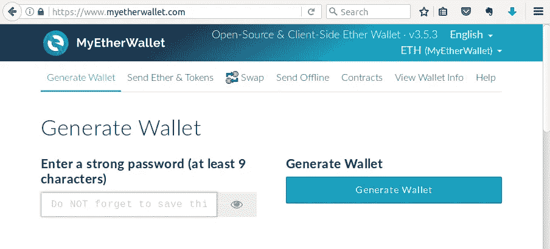
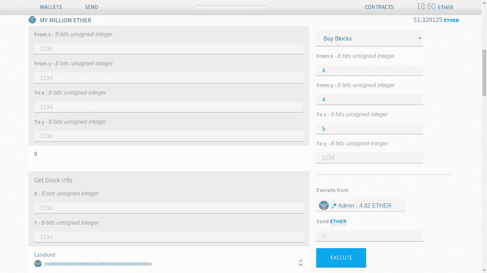
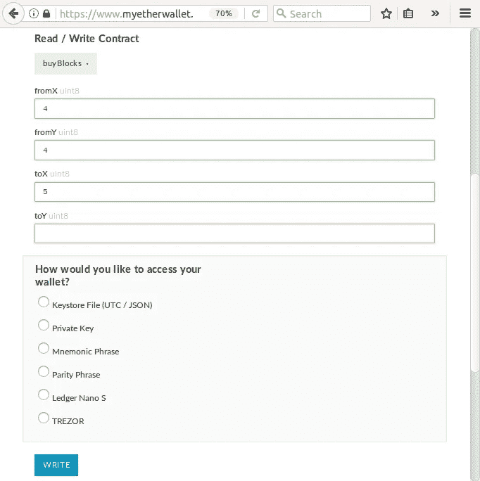

# 一个企业家、程序员和用户签订了一份智能合同——以太坊区块链创业指南

> 原文：<https://medium.com/hackernoon/an-entrepreneur-programmer-and-user-walk-into-a-smart-contract-the-ultimate-ethereum-blockchain-7b8dbd0c8463>

## life hack——你不需要了解区块链就能建立一个智能合同创业公司


Entrepreneurs guide to smart contracts

我完成了我的智能合同项目，但在阅读关于区块链的讨论时，我仍然觉得自己是个十足的菜鸟。我要学的东西太多了。但是，嘿，我的项目成功了！何必呢？尽管区块链很酷，理解技术也很酷，但没必要什么都懂。

从企业家的角度来看看智能合同——关注你如何从中受益:

*   你实际上能做什么样的项目？
*   有哪些商业模式？
*   MVP 应该是什么样的？
*   吸引用户、找到程序员和建立基础设施需要什么？

本指南包含示例和练习，将向您展示智能合约的实用一面，并帮助您评估您的想法或产生一个新的想法。把它作为你进一步调查的起点。

# 关于区块链，你需要知道什么，你可以跳过什么

**采矿**。首先要跳过的。从企业家的角度来看，采矿更像是玩股票市场——购买设备，分析奖励价格图表，并决定将你的计算能力投资于哪种加密货币。但是，如果你正在处理智能合同，你不必关心采矿，因为当你访问一个网站时，你不关心互联网提供商。

**块、散列、加密**和所有那些数学——我们也要忽略它。重要的实际结果可以归结为这样一句口头禅:“进入区块链的任何东西都将永远留在那里，任何东西都可以核实，但任何东西都不能改变”。实际上，这意味着数据被永久、透明和安全地存储。

现在让我们转向那些你离不开的术语，并解释它们，就好像现在是 2005 年一样。

**区块链就像一个 BitTorrent 网络**。你电脑上的一个程序下载文件，然后把它们分发出去。但是这个程序叫做**区块链客户端**而不是 torrent 客户端。而你下载的那些文件存储的是交易而不是视频和音乐。发件人、收件人、日期时间和数量—记录被一个接一个地存储(是的，它们被存储在块中，但谁在乎呢)。运行区块链客户端的每个人都有自己的整个区块链数据库的副本，并保存所有曾经进行的交易。这个数据库是巨大的。以太坊区块链目前约为 43 GB，比特币为 [125.78 GB](https://bitinfocharts.com/) 。待办事项

**加密货币是一系列货币转账。**在区块链世界，你的余额不仅仅是一条记录，而是你所有收入和支出的总和(整个交易历史)。如果区块链存储的交易只包含资金转移(发送方地址、接收方地址和发送的金额)，我们将这种类型的区块链称为加密货币。比特币——是一种加密货币。但是任何事务只是文件中的一个字符串，因此它可能包含任何信息。反过来，一个地址可能不属于一个人…这给了我们比加密货币更广泛的机会。

**智能合约就像一个网站。**一个区块链地址可能属于一个程序。一个程序被称为智能合同。之所以称之为契约，只是因为代码是开放的。然而，将它比作一个网站(或 web 服务)更简单。例如，分类广告服务可以是智能合同。它的代码将被存储在区块链的一个特定地址——就像一个网站的 url。到这个地址的交易不会包含钱，而是包含广告文本。并且智能合同将发布该广告，即保存到区块链。

**以太坊就像互联网**以太坊——就是那种区块链，在这里交易可能不仅包含金钱，还包含数据。区块链数据库(人们下载的那些文件)存储了人与人之间的交易、涉及智能合同的交易以及合同源代码。这使得以太坊成为一种新型的互联网，它由参与其中的每个人存储在本地。

这对于理论来说已经足够了。其余的你将从实践中了解它的含义。

# 智能合同和传统网站之间有什么区别

智能契约驱动的服务有什么优点(和缺点)。

## 开放性和加密

用户不一定要信任你。“进入区块链的任何东西都将永远留在那里，任何东西都可以核实，但任何东西都不能改变”。用户确切地看到您的系统是如何工作的(智能合同代码是开放的)，并对您的数据库的可靠性保持信心(数据库是透明和不可更改的)。这意味着不需要赢得用户的信任。

例如，你可以把一个分类广告服务变成一个慈善捐赠的公开拍卖。销售过程将如下所示。卖家设定初始价格，然后贴出很多。之后，任何人都可以跟踪赌注，看到一个赢家，看到多少卖家赚了多少，多少被扣除给慈善机构和平台佣金。每个人都相信没有作弊。

在最有利的地方。赌博( [Rouleth，](https://github.com/Bunjin/Rouleth) [vdice.io](https://www.vdice.io/) )，预测市场([占卜](https://augur.net/)，[认知](https://gnosis.pm/))，投票，传销([百万富翁主页](http://themillionetherhomepage.com/0xF51f08910eC370DB5977Cff3D01dF4DfB06BfBe1))。

## 支付处理“开箱即用”

您不必处理任何支付处理服务。编写智能合同的可靠性语言包含了所有必要的货币(以太加密货币)操作符。用户平衡只是代码中的另一个变量。你可以为它编写任何行为——比如在收到一定数量的钱时触发一个事件，或者进行多签名支付等等。这就是为什么以太和其他加密货币通常被称为可编程货币。

在最有利的地方。众筹平台( [Weifund](http://weifund.io/) ， [Wings.ai](https://wings.ai/) )，租用服务[假人——租用未使用的 CPU/GPU 周期](https://golem.network/)。

## 分散

你不用担心 [DoS 攻击](https://en.wikipedia.org/wiki/Denial-of-service_attack)和可扩展性。每个区块链用户都有自己的智能合同副本本地在他的电脑上，因此它将承受任何负荷，免费。

在最有利的地方。智能合同催生了一种全新的公司——去中心化组织(Dao)。道是一个值得研究的独立现象。与此同时，问问你自己:“如果有可能通过智能合同直接连接司机和乘客，我们为什么需要像优步这样的中介？”。它打开了什么样的前景？看看这个创业公司:[街机城](https://arcade.city/)和 [Lazooz](http://lazooz.org/) 。

```
Lifehack: When googling for A DAO, ignore the hassle around [THE DAO](https://en.wikipedia.org/wiki/The_DAO_(organization)). The only reason THE DAO failed was braking some basic smart contract safety rules (we'll discuss them further).
```

## 交易延迟和佣金

用户不得不为每一笔交易付费，也不得不等待一段时间。平均交易在[14-15 秒](https://etherscan.io/)内被挖掘(包括读取)到以太坊区块链。在不久的将来，这种延迟很有可能减少到 4 秒。但即便如此，我们都习惯了更好的响应。此外，一笔简单的汇款(涉及两个地址，没有合同，数据量最小)将花费大约[0.000861 ETH(2017 年 3 月为 0.02 美元)](https://etherscan.io/tx/0x34b0f9cbea13a294dd888008a6bfdf35d8d180d6bbebf38007012580d6e32e43)。这些“缺点”很小，但足以为某些类型的项目建立一个沉重的门槛。

对它没有好处的地方。比如聊天。每条信息都会从你的余额中扣除几个 weis ( [乙醚名称](http://ether.fund/tool/converter))，并且需要半分钟才能到达另一端。这对于一家创业公司来说可能是个坏主意，除非你在处理一些官方信件，这需要法律效力，不需要隐私。

有了智能合约，你几乎可以选择任何网络服务，并使之成为区块链。此外，您可以自由创建全新的区块链专用项目类型。看看已经做了什么，把它与物联网、人工智能、虚拟世界或金融科技结合起来，你很可能会得到一只独角兽。

```
Note: You can make a smart contract with Bitcoin too, but it's like doing 3D in MS Excel. [Kinda possible](https://youtu.be/28RXNb70SlA), but why?
```

## 有哪些商业模式

你可以自由使用任何商业模式。但是首先来看看以太坊(和其他区块链)中已经成为新标准的东西——**令牌**。

用常规术语来说，代币的商业模式就像是众筹和 IPO 的结合。“大众”购买的是你公司的股票，而不是产品。在未来，股份(代币)可能会被出售或交换你的服务。

这之所以成为可能，是因为 [Solidity](https://solidity.readthedocs.io/en/develop/introduction-to-smart-contracts.html) (以太坊智能合约语言)允许发行自己的加密货币。

比如说。你想出了一个分类广告平台的主意。你希望它有自己的内部货币(代币)，叫做广告(ADV)。你想收取 1 ADV 的广告费用，2 ADVs 的广告费用，0.2 ADVs 的更新费用。你写一份聪明的合同。在这一点上，它所能做的就是收钱(ETH)和保持用户平衡。

现在你以众筹项目通常会做的方式宣布你的平台，并提出以低成本 1 ADV = 1 ETH 购买 ADV。稍后，当您的平台上线时，您可以将 ADV 价格设置为 10 ETH。在那之后，那些一开始就投资的人将能够出售他们的广告来获得收入，或者以比当前价格低 10 倍的价格投放他们的广告。但是现在你已经赢得了发展的机会。

代币本身就有足够的吸引力，可以开始尝试智能合约。

## 吸引用户需要什么

好的。你发布了你的第一份智能合同。但是如何才能让一个没有区块链经验的用户使用它呢？而如何才能降低门槛呢？

我们可以将用户体验分为两个部分:与区块链互动(用户无论如何都要做的事情)和与你的智能合约互动(我们可以让用户的生活更轻松的方式)。

# 与区块链互动

用户必须做的事情。

**得到一个地址(一个钱包)。**地址和密钥就像用户名和密码。没有它，就无法与区块链互动。最简单的方法是在 MyEtherWallet.com 的 T4 使用发电机。这需要不到一分钟的时间，因此，用户会收到一个地址和一个密钥。地址是 42 个字符串，密钥是一个小文件。密钥文件用于签署交易，必须尽可能安全地保存—没有办法恢复它。用户可以使用同一个地址与任何智能合同进行交互。



弄点乙醚。任何交易都需要佣金(平均 0.001 到 0,01 ETH)。用户必须用足够的钱来充实他的地址，以便与你的合同互动。通过主要交易所购买乙醚是可能的。这些交换需要 1-3 天的时间进行身份批准，并且仅在有限的国家/地区提供。来自其他国家的用户和那些不急于等待的人(尤其是当购买价值几块钱的乙醚时)可能会使用几乎即时的替代品。

```
Exercise: [generate a wallet](http://www.myetherwallet.com/) and [send some Ether](https://www.bestchange.com/paypal-usd-to-ethereum.html) to it.
```

**访问区块链客户端。**与区块链的任何互动以及任何相应的智能合同都通过区块链客户完成。

截至 2017 年 3 月，将以太坊数据库下载到硬盘( [70%仍在使用硬盘](http://www.storagenewsletter.com/rubriques/market-reportsresearch/ssds-exceeding-30-market-penetration-in-notebooks-this-year-dramexchange/))需要 2-3 天时间和 43 GB 的备用空间。它使电脑反应迟钝，以至于开始向它扔东西。保持区块链同步也需要和在线看电影一样多的资源。

```
Not to confuse the pros. For the sake of simplicity we call EthereumWallet, Mist browser, geth and parity the blockchain client. We are entrepreneurs here, it is only a programmer who should really know the difference.
```

还有一种所谓的轻客户端。不需要下载数据库。但是它仍然需要安装，并且需要手动操作。我们的目标受众也不愿意做。

所以让我们现实一点，我们的目标受众几乎不会在他们的电脑上安装任何区块链客户端。让我们看看我们能帮上什么忙。

**用户开始与任何智能合同交互的一个必要且充分的最小值是一个地址(密钥文件)和其上的少量以太网。**

# 与您的智能合同互动

我们通过图形用户界面(GUI)简化了用户体验。在以太坊中，图形用户界面不属于智能合约，存储在区块链之外。有几种方法可以将 GUI“附加”到智能合约。以下是它们从最简单到最方便用户的排列顺序。

## 没有图形用户界面的智能合同

用户可以直接与智能合约进行交互，完全没有 GUI。

区块链客户端可以识别智能合同功能，并让用户使用它。客户端提供自动生成的 GUI，因此合同看起来和感觉起来就像网站的登录表单。这是一种书写和阅读合同的简单方式。



但是我们同意我们不会强迫用户和区块链客户打交道。为了让用户从中解脱出来，我们可以尝试提供 MyEtherWallet.com(一个在线客户端)。契约交互看起来是一样的，但是不需要下载或学习任何东西。



没有 GUI 的合同必须有很好的文档记录。制作一个登录页面来显示合同的当前状态也是一个好主意。

例如，[TheMillionEtherHomepage.com](http://themillionetherhomepage.com/0xF51f08910eC370DB5977Cff3D01dF4DfB06BfBe1)显示底层契约的状态，并提供给用户直接使用它的所有必要的指令。相同的设置可能是分类广告智能合同的最低要求。因此，没有区块链背景的用户将能够掌握服务的想法。

```
Look and feel exercise: Try following [sign in instructions](https://www.youtube.com/watch?v=oSwffa3tUNI&feature=youtu.be) for [TheMillionEtherHomepage.com](http://themillionetherhomepage.com/0xF51f08910eC370DB5977Cff3D01dF4DfB06BfBe1) (it's free) and see what it is like to use MyEtherWallet.com.
```

**没有 GUI 的智能合约将作为** [**最小可行产品**](https://en.wikipedia.org/wiki/Minimum_viable_product)

## 分散式应用程序(DApp) —浏览器中的 GUI

在上面的例子中，网站不允许写入仅仅代表其状态的合同(它只从合同中读取)。让用户通过你自己的贵由与你的合同交互(读和写)需要一个 DApp。DApp 是浏览器中合同的图形用户界面。

浏览器可以同时连接到互联网和区块链客户端。这使得智能合约看起来(和工作起来)就像一个传统的网站。用户将点击类似于*http://myClassyAdvertisements.com*的链接，看到你的网站是 HTML、CSS 和 JavaScript 的完美结合，然后会被提示填写广告文本并点击“发布”。用户会注意到的唯一区别是弹出一个选项，让用户选择磁盘上的密钥文件，而不是要求输入用户名和密码。

GUI 取自互联网，但是交易被发送到本地的区块链客户端。

浏览器可以连接到完整或轻型区块链客户端。我们把它们都丢弃了。有一个“包含”客户端的浏览器— [迷雾浏览器](https://github.com/ethereum/mist/releases)。但是它也太复杂了。最简单的解决方案是谷歌 Chrome 插件 [Metamask](https://metamask.io/) ，它将区块链的所有优势都集成到浏览器中。这是我们希望我们的用户安装的。

```
Exercise: Go to tokens exchange platform [Maker Market](https://mkr.market/), then install [Metamask](https://metamask.io/) Chrome plugin and try Maker Market again. See how metamask brings blockchain functionality to the website.
```

**DApp 和** [**元掩码**](https://metamask.io/) **浏览器插件让你的智能合约看起来和感觉就像一个网站**

## 移动应用程序

我们可以为移动或桌面应用程序制作任何 GUI，并为其带来任何功能。但是为了发送交易，它也必须与区块链的客户通信。

不需要在本地安装任何客户端的方法有:将一个轻客户端嵌入到您的应用程序中，或者与一个远程区块链客户端通信(参见基础设施部分)。

```
Exercise: Try installing [Jaxx wallet](https://jaxx.io/) or [Free Wallet](https://freewallet.org/currency/eth) on your phone.
```

**雇佣一个没有区块链背景的用户意味着让他得到一个地址，买一点乙醚，安装你的手机应用或者**[**meta mask**](https://metamask.io/)**浏览器插件。**

# 建设一个基础设施需要什么

让我们转向更实际(和技术)的部分。首先，你要买些什么。从最便宜到最贵的设置。

## 没有图形用户界面的智能合同

不管您实现 GUI 的方式如何，您都需要首先发布您的合同。合同的公布也是一种交易。佣金可以忽略不计。如果你设法支付 1 ETH 的佣金，那么你的项目比现有的大多数项目都要大。

项目文件可以在 readthedocs.com 免费出版。或者上传教学视频到 youtube。

如果你想像 TheMillionEtherHomepage.com 那样在网站上显示合同的状态，你必须开发一个后端，通过区块链客户端“监听”合同。因此，你需要一个主机来运行你的网站，区块链客户端和你的区块链客户端“听众”。

在购买主机之前，检查一下 [Etherscan.io](https://etherscan.io/) 和[in fura](https://infura.io/)API。这些是“远程”区块链客户端，它们可能会让你用纯 Javascript 构建你的登陆页面，而不需要后端。

## DApp

DApp 只是一个网页(HTML，CSS，JAvaScript)。一个没有数据库和框架支持的简单主机可能就足够了。记住你的用户必须通过他自己的客户端(本地客户端或[元掩码](https://metamask.io/))进行交互。因此，为那些无法访问区块链的人介绍一个版本(见上一段——制作一个代表您的智能合同状态的网页)。

## 移动应用程序

对于移动应用程序，你可能需要一个运行区块链客户端的服务器，让你的应用程序通过它与区块链通信。或者你可以将[轻客户端](https://blog.ethereum.org/2016/11/17/whoa-geth-1-5/)嵌入到你的应用中。或者使用 [Etherscan.io](https://etherscan.io/) 和 [Infura](https://infura.io/) API。取决于你的特征。这里有一个更详细(也更技术性)的指南— [手机:简介](https://github.com/ethereum/go-ethereum/wiki/Mobile:-Introduction)

# 需要哪些开发人员技能

你想搜索什么样的开发者技能？

第一——责任，第二——耐心，第三——JavaScript 前端技能。安全第一，因为故障代价很高。

## 没有图形用户界面的智能合同

以太坊有自己的智能合约语言，叫做[可靠性](https://solidity.readthedocs.io/en/develop/introduction-to-smart-contracts.html)。

这种语言看起来非常像 JavaScript，学起来很简单。但是你必须非常、非常、非常小心地写好合同。

任何联系都是开源的。任何人都可以复制它，并在实际攻击前悄悄试验攻击选项。由于没有经过深思熟虑的错误修复策略，地址和合同代码在发布后都不能更改。如果有一个漏洞并且没有逃脱的路径，你将无助地观察你的平衡接近零。命运多舛的道也是如此(还记得生活帮吗——道只是一个不应该写智能合同的例子)。

**责任。**以太坊社区建议编写智能合同，就好像它是电子产品或金融服务的固件(但不是网站)。对于任何渴望编写智能联系人的人来说，这份关于安全的[官方文件](https://github.com/ConsenSys/smart-contract-best-practices)是必须的。

## DApp

DApp 是 HTML，CSS 和 JavaScript。JavaScript 库 [web3.js](https://github.com/ethereum/wiki/wiki/JavaScript-API) 提供与区块链客户端的交互。前端开发人员将完成这项工作。

你需要一个有耐心和好奇心的开发者。这是一个深入研究区块链技术、让原始开发工具工作并通读大量文档的人。

不管你的合同有没有 GUI，你都需要一个 JavaScript 开发者。因为强烈建议(不，这实际上是必须的)用测试覆盖几乎 100%的智能合约功能，测试是用 JavaScript 编写的。详细的开发者指南在这里[在这里](/@ConsenSys/a-101-noob-intro-to-programming-smart-contracts-on-ethereum-695d15c1dab4#.ilxz8sdno)。

## 移动应用和后端

移动和桌面应用程序可以用任何语言编写。建议与 DApp 相同。要将您的应用程序连接到区块链客户端(完整、轻量或远程)，有现成的库可用。比如 [python](https://github.com/ConsenSys/ethjsonrpc) 。要嵌入一个轻客户端，请查看 [geth](https://blog.ethereum.org/2016/11/17/whoa-geth-1-5/) 。

# 结论

```
Lifehack: Jump off the cliff and build wings on the way down © Ray Douglas Bradbury.
```

在官方以太坊 dapp 列表中只有 368 个 dapp，其中只有三分之一是活的。我认为这表明缺乏理解，而不是可能性。这使得以太坊成为一个建立未来游戏规则改变者的绝佳机会。

更深入地学习技术，你可能会获得一些见解。了解以太坊和区块链技术的许多基本概念是很有用的。但是对于智能合约和开始，这个指南就足够了。

如您所见，这并不复杂。如果你已经在处理网站和 JavaScript，你所要做的就是提升你的团队的责任感。如果你已经有了一个想法，就进行一次试飞。看看你能爬多高。

感谢您的阅读。

[](http://bit.ly/HackernoonFB)[](https://goo.gl/k7XYbx)[](https://goo.gl/4ofytp)

> [黑客中午](http://bit.ly/Hackernoon)是黑客如何开始他们的下午。我们是 [@AMI](http://bit.ly/atAMIatAMI) 家庭的一员。我们现在[接受投稿](http://bit.ly/hackernoonsubmission)，并乐意[讨论广告&赞助](mailto:partners@amipublications.com)机会。
> 
> 如果你喜欢这个故事，我们推荐你阅读我们的[最新科技故事](http://bit.ly/hackernoonlatestt)和[趋势科技故事](https://hackernoon.com/trending)。直到下一次，不要把世界的现实想当然！

