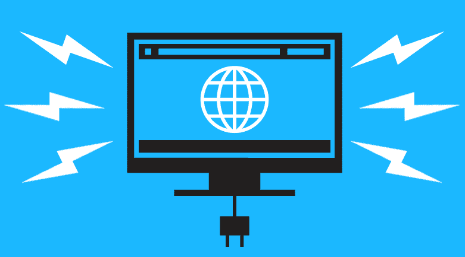
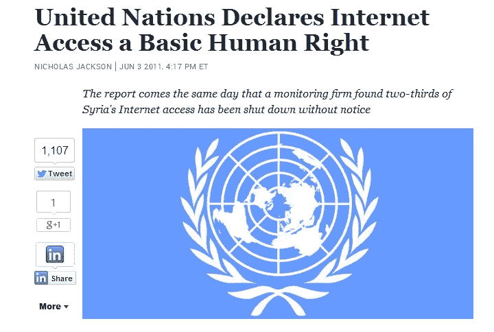
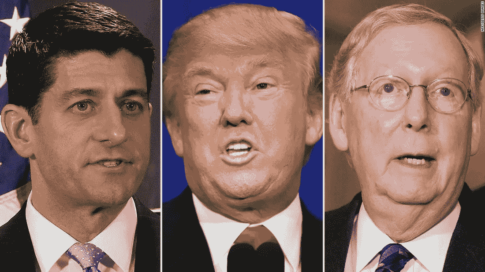
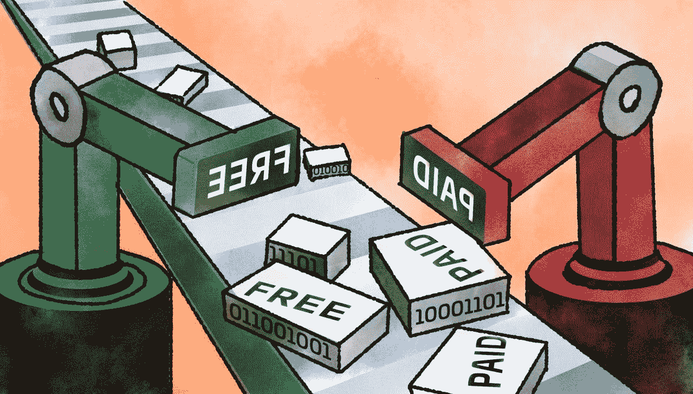
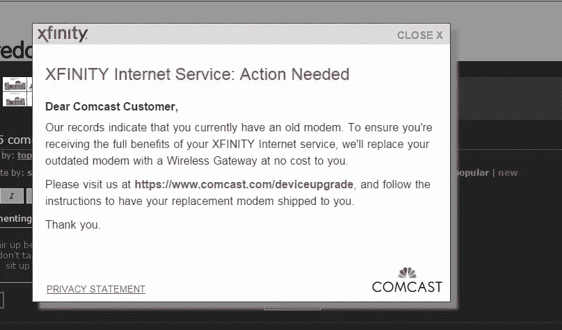
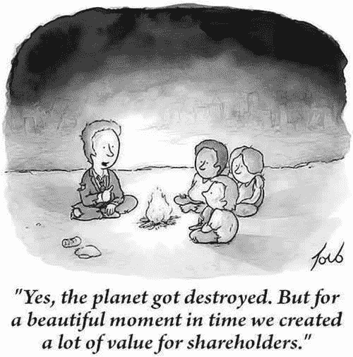
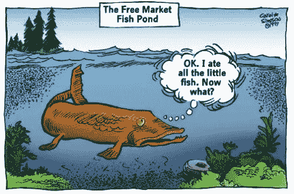
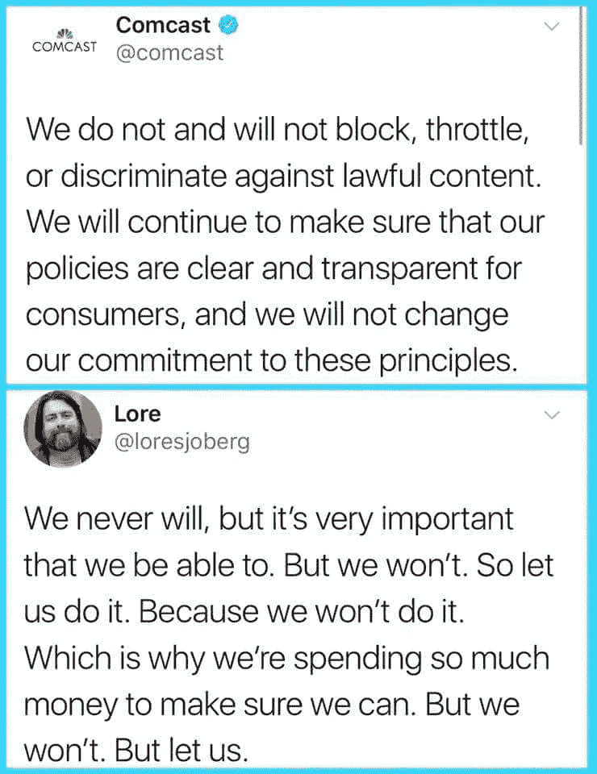
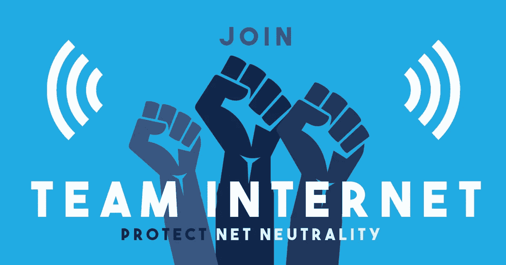

# 捍卫网络中立的常见问题

> 原文：<https://medium.com/hackernoon/an-faq-for-defending-net-neutrality-a5c49d58814a>

## *仔细研究支持放松管制的论点以及如何反驳它们*

[https://www.savetheinternet.com](https://www.savetheinternet.com)

最近几周，由于联邦通信委员会(FCC)主席 Ajit Pai 打算废除现有的网络中立法律，关于网络中立的辩论重新浮出水面。一如既往，博客圈和新闻媒体爆发了两派观点，激烈辩论是否要废除网络中立规则。在所有的回复中，有一个特别流行的是由 [Stratechery](https://stratechery.com/) 的 [Ben Thompson](https://twitter.com/benthompson) 写的，最初的标题是[“为什么 Ajit Pai 是对的”](https://stratechery.com/2017/pro-neutrality-anti-title-ii/)(后来改名为“支持中立，反对标题 II”)。

在这一块，还有一个跟进，([《轻触》)，有线和 DSL 宽带权衡；反垄断的重要性)，汤普森认为他“绝对[支持]监管互联网服务提供商和保持中立(至少在屏蔽内容方面)。”然而，在提出这一论点时，汤普森认为，通过监管 ISP，我们冒着阻碍创新的风险，同时也有效地增加了已经垄断的 ISP 领域的进入壁垒。在这些假设中，Thompson 过度简化了手头的问题，将公司为股东实现利润最大化的努力与为客户的最佳利益而行动混为一谈，而从未充分解决竞争将永远是这场辩论的瓶颈。](https://stratechery.com/2017/light-touch-cable-and-dsl-the-broadband-tradeoff-the-importance-of-antitrust/)

利用汤普森关于网络中立性的文章作为框架，我旨在打破网络中立性的争论，以帮助读者对每一个支持解除管制的论点做出回应。每一部分都以一个论点为标题，后面是对论点的分析。

I think we can all agree

在我们开始之前，我想我们需要确定一些共同点。我认为公平地说，这场辩论中的每个人都喜欢互联网和它创造的机会。在这个分析中，我假设每个人都希望互联网成为一个工具，以我们认为合适的方式连接我们每一个人，同时支持我们不断增长的需求。毕竟，最大的公司，甚至康卡斯特和威瑞森，他们的规模都归功于互联网。每个人都需要根据自己的业务和生活需求进行连接。

从这一点出发，围绕网络中立性的争论分为三类，主要动机是什么。除了他们共有的基本假设(我们都想要连通性)，这些激励因素和类别是:

1.  ***利润* :** 互联网是自由市场的一部分。ISP 应该能够以他们认为合适的方式利用用户对数据的需求。消费者友好政策次之。
2.  ***稳定* :** 对消费者友好的政策是理想的，但实现这一目标的途径是放松管制，这将增加竞争和投资，从而促进增长[并满足需求。](https://hackernoon.com/tagged/growth)
3.  ***公民自由* :** 在一个没有竞争、进入壁垒最高的市场，放松管制会导致消费者滥用权利，所以监管是保护消费者的，这是重中之重。

我公开承认我属于第三阵营，但我属于一个将互联网接入货币化的行业。我想给你全部的披露。没有人会承认自己是#1 的一部分，你应该默认 *假设*我是#1 的一部分，就像任何公司一样。我的工作就是向你证明事实并非如此。

这篇文章将集中在第二个阵营的观点上，汤普森对此做了进一步的阐述。他的立场非常冷静，绝对值得分析，因为它植根于你会在辩论的另一方看到的最明智的假设。

在进入支持放松监管的细节之前，自然有必要对这一立场持怀疑态度。当一家公司的“应该是什么”的想法恰好与对他们有利的东西相一致时，怀疑主义应该永远占据主导地位。引用一句话:

> “很容易混淆‘是什么’和‘应该是什么’，尤其是当‘是什么’对你有利的时候。”—提利昂

在放松管制的人群和 ISP 的心目中，即将到来的分层互联网“是什么”也是消费者“应该是什么”，当分层互联网碰巧对他们有利时。我再次警告读者，当消费者的最佳利益与公司的更多利润相一致时，他/她应该持怀疑态度。

让我们深入讨论每一个论点。

## **标题 II(监管)和网络中立是分开的**

能不能亲网中立，反题二？我们来看看两者的区别。

网络中立就是对数据包一视同仁。没有人说你不应该为更多的使用支付更多的费用，但是这个想法是提供商不应该在来源、目的地或内容上有所区别。提供商不应该能够过滤你看到的数据，他们当然也不应该被允许修改他们提供给你的网站数据。

标题二是 1934 年通信法案中的一个条款。如果宽带被归入第二章，互联网服务提供商被定义为“公共运营商”，这意味着网络中立性可以得到执行。

下一个要问的问题是为什么第二章是实施网络中立的手段。毕竟，标题 II 是在 ARPANET 甚至是一个想法之前起草的(并且是打算应用于标准的公用事业公司)。由于 2014 年 Verizon communication s Inc .[*诉 FCC* 一案，第二章被用于强制网络中立。最高法院裁定*鉴于目前的法律*，网络中立只有在互联网服务提供商被归类为 1934 年《通信法》第二章下的公共运营商而非第一章下的提供商时，才可由联邦通信委员会强制执行。](https://en.wikipedia.org/wiki/Verizon_Communications_Inc._v._FCC_(2014))

所以联邦通信委员会这么做了。他们将互联网服务提供商归类为公共运营商，这样网络中立性就可以得到加强。

如果特朗普政府下的 FCC 决定宽带不归入 Title II，那么有两种方法来强制执行网络中立性:

*   现有反垄断法
*   政府创造了监管互联网服务提供商的新方法

[鉴于“[反垄断]执法行动过于缓慢，无法拯救受到 ISP 伤害的公司”，而且 FTC/DOJ 没有执行这些法律的记录](https://arstechnica.com/tech-policy/2017/08/a-title-ii-opponent-explains-why-ajit-pais-plan-wont-protect-net-neutrality/)，我们只剩下一个现实:

一个网络中立和没有第二章的世界需要国会采取行动。

共和党占多数的国会会挺身而出吗？国会是会支持反垄断法还是会找到一种新的方法来加强网络中立性？

If the FCC won’t enforce Net Neutrality, then its fate is in the hands of these gentlemen

用汤普森的话来说，“记住，在美国，两大政党中的一个经常威胁要对国家债务违约以获得政治分数。道路和桥梁等基础设施投资低得令人尴尬，核能等环境可持续能源投资就更少了。将宽带这一需要持续投资的事物的未来交到这样一个功能失调的政府手中，充其量看起来是有勇无谋。

重点引用的是我自己。甚至他也不相信我们能把宽带的未来交到这样一个功能失调的政府手里，然而你能让“支持网络中立，反对第二代所有权”成为现实的唯一方法就是这么做。在现实层面上，反对第二号法案和反对网络中立是一回事，除非你能让你的读者相信，我们可以指望国会和川普的 DOJ 做正确的事情。

## **零评级不反网络中立**

[https://techcrunch.com/2017/04/16/wtf-is-zero-rating/](https://techcrunch.com/2017/04/16/wtf-is-zero-rating/)

从定义上来说，零评级是分级互联网。汤普森指出，“零评级并不是一个明确的网络中立问题:T-Mobile 对所有数据一视同仁，有些数据根本不需要花钱。”如果前澳洲野狗汤姆·惠勒 T2 得到了它，我想每个人都能看到这并不是对所有数据一视同仁。文章指出，威瑞森和 AT & T 自己的内容不会增加你的数据上限，但其他人的内容会。平等对待数据是一个二元条件——所有数据包都有相同的条件，否则就没有。在零评级中，数据包被过滤，根据不同的支付级别创建等级，这显然违背了网络中立的理论。

## **互联网服务提供商能够并且愿意自我监管**

Comcast injecting JavaScript into a webpage so that you get their new hardware

如果互联网服务提供商认为他们可以逃脱法律制裁，他们就会无视法律法规。例如，[康卡斯特利用中间人攻击向你宣传他们的产品](https://www.privateinternetaccess.com/blog/2016/12/comcast-still-uses-mitm-javascript-injection-serve-unwanted-ads-messages/)。简而言之，他们获取应该放在你的浏览器上的 http 网站数据，并注入他们自己的定制代码，为你提供更多的广告。这一切都没有经过网站所有者的同意，也没有告知消费者。中间人攻击是黑客使用的一种技术，似乎康卡斯特不会让这些类型的技术阻止他们增加利润。

Free Press 的这篇令人难以置信的文章展示了美国几乎所有主要电信公司的滥用模式。为什么 AT & T 会屏蔽 Skype、FaceTime 和谷歌语音？因为你绕过了他们自己的服务，让他们花钱。为什么威瑞森在向联邦通信委员会承诺不会阻止网络共享后还要阻止呢？因为如果你能从你的朋友那里得到帮助，为什么你们都需要订阅威瑞森呢？这让他们付出了代价。在每个违反网络中立的背后，包括汤普森在内的诋毁者会让你相信，这当然不是为了钱。

在整个辩论中，没有什么比故意和方便的忽视更让我愤怒的了，即公司对其股东负有最大化利润的信托责任。如果一家公司可以通过非法挤压竞争来实现这一点，并最终获得更大的利润，因为法律费用远不如他们赚的那么多，他们就会这么做。如果汽车公司进行这种计算，并把利润放在安全之上，当生命危在旦夕时，为什么互联网服务提供商不会在包过滤这样微不足道的事情上这样做呢？

反过来，汤普森试图反驳这一论点:“记住，互联网服务提供商承担着巨大的固定成本，这意味着他们的动机是最大限度地增加最终用户的数量。这意味着不要切断那些客户想要的网站和应用。”

然而，通过这种概括，汤普森消除了支持其主张的细微差别。他们的目标不是最大化终端用户。他们的目标是利润最大化。现在，87%的美国人使用互联网。如果互联网服务提供商能够找到一种方法将这个数字降低到 80%,并且比以前多赚 10%的钱，他们就会这么做。如果他们自愿选择不这样做，董事会将解雇首席执行官，因为他/她没有履行为股东实现利润最大化的受托责任，并由愿意这样做的人取代他/她。没有法律规定公司必须最大化客户满意度和客户基础，但是有一个规定是最大化利润。这意味着，对于一个优秀的 CEO 来说，你的公民自由也是资产负债表上的一栏。不要忘记这一点。

Credit to [Tom Toro](http://tomtoro.com/)

这个话题总是让我感到不必要的愤怒，但是怎么会有人面无表情地看着普通美国人，假装世界上一些最大的、受利润驱动的公司会神奇地达成一个对消费者必然有益的解决方案呢？就像我以前说过的，我还要再说一千遍:公司对其股东负有信托责任。*有时*这与消费者和公民的最佳利益相冲突。没有神奇的方式让这种交集发生，也没有任何必要让它发生。这种交集只有两种形成途径:

*   消费者愿意并有能力将他们的钱交给更倾向于消费者政策的人，从而在市场中创造一种消费者至上的规范
*   行业法规

如果市场不够健康(想想足够的竞争)，放松管制没有现实的途径让市场健康，那么监管是唯一的选择。

让我们看看网络中立放松管制的具体细节，看看它是否真的能增加竞争和创新。

## **放松管制增加竞争和创新**

我想在这里赞扬汤普森，因为他基本上是对的。解除管制将会增加竞争，但仅限于大电信公司之间。问题是，要让自由市场的方式蓬勃发展，你不能只鼓励客户在现任者之间流动。需要有一种途径来废黜现任者，这样才有意义。在很大程度上，是没有的。许多公司都在尝试，但他们面对的是电信史上最大的庞然大物，有着巨大的进入壁垒。

总的来说，放松管制增加竞争是有道理的。当你允许公司优化他们以前没有理由这样做的领域时，创新就会出现，公司会优化该领域，寻求市场优势。理论上，这使得现有的和新的参与者都有机会以这种优势进入市场。因此，让我们具体分析一下，看看网络中立解除管制的具体细微差别。

如果网络中立性不复存在，互联网服务提供商将从事过滤数据包的业务。你如何在这个行业中获得竞争优势？

*   向消费者推销包过滤的营销——ISP 将相互竞争，寻找使分层互联网为消费者所接受的最佳方式
*   包过滤方面的技术创新——如果您能更好地过滤数据包，您的网络就会运行得更好(这可能会带来更好的防火墙技术)

Comic by Carol Simpson

这些对寻求与传统提供商竞争的新公司有帮助吗？请记住，竞争不仅仅是遗留提供商之间的竞争；它还要求新进入者有能力进入市场。这种放松管制*如何直接*允许新公司创新和优化，以与传统供应商拥有的市场竞争？(提示:没有)

也许消费者的愤怒和厌恶会给现任者带来足够的竞争压力，让他们被取代，但这是一场巨大的赌博，尤其是因为这样做的成本如此之高。在这里，你是在用公民自由在总的承诺上赌博，ISP 将创建分层的包，因为这将使他们赚更多的钱。如果你幸运的话，你将碰巧处于一个尖酸刻薄到在任者都能穿透的市场。这样的事情还要多久才会在全国范围内发生？与此同时，消费者会发生什么？那些无力参与竞争的新企业怎么办？往好里说，他们处于不利地位，往坏里说，他们会被挤出市场。

消费者的不满是这种放松管制的间接影响*。这取决于在市场机会如此之大，以至于消费者不惜一切代价不加入传统提供商网络之前，你能在多大程度上欺骗消费者。当试图打开市场时，这是一个残酷的把手。*

让我举一个解除管制的例子，它直接增加了竞争和创新，所以我们可以看到不同之处:如果 FCC 解除对许可频段(无线频谱的大块)的管制会怎么样？更多的竞争对手将能够提供 LTE 服务(因为购买这些频段需要数十亿美元)。这也会在这些频段上造成大量拥挤(外来信号)，导致本底噪声上升。如果噪底上升，你可以通过投资更好的信号滤波技术和调制技术来获得竞争优势，这是放松管制和竞争加剧的直接后果。这无疑是对我们所有人都更好的创新，并且具有广泛的积极意义，不仅仅是对消费者互联网。

这个例子有很多后果，我并不支持它。我试图证明**全面放松管制以实现不明确的竞争和不明确的创新是企业对美国人撒谎的方式之一。细微差别是关键。**

## **在让我们最担心的事情影响我们的决策之前，我们难道不应该至少看看这些事情是否被证实了吗？**

我们什么时候能再聊这个话题？本届政府的联邦通信委员会会改变决定吗？大概不会。下届政府会吗？国会呢？扭转这种放松管制的局面并不容易。

Comcast’s pledge has since been changed

此外，在什么情况下我们可以说我们最害怕的事情已经被证实了？当康卡斯特删除其网络中立承诺的同一天，联邦通信委员会宣布计划取消它的时候，情况会怎样？写在墙上，正如提到的，虐待的记录显然在那里。电信公司不会小心翼翼地等待网络中立规则崩溃，看看自由市场会把他们带到哪里。正如《自由新闻报》的文章所展示的，他们在很多机会下都在积极越线，并对公众隐瞒。最重要的是，他们告诉你他们将来会这么做。

在评估我们最害怕的事情时，不管它们是否被证实，我们都必须划出一条我们可以断定已经被越过的线。我认为包过滤的系统性滥用已经发生了。对于放松管制的人群，我提出了以下问题:这条线看起来像什么？如果互联网服务提供商无论过去做了什么，未来承诺做什么，都不能越过这条线，那么就不可能证实我们的担忧，更不用说客观地讨论什么时候放松管制过了头。

## 当然，互联网服务提供商市场没有竞争，但是谷歌和脸书呢？

Thompson 说“我要补充的是，如果中立和排斥竞争是网络中立支持者所说的问题，那么谷歌和脸书甚至比 ISP 更令人担忧:它们都是超级聚合者，拥有前所未有的权力和技术史上最深的护城河，并且越来越愿意不中立”。

怎么样主义就是你如何通过说“好吧，那其他人呢？”来转移话题虽然谷歌和脸书肯定是个问题，但它们是完全不同的问题。谷歌和脸书不应该分散我们对这场争论的注意力，这场争论的焦点是互联网服务提供商。

## 我们别无选择:我们必须跟上不断增长的需求

放松管制的目的是为了满足日益增长的消费者需求。用 Pai 的话说，“什么样的监管框架能最大限度地激励每家公司部署下一代网络？”

他认为，该框架是基于允许包过滤，这创造了分层定价和访问。这意味着我们将获得更高吞吐量的链路来满足需求？我在这里认真地问，因为每一个“反标题 II”的论点都围绕着这个模糊的概念，即所有形式的放松管制都有可能创造出我们想要的任何形式的创新来满足这个特定的论点。但是，只有在特定的放松管制以某种方式在财政上激励公司在特定领域创新的情况下，才会出现这种情况。如果科技公司通过其在线平台增加供应来满足消费者对增加数据的需求，那么与供需的自然增长相比，分层定价如何激励互联网服务提供商改善他们的网络？

请联系我，或者向公众提供一个假设但切实的工具，通过它，这种类型的解除管制将直接激励下一代网络的更高容量链路。如果你不能说出一个，你又一次相信了公司，这似乎是现代消费者-公司关系中最片面的关系。

细微差别是关键，如果这个国家的公民和消费者为了满足我们日益增长的需求而要承受分层互联网和更高平均价格的风险，我们需要确切地知道企业打算如何做到这一点。

从分层定价中增加的利润的一定比例会被投资回创造“下一代网络”吗如果这是我们的计划，那么我们就是在补贴互联网服务提供商，这样他们就有希望提高我们的生活水平。这听起来像是政府应该让企业负责的事情——特别是因为我们已经补贴了他们一次，总计[4000 亿美元](https://www.huffingtonpost.com/bruce-kushnick/the-book-of-broken-promis_b_5839394.html)，却没有任何回报。

如果这些利润不重新投资于基础设施，我们将面临电信历史上最荒谬的双重打击:免费的分层互联网，以及为从未到来的下一代网络支付的又一轮双重补贴。

# 你希望互联网是什么样的？

我喜欢从这场辩论中退一步问自己这个问题。我想让互联网成为我不去想的东西。给我 Wi-Fi 信息，我会提供一个网址或一个应用程序来点击。我相信，随着思想和互动速度的提高，我们的文明作为一个整体也在进步。互联网是让我们做到这一点的工具，我认为企业充当过滤器来过滤媒体上应该和不应该出现的内容是不可接受的。

但是美国人希望互联网是什么样的呢？[结果显示，88%的美国人也不希望自己的数据被过滤](https://www.newsmax.com/t/newsmax/article/800881?section=US&keywords=poll-americans-support-net-neutrality&year=2017&month=07&date=10&id=800881&aliaspath=%2FManage%2FArticles%2FTemplate-Main)。为什么这个统计数字不够有说服力？网络中立是国家对话的一部分，碰巧得到了这个国家公民的压倒性支持。我们的代表在华盛顿为代表我们的利益而战吗？随着 12 月 14 日周四可能以 3 比 2 的投票结果废除该法案，我们发出自己的声音是很重要的。你可以看看[为网络而战](https://www.battleforthenet.com/)，了解更多你能做的事情。如果你能抽出时间，我鼓励你于 12 月 13 日星期三上午 10 点在华盛顿特区联邦通信委员会大楼前加入我的和平抗议活动。

Andrena 正在创建一个由区块链供电的网络，这样一个社区就可以相互提供家庭互联网。