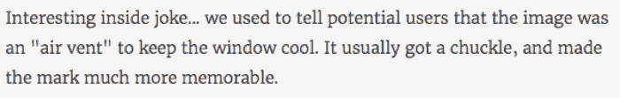
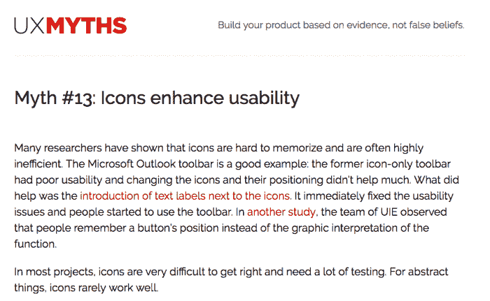

# 汉堡包和菜单的(图标)ic 故事

> 原文：<https://medium.com/hackernoon/an-icon-ic-story-of-hamburger-and-menu-61c5005d792a>

## 汉堡和菜单的权威历史

现在告诉我，

**什么抵得上千言万语？一张照片？没错。**

毫无疑问，当编辑 ***苔丝·弗兰德斯*** 在 1911 年的一篇报纸文章中讨论“**新闻和宣传**”时，这种说法成了时髦的说法。

现在，这个简洁的陈述可能与我们在网站上使用的*图标*更加相关。当图标 *'* ***汉堡包*** *'* 推出时，它是新的，但却无处不在，因为它的名字与一种流行的食物联系在一起。

在所有这些命名运动当中， ***杰夫·奥尔德*** 联系到了 ***诺姆·考克斯*** 这个无名视觉金块的设计者，以了解更多的信息。

他还告诉他一个关于汉堡包图标的笑话

当这个图标开始真正出现在屏幕上时，消费者感到心烦意乱。他们不知道这是什么意思，也不知道应该用它来做什么——那三行粗体字！

后来，一些设计者和开发者提出了运行 [A/B 测试](https://zarget.com/features/ab-test.html)来解决这种不确定性的想法。

> "最后，A/B 测试向他们展示了用户对新汉堡图标的关注程度."

结果似乎令人震惊！那个 ***加边的*** 汉堡(又名三明治)甚至没有我们最初想象的那么好认。

这篇文章将为我们整理什么时候使用图标，什么时候文字最适合我们的需要。

如果你想了解更多关于汉堡的知识，可以参考 theatlantic.com 的研究。它将向您解释为什么这个设计选择实际上没有任何意义。

## **图标——应对空间缩减**

大多数设计师选择图标而不是文本的原因是: ***图标需要的空间更少*。**

随着手机屏幕日益变小，响应式设计也迅速获得更大的吸引力，这已经成为设计师优先考虑的问题。

事实上，谷歌最近更新了它的应用程序，更多地使用图标。他们的意思是，图标是代表一种状态或影响一个行为的最清晰的方式之一。

此外，他们专注于 ***图标*** 的原因很有道理，因为图标是本能的，而且很小，随着移动设备及其屏幕尺寸的缩小，屏幕上的房地产已经成为一种昂贵的资产！

具体来说，谷歌创造了简单的图标，因为轻巧清晰的图标容易理解和适应。

简单的图标需要很少的学习。但从另一个角度来看，大型公司在利基市场非常有价值，但他们的学习曲线很长，需要很长时间才能成为一名无脑人。

如果像微软这样的公司想让他们的新手快速了解他们的产品，他们会用文字代替图标，而其他公司则花时间训练他们的用户识别他们新的和不寻常的图标。

## **文本—为清晰起见**

尽管图标的大小很方便，但一些设计者认为图标不是与用户交流的有效方式。

除了其他问题之外，图标的含义可以根据一个人的文化而变化。有时它们毫无意义。这当然是主要的可用性问题之一。

和其他的设计神话一样，一个非常普遍且被否定的神话是“**图标增强可用性**”

让我们看看**UXMYTHS.COM**的专家团对图标的看法…

考虑到我们现在开发功能的速度，我们看到大量的功能加入和退出(变老)，而一些图标的风格或含义随着时间的推移而改变。

我们的世界变得越来越小，像“**复选框**这样的问题也会产生重大影响。

> “因此，在设计时，将‘背景’作为关键始终是非常重要的”

当然，我们理解在国际申请中使用文本的后果。在这种情况下，语言障碍的复杂性非常高，因此在这里必须强制使用图标或符号。

然而，当创建针对本地或单一文化的应用程序时，具有多样化的年龄组和技术能力，文本往往是最佳选择。

许多应用程序选择最重要的功能并用文本标记出来，而不是为每个功能创建一个图标。

> "公司为他们的重要功能提供文本，而不是图标."

尽管事实上，没有大量的研究就没有好的设计，我还是列出了我的一些建议，让你从一些教育性的帖子开始。

*   必要时使用**图标**
*   对于桌面/应用程序，让图标在悬停时缓慢移动
*   使图标易于定位
*   最初显示**标签**

由 [**研究 Aiga.org**](http://www.aiga.org/symbol-signs/)关于符号的标志。

由**研究关于电脑图标的历史。**

**由 gizmodo.com[T5关于创始汉堡图标的研究。](http://gizmodo.com/who-designed-the-iconic-hamburger-icon-1555438787)**

**谢谢我没有让你厌烦😉(你至少可以假装一下！)**