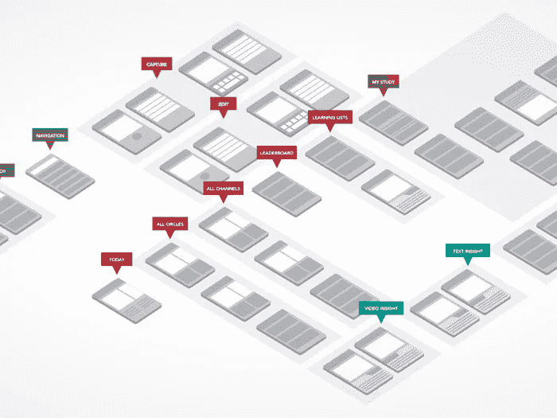
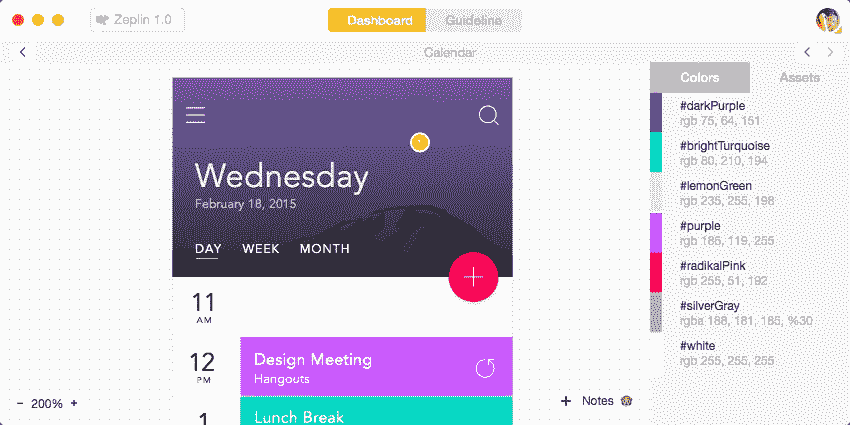

# 视觉实验室的想法(UX 设计 BIM？)

> 原文：<https://medium.com/hackernoon/an-idea-for-invision-labs-ux-design-bim-3f610c53b89>

 [## 实验室|视觉

### 查看 InVision 的 LABS，这是一组工具和产品，可帮助您解决未来的设计挑战。

labs.invisionapp.com](https://labs.invisionapp.com/) 

自从我见到[vision](https://medium.com/u/206c13695d27?source=post_page-----3f610c53b89--------------------------------)以来，我一直惊讶于技术是如何改进[设计](https://hackernoon.com/tagged/design)流程和工作流程的。我记得当我开始担任项目经理时，可用的最流行的工具是 excel、MS project 和其他一些更复杂的工具，如 SAP。现在有了这么多的工具，它只会让你感到决策疲劳，最终可能会回到冗长的电子表格中来管理时间、范围、任务、时间跟踪等。

我在一家代理公司( [DigitasLBi](https://medium.com/u/8020fda23ea4?source=post_page-----3f610c53b89--------------------------------) )的第一份工作中，几乎所有事情都使用电子表格，这是我的日常生活。从需求和蓝图到启动控制！几乎项目的每个阶段都有自己的 excel，存放在 drive 或 dropbox 中，随时可供整个团队更新。

Do we have the User research documentation?

上周与 Felipe(我们的 drupal 前端开发人员)讨论一些想法时，他提到使用 Trello 跟踪一些项目任务。所以我坐下来建立这个项目，我在想如何将我们所有的项目管理、设计、人工智能和开发任务/工具整合到一个地方。这就是灵感出现的地方！在阅读这篇关于[设计驱动项目管理](http://blog.invisionapp.com/design-project-management-tool/)的文章时，我开始思考我以前在 AEC 行业的经验中的改进和敏捷化。

## 如果我们可以将 [InVision](https://medium.com/u/206c13695d27?source=post_page-----3f610c53b89--------------------------------) 作为我们所有设计和开发项目的应用程序，会怎么样？(设计项目的 BIM)

 [## 什么是 BIM |建筑信息建模| Autodesk

### 为什么 BIM 对您的企业至关重要无论您是希望遵守政府和商业 BIM 要求，还是您…

www.autodesk.com](http://www.autodesk.com/solutions/bim/overview) 

因此，在 trello 面前进行头脑风暴后，我记得 BIM 如何成为 AEC 项目的应用程序/流程(我花了三年时间学习建筑)。每个建筑和设计工作室都有 BIM 作为每个项目和建筑师的必备。那么为 UX 建造一个类似的视觉系统怎么样？我知道有些人会喜欢它，有些人会讨厌它，但对我来说，最重要的事情是在协作中创造一些东西来简化我们的生活，在团队中协作，聪明地工作！

> “任何傻瓜都能写出计算机能理解的代码。优秀的程序员写人类能理解的代码 David H(Rails creator)”

我们开门见山吧！现在，Invision 允许我们分配屏幕、跟踪时间、评论原型和拖动任务(如果我遗漏了任何其他功能，请告诉我)。太酷了！但是我想提出将用户故事、用户工作流和信息架构以及 Zeplin 和 Github 整合到 Invision 中的想法。

AEC 项目的 BIM 提案是计划+设计+建造+管理工作流程，通过一个集中平台与所有项目团队和利益相关方实时协作管理 E2E 流程，从而提高工作效率。

在我们的例子中，让我们提出同样的东西，但让我们尝试建立一个简单的架构来集成它:

## 计划:

我知道很多人在电子表格中以[敏捷](https://hackernoon.com/tagged/agile)格式存储用户故事:*作为一个<类型的用户>，我想要<一些目标>以便<一些理由>。*如果有一个类似的功能，我可以在 vision 中存储我的用户故事，我可以将每个用户故事分配给原型功能，这样 UX 设计师就可以在视觉设计中验证每个用户故事，并通过 liveshare 与客户/利益相关者进行讨论！

用户流量；将一个屏幕分配给图表是非常棒的，这样它将说明屏幕在流程中的位置。

信息架构还在开发中！(关于这一点，我有很多想法，我稍后会讨论)但是，如何存储我们的 IA 图并将它们与视觉设计集成，这样我们就可以让 UX 设计师与视觉设计师交流数字产品应该是什么样的，同样，开发人员也可以在 Zeplin 敲门之前了解一切是如何创建的

## 设计:

让我们采取线框图，整合用户流，并将其添加到视觉设计中，使其成为一个原型！(素描，Adobe UX，PS，AI，justinmind，用你喜欢的)

## 构建:

Invision 肯定需要一种方法来与工具如 Zeplin 或 T2 Sympli 进行交流。一旦原型获得批准，我们需要轻松地将资产发送到任何工具，这样我们可以加快前端开发，并前进到 git 中的版本控制(是的，我认为设计师也应该在 Git 中)

## 管理:

如果我们可以将 Invision 与 Zeplin 或 Sympli 通信，那么如果我们可以让前端开发人员将他们的代码推入 git 并让 Git 与 Invision 通信呢？这样，UX 设计师或项目经理甚至可以跟踪开发过程，或者如果项目在敏捷 UX 上，我们可以保持积压更新，以便整个项目团队和利益相关者进行实时沟通。因此，每次他们通过 liveshare 召开会议时，他们也会跟踪开发阶段。

## 那么我们下一步是什么？

所有这些想法都来自我们团队内部的几次对话，讨论如何以最佳方式改进我们的工作流程，以提高我们的工作效率和协作。

我们希望看到这种情况发生，但是如果没有 Invision api，这将很难实现！与此同时，我们将尝试与[扎皮尔](https://medium.com/u/530c4c926670?source=post_page-----3f610c53b89--------------------------------)建立联系。

感谢阅读，并随时分享它，爱它或书签！我们将不断更新媒体！

## PURA·维达！

> [黑客中午](http://bit.ly/Hackernoon)是黑客如何开始他们的下午。我们是 [@AMI](http://bit.ly/atAMIatAMI) 家庭的一员。我们现在[接受投稿](http://bit.ly/hackernoonsubmission)并乐意[讨论广告&赞助](mailto:partners@amipublications.com)机会。
> 
> 如果你喜欢这个故事，我们推荐你阅读我们的[最新科技故事](http://bit.ly/hackernoonlatestt)和[趋势科技故事](https://hackernoon.com/trending)。直到下一次，不要把世界的现实想当然！

