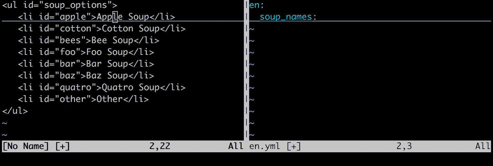

# Vim 宏简介

> 原文：<https://medium.com/hackernoon/an-intro-to-vim-macros-f690d8c3c3fd>

当试图解释为什么 [Vim](https://hackernoon.com/tagged/vim) 如此神奇时，人们经常会说“你不必使用鼠标”“模态编辑”“命令是[可组合的](https://hackernoon.com/tagged/composable)”之类的话。这些都是让编码更快更容易的好东西。它们也*碰巧*导致了 Vim 最强大且不被公开的特性之一:宏。

# 什么是宏？

宏是“编程编辑”的一种形式，或者使用代码来更改文本。宏对于粘贴就像普通模式对于插入模式一样。粘贴将文本插入到代码中。宏运行文本就好像它是一系列命令。除此之外，它们是相同的，甚至使用相同的寄存器来存储文本/击键。如果你写一个宏来注册一个，你可以输入" ap 来粘贴你的宏的原始文本到缓冲区。如果你把文本“ZZ”拉进寄存器 a，@a 会保存并退出你的窗口。这种同构有两个结果:

*   如果你想编辑一个宏，你可以粘贴它，修改文本，并复制回你的寄存器，这是非常方便的。
*   运行宏与手动输入按键完全一样，这意味着宏可以访问 Vim 中的所有内容。宏可以拆分窗口、创建新文件、运行命令，甚至更改设置。唯一的限制是一个宏不能直接记录另一个宏。

宏概括命令:命令自动化简单的任务，而宏自动化复杂的任务。

## 例子

假设我们有一个包含以下 HTML 的 rails 项目:

```
<ul id="soup_options">
   <li id="apple">Apple Soup</li>
   <li id="cotton">Cotton Soup</li>
   <li id="bees">Bee Soup</li> 
            ...
</ul>
```

作为重构的一部分，您需要将列表项中的文本转换为 I18n。根据设置，一种方法是使用以下宏:

```
^"ayi""bcit<%=t 'soup_options.<c-R>a'%><c-C><c-W>wo<c-R>a: <c-R>b<c-C><c-W>wj
```

其中<c- class="jq">X为 ctrl+ *X.*</c->



I am bad at making gifs

# 宏观思维

让我们仔细分析一下我们刚刚使用的宏:

```
^                       Move to beginning of line   | Prefix
"ayi"                   Copy in quotes (id) to reg a  |
"bcit                   Change in tag (text) to reg b |
  <%=t 'soup_options.   Text                          |
  <c-R>a                Paste reg a                   |
  '%>                   Text                          |
<c-C>                   Exit insert mode              | Body
<c-W>w                  Switch to next window         |
o                       Newline                       |
  <c-R>a:               Paste reg a                   |
  <c-R>b                Paste reg b                   |
<c-C>                   Exit                          |
<c-W>w                  Switch to next window       |
j                       Down one line               | Suffix
```

首先，宏有一个清晰的结构:

*   大多数宏都以前缀**开始，这是一组确保宏正常运行的命令。我们的设置只是^，所以我们在生产线的开始。其他设置可能包括从一个特定的字符串或字符开始，跳到一个标记，清除寄存器等。**
*   接下来是一个**主体**，它完成编辑任务。
*   我们以一个**后缀**结束，它设置我们重复宏。没有后缀，宏仍然可以工作，但是我们必须手动移动到下一行。有了它，我们已经定位在下一行，可以用@q 重复。我们也可以使宏*递归。*虽然宏不能记录宏，但它可以运行宏，包括宏本身。如果我们在后缀后面加上@q，我们的宏会一直重复，直到用完所有的行。

身体是最复杂的部分，有一些特别的地方值得注意。

## 寄存器的使用

寄存器在 vim 命令中很有用；在宏中，它们是绝对重要的。寄存器实际上是您在宏中的“变量”,让您为将来的转换存储信息。这里我们最终使用了两个，一个存储 id，一个存储文本。

同样，标记也非常有用，尤其是大写的。虽然我们在这里使用了两个窗口，但是我们也可以在 html 文件中放置一个标记 mA，在 I18n 文件中放置一个标记 mB，并使用它们进行切换。

因此，保留几个寄存器作为宏使用，几个寄存器供宏使用通常是个好主意。

## 选择不变量

由于这些行都略有不同，我们不能依赖基于计数的命令总是正确的。幸运的是，vim 有强大的相对运动和选择命令，我们可以使用。yi”和 cit 使用文本对象作为不变量。我们感兴趣的是 id 和 li 值，“引号内的第一个文本”和“标签内的文本”将总是描述它们。请注意，这里有多个可能的不变量可供选择，不同的上下文会改变哪些是有效的，哪些是无效的。假设我们有以下内容:

```
<li id="apple">Apple Soup</li>
<li id='cotton'>Cotton Soup</li>
<li class="foo" id="bees">Bee Soup</li>
```

易”会猛拉“苹果”，但“棉花”是在单引号里的。“棉花”可以用“易”，但“苹果”就不行了。这里的一个不变量是 f=2lyw，或者“在第一个=”之后，从两个字符开始抽取单词。这将破坏第三行(复制“foo”而不是“bees”)。我们可以通过用 F > f=(last = before of first >)替换 F =来解决这个问题。

(这里的其他不变量可能是/id=或 f>B3w (ew)。使用最简单的符合你的上下文的。)

# 使用宏

您可以通过按 q[a-z]开始录制新宏，并通过按 q 结束录制。您可以使用 q[A-Z]追加到现有宏。您也可以通过使用“[a-z]y 将文本字符串直接复制到寄存器中来创建宏。编写宏的一种常见方法是:

1.  记录宏的第一次迭代。
2.  运行您的第二个案例，看看它是否仍然有效。如有必要，请撤消。
3.  如果第二次运行失败，将宏粘贴到缓冲区，手动添加适当的击键，并将其复制回寄存器。必要时重复。

通常问题是不正确的不变量或相对运动，应该很容易解决。

直接编辑宏时，可以在插入模式下使用 ctrl-V 按字面插入特殊字符。你可以用它来添加 ctrl 命令，escape 等等。

# 何时不使用宏

*   当元编码不必要时。你不需要一个宏来缩进一个页面，因为你已经有了 gg=G。
*   当另一个更简单的工具就足够了。Vim 提供了许多其他命令来满足更常见的用例，比如。，:norm，和:bufdo。
*   当你有一致的用例时。宏是快速的、一次性的转换。如果你期望长期需要它，或者需要更灵活的东西，考虑写一个函数。
*   当你应该使用编程语言的时候。

# 摘要

Medium 需要内联代码格式。

# 进一步阅读

```
:h complex-repeat
:h multi-repeat
:h registers
:h i_CTRL-V
```

[](http://bit.ly/HackernoonFB)[](https://goo.gl/k7XYbx)[](https://goo.gl/4ofytp)

> [黑客中午](http://bit.ly/Hackernoon)是黑客如何开始他们的下午。我们是 [@AMI](http://bit.ly/atAMIatAMI) 家庭的一员。我们现在[接受投稿](http://bit.ly/hackernoonsubmission)，并乐意[讨论广告&赞助](mailto:partners@amipublications.com)机会。
> 
> 如果你喜欢这个故事，我们推荐你阅读我们的[最新科技故事](http://bit.ly/hackernoonlatestt)和[趋势科技故事](https://hackernoon.com/trending)。直到下一次，不要把世界的现实想当然！

[](https://goo.gl/Ahtev1)