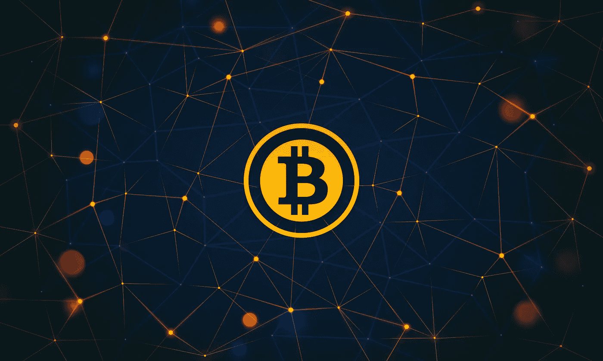
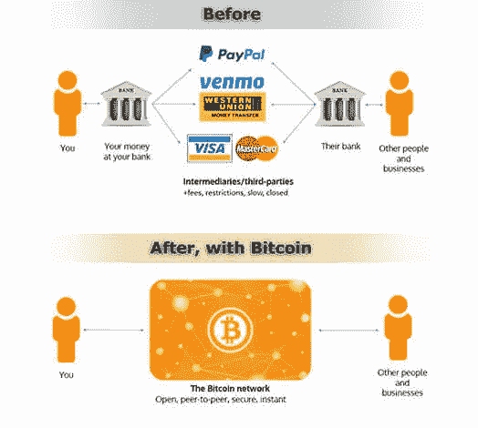
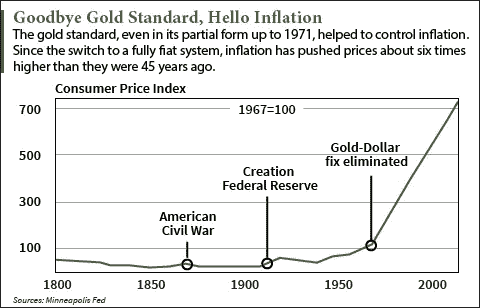
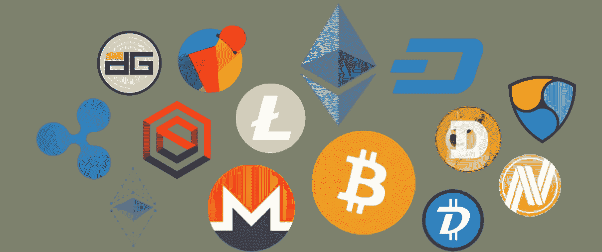

# 比特币和加密货币简介

> 原文：<https://medium.com/hackernoon/an-introduction-to-bitcoin-and-cryptocurrency-618c139d1d06>

目前，人们对加密货币领域有着极大的兴趣，同时也存在困惑、不确定性和疑虑。比特币，加密货币，区块链，ico。这些是什么意思？对这些外国概念的自然反应通常是怀疑和拒绝，但在行话的背后是一种强大的新技术，它正在改造我们的金融体系。

比特币最初是 2008 年全球金融危机最严重时期的一项实验，旨在建立一个更好的金融体系。早期，加密货币发展成了一种肮脏的潜台词，因为它们主要与黑市交易有关:毒品交易、勒索软件支付、洗钱和逃税。加密货币被描述为自互联网以来最具破坏性的技术，以及欺诈或大规模庞氏骗局。

专家们说这是一个投机泡沫，但对于那些未能找到正确解释的人来说，这只是一个简单的出路。他们有理由提出正确的问题，但最终未能找到加密货币需求快速增长背后的主要原因。比特币和其他加密资产是一种新兴的新资产类别，作为一种根本性创新的新技术，正在经历快速增长。

我们生活在一个数字时代，新一代更喜欢相信“抽象”，质疑传统规范，并通过技术找到更好的前进方式。比特币创造了一个开放的金融系统，允许我们以以前从未想过的方式存储和交易价值，从而为世界带来了多功能的金融工具。

# 第一部分:比特币

## 这是什么？

比特币是不受任何人发行或控制的数字货币。它用于在世界任何地方安全地存储和转移任何数量的价值。它用于购买商品和服务，储存财富，或在未经第三方许可的情况下向任何人发送价值。比特币通常被视为“数字黄金”，妥善储存的比特币不会被政府黑客攻击、窃取或没收。因此给人们完全的所有权，就像口袋里有一个瑞士银行账户一样。与实物黄金不同，比特币在世界任何地方存储或发送都更便宜、更快、更高效。比特币可分割到小数点后第八位，并且完全数字化，允许任何货币价值的转移。与可以被操纵和贬值的政府“法定”货币相反，2100 万比特币的有限供应量使其成为一种稀缺而有价值的资产。比特币是货币互联网，它将为金融带来互联网为通信带来的好处。

## 它是如何工作的？

比特币网络是一个点对点网络，运行在一个名为区块链的分散分布式自清算账本上。比特币网络上运行的货币单位被称为比特币，用于在网络参与者之间存储和传输价值。与央行发行的大多数货币不同，这些货币可以贬值和操纵，比特币是根据一套固定的规则发行的，以创造不会被中央当局或恶意行为者操纵的可靠货币。用户可以购买或销售商品和服务，向个人或组织汇款，甚至以快速、安全和无边界的方式提供信用。访问这些硬币的唯一先决条件是互联网连接和一个私钥，该私钥与面向公众的密钥形成一对，以提供对存储在比特币网络上的硬币的访问。未经授权获取某人的私钥类似于从他们的金库里偷黄金。

## “区块链”

什么是真正的区块链？区块链是一个防篡改的加密数据库，由密码术*(对加密的研究)*保护，充当跟踪数字资产的会计分类账。区块链不是像传统数据库那样由单个服务器维护，而是分散在 T2 的 T3，由分布在 T4 的世界各地的 T5 计算机网络维护。该数据库跟踪网络中的每一枚比特币，以及自第一枚比特币诞生以来的每一笔交易。你可以把比特币想象成一个记账系统。通过区块链，它是一种在开放的分布式自动清算分类账中以数字方式记录交易和价值的方式。

> **分散:**没有一个中心实体或一个人拥有控制权。
> 
> **分布式:**比特币不是由一个单一实体拥有和运营的中央服务器，而是分布在全球各地，因此不可能关闭，因为没有中央故障点。没有比特币 HQ 地址可以让人突袭；没有中央服务器可以黑。

**比特币挖矿**
数据库由 [**矿工**](https://www.investopedia.com/articles/investing/043014/what-bitcoin-mining.asp) **:** 通过向网络贡献自己的电力和计算机处理能力，设立专门的计算机来处理交易的人或企业。作为交换，他们收到交易费和/或新的比特币，当一个新的区块被添加到链中时，新的比特币由协议释放到网络中。矿工通过保护网络来提供公共服务，而网络对他们的工作进行奖励。

为了实现这一点，用户向网络广播交易，矿工通过比赛完成复杂的数学难题，用专门的计算能力记录交易，这*证明*他们正在为比特币网络工作。每个新区块都被添加到区块链中，这些交易每 10 分钟被确认和记录一次。然后矿工们争夺下一个街区的比赛开始了。正如最初的[比特币白皮书](https://bitcoin.org/bitcoin.pdf)中所概述的，这一切都是由比特币算法/协议及其底层 NSA 加密哈希算法(SHA-256)的规则决定的。

**区块链的价值** 在区块链之前，实际上不可能*拥有*一项数字资产。如果我发给你一个 mp3 文件，你只有一个拷贝，而原件在我这里——有两个拷贝。说到钱，如果我给你 10 美元，很重要的是我不再拥有这 10 美元，它现在是你的了。借助区块链技术，我们现在有了一种方法来证明和实施数字稀缺性的概念，并以分散的方式跟踪数字资产的所有权。

我们可以有钱生活在互联网上的想法是一个突破。我们现在有了与我们在互联网上看到的相同的开放接入架构，用于通信，但用于金融。

第一套互联网协议实现了全球免许可信息交换，彻底改变了世界。这一组新的基于区块链的协议或“加密资产”实现了全球无许可的价值交换。在互联网上交换价值的能力改变了游戏规则。我们将看到组织资本、新市场、甚至分散自治组织的方式得到极大改善，因为区块链将以无人能及的方式做出决策、分配资源和资本。 [*](http://investorfieldguide.com/hashpower/)

## 区块链不是比特币

银行和企业一直在大肆宣传区块链底层技术的前景，但比特币本身却没有。这代表了公司建立“私有区块链”,类似于早期私有内部网与公共互联网的故事。出于与互联网相同的原因，区块链的真正价值在于开放的公共区块链，它提供免费和开放的全球访问，因为它们不在封闭的私人系统中。分散的公共区块链正在建立一个完全平行的金融系统，而不是使用技术来更新陈旧的基础设施。

比特币本身的数字化并不完全是革命性的，因为世界上绝大多数的财富已经数字化了。当我们在网上查看我们的银行账户余额时，我们实际上并没有那么多钱存在银行金库里。货币只是一个会计系统。银行运行自己的私人内部分类账*(会计机制)*，记录系统中所有的 1 和 0*(账户余额)*。

到目前为止，操作这样一个系统的唯一方法是通过一个可信任的第三方的规则。现在，比特币通过一套固定规则的协议以一种去中心化的方式进行管理，人们开始相信数学定律，而不是他们机构的信仰。

> “最纯粹的货币是信心。这是一种围绕商定的交换媒介的网络效应，这种媒介有一些稀缺性的承诺。比特币通过结合密码学和经济激励(“密码经济学”)来强化其稀缺性。很多人觉得这比依赖政府的诚信更令人欣慰。我们相信数学。”
> 
> - [贝宝创始人大卫·萨克斯](https://www.cnbc.com/2017/08/14/david-sacks-cryptocurrency-interview.html)

## 货币的演变

在很早的时候，人们通过易货交易系统交换价值，随后发展了商品货币*(即银币和金币)*，因为它们易于携带和分割，并且具有提供价值的稀缺程度。随着银行业的兴起，出现了一种基于债务的系统，我们将黄金存入银行，他们发给我们一张纸，代表我们在银行有多少黄金。毕竟，携带纸币比携带一袋黄金要容易得多。

1971 年，尼克松总统废除了**金本位制，结束了人们在美联储用美元兑换黄金的能力，允许政府完全自主地自由印钞，从而使美元成为**法定货币** *(Fiat 在拉丁语中是“它应当”的意思)。如今在世界各地司空见惯的法定货币没有有形资产的支持，只有政府的承诺。不幸的是，这导致了政府操纵货币和货币贬值，以消费者为代价来削减巨额联邦赤字。***

****

**由于通货膨胀，自二十世纪中期以来，美元已经失去了 90%的购买力。这就是为什么许多理财规划师强调投资股票、黄金、房地产等资产。，而不是持有现金:鉴于菲亚特随着时间的推移会失去其价值储存手段，因此要保护和增加财富。**

****美元与比特币** 要知道，美元是世界上最好的交易货币。如果我被困在南美洲的雨林中，我会选择美元，因为它是世界储备货币。美元几乎在任何地方都被接受，但它是一种可怕的价值储存手段。**

**长期以来，黄金一直被认为是终极价值储存手段。现在，人们开始转向加密货币，因为它们比今天已知的任何资产都更安全，更容易存储和运输，更便宜，更容易细分。它通过削减银行/中间商的高昂费用、全球汇款市场(人们在一个国家工作并把钱汇回家给家人)以及成为互联网货币和推动新一轮全球电子商务浪潮，扰乱了国际支付和转账业务。**

***这里的基本要点是，比特币不是用来支付你的星巴克咖啡，而是用来支付美元。大多数人宁愿使用他们的星巴克卡和获得星星，也不愿使用比特币。***

## **比特币和发展中国家**

**美国人继续低估比特币，因为他们生活在世界上最安全和稳定的金融系统中。对于那些由于政府腐败或缺乏经济增长而导致恶性通货膨胀猖獗的国家(委内瑞拉、阿根廷、津巴布韦等)，这是一幅更加真实的画面。).加密货币为那些被困在压迫性货币制度下的人提供了一种逃避方式。**

**比特币改变发展中国家的另一个强有力的方式是为那些无法获得比特币的人提供金融服务。有数十亿人无法获得金融服务或银行账户，但可以使用智能手机。因为使用比特币只需要一部连接互联网的智能手机，比特币为最需要的人带来了金融服务。赋予人们“成为自己的银行”的权利是有价值的，无论他们身在何处，他们都可以获得、储存和转移价值。**

## **比特币的核心价值主张**

**当人们了解比特币时，他们首先想到的事情之一是支付。我们进行的每一笔金融交易，无论是与 Venmo 还是与我们的银行，都至少有一个中间人在中间，从中抽取一点佣金。如果我们可以在不需要许可的情况下以对等的方式进行交易，那会怎么样？我们所需要的只是一个互联网连接，我们可以向任何人汇款，无需任何人的许可，就像互联网允许我们发送信息一样。从哲学上讲，比特币保证了你赚的钱是你的，并强化了你可以真正拥有自己财富的理念。**

**支付和作为交换媒介是比特币价值主张的重要部分，但不是唯一部分。比特币是一种高度抵制审查、无需许可的价值储存手段。以瑞士银行账户为例，世界上大约有价值 20 万亿美元的财富存在大公司和许多个人的离岸银行账户和空壳公司中。这并不违法，而是合法地保护这些资产免受债权人、税收、司法管辖甚至腐败的侵害。**比特币和其他加密资产在更大程度上填补了这一空白和其他许多空白，成为历史上第一种不可审查、不可没收的资产。****

## **为什么你应该拥有比特币**

**你应该拥有一些比特币，原因和你应该投资任何东西的原因一样:随着时间的推移，保持或提高你的生活水平。面对通胀压力，以及法定货币是一种糟糕的价值储存手段这一事实，这一点尤为重要。每个人都应该建立一个多元化的投资组合，以确保他们的金融未来，并使他们能够实现他们在生活中最想要的。加密资产将在其中发挥重要作用，因为我相信比特币和基于区块链的资产是最伟大的技术创新之一，将代表我们这个时代最伟大的财富创造事件。**

# **第二部分:以太坊和所有其他加密货币呢？**

****

**比特币是数字经济的价值储存手段。它是第一种主要的加密货币，只是区块链更广泛潜力的先驱。**

**第二大加密货币是以太坊，它的主要用例是扩展到比特币的货币用例之外。以太坊是一个更加可编程的通用区块链，它使用智能合同(法律、金融、社会等)。)用代码表示。这允许其他开发人员在以太坊上构建应用程序，而不是构建他们自己的区块链。一个很好的比喻就是把比特币想象成**“数字黄金”**，以太坊想象成**“数字石油”**把以太坊想象成一台巨大的全球去中心化超级计算机，可以处理所有类型的复杂事务或应用。以太坊的原生货币“以太”就是这个比喻中的石油。它被用作支付计算成本的燃料，允许其他企业、开发者和个人在以太坊区块链上构建应用程序和处理交易。**

## **2017 年和首次发行硬币(ico)的兴起**

**以太坊的兴起，降低了开发者创建新网络的准入门槛。2017 年，我们看到以太坊网络上的 ico 激增。ICO 是一群开发人员用以太坊区块链上的令牌建立一个分散的网络，并通过向社区出售该令牌来换取开发协议的资金，从而众筹开发资金。另一方面，用户已经购买了协议本身的一部分，并且现在拥有令牌来用作投机的投资，或者为该网络上的服务和接入付费。这些网络可以为任何事情提供动力，从分散的文件存储到预测市场或分散的赌场。**

**区块链技术及其支持的底层去中心化应用是互联网的下一个前沿。互联网创造了巨大的价值，改变了世界，但我们赖以让互联网正常工作的基础互联网协议，如 TCP/IP HTTP SMTP，却没有创造任何价值。**

**USV 的论文叫做 Fat 协议:**

** [## Fat 协议|联合广场企业

### 在区块链应用程序堆栈中，协议和应用程序之间的这种关系正好相反。价值…

www.usv.com](http://www.usv.com/blog/fat-protocols) 

[来自 Reformed Broker](http://thereformedbroker.com/2017/10/18/an-evening-in-wonderland/) 的乔希·布朗对此做了很好的总结:

> 有一个叫做 Fat Protocols 的概念，大概是这样的:蒂姆·伯纳斯·李(Tim Berners Lee)在 1989 年有效地发明了万维网，但他并没有从他的发明中获得太多的经济利益。所有的金钱奖励都给了那些在 HTTP 协议或 FTP 协议等之上构建东西的公司。雅虎、谷歌、美国在线、脸书——这些是赢家。实际运行网络的协议本身没有任何价值。Fat 协议理论认为，在加密货币中，情况正好相反——大部分价值将归网络本身所有(以硬币价值的形式),创造东西的公司将获得很薄的一层价值。

区块链通过建立一个市场来为稀缺资源定价，更有效地分配这些资源，并为贸易提供激励，从而将市场引入网络。因为区块链创造了数字稀缺，他们可以通过加密数字令牌将协议货币化，这实质上是在每个网络自己的私有数字经济中充当货币。这使得人们可以直接投资于协议本身，而不是一家公司以它为基础。在互联网的早期阶段，投资这项技术需要一个人作为风险投资家对亚马逊或雅虎这样的公司进行早期投资。，它在这些底层互联网协议之上构建应用程序。

## 那又怎样？

加密资产代表着风险资本的民主化，以及未来技术为网络用户而非投资者精英群体创造的财富。

比特币的崛起是我们第一次可以将开源技术货币化，这意味着普通投资者可以参与其增长，而不仅仅是那些投资早期公司的人。这产生了病毒式的网络效应，允许网络克服自举问题，因为用户对网络的成功有一种财务激励，类似于成为脸书或 Twitter 的早期投资者。

自举问题:网络只有在用户达到临界质量后才变得有价值。即 10 人的社交网络与 100 万人的社交网络。

## 让互联网回归本源和 Web 3.0

互联网的第一次迭代起源于 20 世纪 60 年代，是在美国遭受核攻击的情况下，军方的一个生存通信系统。其恢复能力的关键是权力下放。不幸的是，随着时间的推移，互联网变得越来越集中和垄断，因为谷歌和脸书等互联网巨头通过控制用户的个人数据获利。区块链和去中心化技术正在使互联网回归其去中心化的根源，让用户重新控制他们的数据，并消除盈利实体的控制、限制和安全限制。

> 通过开发新的开放网络，令牌可以帮助扭转互联网的集中化，从而保持互联网的可访问性、活力和公平性，并带来更大的创新。— [克里斯·迪克森](/@cdixon/crypto-tokens-a-breakthrough-in-open-network-design-e600975be2ef)

## 还和我在一起吗？

理解今天的区块链技术有点像理解 1995 年的互联网。直到网景公司和万维网的出现，互联网才被主流采用，因为浏览网页的能力是其首批主流应用之一。就像你知道如何使用 Safari 浏览网页一样，很快你就会在日常生活中与区块链互动，因为底层基础设施可以扩展到支持比特币以外的大量主流用户应用程序。

# 第三部分:我如何开始投资？

对新投资者来说，最简单的方法是通过比特币基地建立一个数字货币钱包。比特币基地是这个领域最有信誉和最值得信赖的钱包提供商。通过比特币基地，你可以安全地连接到你的银行账户或信用卡，直接购买数字货币或转账到比特币基地购买。

## 太迟了吗？什么时候是购买的好时机？

比特币和其他加密资产的估值已经大幅上升，但从长期来看，我们仍处于相当早期的阶段。最好的策略是使用[美元成本平均法](https://en.wikipedia.org/wiki/Dollar_cost_averaging)平均进入市场，这样可以最小化市场时机风险。比特币基地允许你设置自动购买*(即每周日购买 100 美元的比特币)*。

 [## 美元成本平均-维基百科

### 美元成本平均(DCA)是一种投资策略，其目标是减少波动性对大型…

en.wikipedia.org](https://en.wikipedia.org/wiki/Dollar_cost_averaging) 

## 费用:

比特币基地对买卖数字货币收取 1.5%的费用。这不是购买数字货币最便宜的方式，但却是迄今为止最简单、最安全的方式。这是价格和便利性/安全性之间的权衡。(你也可以使用他们的基础交易所 GDAX.com，并支付 0%或 0.25%的费用)。

 [## 比特币基地——买卖数字货币

### 比特币基地是一个购买、出售、转移和存储数字货币的安全在线平台。

www.coinbase.com](https://www.coinbase.com/join/52db1c07478d20a1f7000023) 

*披露:如果您使用上述链接建立您的账户，并且在 90 天内购买至少价值 100 美元的数字货币，您和我都将从比特币基地获得价值 10 美元的免费比特币！*

# 推荐进一步阅读:

想了解更多？我为一些额外的优质内容整理了一份数字货币阅读清单。否则，请在这里关注我的未来帖子，或者在 Twitter 上联系我。

 [## 数字货币阅读清单—尼古拉斯·德·邦廷—中号

### 受到 Chris Dixon 的“加密令牌综述”的启发，我经常被问及关于如何了解更多信息的最佳建议…

medium.com](/@ndebontin/digital-currency-reading-list-13fe3f565dd8) 

感谢每一个评论并为这篇文章做出贡献的人，以及我从中获得灵感的人:Olaf Carlson Wee，Naval Ravikant，Chris Dixon，Chris Burniske，Ari Paul，Andreas Antonopoulos 和许多其他人。

*声明:本文并非投资建议。当考虑任何投资时，人们应该深入考虑他们如何投资自己的钱，特别是当涉及到加密资产时，因为它们具有波动性和投机性。***