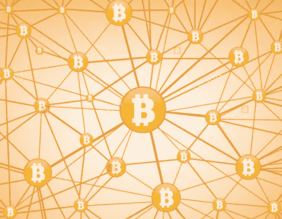

# 比特币简介:它是什么，为什么存在，以及在哪里购买

> 原文：<https://medium.com/hackernoon/an-introduction-to-bitcoin-what-it-is-why-it-exists-where-to-buy-it-6f2b17b548ad>

**针对非技术人士和比特币新手**

在过去的几个月里，我收到了许多来自纽约、欧洲、中东和其他地方的朋友的短信和电话，他们都在问同样的问题:

1.  **什么是比特币&区块链？**
2.  **为什么人们会使用它？**
3.  哪里可以买到？
4.  **安全吗？**

自 2009 年问世以来，比特币价格最近达到了历史新高，媒体对此非常狂热。虽然这个数字继续波动，但我们看到前所未有的非技术人数越来越关注“比特币&加密货币”的噪音。

**虽然我不是开发人员、区块链专家，也不是比特币矿工，但自 2015 年以来，我一直对比特币的世界感兴趣，**当时我在一家支付公司工作，专注于构建第一个智能支付终端，本质上是“面向未来”的支付，并确保消费者可以用任何可用的货币支付，包括比特币。那时候，我读了Digital Gold:bit coin and the Inside Story of the Misfits and Millionaires study to Reinvent Money，这是一个关于比特币及其在 2009 年至 2015 年演变的故事。

在三藩市，我参加了一些加密聚会，并随意地在区块链世界里探头探脑。我很大程度上被数量空前的区块链公司吸引住了，它们通过 ICO(首次公开募股)筹集资金，我很好奇这些公司中是否有许多开发出了他们向市场承诺的产品。

如今，大多数关于比特币的文章都是从技术人员的角度讲述的，因此，主流读者有很多困惑，因为他们试图理解正在发生的事情。作为一名产品营销人员，我的工作是获得真正复杂的技术产品，并围绕该产品建立一个主流受众可以理解的故事。在完全公开的情况下，它仍然是加密货币世界中非常狂野的西部，我们仍然处于(我认为是)这种货币的早期，所以我将尝试提供一些复杂概念的非常基本的理解。

出于本文的目的，我不会试图深入比特币世界最新消息的细微差别和细节，如比特币分叉、SEC 裁决、治理(国内和国际)、ICO，以及我为什么看好某些区块链和加密货币等。

相反，我将尝试告诉你一个关于比特币的故事，并谈论它为什么重要。希望你有足够的理解，帮助你在高层次上理解它。

**区块链、比特币& Crypto defined**

**什么是区块链**？一种公开的分散式分类账，安全地匿名记录各方之间的交易，从而省去中间人。单词“块”指的是数据存储的方式；在街区。任何事务都被广播到区块链上必须验证该事务的所有节点。[以太](https://blockgeeks.com/guides/what-is-ethereum/)是区块链的一个例子。

**比特币是什么？**一种可以在区块链上兑换的数字货币，即分散式分类账。今天，它更像是一种商品，但是一些国家，比如阿根廷，已经开始用它作为货币来支付像优步这样的东西。

**什么是加密货币**？指使用区块链技术的比特币和其他数字货币。

## **早期——一切开始的地方**

如果你没有听说过中本聪，很有可能你刚刚进入比特币 T21 的区块链空间。对于长期的比特币爱好者来说，Satoshi 这个名字是伟大传说和民间传说的代名词。这个男人或女人(或一群男人&女人)被认为是比特币的“创造者”，他们的下落完全不明。迄今为止，许多人仍在试图追踪比特币的创造者，对此人的身份也有多种猜测。我不会猜测我认为 Satoshi 是谁或不是谁，只知道他/她在 2009 年作为比特币的创造者而存在。你可以在这里找到他的白皮书。创造一种没有领导者的货币很可能是一个战略举措，有许多理论阐明了为什么这样做是故意的。

虽然比特币作为有史以来第一种加密货币获得了巨大的人气，但其他加密货币实际上在比特币之前就出现了，如[尼克·斯巴佐的比特币](https://en.wikipedia.org/wiki/Nick_Szabo) **、**和[戴伟的 b-money](https://en.wikipedia.org/wiki/Wei_Dai) 。

## **比特币找到自己的路**

**暗网——丝绸之路** 比特币被创造出来，作为一种在两方或多方之间匿名交易和汇款的方式。虽然我们可以猜测比特币的最初目的是为了实现商业民主化，允许点对点的全球交易，而无需向中间人支付费用，但随着更多负面用例的出现，如丝绸之路，比特币变得臭名昭著。

丝绸之路，同义词称为“暗网”，是一个你可以在网上购买所有非法物品的地方，使用的不是别的，正是比特币。然而，丝绸之路在 2013 年 10 月被关闭，尽管仍有一些使用比特币进行非法活动的案例，但我要说，今天绝大多数比特币所有者都没有将比特币用于这些目的。

像任何新行业一样，在产品的初期会出现许多偏离其核心使命和价值主张的用例。

## 为什么人们在使用比特币？它解决什么问题？

如今，比特币的主要用途包括汇款、限制汇率风险、通胀保护以及作为一种新的货币形式。

*1。汇款* 如今，许多家庭和朋友生活在世界各地，向海外汇款效率低下，而且在许多情况下费用高得令人难以置信。问问任何一个家庭汇款的人，西联汇款或一些主要的汇款公司收取多少费用，你会震惊地得知在汇款中损失了多少。

此外，在一些国家，比如中国，你不能将大量的钱(我相信超过 5 万)汇往海外。这在许多国家并不罕见，比特币通过允许人们实时汇款而没有高额汇款费用的负担，从而规避了此类问题。

*2。汇率风险保护/结算* 如果您是一家在海外从一种货币向另一种货币转移大量资金的机构，通常银行需要 3-5 天才能完成交易，这意味着在此期间存在汇率变化的风险。比特币再次规避了这一点，因为它是实时转移到海外的，所以你不会受到汇率风险的影响。

*3。通货膨胀保护* 比特币的另一个主要用途是通货膨胀保护。经历过高通胀和货币波动的国家，如阿根廷，会遭受货币大起大落的影响，在许多情况下，货币波动如此剧烈，一个人可能会在几天、几周或几个月内损失大量价值。

Wences Cassera 是阿根廷人，也是比特币的长期拥护者，经营着比特币钱包 Xapo，对于通货膨胀如何摧毁一个国家货币的信心有着第一手的经验。你可以在 NYT 的文章中了解更多他的理论:[“比特币能征服阿根廷吗？”](https://www.nytimes.com/2015/05/03/magazine/how-bitcoin-is-disrupting-argentinas-economy.html)

显然，比特币的价格也会波动，仅在去年一年，我们就已经看到了重大波动，但在货币波动更大的国家，比特币可以作为一种解决方案。

*4。随着一些主要零售商(Wordpress、Overstock、微软、CheapAir 等)接受它作为一种支付形式，其他人也在使用它作为货币，我敢打赌这种趋势将继续上升。*

## **哪里可以买到比特币？**

你可以在特许交易所购买比特币，比如:

*   [北海巨妖](https://www.kraken.com/)
*   [比特币基地](https://www.coinbase.com/join/5620960d88fc153ef700006d)
*   [波洛涅克斯](https://poloniex.com/)
*   [HitBTC](https://hitbtc.com/)
*   [CEX。IO](https://cex.io/r/3/up104927984/3)
*   [Bitstamp](https://www.bitstamp.net/)
*   [CoinMama](https://www.coinmama.com/)

这些只是一些交换，请注意，有些有一定的限制，所以您必须做尽职调查，看看哪些交换最有意义。[比特币基地](https://www.coinbase.com/join/5620960d88fc153ef700006d)在美国是一个受欢迎的交易所，他们的 UX 易于使用和导航，即使是最新手的比特币爱好者。

## **安全吗？有人能偷我的比特币吗？**

是的，就像你留在网上的任何容易被黑客攻击的东西一样，你的比特币也可能被盗。然而，你可以采取一些预防措施来确保这种事情不会发生在你身上。

如果你在交易所购买比特币，然后把它留在那里，你就把比特币的安全性交给了交易所的安全墙。关键是使用[冷藏](https://www.weusecoins.com/bitcoin-cold-storage-guide/)并将你的比特币离线储存在钱包里。我强烈建议使用硬件钱包，如[Ledger](https://www.ledgerwallet.com/)&[Trezor](https://trezor.io/)，只有当设备插入笔记本电脑时，你才能访问你的钱包，同时由你创建的特殊代码进行提示。

你们中的许多人可能听说过也可能没有听说过臭名昭著的 Mt Gox 事件，在 2014 年，几乎所有的比特币都从 Mt Gox 交易所被盗，许多人失去了几乎所有的比特币。虽然这一事件确实动摇了一些比特币持有者，但交易所变得越来越聪明，他们离线存储了大量比特币，并采取了额外的预防措施。(注:当局最近已经追查到 Mt. Gox 事件的罪魁祸首)。

但最终，应该明智对待你的投资的是你，比特币的持有者。

坦白地说，我们甚至还没有触及比特币的表面。每天都有新的东西重新定义我们对区块链和加密货币的看法。但这篇文章旨在为那些不从事技术工作但有兴趣成为加密货币持有者的人提供最基本的问题介绍。

老实说，这篇文章是由我妈妈没完没了的提问引发的，她不停地问我以下问题:比特币是什么，它为什么存在，我在哪里可以买到它？

如果你想了解更多，你可以在[媒体](/@yasmeenturayhi)上关注我，并给我发短信。

[以太坊简介](https://hackernoon.com/an-introduction-to-ethereum-68fb9b95fc62)
[加密货币钱包简介](/@yasmeenturayhi/an-introduction-to-cryptocurrency-wallets-288629d879a4)

## 我的书“[产品营销拆穿。亚马逊上有重要的上市指南"](https://www.amazon.com/dp/1718968124/ref=sr_1_44?ie=UTF8&qid=1535685326&sr=8-44&keywords=product+marketing)！

