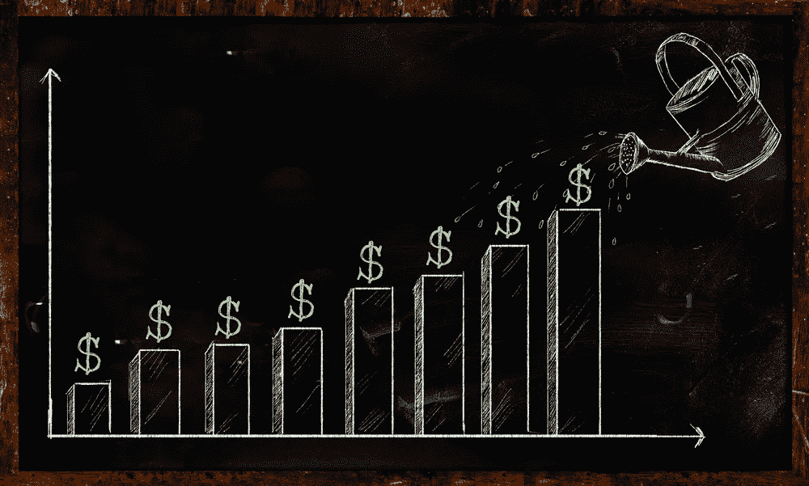
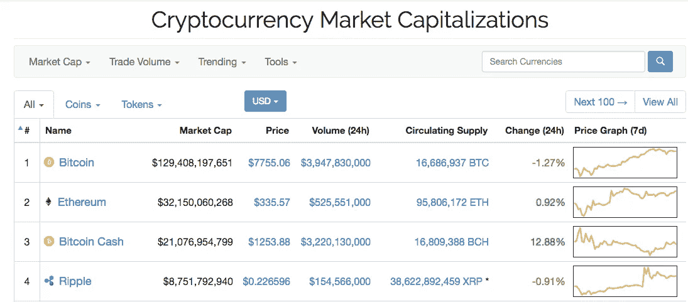
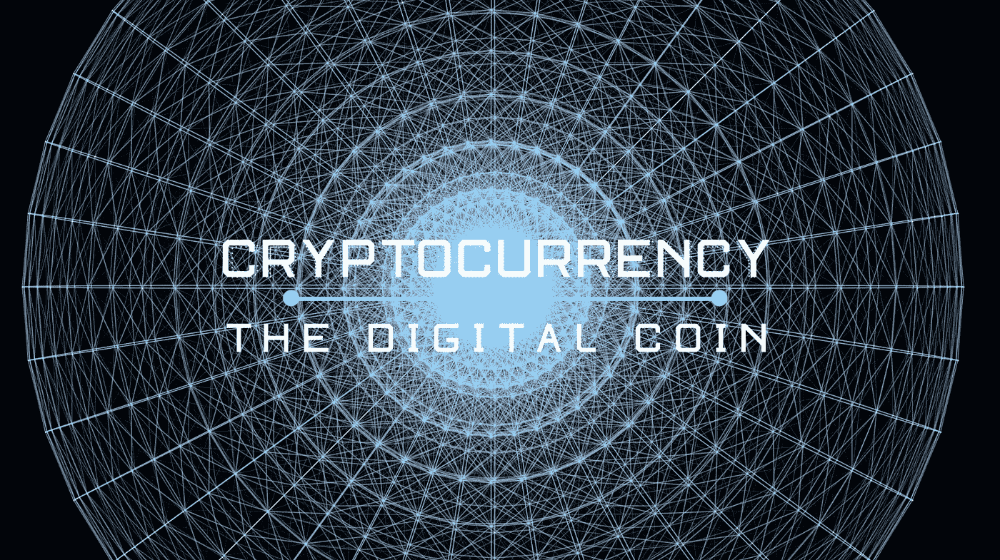
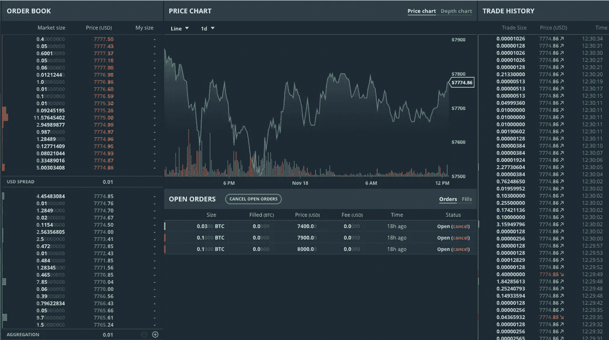
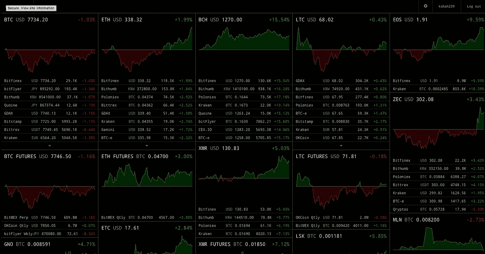

# 加密货币投资简介

> 原文：<https://medium.com/hackernoon/an-introduction-to-cryptocurrency-investing-cf6b9e924697>

Source: [https://themerkle.com/the-token-fund-makes-investing-in-crypto-assets-a-breeze/](https://themerkle.com/the-token-fund-makes-investing-in-crypto-assets-a-breeze/)

*免责声明:本人不属于金融机构，以下内容不应作为专业投资建议。*

## 基础知识

最近，加密货币每天都会收到新闻报道，[投资加密货币会很有趣，有利可图，也有回报。](https://hackernoon.com/tagged/investing)[比特币](https://hackernoon.com/tagged/bitcoin)和以太坊在过去一年中分别增长了 940%和 3404%，因为兴趣投资者涌入数字货币市场和数字钱包[比特币基地](http://coinbase.com)报道称，每天有 10 万新用户注册该应用。而这仅仅是开始。

首先，你要熟悉流行货币的市值和价格。加密货币市场具有高度的投机性，因此及时了解最新消息至关重要。乍一看，这个市场似乎是一场赌博，但通过了解每种代币以及底层项目和技术，你可以成为一名智能加密货币投资者。

像 [Coinmarketcap](https://coinmarketcap.com/) 这样的网站和像 [CryptoPro](https://itunes.apple.com/us/app/crypto-pro-bitcoin-ticker/id980888073?mt=8) 这样的应用程序可以让你轻松掌握所有加密技术。

## 只投资你能承受的损失

当我第一次对加密货币市场感兴趣时，我收到的一条重要建议是，只投资你能承受的全部损失。将你的投资限制在你的可支配收入范围内，可以让你在最坏的情况下避免生活方式的风险。请记住，没有中央权威机构、金融机构或政府来监管数字货币。

不过，不要让这吓到你，因为激励和风险一样大。Xapo 的首席执行官文斯·卡萨雷斯(Wence Casares)曾在被问及投资比特币时表示:

> “我总是告诉他们(我的家人)，他们目前能做的第二愚蠢的事情是拥有大量他们输不起的比特币，而他们能做的最愚蠢的事情是不拥有任何比特币。”

你应该投资加密货币的原因有很多:如果你对技术或项目感兴趣，买入他们的货币是表明你支持的一个很好的方式。此外，这也是对不受任何中央管理机构监管的金融体系愿景的贡献。

Source: [https://www.youtube.com/watch?v=hxtB01iPK6w](https://www.youtube.com/watch?v=hxtB01iPK6w)

当你认为你已经准备好投入时，我建议投资一小笔钱在像比特币这样的流行货币上。[比特币基地](http://coinbase.com)通常是新用户的首选数字货币钱包，从 10 美元或 100 美元开始可以让你更容易地看到你的盈亏百分比。准备好提供个人信息，以便平台验证您的身份。

首要原则很简单:低买高卖。你的利润是你买入和卖出每种货币的价格差。将你的投资转移到 [GDAX](http://gdax.com) ，这是一个来自比特币基地的专业交易平台，将允许你以低得多的交易费用进行交易，0.15%比 4%。

不要被 GDAX 交易平台吓倒。公司提供了大量有用的文章和[培训视频](https://support.gdax.com/customer/en/portal/articles/2429581-using-the-trading-view-tutorial-videos-)来帮助新人习惯这个平台。当你开始以更高的频率交易时，理解市场交易、限价交易和止损交易的区别是很重要的。

建议从比特币基地和 GDAX 支持的三种货币开始——比特币、以太坊和莱特币——直到你对这个市场的运作方式有了信心。此外，Youtube 上还有一些有用的[视频，解释了更深入的投资策略。](https://www.youtube.com/watch?v=zZ-KTx2ty18&t=121s)

## 替代硬币和替代交换

当你认为你已经准备好进入不同的货币和替代货币时，你可以考虑看看其他交易所，如 [Poloniex](https://poloniex.com/) 、 [Bittrex](https://bittrex.com/) 或[北海巨妖](https://www.kraken.com/)。为每项交易准备广泛的验证流程，以尽量减少洗钱。

替代币远比比特币和以太币更不稳定，投资起来也非常有回报，但应该事先彻底研究。控制加密货币市场绝大多数波动的投机因素导致价格以令人难以置信的速度变化——创造了高风险高回报的全新维度。

## 最后，几个方便的工具。

有各种各样的工具和策略可以用来确保你的投资不会失控。像 [Cryptowatch](https://cryptowat.ch/) 这样的工具可以通过导入 API 密匙在同一平台上访问和交易各种不同的交易所。Cryptowatch 还提供了一个有用的短信提醒功能，因此您可以始终保持在市场的顶端。

最后，如果价格低于你的风险承受能力，你可以设置限价交易来自动卖出特定的投资。例如，如果你不愿意损失 100 美元代币的 30%以上，你可以进行限价交易，以 70 美元的价格卖出代币。你甚至可以设置这样的交易，当价格上升到一个指定的价格——比如 200 美元。当你离开交易平台时，这些策略将帮助你保持理智，并缓解你不断开设交易所和查看价格的永久需求。

## 感谢阅读！

只要有一点耐心和勤奋，投资加密货币可能会是一次极其有利可图的经历。好看！