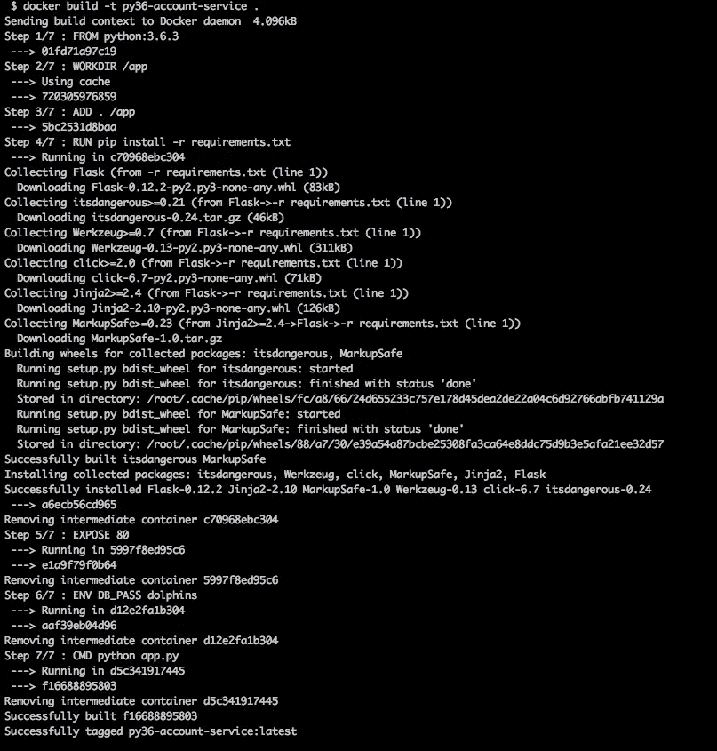
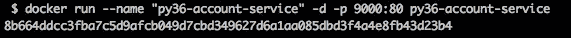
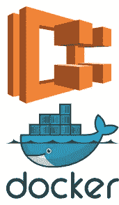

# 通过故事介绍 Docker

> 原文：<https://medium.com/hackernoon/an-introduction-to-docker-through-story-8ae5594d7446>

我之前的几篇基于故事的文章似乎真的很合得来，我从你们那里得到了一些非常好的反馈。因此，我想我会继续这个系列，并开始介绍更细粒度的主题，如集装箱化和码头工人。

我们将再次关注我们的高级开发人员 Gemma，她致力于改进在线漫画浏览/商店的[代码库](https://hackernoon.com/tagged/codebase)。如果你有兴趣了解这个故事是如何开始的，我建议你看看:

[](https://hackernoon.com/an-introduction-to-microservice-based-architecture-through-story-part-1-55c553ac4bd9) [## 通过故事介绍基于微服务的架构—第 1 部分

### 如今，对基于微服务的架构的推动似乎对许多大型、分布式……

hackernoon.com](https://hackernoon.com/an-introduction-to-microservice-based-architecture-through-story-part-1-55c553ac4bd9) 

> 如果你想在 docker 上了解更多，那么我强烈推荐你去看看这本书——[Docker:Up&Running:Shipping Reliable Containers in Production](http://amzn.to/2Ch8DyN)

## 这些问题

在过渡到基于微服务的方法期间，Gemma 监督了几个新面孔加入她的团队。当加入一个新团队时，总会有一个学习曲线和一个过渡期，这会降低团队的整体效率，因为他们希望在工作机器上设置好一切。

新来的人不应该感到束手无策，因此 Gemma 让她的一些高级工程师和新来的人在一起，试图让他们尽快开始运行代码库。

## 依赖和环境地狱

最初，Gemma 的团队中有 4 个人，他们作为一个紧密团结的单位工作，能够非常快速和轻松地修复彼此机器上的任何依赖问题或环境问题，而不会浪费太多时间。

然而，随着团队的扩大，不同环境的数量成为一个问题。一名团队成员可能运行 CentOS，另一名运行 MacOS，第三名运行 Windows 10。这意味着他们必须确保每台机器都有正确的依赖项和环境变量才能运行。

一个团队成员可能已经在他们的机器上安装了 Python 3.1，而帐户服务实际上需要 Asyncio 才能工作。Asyncio 仅在该语言的 3.4 版本中可用，因此该服务将无法在他们的机器上启动。

现在，虽然解决这个问题可能有些琐碎，但它确实代表了尝试将每个人同步到正确版本所花费的时间。随着代码库复杂性的增长，运行它所需的环境配置也在增长。

## 三。配置— 12 因素应用

如果你致力于让应用程序对云友好，那么你可能已经遇到了 [12 个因素](https://12factor.net/)。Gemma 和她的团队试图确保应用程序中的每项服务都符合所有这些因素，以便只需很少甚至不需要手动操作就能轻松扩展和部署服务。

第三个因素是您将所有配置项存储在您的环境中。这通常意味着使用 python 命令，例如:

```
import osdb_pass = os.environ["DB_PASS"]
```

以便检索数据库密码等。然而，这使得在您的本地机器上运行它变得相当困难，为了让您的程序运行，您必须首先设置所有这些变量。您可以使用 powershell 脚本或 bash 脚本来实现这一点，但是使这种跨平台兼容需要时间和精力，并且任何更改都变得很困难。

## 问题

为所有新来者设置适当的依赖项和环境变量的组合开始变得有点麻烦，有时测试是针对生产数据库运行的。这是由于开发人员忘记将环境变量设置回开发值。

随着未来团队的进一步扩展，这个问题需要得到解决。

## 解决方案— Docker

这就是杰玛发现集装箱化和码头工的奇妙世界的时候。通过容器化，Gemma 和她的团队能够在一个`Dockerfile`内定义应用程序运行所需的一切，然后用一个简单的命令运行他们新发明的 docker 应用程序。

他们首先将使用 Python 编写的帐户服务转换为使用 docker，然后想出了类似这样的东西:

```
FROM python:3.6.3WORKDIR /appADD . /appRUN pip install -r requirements.txtEXPOSE 80ENV DB_PASS dolphinsCMD ["python", "app.py"]
```

他们指定了希望应用程序运行的精确 Python 版本，指定了应用程序的工作目录，并运行了一个`pip install -r requirements.txt`,以便安装所有必要的 Python 依赖项。最后，他们公开了端口 80，这是运行底层 Python 应用程序的端口。

您将在倒数第二行看到，他们还能够指定他们的`DB_PASS`环境变量，这将允许他们连接到他们的开发数据库。

## 运行他们的应用

定义这个`Dockerfile`的真正好处是，团队中的每个人在本地机器上安装 Docker 后，都可以使用以下两个命令来构建和启动应用程序:

```
docker build -t py36-account-service .docker run --name "py36-account-service" -d -p 9000:80 py36-account-service
```

这将随后消失，下载所有需要的需求，并建立我们的 Docker 镜像文件，我们可以随后运行。



A screenshot of Gemma running this locally

之后，她就可以通过调用上面指定的第二个 Docker 命令来运行应用程序了。



running the account service

通过将应用程序迁移到这种新格式，这意味着团队的任何新成员都可以被告知只需安装 Docker(如果他们还没有安装的话)，然后运行这两个命令，他们就会在自己的机器上拥有一个工作帐户服务。从长远来看，这最终会节省大量时间。

这可以在所有开发者的操作系统上轻松工作。

## 应对多种环境

因此，虽然上面的结构允许开发人员在一个环境中运行他们的应用程序，但是它没有解决开发人员在生产环境中意外运行应用程序测试的问题。

为了解决这个问题，我们可以做一些事情，比如指定我们想要传递给应用程序的内容。在这些环境文件中，我们可以分别指定我们的开发、测试和生产凭证。然后，我们可以指定希望我们的应用程序像这样启动并使用我们的开发数据库:

```
docker run my_app --env-file .dev
```

## 结论

通过利用 docker，Gemma 和她的团队能够最大限度地降低新开发人员进入团队的门槛，并极大地减少了让某人启动并运行工作开发环境所需的时间。

将他们的应用程序对接也简化了部署，因为他们能够利用 AWS 服务，如弹性容器服务(ECS ),而不必太担心底层操作系统等。这最终节省了他们的时间和精力，并且成本与他们在一个普通的 EC2 实例上运行它是一样的。



# 结论

希望你觉得这个故事既有趣又有启发性！我很喜欢这种新的写作风格，我希望它能改变大多数技术文章冗长乏味的风格。

我希望这有助于突出 Docker 的好处，以及如何在日常应用中利用它来改进开发人员的工作流程。它不应该只用于微服务之类的应用，它还为更大的单片应用提供了很多价值。

如果你觉得这很有用，请在评论区告诉我，或者发微博给我@ [Elliot Forbes](https://medium.com/u/eb71d34fbe09?source=post_page-----8ae5594d7446--------------------------------) 。我非常乐意听到任何反馈！