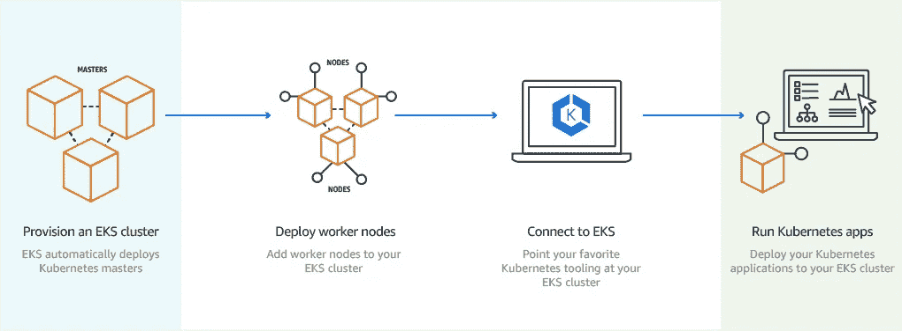
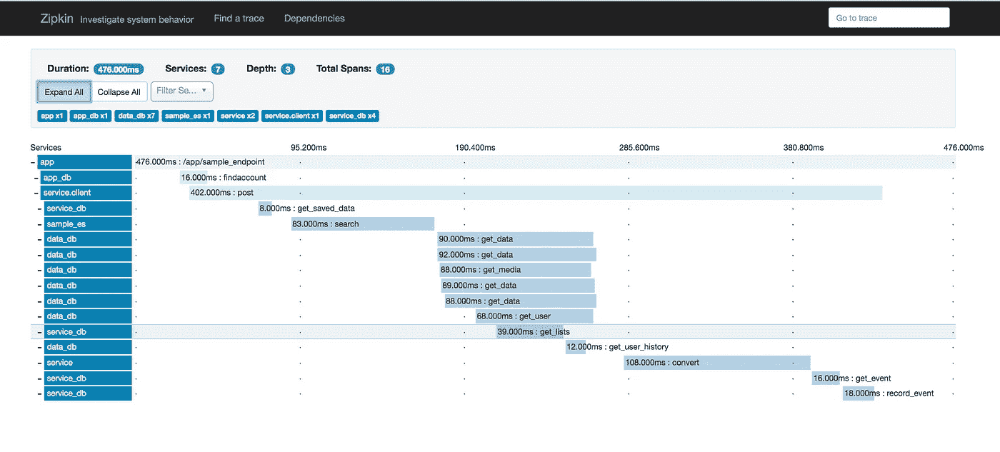

# 通过故事介绍基于微服务的架构—第二部分

> 原文：<https://medium.com/hackernoon/an-introduction-to-microservice-based-architecture-through-story-part-2-dacceaff9a13>

几周前，我写了这篇文章:

 [## 通过故事介绍基于微服务的架构—第 1 部分

### 如今，对基于微服务的架构的推动似乎对许多大型、分布式……

hackernoon.com](https://hackernoon.com/an-introduction-to-microservice-based-architecture-through-story-part-1-55c553ac4bd9) 

这对我来说是一种新的写作风格，我只是想尝试一下。从那时起，它就成为了我最受欢迎的帖子之一，它最近的活动促使我写下了故事的第二部分。

故事发生在高级开发人员 Gemma 身上，她领导着公司的一个团队向基于微服务的架构发展。这个故事发生在她的团队过渡到基于微服务的架构 3 个月后。

# 道路上的隆起

总体而言，向微服务架构的过渡已证明对公司有利。Gemma 成功地设计了一个解决方案，将网站分成 3 个不同的问题域；账户服务、商店服务和漫画浏览器服务。

## 停机时间的减少

在制作 3 个月后，这家漫画公司看到了任何停机时间的结束，这在一定程度上要归功于他们的绿蓝部署策略。再也没有“大爆炸”式部署上线并随后停止、导致整个站点瘫痪的情况了。

通过绿蓝部署，Gemma 和她的团队能够将新版本的系统与现有的稳定版本一起部署，并执行大量不同的测试，如 canary 测试，以确保当他们进行最终切换时，一切正常工作。

## 部署的困难

然而，随着 Gemma 和她的团队转向基于微服务的方法，他们发现他们花费在部署上的时间增加了。

他们不再执行单一应用程序的“一个”发布，而是在每次发布时部署 2 到 6 个不同的服务。这包括他们 3 个服务中的每一个的新的绿-蓝实例。

这显然并不理想，他们获得了更少的停机时间和更具弹性的架构，却损失了开发人员的生产力。作为一个小团队，如果一个开发人员每 3 天就被拖进 4 个小时的部署中，那么它真的开始损害团队的生产力。

## 库伯内特人的崛起

在遇到这个绊脚石后，Gemma 被迫进一步研究，并找到一种方法来自动化发布，这样他们就可以收回失去的时间，并将更多的精力放在交付关键业务价值上。

这是她发现 Kubernetes 的时候。她看了一下 [Kubernetes:启动并运行](http://amzn.to/2Dglbpt)，并开始精通使用 Kubernetes 的艺术。

Kubernetes 本质上允许她和她的团队将他们的整个系统定义为代码。在 AWS 新的托管 Kubernetes 服务的基础上运行这项服务，可以让他们在管理整体资产方面节省大量时间。

这引发的唯一问题是，团队需要一些时间来了解托管 Kubernetes 服务的来龙去脉以及底层的 Kubernetes [技术](https://hackernoon.com/tagged/technology)。随着时间的推移，这将节省更多的时间，Gemma 认为这没有问题。

AWS’s EKS — Managed Kubernetes Service

## 可追溯性的丧失

迁移到基于微服务的架构时出现的另一个有点麻烦的问题是，失去了对出错原因的可追溯性。

随着任何应用程序中服务数量的增长，能够跨构建该应用程序的各种微服务跟踪请求变得很麻烦。

如果某个服务出了问题，他们如何通过它调用的所有后续系统轻松地跟踪它？

最初，使用低效的调试机制浪费了大量时间。每当一个工程师因为一个问题在周末被叫去的时候，他们都不愿意上线并试图调试已经发生的事情。面临的任何问题都需要至少一个小时来调试，即使在没有问题的情况下也是如此。

## 可追溯性的答案:Zipkin

杰玛求助于一个名为 Zipkin 的系统，该系统基于谷歌自己的追踪系统 Dapper 的想法。Zipkin 本质上为您提供了所有服务间调用的非常详细的跟踪，并且本质上允许 Gemma 和她的团队跟踪他们的服务中面临的任何和所有问题。

同样，必须投入更多的时间来学习这个新工具，并确保她团队中的所有开发人员都能够轻松有效地使用该工具进行调试。

然而，一旦他们熟悉了 Zipkin，他们就能够利用这些看起来非常棒的调用跟踪。

Zipkin traces typically look like this

## 3 个月后——结论

在转向基于微服务的架构 6 个月后，该团队在进行更改的速度方面取得了巨大进步。

他们在弹性方面取得了巨大进步，客户体验也得到了极大改善。他们能够快速部署用户喜爱的变化和改进，总体而言，该公司能够主导在线漫画市场。

团队花了很多时间学习更新的技术，但是最初投入的时间最终得到了回报。

# 结论

希望你发现这篇后续文章和上一篇文章一样有趣和有启发性。一如既往，如果你对我的写作风格有任何反馈，请告诉我！我总是渴望改进我表达观点的方式！

我想这个故事的寓意是，虽然基于分布式微服务的架构可能适用于大多数不同的系统和团队结构，但你必须考虑部署和可追溯性等方面的复杂性增加。这与过去的方式相比是一个巨大的变化，开发者的思维方式必须改变。

想和我联系吗？请随意发微博给我@ [埃利奥特·福布斯](https://medium.com/u/eb71d34fbe09?source=post_page-----dacceaff9a13--------------------------------)。