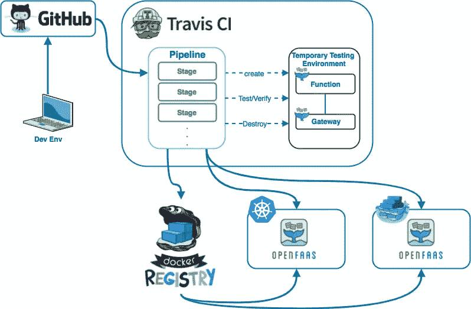
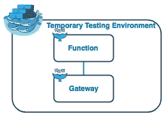
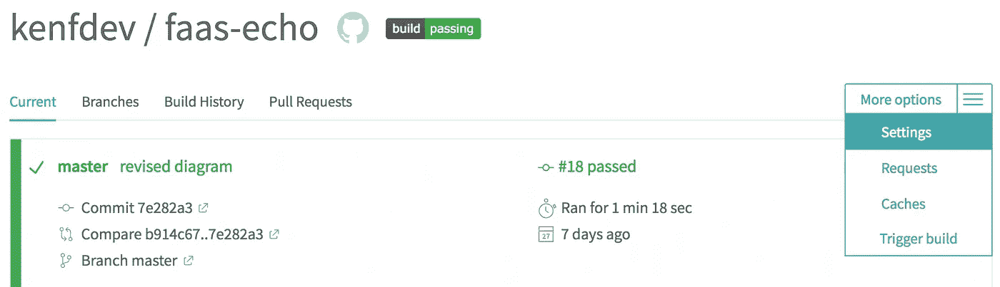
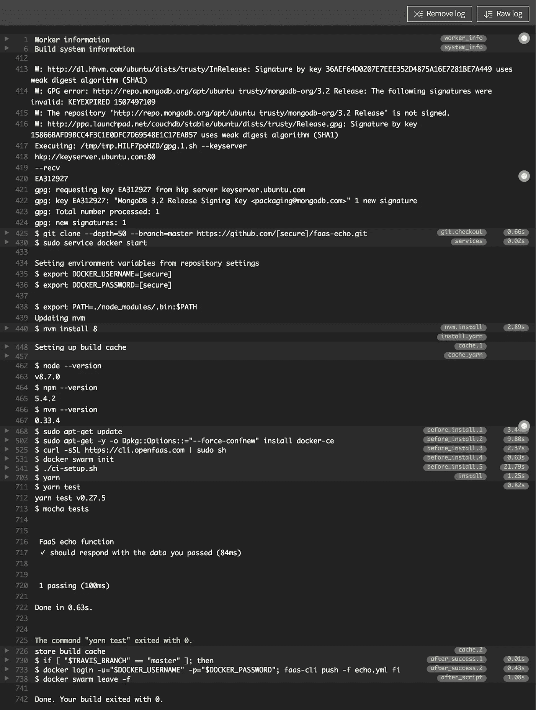

# 使用 OpenFaaS 的无服务器 DevOps 简介

> 原文：<https://medium.com/hackernoon/an-introduction-to-serverless-devops-with-openfaas-b978ab0eb2b>

DevOps 不仅仅是做 CI/CD。但是 CI/CD 管道在 DevOps 中有着重要的作用。最近我一直在 [OpenFaaS](https://www.openfaas.com/) 上投入时间，当我开始创建多个功能时，我想要一个易于使用和可访问的开发和交付流程，换句话说，一个 CI/CD 管道。

一天，当我与 Alex(OpenFaaS 的创造者)交谈时，他让我整理一份关于 open FAAS 的 CI/CD 的指南(使用 Github 和 Travis CI)。对我来说，这是一个完美的时机，因为我实际上正在考虑如何将我与其他项目一起应用的 CI/CD 管道集成到 OpenFaaS 无服务器管道中。下图显示了我得出的结论:



OpenFaaS CI/CD Pipeline

高层次的概述如下:

*   推送至 GitHub
*   流水线启动
    构建函数映像
    创建临时群环境
    运行函数测试
    如果测试通过则向注册表发布映像
    如果测试通过则部署函数
*   管道末端

对于那些想一头扎进去的人来说，资源库发布在这里。您可以在`.travis.yml`文件中查看管道的阶段和命令。

我从这里开始一步一步解释上下文。

# 在 Travis CI 构建中使用 Docker 和 Swarm

好吧，我不打算进入“如何使用特拉维斯 CI”的细节。有很多很好的文章解释这一点，官方文件也组织得很好。在我的用例中使用 Travis 的要点是:

*   我们将使用 Docker 和 Swarm
*   我们将使用 Node.js 进行测试

如[文档](https://docs.travis-ci.com/user/docker/)中所述，我们需要包括:

```
sudo: required

services:
  - docker
```

为了在构建中使用 docker。此外，我们希望能够使用`docker-compose` `version 3.2`来部署我们的 OpenFaaS 堆栈，但这在 Travis 的默认 docker 版本中是不可能的。同样，正如[文档](https://docs.travis-ci.com/user/docker/#Installing-a-newer-Docker-version)所说，你需要写:

```
before_install:
  - sudo apt-get update
  - sudo apt-get -y -o Dpkg::Options::="--force-confnew" install docker-ce
```

为了安装 docker 的新版本。如果你错过了这一部分，你会看到

```
unsupported Compose file version: 3.2
```

像这样的事情会失败的。

# 用 Swarm 创建临时测试环境



Open FaaS Temporary Testing Environment

如上图所示，我们需要一个 OpenFaaS 环境来全面测试功能(e2e 测试)。创建一个 Swarm 环境很容易，但是准备一个 OpenFaaS 环境需要一点调整才能正常工作。

为了准备我们的测试环境，我们需要:

*   获取 OpenFaaS CLI 工具( [faas-cli](https://github.com/openfaas/faas-cli) )
*   初始化群集
*   部署网关和功能

**获取 OpenFaaS CLI 工具:** OpenFaaS CLI 工具( [faas-cli](https://github.com/openfaas/faas-cli) )使得使用 open FAAS 变得很容易，我们肯定会在管道中需要它。它就像调用这个命令一样简单:

```
curl -sSL [https://cli.openfaas.com](https://cli.openfaas.com) | sudo sh
```

**初始化蜂群:** 这是直截了当的。只需调用命令:

```
docker swarm init
```

**部署网关和功能:**
好了，这是比较棘手的部分。通常，部署 OpenFaaS 是非常容易的**。我是真心的。如果你还没有，你一定要看看亚历克斯的“ [FaaS 与愤怒——在 60 秒内从 0 到无服务器，在任何地方](https://skillsmatter.com/skillscasts/10813-faas-and-furious-0-to-serverless-in-60-seconds-anywhere)”。但是为 CI/CD 管道部署它会增加一些您通常不需要的顾虑。在测试运行之前，环境需要准备好。这意味着群服务需要准备好。为此，我编写了一个简单的 shell 脚本函数:**

```
# This function checks if the service is in Running state
check_service_is_running() {
    local SERVICE_NAME=$1
    local STATE=$(docker service ps --format '{{json .CurrentState}}' $SERVICE_NAME)
    if [[ $STATE = \"Running* ]]; then
      echo 1
    else
      echo 0
    fi
}
```

**它使用`docker service ps`来检查服务的状态。如果是`Running`，则返回`1`，否则返回`0`。除了这个功能，我们需要重试，直到服务准备好，所以我也添加了一个重试功能(它在内部调用`check_service_is_running`):**

```
# This function waits for the service to become available.
# Retries for 10 times and 3 second interval (hard coded for now)
wait_for_service_to_start() {
    local n=1
    local max=10
    local delay=3local SERVICE_NAME=$1
    local SERVICE_IS_RUNNING=0
    while [  "$SERVICE_IS_RUNNING" -eq 0 ]; do
      if [[ $n -gt $max ]]; then
        echo "ERROR: Retried $(($n-1)) times but $SERVICE_NAME didn't start. Exiting" >&2
        exit 1
      fi
      SERVICE_IS_RUNNING=$(check_service_is_running $SERVICE_NAME)
      echo "Waiting for $SERVICE_NAME to start"
      n=$[$n+1]
      sleep $delay
    done
    echo "$SERVICE_NAME is Running"
}
```

**现在，我们可以确保网关和功能按预期运行，我们可以使用以下命令设置环境:**

```
# deploy the stack to swarm
./deploy_stack.sh# build the functions (assuming 4 cores)
faas-cli build --parallel 4 -f stack.yml# we can't deploy unless the gateway is ready so wait
wait_for_service_to_start func_gateway
# and then deploy
faas-cli deploy -f stack.yml# wait for functions to become ready for testing
wait_for_service_to_start echo
```

**`deploy_stack.sh`只是简单地呼叫:**

```
docker stack deploy func --compose-file docker-compose.yml
```

**并在 Swarm 内部部署堆栈。我想在本地机器上重用这个 shell，因此它在一个外部文件中。`faas-cli build`创建功能映像，`faas-cli deploy`通过网关部署功能。通过这个调整，我们可以确保一个完全工作的 OpenFaaS 环境(您可以在 [ci-setup.sh](https://github.com/kenfdev/faas-echo/blob/master/ci-setup.sh) 文件中查看完整的脚本)。**

# **测试功能**

**现在我们有了一个测试环境，针对它的测试非常简单。您可以选择自己喜欢的任何框架，但是对于本文，我选择了 Node.js 和 [chakram](https://github.com/dareid/chakram) 库。以下测试是对`echo`功能的示例测试。只是检查响应是否是我发送的文本:**

```
const chakram = require('chakram');
const expect = chakram.expect;const ENDPOINT = "[http://localhost:8080/function/echo](http://localhost:8080/function/echo)";describe("FaaS echo function", () => {
    it("should respond with the data you passed", () => {
        // Arrange
        const expected = "echo test";// Act
        return chakram.post(ENDPOINT, expected, {json: false})
            .then(response => {
                // Assert
                expect(response).to.have.status(200);
                expect(response.body).to.contain(expected);
            });
    });
});
```

**为了使用 Node.js 和缓存库，不要忘记在`.travis.yml`中添加以下几行:**

```
language: node_js
node_js:
  - "8"cache: yarn
```

# **清理虫群**

**这可能是不必要的，但我喜欢对称，所以我决定清理群体环境:**

```
docker swarm leave -f
```

# **发布和部署**

**在测试按预期通过之后，我们希望发布功能映像，并将它们部署到其他环境中(开发、阶段、生产等)。这很简单，travis ci [文档](https://docs.travis-ci.com/user/docker/#Branch-Based-Registry-Pushes)中也有记载:**

```
after_success:
  - if [ "$TRAVIS_BRANCH" == "master" ]; then
    docker login -u="$DOCKER_USERNAME" -p="$DOCKER_PASSWORD";
    faas-cli push -f echo.yml
    fi
```

**这意味着只有当**测试成功**并且在**主分支**上时，图像才会被推送。`faas-cli push`将函数推送到注册表。另一个有趣的部分是`$DOCKER_USERNAME`和`$DOCKER_PASSWORD`环境变量。您可以通过 travis ci 管理控制台设置这些凭据。**

****

**travis ci dashboard**

**从设置中，您可以设置环境变量:**

****

**Setting Environment Variables**

**因此，你不必在`.travis.yml`里暴露你的身份。虽然上面的命令没有部署到任何环境中，但这只是触发一些 deploy webhook(或类似的东西)的问题。因此，无论您使用什么后端(Swarm、Kubernetes、黄牛等)，您都将在这里执行某种触发命令。**

# **运行管道！**

**一切准备就绪！现在让我们做一些编辑并触发管道。您应该会看到类似这样的内容:**

****

**您应该看到测试通过了，图像也发布了。**自动化全流水线！****

# **包扎**

**在本帖中，我们为 OpenFaaS 创建了一个完整的 CI/CD 管道。可以把服务换成自己喜欢的，GitLab，Gogs，Jenkins，Circle CI，GoCD，Drone 等。(随你怎么说),你可以在云中或内部任何你喜欢的地方无缝地使用它们。不用说，能够完全控制管道是一个巨大的优势！**

**尽管如此，仍有一些我们可以改进的地方，包括:**

*   **每次更新 docker 以在流水线的开始使用 docker-compose `ver: 3.2`需要一点时间。希望有某种方式来切换特拉维斯的 docker 版本**
*   **CI 每次都下载`faas-cli`。也许我们可以创建一个`faas-cli`容器，并在管道中重用它，利用图像缓存的优势。**

**如果你有任何想法，请随时与 [me](https://twitter.com/kenfdev) 分享！也会喜欢反馈！**

**延伸阅读:**

*   **你可以在这里找到这篇文章项目的完整回购:【https://github.com/kenfdev/faas-echo】T5**
*   **如果你还没有，你一定要看看 Alex 的“OpenFaaS:与 Alex Ellis 一起在 60 秒内从零到无服务器”:**

***如果你对 OpenFaaS 感兴趣，请给*[*GitHub repo*](https://github.com/openfaas/faas)*打一个* ***星*** *以示支持！***