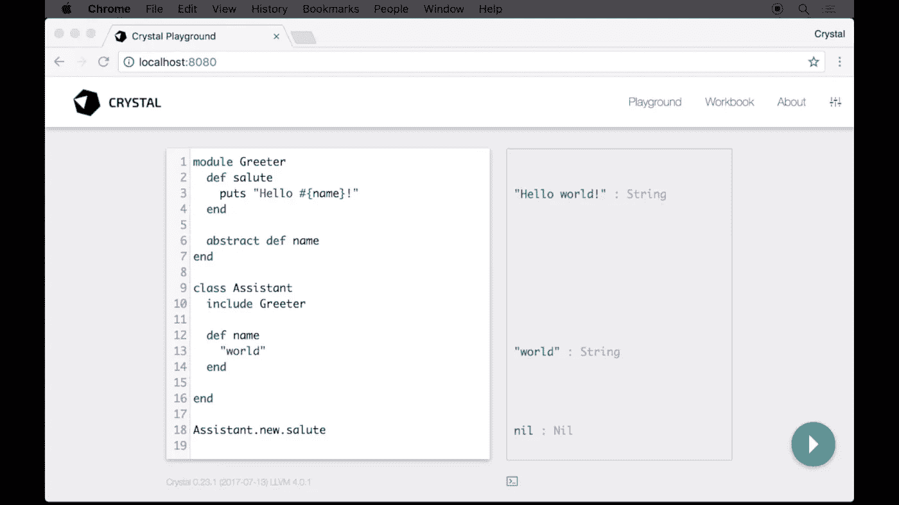

# 水晶编程语言介绍

> 原文：<https://medium.com/hackernoon/an-introduction-to-the-crystal-programming-language-b9e0222b5b5e>

Crystal’s syntax is heavily Ruby-inspired, and it comes with this amazing built-in playground.

Crystal 诞生于五年前，是对一个长期存在的假设的挑战:编程语言要么容易被人类理解，要么可以编译成快速程序。

Crystal 是一种静态类型的编译语言，其性能接近 c/c++，但语法像 Ruby 一样可读。它依赖 LLVM 来发出本机代码，从而利用工具链中内置的所有优化。由于它的类型检查系统，类型错误在编译期间被捕获，避免了运行时的错误。但是，考虑到它有内置的类型推断，大多数类型注释都是不必要的，这样可以使代码更整洁、更易读。

许多其他特性使它成为一种强大而易用的语言:空引用检查、宏系统和 C 绑定。随着社区的不断增长(GitHub 上有超过 8.8k 的追随者)，Crystal 是发展最快的现代语言之一。

这里有一个关于 Crystal 的快速介绍，可以让你在 30 分钟内开始使用。

*   [001.1 —安装和介绍 Crystal](https://www.dailydrip.com/topics/crystal/drips/installation-and-introduction-to-crystal) —通过学习如何在 Crystal 中安装、编写代码和编译，准备运行您的第一个简单程序。
*   [001.2 — Crystal 语言基础知识](https://www.dailydrip.com/topics/crystal/drips/crystal-language-basics) —我们将在 Crystal 的操场上玩，这是一种快速学习基本构造、内置类型、类型系统和方法重载的便捷方式。
*   [001.3 —语言基础 II](https://www.dailydrip.com/topics/crystal/drips/language-basics-ii) —让我们看看如何定义类、模块和宏。
*   [001.4 — Web 服务器](https://www.dailydrip.com/topics/crystal/drips/web-server) —用 Crystal 在 5 分钟内搭建一个 HTTP 服务器！
*   [001.5 — JSON 和数据库](https://www.dailydrip.com/topics/crystal/drips/json-databases) —通过学习处理 JSON 和访问数据库来扩展您的 Crystal 能力。