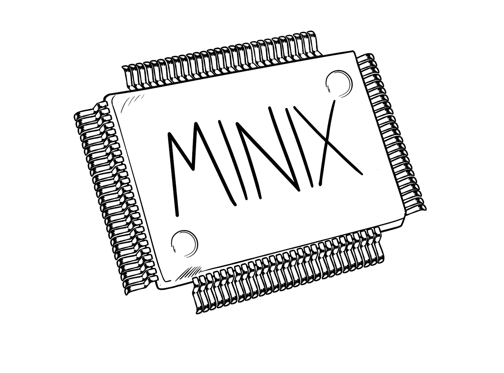

# 致安德鲁·塔南鲍姆的公开信

> 原文：<https://medium.com/hackernoon/an-open-letter-to-andrew-tanenbaum-883e1abe692a>

Illustration by [Daniele Sapuppo](https://www.facebook.com/danielesapuppocomicartist)

亲爱的塔南鲍姆教授，

当我还是一个年轻的学生时，我认真研究了你的许多书，惊奇地探索计算机的内部工作原理。作为一名软件工程师，他们给了我许多我今天仍在使用的工具。

我感谢你对这个领域的巨大贡献。启发数百万学生的思维，并向他们展示学习计算机如何工作的途径，是一项比编写一个在许多机器上运行的操作系统大得多的成就。

这就是为什么我一直认为你是一流的天才。我总是向任何对我们领域感兴趣的人推荐你的书，因为我知道这将是学习计算机体系结构、网络或操作系统的最佳途径。

这也是为什么，当我昨天看到你写了一封公开信给英特尔，我期待终于有人站出来为最终用户的自由。

你的操作系统正被英特尔用来潜在地完全控制任何由他们的芯片驱动的机器。讽刺的是，正如你所知道的，它比最终用户运行的操作系统更强大。我愿意相信 MINIX 的真正目的是教年轻学生如何走出去，发明他们自己的操作系统。不要控制他们的个人机器。

为了最终用户的自由，我们生活在一个困难的时代。大公司控制了我们的数据和隐私，现在似乎也控制了我们的机器。

**我们需要你这种级别的人的支持和声音，开始提出一些重要的问题**。我们必须重申并提醒大公司，最终用户的自由是唯一重要的自由。比任何许可争论或“谁的操作系统运行得最多”都多。

帮助我们明确用户拥有他们机器的所有权。这是一项真正值得铭记的事业。

带着尊敬和感激，

萨尔瓦托勒·扎帕拉
前计算机科学学生

___________

背景:请点击此处阅读安德鲁·塔南鲍姆教授致英特尔的公开信:
[http://www.cs.vu.nl/~ast/intel/](http://www.cs.vu.nl/~ast/intel/)