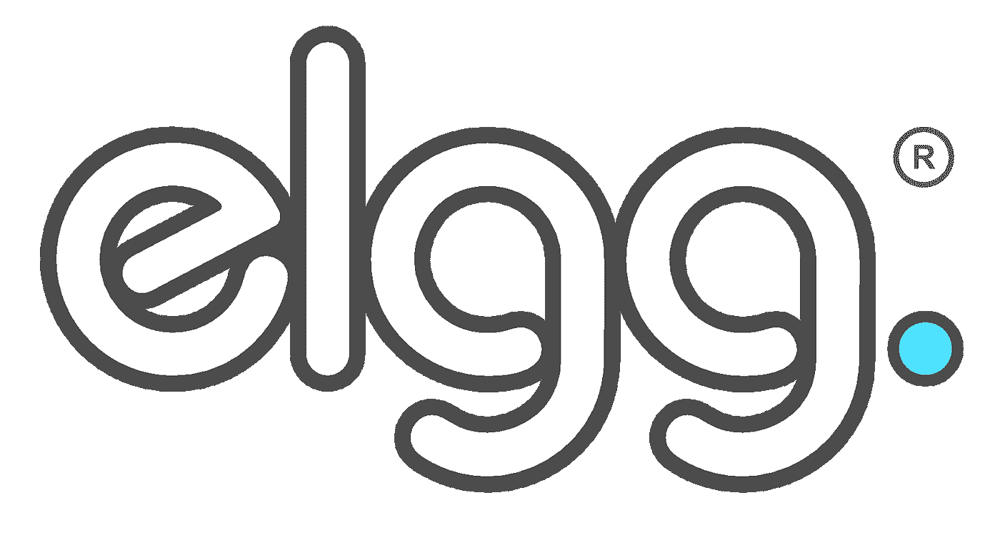

# 给埃尔格的公开信

> 原文：<https://medium.com/hackernoon/an-open-letter-to-elgg-af8bba75032b>

Logo by [Pete Harris](http://www.peteharris.co.uk/)

## 你好。有一段时间了。

亲爱的大家:

第一:尽管我是 Elgg 的技术联合创始人，但我从 2009 年起就不再是这个社区的一员，从那以后，比我聪明得多的人开始从事核心代码管理。这封信意味着爱，但我不认为有任何发言权。

尽管如此，我还是被转发到了 [Elgg 的十字路口](https://elgg.org/discussion/view/2544502/elgg-at-a-crossroads)，虽然那个帖子的评论已经关闭，但我不能不参与进来。在那篇文章中，史蒂夫·克莱说:

> 就我个人而言，我真的很喜欢与 Elgg 的贡献者一起工作，不想停止，但为了我的职业生涯，我不能再专注于返工 2008 年时代的 API 了。

如果这些 API 是 2008 年的，它们实际上也是 2006 年的。那是整整十年前的网络技术。

如果我认为一个全球开源社区将在十年后坚持我的 API 决策，我可能会更加努力地考虑它们。

埃尔格出生在另一个世界。我们的媒体称我们为“盒子里的 MySpace”。 *MySpace* ！当时，社交平台有个人资料、订阅源、博客、照片和标签。可以肯定的是，这是一个更简单的时代。

十年后，我们有了 Snapchat、Instagram、Periscope 等等。而且中等！越来越多的人通过移动设备上网。青少年在 YouTube 上听音乐。高清视频会议是常态。我们正处于实时环境、移动设备、机器人、视频直播和无处不在的连接的时代。

没有充分的理由保持与旧时代的向后兼容性。互联网从来都不是这样运作的。你想让 2008 年的插件继续工作，或者继续使用 Elgg 1.12 的想法是可笑的。我不能代表我的共同创始人戴夫·托什，但我很确定他会对此有所选择。我也是。我会把它们留给你去想象。

我在 2003 年开始写 Elgg 的第一个版本。三年后，我们决定必须创建一个全新的版本来进步，我们做到了——没有向后兼容性。没有理由不这样做了。

开源很神奇。如果你真的想让这些东西工作，你应该自己开发代码。任何人都可以。(表白:六年左右，我也想过要分叉 Elgg。)

但是核心开发者应该总是创造新的东西。他们已经为这个平台贡献了太多的职业生涯——让这个平台代表他们所能做到的最好，这才是公平的。反过来，这也是给社区和网络的一份礼物。(另一个天赋是:以此谋生的能力。帖子的评论暗示了那些认为任何人都不应该用开源赚钱的人，我相信这种态度是极其有害的。)

请不要让我古老的决定阻碍你。你应该乐于创造推动社交网络发展的新事物。

请接受我的道歉，我粗鲁地插手了。

爱情，

本(男子名)

Team Elgg, a decade ago, L-R: me, Dave Tosh, Misja Hoebe.

> [黑客中午](http://bit.ly/Hackernoon)是黑客如何开始他们的下午。我们是 [@AMI](http://bit.ly/atAMIatAMI) 家庭的一员。我们现在[接受投稿](http://bit.ly/hackernoonsubmission)，并乐意[讨论广告&赞助](mailto:partners@amipublications.com)机会。
> 
> 如果你喜欢这个故事，我们推荐你阅读我们的[最新科技故事](http://bit.ly/hackernoonlatestt)和[趋势科技故事](https://hackernoon.com/trending)。直到下一次，不要把世界的现实想当然！

