# Upwork 上一个伪装得非常好的恶意软件骗局:我是如何差点被一个键盘记录器感染的

> 原文：<https://medium.com/hackernoon/an-unusually-well-disguised-malware-scam-on-upwork-how-i-almost-got-infected-with-a-keylogger-a638b7c51927>

以下是我在 Reddit 上发的一个帖子的复印件。

通常，我会尽量把我的 Reddit 主账户和任何有我真名的账户分开。但事实是，这是我想让其他人知道的事情——尤其是其他使用 [Upwork](https://hackernoon.com/tagged/upwork) 寻找客户的自由职业者。

所以我愿意冒险暴露我的真实姓名。如果你把一些文本复制粘贴到谷歌上，你可能会找到我的帖子。如果这成为一个问题，我随时可以创建另一个 Reddit 帐户。

这是一个关于骗局的帖子。这不是典型的骗局，你工作，他们不给你工资。我以前遇到过几次。这是不同的东西。

这是一次试图用键盘记录器感染人们的尝试，目的是窃取密码。

我以前听说过这些事情发生在 Upwork 上。事实上，我在 2016 年申请了一份工作，结果是一次钓鱼尝试。我马上就认出来了，但还是很惊讶。

几年前我在 Elance 被骗过。我做了价值约 3000 美元的工作，却从未得到报酬。我见过同样的骗局不断出现，但它往往遵循同样的模式。

这个不一样。我用截图记录了这次经历。我决定与社区分享这一点，因为这是相对良好的伪装，我敢肯定，我不是唯一一个申请这个所谓的“演出”的人

我是一名文案和内容撰稿人，这是一份写作工作。然而，我确信类似的骗局可能也针对其他职业。

事情是这样的。

我一直在用 Upwork 到处寻找新客户。我对申请什么样的工作很挑剔，我不在乎低于某个比率的工作。1000 字 5 美元？哈哈哈哈，没有。

总之，这份工作给了我一份异常丰厚的报酬。一般来说，100-1200 字左右的文章收费 100-120 美元是相当标准的，但在 Upwork 上很少能找到这么好的东西。

当我申请的时候，这个工作已经开始了 45 分钟，已经有 20-50 个提议了。然而，由于体面的工资率和正规工作的承诺，我想无论如何我都要参加竞选。我知道客户会从完全不适合这个职位的人那里收到很多蹩脚的英语提议，所以我认为其中一些提议可能是行不通的。

这里有一些演出的截图。

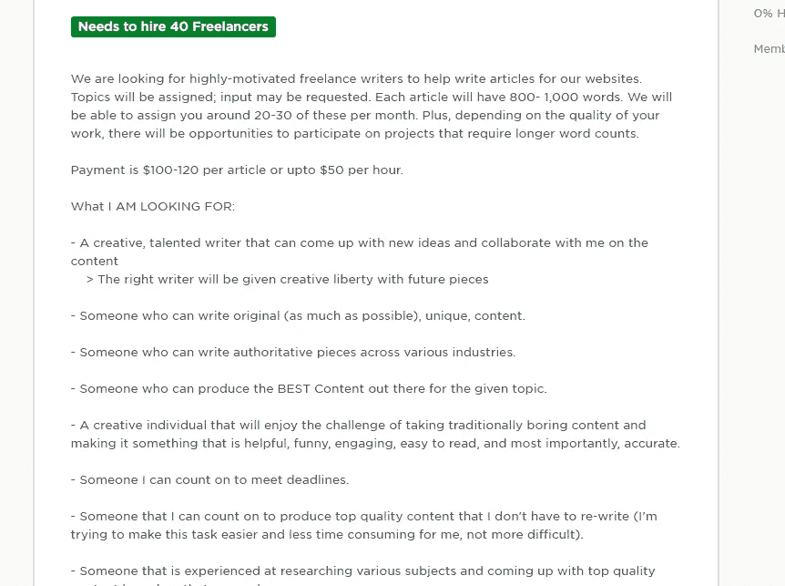

这是对 Upwork 写作工作的一个非常标准的描述。

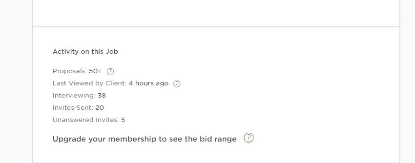

如你所见，他们有相当多的读者。

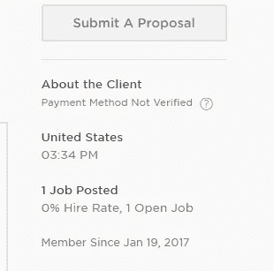

如你所见，他们是 Upwork 的新手，他们的支付方式未经验证。这有时可能是一个危险信号，所以我记下了这一点。然而，最糟糕的情况是这份工作不合法，所以我还是试了一下。它没有遵循我过去遇到的诈骗的重复模式。

我被选中参加面试，并被提供了一个 Skype ID 添加到我的联系人列表中，这样他们就可以和我谈论这个项目。酷毙了。

我在 Skype 上加了“朱迪思”，伸出手。

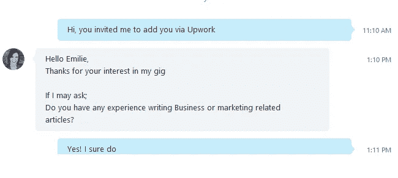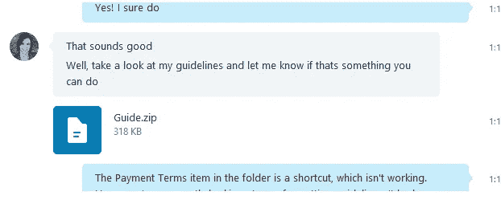

此时，他们发给我一个. zip 文件，里面有他们的项目指南。

有两个文件。一个是名为“所有内容的格式”的 PDF 那个文件工作正常。它详细说明了格式要求，这些要求非常简单。

第二个文件的标题是“付款条件”，但显示为快捷方式，而不是文件。点击它没有任何作用。

很自然地，我让他们知道他们不小心给我发送了一个文档的快捷方式，而不是实际文档本身的副本。

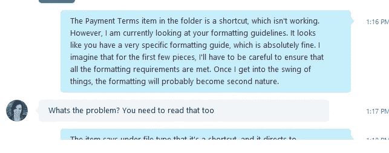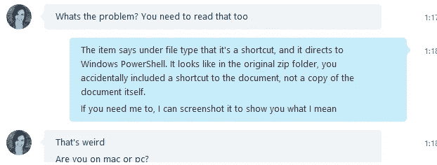

如果你精通技术，你可能会想，“啊，该死的不。”然而，我不是特别懂技术，所以一开始我没有意识到这是怎么回事。我真的以为他们不小心把文档的快捷方式放到了。zip 文件夹。

我认为快捷方式文件是个错误，于是问他们是否可以重新发送文件。

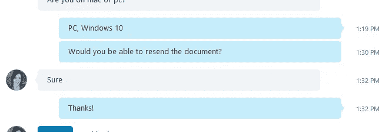

它仍然显示为快捷方式，而不是文件。有益的是，我截图给他们看。

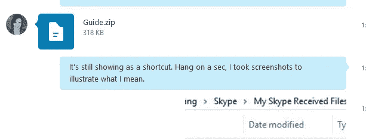

他们答复如下:

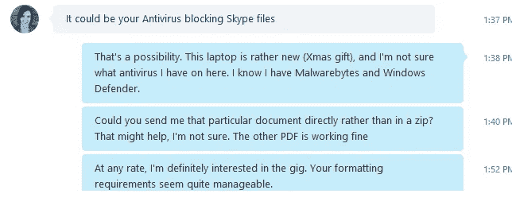

如你所见，我问他们是否会直接把文件发给我。我已经通过 Skype 发送了大量的 pdf、图像文件和 MS Word 文档，所以我知道这很容易做到。

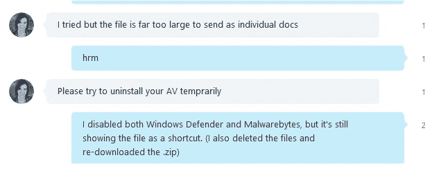

我意识到我试图禁用 Malwarebytes 是愚蠢的，但幸运的是，该文件仍然拒绝打开。然而，据我所知，这并不意味着键盘记录器没有安装。

这就是我开始怀疑的地方。带有付款条款的 PDF 或 Microsoft Word 文档不可能太大而无法通过 Skype 发送。

以前，我认为是某种技术上的无能。这个人可能是某种编辑，而不是技术人员。令人惊讶的是，有些人对技术一无所知。简单检查一下 [/r/talesfromtechsupport](https://www.reddit.com/r/talesfromtechsupport) 就能说明这种现象。

但此时，我开始怀疑这里面可能有猫腻。

他们提出再次尝试发送文件。

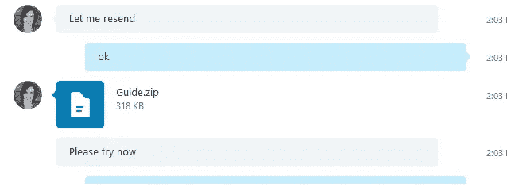

还是不行。

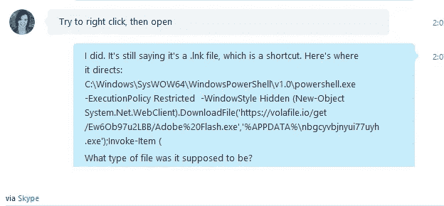

在进入“属性”并看到那个奇怪的文件路径后，我*肯定*怀疑某种[恶意软件](https://hackernoon.com/tagged/malware)感染企图。我听说过这种事情确实发生在 Upwork 上，但我自己从未经历过。

同样，如果你精通技术，你现在正在摇头。请原谅我当时的无知。直到后来我才意识到那个文件路径的真正含义。

正是在这一点上，我决定使用我通常的骗局检测策略之一。我查看了用户的 Skype 个人资料，并对他们的个人资料图片进行了截图。然后，我做了反向图片搜索。

The stolen profile picture the scammer was using.

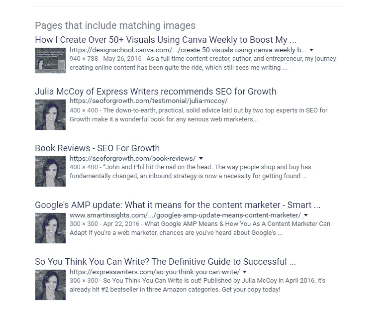

The reverse image search results.

反向图像搜索显示了多个搜索结果，表明照片属于朱莉娅·麦考伊，她是一名职业作家，也是一家名为 ExpressWriters 的文案机构的首席执行官。

在检查了那个特定机构的[定价页面](https://expresswriters.com/pricing/)后，很明显这个任务不可能是给那个公司的。基于他们向客户收取的费用，这个价格是不合理的。

我又发了一条信息。

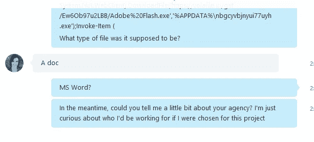

自然，他们没有回应。

我的 SO 谷歌了文件路径，意识到这是一个可疑的程序。然后我被几个 Reddit 评论者告知，他们已经成为同一个骗局的受害者，并且安装了一个键盘记录器。其中一些人的 Paypal 账户被盗，或者 Gmail 账户被盗。

惊恐之下，我立即清除了我的浏览器历史记录，其中包含保存的密码。我肯定不会登录 Gmail、Upwork、Paypal 或任何其他重要的网站。

我联系了一个在 IT 部门工作的好朋友。他建议我继续在我的笔记本电脑上做一个完整的工厂重置。

我照做了，并在另一台设备上更改了我所有的密码。

到目前为止，我似乎完好无损。我非常幸运。

我决定分享这一点的原因是，直到 Skype 对话进行到一半时，一切似乎都是合法的。

显然，骗局越来越不明显了。永远小心 Upwork 客户。确保你知道你在为谁工作，不要害怕向他们索要公司名称、LinkedIn 简介或其他任何东西，以表明他们是合法的个人或机构。

我能够足够迅速地采取行动，防止自己成为受害者。其他人就没这么幸运了。可怕的是，骗子们在社交工程方面有多聪明，他们中有多少人潜伏在你意想不到的地方。

> [黑客中午](http://bit.ly/Hackernoon)是黑客如何开始他们的下午。我们是 [@AMI](http://bit.ly/atAMIatAMI) 家庭的一员。我们现在[接受投稿](http://bit.ly/hackernoonsubmission)并乐意[讨论广告&赞助](mailto:partners@amipublications.com)机会。
> 
> 如果你喜欢这个故事，我们推荐你阅读我们的[最新科技故事](http://bit.ly/hackernoonlatestt)和[趋势科技故事](https://hackernoon.com/trending)。直到下一次，不要把世界的现实想当然！

