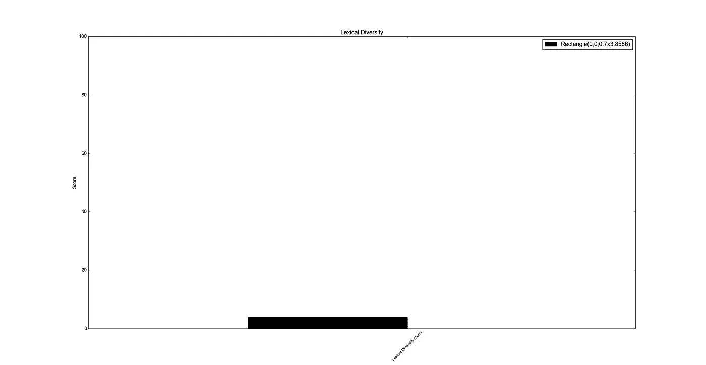
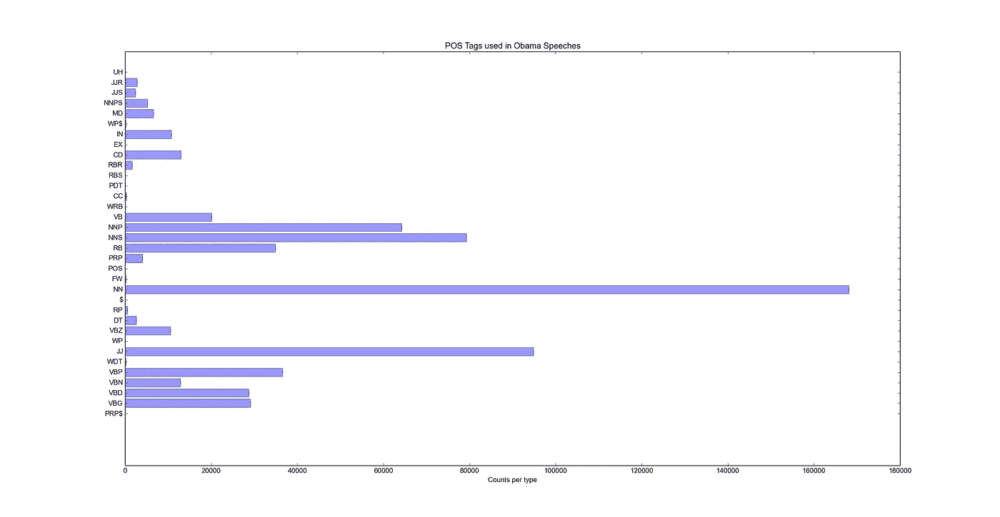
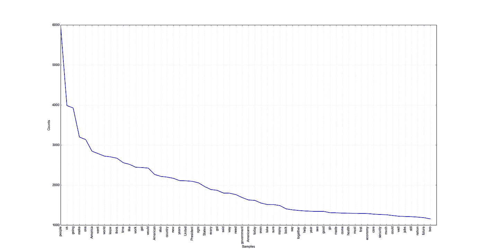
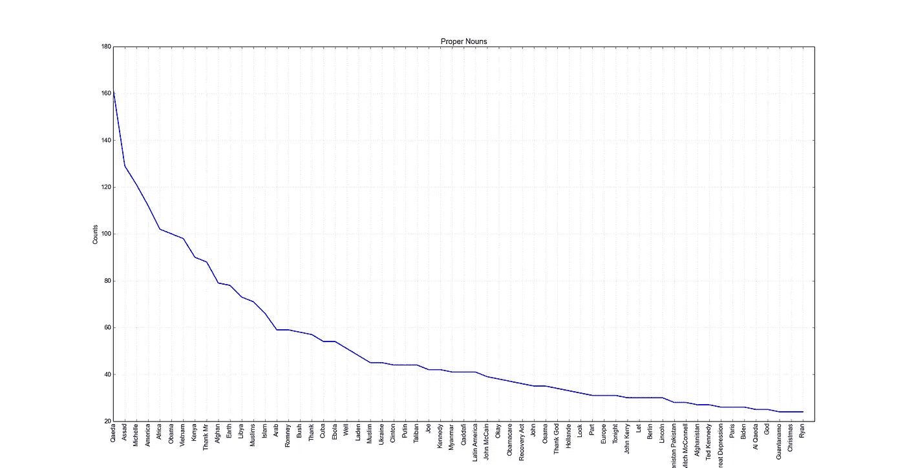
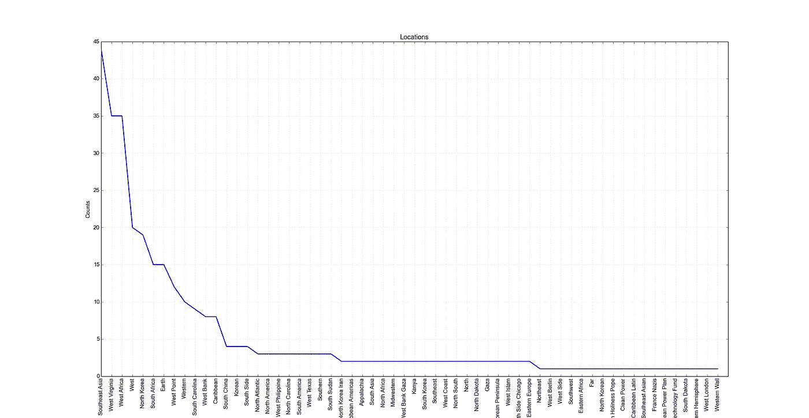
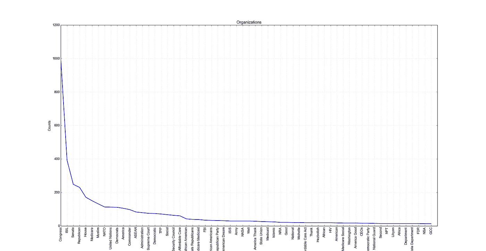
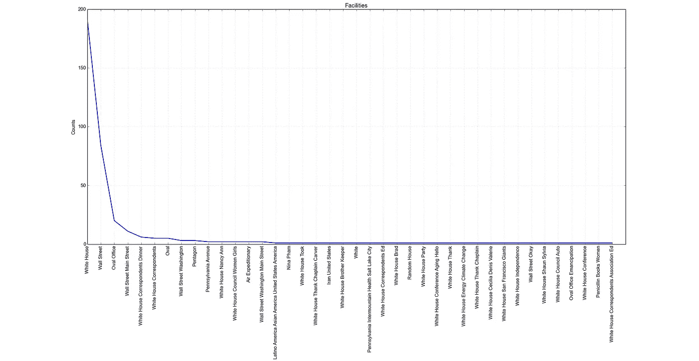
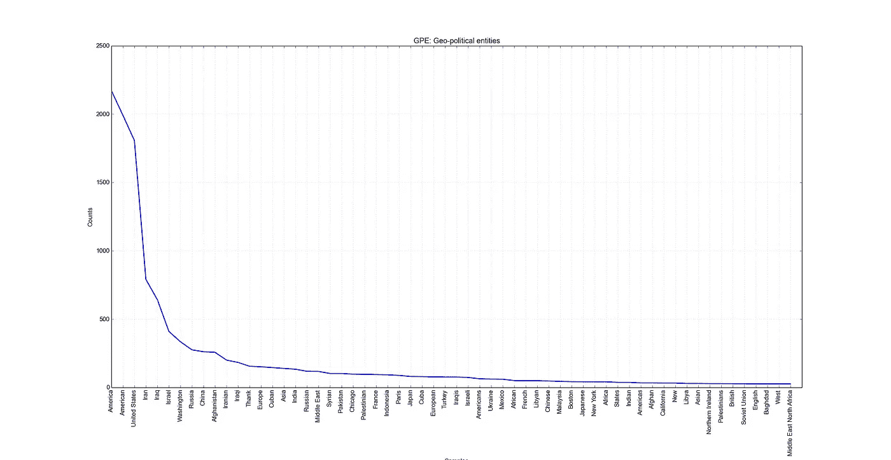

# 分析奥巴马自 2004 年以来的演讲

> 原文：<https://medium.com/hackernoon/analysing-obama-speeches-since-2004-7f08797f7078>


Photo by [Jason Yu](https://unsplash.com/@jason_yu?utm_source=medium&utm_medium=referral) on [Unsplash](https://unsplash.com?utm_source=medium&utm_medium=referral)

我最近一直在玩一些工具来分析在线文本，我一直在使用 NLTK(自然语言工具包)，这是一个用于构建 Python 程序来处理人类语言数据的平台。

**NLP** 或**自然语言处理**是使计算机能够理解人类语言、推导意义并生成自然语言的科学。它是**计算机科学、** **人工智能、****语言学的交叉。**

最近我一直在做一个非常类似的项目，在我的 raspberry pi 上实现一个智能聊天机器人，我将在我的[博客](http://eon01.com/blog)上发布我的实验，但现在，让我们学习**如何使用 NLTK 来分析文本**。

我在本教程中提供的分析是基于 **348 文件**的，但仍然是近似的，旨在成为学习基础知识的教育工具，而不是更多。NLTK 是一个伟大的工具，但仍然是一个软件，旨在随着时间的推移变得更加有效。也许您会发现一些小的分类错误，但与整体结果相比，这仍然可以忽略不计。

文本已经从[这个网站](http://www.americanrhetoric.com/barackobamaspeeches.htm)下载，我还没有看到每一个演讲的内容，但是这些文本绝大多数都是奥巴马在他的演讲中讲述的。与这个分析的整体结果相比，其他人所说的任何事情都是微不足道的。

# 下载内容

首先是下载内容，我使用了这个简单的 Python 脚本:

```
#!/usr/bin/env python
# coding: utf8from goose import Goose
import urllib
import lxml.html
import codecsdef get_links(url, domain):
 connection = urllib.urlopen(url)
 dom = lxml.html.fromstring(connection.read())
 for link in dom.xpath(‘//a/@href’): # select the url in href for all a tags(links)
 if ( link.startswith(“speech”) and link.endswith(“htm”) ):
 yield domain + linkdef get_text(url):
 g = Goose() 
 article = g.extract(url=url)
 with codecs.open(article.link_hash + “.speech”, “w”, “utf-8-sig”) as text_file:
 text_file.write(article.cleaned_text)if (__name__ == “__main__”):
 link = “[http://www.americanrhetoric.com/barackobamaspeeches.htm](http://www.americanrhetoric.com/barackobamaspeeches.htm)"
 domain = “[http://www.americanrhetoric.com/](http://www.americanrhetoric.com/)"
 for i in get_links(link, domain):
 get_text(i)
```

连接是第二步:

```
import os
for file in os.listdir(“.”):
 if file.endswith(“.speech”):
 os.system(“cat “+ file + “ >> all.speeches”)
```

那么建议创建我们用 NLTK 行话称之为令牌的东西:

```
with codecs.open(“all.speeches”, “r”, “utf-8-sig”) as text_file:
 r = text_file.read()
 #Remove punctuation
 tokenizer = RegexpTokenizer(r’\w+’)
 _tokens = tokenizer.tokenize(r)
 # Get clean tokens
 tokens = [t for t in _tokens if t.lower() not in english_stopwords]
```

# 分析内容

## 词汇多样性

根据维基百科，给定文本的词汇多样性定义为单词总数与不同独特词干数量的比率。

```
# Process lexical diversity
 st = len(set(tokens))
 lt = len(tokens)
 y = [st*100/lt]
 print(y)
 fig = plt.figure()
 ax = fig.add_subplot(111)
 N = 1
 # necessary variables
 ind = np.arange(N)
 width = 0.7
 rect = ax.bar(ind, y, width, color=’black’) 
 # axes and labels
 ax.set_xlim(-width,len(ind)+width)
 ax.set_ylim(0,100)
 ax.set_ylabel(‘Score’)
 ax.set_title(‘Lexical Diversity’)
 xTickMarks = [‘Lexical Diversity Meter’]
 ax.set_xticks(ind+width)
 xtickNames = ax.set_xticklabels(xTickMarks)
 plt.setp(xtickNames, rotation=45, fontsize=10)
 ## add a legend
 ax.legend( (rect[0], (‘’) ))
 plt.show()
```



## POS 标签频率

就像在 NLTK 的官方文档中解释的那样，将单词分类到它们的**词性**并相应地标注它们的过程被称为**词性标注**、**词性标注**，或者简称为**标注**。

嗯，简单来说，一个词可以是名词，动词和形容词。NLTK 将帮助我们确定这一点:

```
# get tagged tokens
 tagged = nltk.pos_tag(tokens)
 # top words by tag (verb, noun ..etc)
 counts = Counter(tag for word,tag in tagged)
 # counter data, counter is your counter object
 keys = counts.keys()
 y_pos = np.arange(len(keys))
 # get the counts for each key
 p = [counts[k] for k in keys]
 error = np.random.rand(len(keys)) 
```

以下是带有描述 POS 标签列表:

```
POS Tag | Description | Example
CC coordinating conjunction :  and
CD cardinal number :  1, third
DT determiner : the
EX existential : there there is
FW foreign word : d’hoevre
IN preposition/subordinating conjunction : in, of, like
JJ adjective : big
JJR adjective, comparative : bigger
JJS adjective, superlative : biggest
LS list marker : 1)
MD modal : could, will
NN noun, singular or mass : door
NNS noun plural : doors
NNP proper noun, singular : John
NNPS proper noun, plural : Vikings
PDT predeterminer : both the boys
POS possessive ending : friend‘s
PRP personal pronoun : I, he, it
PRP$ possessive pronoun :  my, his
RB adverb : however, usually, naturally, here, good
RBR adverb, comparative : better
RBS adverb, superlative : best
RP particle : give up
TO to : to go, to him
UH interjection : uhhuhhuhh
VB verb, base form : take
VBD verb, past tense : took
VBG verb, gerund/present participle : taking
VBN verb, past participle : taken
VBP verb, sing. present, non-3d : take
VBZ verb, 3rd person sing. present : takes
WDT wh-determiner : which
WP wh-pronoun : who, what
WP$ possessive wh-pronoun : whose
WRB wh-abverb : where, when
```

这是我们得到的结果:

*   不止 16k 名词
*   差不多 10k 形容词
*   几乎没有预定者
*   ..等等



普通词汇

为了找出奥巴马演讲中最常用的 60 个词(不包括停用词)，下面的代码将完成这项工作:

```
# Top 60 words
 dist = nltk.FreqDist(tokens)
 dist.plot(60, cumulative=False)
```



## 常用表达

搭配是通常同时出现的多个单词的表达。在本例中，我将数量限制为 60:

```
text = nltk.Text(_tokens)
 collocation = text.collocations(num=60)
```

嗯，共有的表达是:

> 美国；
> 确定；
> 保健；
> 中产阶级；
> 美国人；
> 上帝保佑；
> 白宫；
> 年轻人；
> 年前；
> 21 世纪；
> 中东；
> 长期；
> 总理；
> 确认；
> 清洁能源；
> 气候变化；
> 健康保险；
> 国家安全；
> 总督罗姆尼；
> 执法；
> 核武器；
> 一点点；
> 私营部门；
> 华尔街；
> 国际社会；
> 平价医疗；
> 核武器；
> 每一单；
> 小企业；
> 社会保障；
> 四年；
> 人权；
> 市民社会；
> 前进；
> 最高法院；
> 关心法案；
> 本·拉登；纽约；
> 每天；联合国；
> 减税；
> 即使；
> 第一次；
> 世界大战；
> 保险公司；
> 现状；
> 两年；
> 冷战；
> 去年；
> 联邦政府；
> 经济增长；
> 全球经济；
> 一起来；
> 整束；
> 好消息；
> 亚太；
> 下午好；
> 新岗位；
> 走马上任；
> 常识

## 提取名词，地点，组织和其他东西

代码:

```
 #ORGANIZATION Georgia-Pacific Corp., WHO
 #PERSON Eddy Bonte, President Obama
 #LOCATION Murray River, Mount Everest
 #DATE June, 2008–06–29
 #TIME two fifty a m, 1:30 p.m.
 #MONEY 175 million Canadian Dollars, GBP 10.40
 #PERCENT twenty pct, 18.75 %
 #FACILITY Washington Monument, Stonehenge
 #GPE South East Asia, Midlothiannouns = [chunk for chunk in ne_chunk(tagged) if isinstance(chunk, Tree)] persons = []
 locations = []
 organizations = []
 dates = []
 times = []
 percents = []
 facilities = []
 gpes = []for tree in nouns:
 if tree.label() == “PERSON”: 
 person = ‘ ‘.join(c[0] for c in tree.leaves())
 persons.append(person)
 if tree.label() == “LOCATION”: 
 location = ‘ ‘.join(c[0] for c in tree.leaves())
 locations.append(location)
 if tree.label() == “ORGANIZATION”: 
 organization = ‘ ‘.join(c[0] for c in tree.leaves())
 organizations.append(organization)
 if tree.label() == “DATE”: 
 date = ‘ ‘.join(c[0] for c in tree.leaves())
 dates.append(date)
 if tree.label() == “TIME”: 
 time = ‘ ‘.join(c[0] for c in tree.leaves())
 timess.append(time)
 if tree.label() == “PERCENT”: 
 percent = ‘ ‘.join(c[0] for c in tree.leaves())
 percents.append(percent)
 if tree.label() == “FACILITY”: 
 facility = ‘ ‘.join(c[0] for c in tree.leaves())
 facilities.append(facility)
 if tree.label() == “GPE”: 
 gpe = ‘ ‘.join(c[0] for c in tree.leaves())
 gpes.append(gpe)
```

结果实际上是每个人的名字、地点或组织名称出现在演讲中的频率:



## 寻找其他可能性

使用 n 元语法可以帮助我们生成两个(二元语法)或三个(三元语法)或所有可能数量的单词的句子。这些句子是所有可能的演讲词组合的结果。

让我们看看这个例子:

```
bi = bigrams(tokens)
 tri = trigrams(tokens)
 every = everygrams(_tokens, min_len= 20, max_len=20)
 i = 0
 bilist = list(bi)[:120]for element in bilist:
 print(element[0] + “ “ + element[1])
```

ps:在我的真实例子中，我只使用了列表的奇数索引。

结果是:

> 感谢大家
> 嗯感谢
> 贾尼斯感谢
> 大家都来了
> 美好的一天
> 欢迎白人
> 众议院三周前
> 联邦政府
> 关闭平价
> 医疗法案
> 健康保险
> 集市开业
> 商业横跨
> 国家井
> 得到政府
> 重新开放
> 美国人民【T78 已经在帮助
> 同胞们
> 学习法律
> 的意思是得到
> 覆盖的课程
> 大概听说过
> 新网站
> 人们申请
> 健康保险
> 浏览购买
> 实惠计划
> 州工作
> 顺利开展
> 工作人数
> 人们参观
> 网站铺天盖地
> 加剧潜在问题
> 数千人
> 签约救人

## 让我们写一篇演讲稿

我们可以使用 348 个语音文件来生成我们自己的语音，由于语音是由句子组成的，下一段代码将使用马尔可夫链生成随机的句子:

```
from pymarkovchain import MarkovChain
 mc = MarkovChain()
 for i in range(1,20):
 mc.generateDatabase(r)
 g = mc.generateString()
```

以下是生成的句子列表:

> 他们不仅仅拥抱美国理想，他们还实践了它
> 
> 除非绝对必要，否则我们绝不会让你受到伤害
> 
> 在非洲——王国来了，说，够了；我们在原地慢跑的时间太长了
> 
> 当然，轮到男人了
> 
> 所以这毫无意义
> 
> 我们对家庭产生了影响，并减少了三至四倍的赤字，并帮助确保当公司寻求新的市场时，这些市场已经拯救了他们的生命，因此，一枚能够防止孟买心碎和毁灭的核武器
> 
> 由于参议员麦凯恩为长期和有争议的问题进行斗争，法院不同于任何破坏或损害
> 
> 现在，让我说这个过程
> 
> 他们带领国家工作，比情报部门提醒美国的还要多
> 
> 有充分的理由，我们不奠定这个新世纪-和众议员安德烈卡森从美国和其他国家-韩国-同时也解决其原因
> 
> 我们还宣布一个新的联合国诞生在第三基地，以为你打了很多你知道
> 
> 如果有不同意见
> 
> 你有时间停火，纪念那 7160 亿美元明智的教育开支削减
> 
> 不，这不仅仅是那些为拥有那种政治而奋斗的人之一
> 
> 当这种情况发生时，进步就会停滞
> 
> 基于事实和假设——我站在你们面前，面对同样的恐惧和不安全感，承认我们没有在地面上下注
> 
> 非常感谢
> 
> 我们可以避免开出一种药物，这种药物可以分为三个更有效的领域
> 
> 所以他们想要的是这些
> 
> 有挫折和错误的开始，我们想延长布什对小企业的减税政策；减税——为了投票
> 
> 专家们，专家们已经正确地指出，清洁能源的生产完成了任务

处理自然语言很搞笑。以上所有代码都需要进一步优化，但是作为对 NLTK 的介绍，这是一个很好的练习。

# 连接更深

如果你对这篇文章有共鸣，请订阅 [DevOpsLinks](http://devopslinks.com) :一个由来自世界各地的不同&热情的 DevOps、系统管理员&开发人员组成的在线社区。

你可以在 [Twitter](https://twitter.com/eon01) 、 [Clarity](https://clarity.fm/aymenelamri/) 或者我的[博客](http://eon01.com/blog)上找到我，你也可以查看我的书: [SaltStack For DevOps](http://saltstackfordevops.com) 、 [The Jumpstart Up](http://thejumpstartup.com) & [无痛 Docker](http://painlessdocker.com) 。


如果你喜欢这篇文章，请推荐并分享给你的追随者。