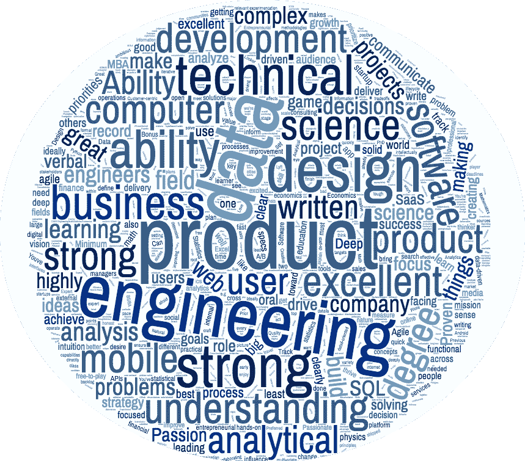
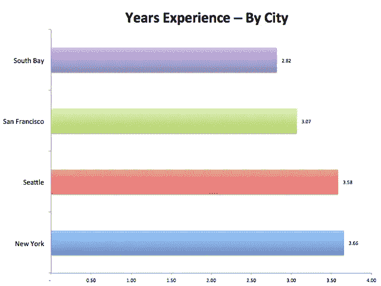
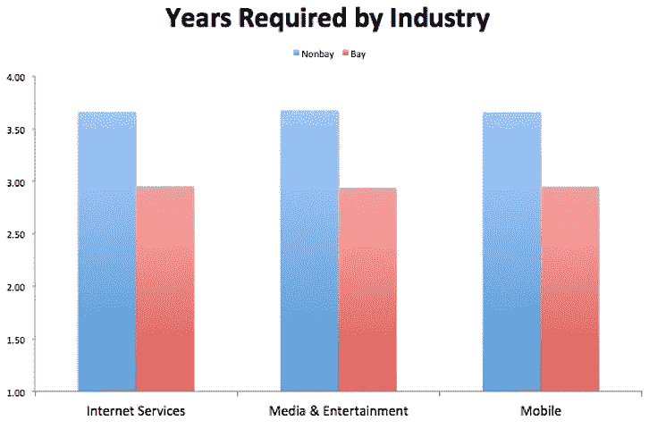
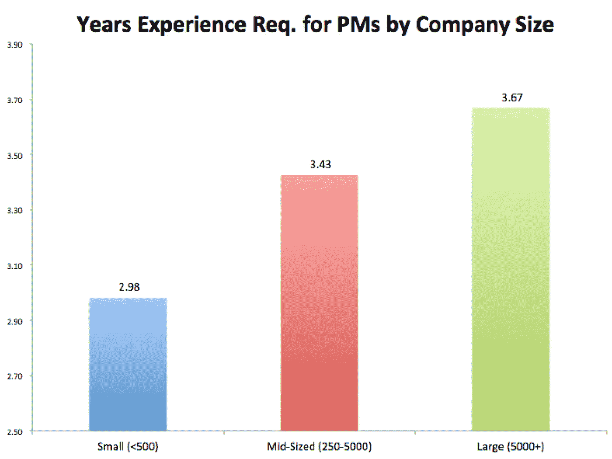
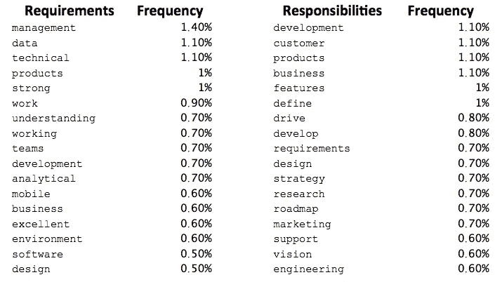

# 如何打入产品:对 100 多个 PM 职位的分析

> 原文：<https://medium.com/hackernoon/analysis-of-100-product-manager-job-descriptions-ebbb98cfb05>

## 公司真正想从产品经理那里得到什么？

闯入产品[管理层](http://To Project Manager Vooraf Technology             Sir,     I am writing this letter to inform you i Want 2hours(4.30pm) leave beacuse I want to go to doctor chamber for my health checkup.So,I apologies for any inconvenience caused due to my absence and hope that you will understand my situation.)可能是一项令人生畏的任务；很难准确定义在产品中从哪里开始，以及需要磨练什么技能才能到达那里。

产品管理的角色是独特的，因为它没有严格的和定义良好的技能。一家公司的项目经理可能需要与另一家公司的项目经理非常不同的背景。最著名的是，谷歌的产品经理要通过严格的技术面试才能获得这份工作，而脸书的项目经理通常不会，也不会因为任何技术知识而被聘用。

因此，我决定分析大量的产品经理职位描述，希望它能帮助有抱负的项目经理确定一些重要的谈话要点，并确定当前项目经理(包括我自己)可以改进的一些领域。

# 首先是底线:

*   只有 1%的 PM 职位描述需要 MBA。所以 2 年和 15 万美元的投资可能是不必要的。
*   获得一份 PM 工作所需的产品经验平均年限为 3.2 年，但这取决于公司的位置和规模(湾区公司要求更少)
*   技术背景或经验是一个一致的趋势，许多工作都在寻找能够将产品见解和工程重点结合在一起的 pm。
*   如果你有兴趣获得更多 PM 相关的分析，请考虑订阅我的时事通讯， [PM 午餐](http://eepurl.com/cUUrqL)，每周一期的产品电子邮件时事通讯。

# 数据集:一堆不同的职位

Also, this word cloud I made looks pretty cool.

我使用 Glassdoor 的职位列表部分收集了 125 家不同公司的 PM 职位描述，该部分汇总了来自互联网的职位信息。我还确保从旧金山、南湾、纽约和西雅图取样，看看各地之间是否有任何差异(有几个很大的差异)。

大多数工作描述被分成三个部分。**职责**(该角色的日常工作)**要求**(教育&背景)，然后是对公司的某种解释或者为什么该角色被征用(我将其归类为**序言**)。

我将公司名称、位置、玻璃门等级、序言、责任、要求和所需年限进行了分类。我用 Crunchbase 的数据添加了公司规模和行业。最终，这大部分是手工收集的，因为职位发布没有统一的格式，需要一点人情味来确定“你将做什么”和“你将成为大师”都指的是“责任”部分。

# 要点 1:产品职位不需要 MBA

在一篇名为“[产品经理从何而来](http://hackingrevenue.com/product-management/where-do-product-managers-come-from/)”的文章中，作者 Alon Porat 分析了他在 LinkedIn 上的关系，发现四分之一的产品经理拥有 MBA 学位，这让我们认为 MBA 是先决条件，或者至少是强烈首选的资格。

然而，在 PM 职位描述的数据集中，与商业或其他硕士学位相关的关键词只在所有职位描述中出现了 16%，其中 90%提到 MBA 只是一个“加分”，这意味着产品经理不一定需要在简历中加入商学院才能在产品部门找到工作。数据集中只有两个职位描述将此列为一项要求。

# 关键要点 2:所需的经验年限因地点和公司规模而异

每个公司都在他们的需求部分列出了以前的产品经验，平均来说，申请这些职位需要 3.2 年的产品经验。

这本身就说明了从一开始就打入产品市场的难度。如果你不是通过大学招聘获得的，或者不是从一个组织内部转来的专业，你很难进入这个领域。

然而，根据公司所在地的不同，工作所需的平均经验年限也有所不同。湾区以外的职能指令手册要求项目经理比旧金山或南湾的公司有更多年的经验。具体来说，纽约的项目经理职位需要比南湾公司多 23%的工作经验。

有人可能会说，每个地方的工业构成不同，这会影响所需的年数。然而，当你比较同一个行业对公司的要求时，非海湾地区的公司仍然比海湾地区的公司需要更多的经验。

为什么会这样呢？硅谷的创业文化可能更看重结果而不是经验，因为风投和早期员工会尝试新的创业公司，所以降低对项目经理的要求也是有道理的。在有前途的候选人身上冒险可能会有更大的回报。

同样，公司规模也是产品职位所需年限的一个因素。较小的公司(少于 500 名员工)对 PMs 要求 2.98 年的经验，大公司(5000 人以上)要求 3.67 年的经验。创业公司可能更看重文化契合度和结果导向，而不是经验。

对于有抱负的项目经理来说，这里的要点是，虽然进入产品岗位存在障碍，但有些类型的公司更有可能接受经验较少的有前途的候选人。数据显示，旧金山湾区的初创企业所需的产品经验最少。

# 关键要点 3:你应该从工作描述中考虑的重要关键词

如果你的目标是进入一份项目经理的工作，你会想考虑招聘经理在他们的工作描述中一贯使用的关键词是什么。在制作简历或美化 LinkedIn 个人资料时，制作与招聘信息相匹配的经历是进入面试阶段的绝佳方式。

以下是在招聘信息中出现频率最高的术语:

让我们根据常用词来拼凑一个故事。

在需求方面，公司正在寻找一位拥有构建**技术**产品经验的项目经理，他**在不同职能**团队**中工作**，并且能够使用**数据**和**分析**来计划和**设计**新功能。

对于职责部分，项目经理将帮助**推动新**功能**的**开发**，根据**客户**或**业务**需求定义**路线图**，同时支持**营销**和**工程**团队。**

您会注意到，有几个经常出现的关键词关注一个项目经理所拥有的技术技能。此外，20%的列表要求或强烈倾向于候选人拥有计算机科学或相关领域的学士学位。

在实践中，虽然项目经理不总是需要成为团队中最具技术含量的人，但与工程师一起工作是绝对必须的。职位描述是一个重要的指标，表明招聘经理希望产品人员至少精通一些技术知识，以便能够将产品规格具体化。因此，如果你可能在这方面有所欠缺，一定要展示你如何能够清晰地向团队传达计划，并执行到终点线。

# 结论:

如果你知道自己想尝试将职业道路转向科技公司的产品管理，你最好的办法是仔细查看目标公司的一些招聘信息，确保你的简历和经历以正确的格式传达。

产品经理来自各种不同的背景，因此，虽然你可能会在这个角色上表现出色，但确保它以正确的方式表达出来也很关键。招聘经理希望知道你能够识别和优先考虑合适的功能，传达详细的规格，并在此过程中与工程师和设计师合作。

*如果你喜欢这篇文章，请考虑推荐它(按下下面新的* ***挥动*** *手图标)以便其他人可以找到它。*