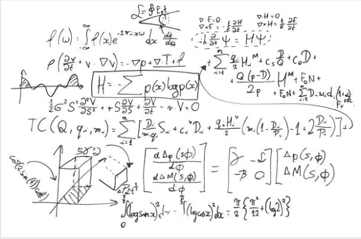
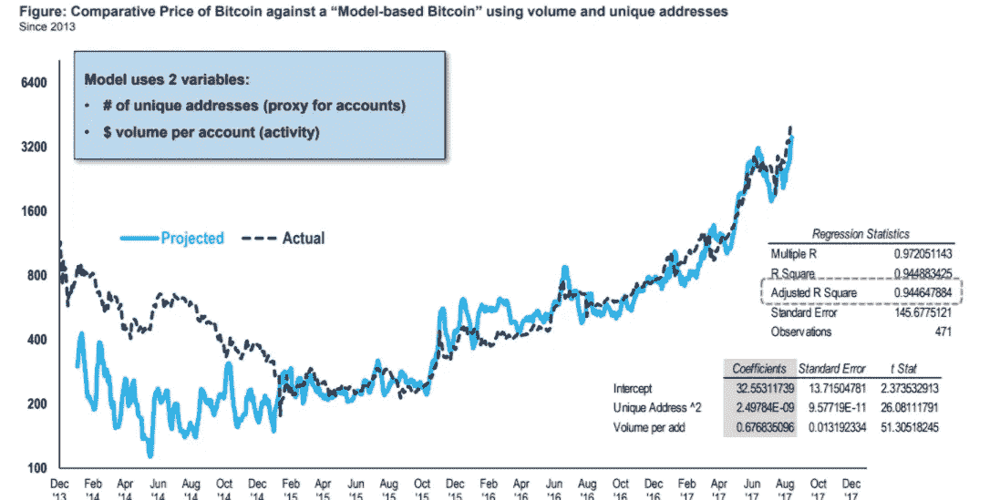

# 分析师表示，过去 4 年中，94%的比特币价格变动可以用一个等式来解释

> 原文：<https://medium.com/hackernoon/analyst-says-94-of-bitcoins-price-movement-over-the-past-4-years-can-be-explained-by-one-equation-6877134dd732>

在 Business Insider 的加密货币节目“The Bit”中，FundStrat Global Advisors 的联合创始人汤姆·李(Tom Lee)解释了他看好比特币的理由，以及他如何对加密货币进行估值。

他说，他的短期模型建立在梅特卡夫定律的基础上，可以有效地解释过去几年比特币价格的大部分波动。

简单来说，梅特卡夫定律认为网络的价值与网络用户数量的平方成正比。

例如，如果你是唯一一个拥有手机的人，手机就毫无用处，但随着其他人拥有手机，它的价值会成倍增长。

社交网络也是如此——脸书的价值仅仅在于使用它的人数。

“如果你把用户数量增加一倍，你就不止是把效用值增加一倍，”Lee 说。

Lee 认为比特币也是如此。FundStrat 分析了活跃比特币地址的数量，以估计比特币网络的用户数量，发现他的值的平方解释了 2013 年以来比特币波动性的 63%。

下面是“比特”的一部分，汤姆·李解释了他的想法。

**Lee:** 从短期来看，我们认为比特币确实非常接近于充当社交网络的理念——这意味着参与越多，价值上升越大。短期内，我们认为比特币将在 2018 年年中达到 6000 美元。

**萨拉·银色啤酒杯乐队:**你在用梅特卡夫定律。你能解释一下吗？

**李:**所以梅特卡夫是个教授。他实际上提出了一个基于乔治·吉尔德的定理，即网络的价值是用户数量的平方。因此，如果你建立一个非常简单的模型，将比特币估值为用户数量乘以平均交易价值的平方函数，那么过去四年比特币 94%的变动都可以用这个等式来解释。

此外，FundStrat 将他们的分析向前推进了一步，增加了每位用户的比特币交易量。这个线性模型解释了比特币价格 83%的变化。

该公司还发现了一个公式，通过回归比特币价格与唯一地址平方和每用户交易量的关系。这个模型为 2013 年以来 94%的比特币价格行为提供了解释。

下图绘制了基于该模型的比特币预计价格(浅蓝色)与实际价格(深蓝色虚线)。该模型相对来说比较适合 2014 年末以来比特币的价格走势。

Bitcoin Price Vs Project Price

FundStrat 也可以利用这个模型来预测比特币在短期内的价格。该模型需要估计比特币网络上唯一地址的数量(平方)和每日交易的数量。

Lee 声称，该模型仅提供了“……短期范围……”的有效估计，然而，考虑到这种溢价，Lee 在短期内显得更加谨慎。

“比特币的长期技术趋势仍然是积极的，”他说，“但短期上涨空间似乎有限，回调的风险正在加大。”

## 结论

感谢你花时间阅读这篇文章，我希望你真的喜欢它。如果您发现这很有价值，请不要忘记点击👏按钮！也可以随时分享我的内容！

在所有社交媒体平台上关注@ TheCoinEconomy，了解加密货币市场和区块链科技发展的最新动态。( [TradingView](https://www.tradingview.com/u/thecoineconomy/) ， [Twitter](https://twitter.com/thecoineconomy) ， [Instagram](https://www.instagram.com/thecoineconomy/) ，[脸书](https://www.facebook.com/Thecoineconomy-353316841786257/)，[stock wit](https://stocktwits.com/TheCoinEconomy)s)