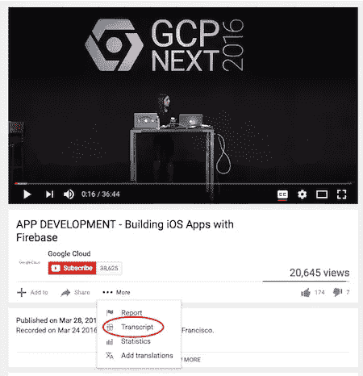
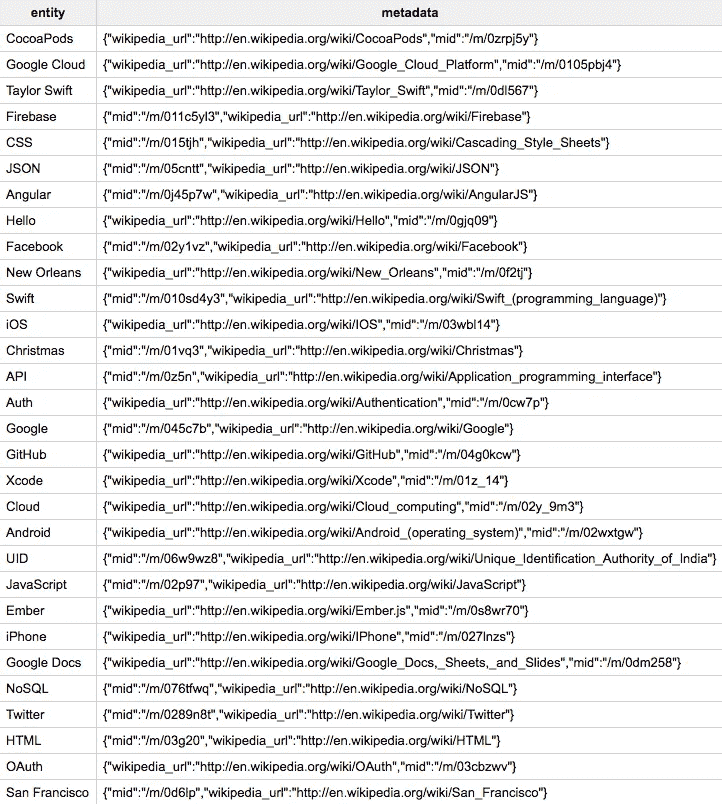

# 用自然语言处理分析我自己的谈话记录

> 原文：<https://medium.com/hackernoon/analyzing-my-own-talk-transcript-with-natural-language-processing-339e16b80d28>

作为一名演讲者，观看我演讲的视频是不断提高的重要部分(尽管我承认这非常痛苦)。但是在我自己的演讲中运行自然语言处理(NLP)怎么样呢？

因为我们的 [Google Cloud 下一次会议](https://cloudnext.withgoogle.com/)快到了，我想通过[自然语言 API](https://cloud.google.com/natural-language/) 发送文字记录来看看[我去年在同一次会议上的演讲](https://www.youtube.com/watch?v=h1Q5X-Uv0dw)会很有趣。我想看看情绪、实体和语言趋势。

# 我的谈话有多积极？

我的演讲是 37 分钟，532 句话。我使用 YouTube 提供的字幕提取了文本，您可以在您的视频上单击“更多”>“抄本”获得:

由于这是一个技术演讲，我不期望情绪太强烈，但我想看看 NL API 在分析它时的表现。这是一个直方图，显示了我演讲中的句子数量和它们的情感分数。分数是一个从-1 到 1 的数字，表示一个句子是肯定的还是否定的:

这大概是我对科技演讲的预期——大部分句子接近中性情绪，稍微多一点积极的一面。让我们仔细看看 NL API 中最积极的句子:

基于此，NL API 很好地挑出了积极的句子。看起来我也可以从[词库搜索“awesome”](http://www.thesaurus.com/browse/awesome?s=t)中受益。经过进一步的检查，我用了 179 次“so”这个词——哎呀！

# 我的演讲有多“酷”？

以下是我用过的前 15 个形容词:

这些形容词中的一些是特定于技术的:“真实”与“实时”搭配，“新”是指创建一个新的 Firebase 实例，等等。其他形容词肯定可以代表一些变化:“酷”、“简单”和“棒极了”。

# 我讲了哪些话题？

关于 NL API 的实体分析，一个有趣的事情是，即使它们不是专有名词，也没有维基百科的 URL，它也会提取实体。以下是我演讲中的 15 大实体:

从这个简短的列表中，我们可以很好地概括我的演讲内容。它关注于[Firebase](https://firebase.google.com/)(‘数据’，‘应用’，‘数据库’，‘用户’，‘安全规则’)。还有一个机器人演示使用了[云视觉 API](https://cloud.google.com/vision/) 。想象一下，如果我在一个数据库中存储了数千份谈话记录，这种元数据会非常有用。

NL API 还能够从我的演讲中提取专有名词实体，并找到正确的维基百科页面，总共有 30 个:

除了一个(UID)之外，API 能够找到与该实体相关联的正确的维基百科页面。令我印象特别深刻的是，它分别提到了泰勒·斯威夫特(歌手)和斯威夫特(编程语言)。

# 下一步是什么

虽然有点尴尬，但这个 NLP 分析对我如何提高演讲水平很有帮助。为了对你的演讲进行分析，从 YouTube 上获取文字记录，并查看 [NL API 快速入门指南](https://cloud.google.com/natural-language/docs/getting-started)。

如果你想亲自了解更多关于 NL API 和谷歌云平台的其他部分，我们的 [**谷歌下一次会议**](https://cloudnext.withgoogle.com/) 将于今年 3 月在旧金山举行。以下是我最感兴趣的演讲:

*   [谷歌云机器学习简介](https://cloudnext.withgoogle.com/schedule#target=introduction-to-google-cloud-machine-learning-f1a29054-f75f-4759-a483-11528bb1162b)
*   [BigQuery 和 Cloud ML:推进大规模神经网络预测](https://cloudnext.withgoogle.com/schedule#target=bigquery-and-cloud-machine-learning-advancing-large-scale-neural-network-predictions-5b6fe857-8185-4bae-bb42-734b729f0c4e)
*   [Auto-awesome:谷歌云平台上的高级数据科学](https://cloudnext.withgoogle.com/schedule#target=auto-awesome-advanced-data-science-on-google-cloud-platform-8b6f74ac-5d9b-4676-8c81-c3e78f650ae9)
*   [谷歌云公共数据集计划:共享和分析大规模全球数据集](http://Google Cloud Public Datasets Program: Share and analyze large-scale global datasets)
*   [使用 Firebase 和谷歌云平台实时编写无服务器应用](https://cloudnext.withgoogle.com/schedule#target=live-coding-a-serverless-app-with-firebase-and-google-cloud-platform-d9026f62-4bfe-4087-b2d8-ffacd52222a2)

我也会在谷歌云的机器学习 API 上做[演讲](https://cloudnext.withgoogle.com/speakers#target=sara-robinson-bdf3d07c-02f9-4fb1-800c-97153574f569)。如果你会去的话，打个招呼(即使你只是想数一下我用‘so’这个词的次数)。

对这个 NL 分析有什么想法或者对 Google Next 有什么问题吗？在推特上找到我 [@SRobTweets](https://twitter.com/srobtweets) 。

> [黑客中午](http://bit.ly/Hackernoon)是黑客如何开始他们的下午。我们是 [@AMI](http://bit.ly/atAMIatAMI) 家庭的一员。我们现在[接受投稿](http://bit.ly/hackernoonsubmission)并乐意[讨论广告&赞助](mailto:partners@amipublications.com)机会。
> 
> 如果你喜欢这个故事，我们推荐你阅读我们的[最新科技故事](http://bit.ly/hackernoonlatestt)和[趋势科技故事](https://hackernoon.com/trending)。直到下一次，不要把世界的现实想当然！

