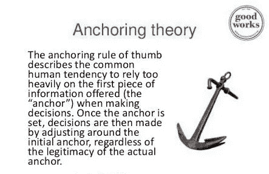

# 锚定和错过的恐惧。

> 原文：<https://medium.com/hackernoon/anchoring-and-the-fear-of-missing-out-637b4f962ac7>

我最近在购物时看到一家汉堡店。在菜单上，他们非常大胆地写着“每位顾客限吃 5 个汉堡”

我的第一个想法是:这太荒谬了。为什么他们在减少自己的销售额。节日期间也是如此(巨大的印度节日:排灯节)。

我的第二个想法:我会得到哪五个？

直到学了主播，我才意识到餐厅老板有多高明。你看，通常我只会挑一个或者当我觉得自己特别慷慨时，两个汉堡，但是当我读到“每位顾客限吃五个汉堡”时在菜单上，我的头脑停留在一个比平时高得多的数字上。

大多数人不会点五个汉堡，但是那个[主播](https://hackernoon.com/tagged/anchor)足以让普通人从一个汉堡增加到两到三个汉堡。你走进去计划吃一顿正常的饭。你走出监狱时，花费比要求的多了五倍。

锚定是行为经济学的一部分。

这种效应已经在广泛的研究和商业环境中被复制。例如，企业主发现，如果你说“每位顾客限购 12 件”，那么与说“不限购”相比，人们会购买两倍的产品。

这就是店主和在线商务网站使用“限量供应”工具的原因。不是因为他们的产品数量有限，而是因为他们利用了影响我们做出正确决策的心理错误。

> 害怕错过。

想要避免损失是很自然的。事实上，研究表明，在心理上，损失对人的影响是收益的两倍。

也许你听到最多的关于锚定的地方是定价。如果一块新手表的价格标签是 500 美元，你可能会认为这超出了你的预算。然而，如果你走进一家商店，第一次在橱窗前看到一只售价 5000 美元的手表，突然之间，街角的那只售价 500 美元的手表似乎非常合理。企业销售的许多高端产品本身并不一定会卖出很多，但它们起到了非常重要的作用，可以固定你的思维模式，让中档产品看起来比它们本身便宜得多。

所以下一次，你准备大采购，考虑到你要省钱，就连高端的物品都不要看了。所以这两种情况都会发生，

> 选项 1:客户看到了满载版本的汽车。然后，当他们说价格太贵时，经销商为了降低价格，取消了期权。
> 
> 方案二:客户看到了汽车的底价。然后，经销商要求他们选择他们想要的选项，逐渐提高价格。

结果:在第一种情况下，人们花了更多的钱，而且不太满意。心理学理论认为，人们经历 FOMO，不愿意放弃他们认为已经拥有的东西。

## **感谢阅读！:)**

## 如果你喜欢它，你可以鼓掌来欣赏它。谢谢你。

## **查看我的个人资料了解更多。** [**@abhed447**](/@abhed447)