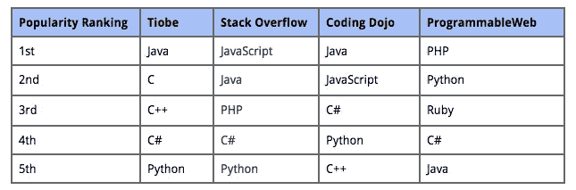
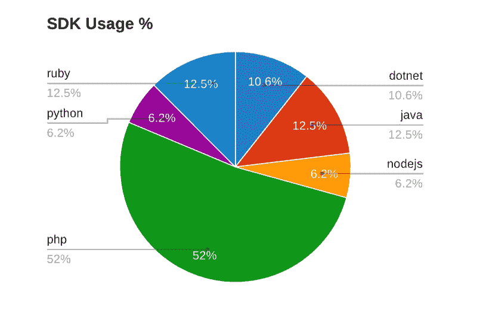
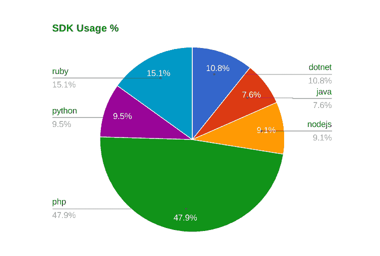

# 最流行的编程语言是…

> 原文：<https://medium.com/hackernoon/and-the-most-popular-programming-language-is-4ab77e5741e8>

嗯，“最受欢迎”是一个有风险的说法。尤其是当谈到编程语言时:每种语言都有狂热的崇拜者，每种语言都有自己的优势。

# **谎言，该死的谎言，还有统计…**

受欢迎程度的顺序根据你看的数据而变化。

在我们进入如何在 [Chargebee](https://www.chargebee.com/?utm_source=medium.com&utm_medium=referral&utm_campaign=repost_hn) 编制排名的细节之前，让我们看看你可以获得顶级编程语言列表的一些方法。

你可以像 Tiobe 一样使用多个参数，例如搜索引擎结果，来做一个[基础广泛的评级](http://www.tiobe.com/tiobe_index)，或者如果你在 StackOverflow 这样的开发人员中很受欢迎，你可以决定从[马嘴](http://stackoverflow.com/research/developer-survey-2016#most-popular-technologies-per-occupation)中得到它。

你也可以根据[的招聘信息](http://www.codingdojo.com/blog/9-most-in-demand-programming-languages-of-2016/)来查看，这就是 Coding Dojo 所做的。

或者，你可以有不同的看法——你可以看看为该语言发布的 API 库[的数量，就像他们在 ProgrammableWeb 上做的那样。](http://www.programmableweb.com/news/what-programming-language-most-popular-apis/2013/06/03)

整理它们会引出一个模式，奇怪的是可编程 Web 的列表:

**来源:**

*   [http://www.tiobe.com/tiobe_index](http://www.tiobe.com/tiobe_index)
*   [http://stack overflow . com/research/developer-survey-2016 #每个职业最受欢迎的技术](http://stackoverflow.com/research/developer-survey-2016#most-popular-technologies-per-occupation)
*   [http://www . coding Dojo . com/blog/9-2016 年最受欢迎的编程语言/](http://www.codingdojo.com/blog/9-most-in-demand-programming-languages-of-2016/)
*   [http://www . programmable web . com/news/what-programming-language-most-popular-APIs/2013/06/03](http://www.programmableweb.com/news/what-programming-language-most-popular-apis/2013/06/03)

# **根据 API 请求衡量受欢迎程度**

我们决定从另一个角度来看这个问题，通过使用特定语言的 SDK 来查看与 Chargebee 集成的应用程序的实际 API 请求。

尽管您可以将 Chargebee 作为一项独立的服务来满足您的计费需求，但大多数 SaaS 公司都与我们紧密集成，以利用我们的订阅计费功能，并且他们倾向于使用构建其服务所用语言的 SDK。所以当我们公开我们的 REST 风格的 API 时，我们也发布了“流行”语言的 SDK。

> 我们对“最受欢迎”的判断是基于使用特定语言库与 Chargebee 集成进行计费的商家的实际数量。

我们特别考虑了那些主动对计费系统进行 API 调用的商家。我们已经排除了进入沙盒帐户的请求。

# **细节**

就像浏览器在[“用户代理”](https://en.wikipedia.org/wiki/User_agent)报头中添加关于它们自己的信息(包括它的版本)一样，Chargebee 的每个客户端库在发送到 API 端点的 http 请求中在该报头中添加它的信息，这些信息反过来被记录为服务器中的访问日志的一部分。

php 客户端发送的用户代理头示例如下所示:

*charge bee-PHP-Client v 2 . 0 . 2*

对于每个请求，我们可以识别所使用的 SDK 及其版本。我们使用 Splunk 分析我们的日志。一个简单的查询给了我们结果。

# **支持的语言**

在我们进入数据之前，让我们先看看我们已经发布的官方 SDK 的语言，以及我们对它们的流行程度的看法。

## **PHP——值得信赖的工具**

Web 在 PHP 上运行。嗯，至少像 WordPress 这样的大多数流行的内容管理系统都是基于 PHP 的。所以一开始这似乎是显而易见的选择。但是深入思考一下，我们期望 API 用户是“时髦”的创业人群。我们期望他们使用更多更新更酷的语言，如 Ruby 或 Python，而不是 PHP。

## **红宝石——梦寐以求的宝石**

Ruby On Rails 在初创公司中很受欢迎，这已经不是秘密了。我们期望 Ruby 在使用方面更接近 PHP。

## **Python——固执己见的人**

Python 是另一种被创业公司青睐的语言。我们预计它会比 Ruby 稍逊一筹，但会比 Java 流行得多。

## **NodeJs——一种语言统治一切**

我们基于少数客户请求发布了 Node JS 库。这是我们发布的最后一个语言版本。我们并不期望有太多的使用，因为与其他平台相比，服务器端 js 平台仍然是新的。

## 爪哇——不新鲜的摩卡咖啡

它已经不再受初创公司的青睐。它现在被认为是企业级的，过于冗长和臃肿。我们预计使用率会很低。

## **。NET——MS 阵营的步兵**

Chargebee 的大多数人从一开始就有 Linux 背景。而且我们大多数人现在都换成了 Mac。很少有 Linux 坚持者(像我一样)。但是微软和它的开发者生态系统对我们来说一直是个谜。我们不确定会有多少用户使用。NET 库时，我们发布了它。

# **我们所期待的**

我们期望 PHP 领先，紧接着是 Ruby 和 Python，Java 远远落后于第四名。

## **一年前的数据(Q2，2015)**

一年前，我们查看了一份跨越三个月的数据。使用模式如下:

正如我们所看到的，PHP 仍然统治着 web，Ruby 紧随其后。令人惊讶的是。NET 的比 Python 的多。

> 我们会发布。NET 库之前的 Python 库，如果我们早一点有这种认识的话。

## **当前数据(从 2016 年 2 月开始)**

没有大的变化。但是 PHP 似乎正在输给 Python 和 Ruby 一些分数。NodeJS 增加，Java 下降。

# **换句话说，SaaS 和电子商务的流行编程语言是…**

如果我们看看我们的发现，我们可以看到它更符合可编程网站的排名。

> 最明显的一点是，与其他语言相比，PHP 更受欢迎。

我们理解，由于使用 Chargebee 计费解决方案的客户的特征，我们基于使用情况的数据集可能会有偏差。

> 但是，如果 Paypal 和 Stripe 这样的巨头公布他们的发现，它将提供一个更可靠的数据集，因为大多数 SaaS 企业至少会集成一个支付网关，如果不是像 Chargebee 这样成熟的计费解决方案的话。

你有不同于我们共享的数据集吗？我们很想知道！

***KPS*** *是* [***的 CTO 兼联合创始人***](https://www.chargebee.com/?utm_source=medium.com&utm_medium=referral&utm_campaign=repost_hn)*。你会发现他在* [***Chargebee 博客***](https://www.chargebee.com/blog?utm_source=medium.com&utm_medium=referral&utm_campaign=repost_hn) *上写了关于 SaaS 商业的教训、观察和故事。*