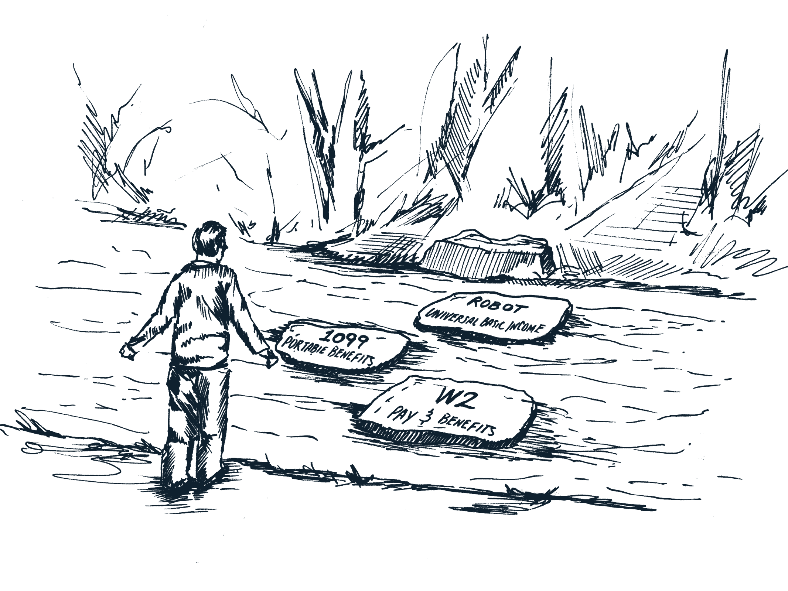
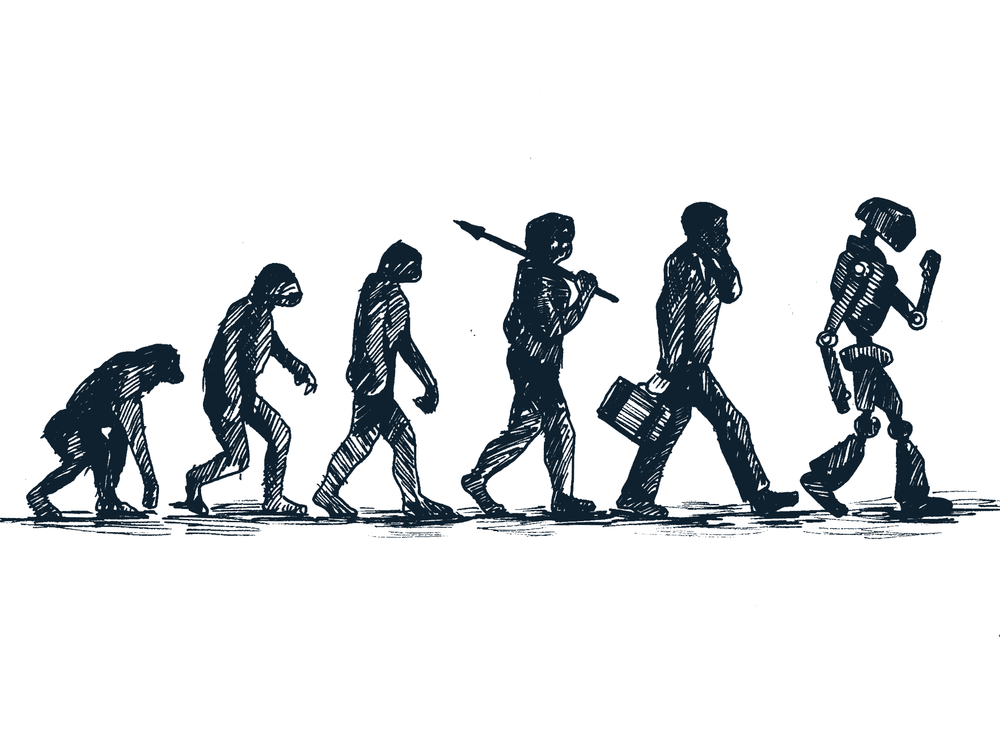

# …然后机器人来了…

> 原文：<https://medium.com/hackernoon/and-then-the-robots-arrived-67de93397242>

在《银翼杀手》(Blade Runner)、IRobot 或任何未来反乌托邦电影的开场场景中，人类将面对机器人作为地球未来的规则制定者和打破者，我们经常被介绍到机器人无处不在的背景下:它们充满了景观，它们是主角，它们是新的恋人、新的朋友和新的工人。

坦率地说，大多数电影的开场场景经常缺少的是对以下问题的回答:

*   在这个新的机器人现实中，[政府](https://hackernoon.com/tagged/government)、商业或人民运动扮演了什么角色？
*   我们怎么会让以人为本的政府或经济不再是机器人领域的选择呢？
*   为什么机器人接管是必然的结局？

在工人实验室，我们在媒体报道中看到了许多关于劳动力市场因自动化而转变的悲观论调。我想到的几篇文章都是色彩鲜艳的标题:

*   [**如何让美国机器人再次伟大**](https://www.nytimes.com/2017/01/25/technology/personaltech/how-to-make-americas-robots-great-again.html)
*   [**保姆机器人&人口增长**](https://economix.blogs.nytimes.com/2013/08/14/babysitter-robots-and-population-growth/)
*   [**在贝莱德，挑选股票的机器正在超越经理人**](https://www.nytimes.com/2017/03/28/business/dealbook/blackrock-actively-managed-funds-computer-models.html?emc=edit_nn_20170329&nl=morning-briefing&nlid=57738231&te=1)
*   [**机器人正在赢得美国就业岗位的竞争**](https://www.nytimes.com/2017/03/28/upshot/evidence-that-robots-are-winning-the-race-for-american-jobs.html?emc=edit_nn_20170329&nl=morning-briefing&nlid=57738231&te=1)

是的，新兴技术以非常真实的方式影响着劳动人民。是的，如果不加以检查和管理，劳动人民将承受这一转变的冲击。不，这并不像反乌托邦未来主义电影让你相信的那样不可避免。这种宿命论太简单了。它给我们留下了太多的机会，免除了我们想象和创造一套以劳动人民为中心并使其受益的解决方案的所有必要工作。

我们需要改变对劳动人民的支持、保护和标准，而不是举手投降。我们相信，在这个政治和经济的时刻，有一个很好的机会来创造一套新的规则，关于如何组织工作，如何评价工人，以及政府如何为我们所有人提供一个完整的安全网。我们相信，我们可以重新设定标准，让劳动人民不再是附属或落后，而是我们经济和国家未来的核心。

当前关于工作未来的讨论由三个主要章节组成:

**从前**:有工人因为 W2 工人的身份领取工资、福利、保障。

**…然后科技公司来了:**所有那些 W2 的工作变成了 1099 或承包商的工作，没有稳定的收入，没有保护或福利，所以我们需要创造*便携式福利。*

**…如果放任不管，雇主们决定:**投资一切的自动化。机器人制造东西和照顾人，而曾经工作的人在家等待领取他们的普遍基本收入支票。

但这种轨迹是必然的吗？

这种工作接近尾声时的跳跃让桌面上留下了太多东西。我们正在抛弃花费在劳动力发展、培训和教育上的数十亿美元。我们正在抛弃作为我们民主基石的工人组织和劳动人民的集体行动。我们忽视了政府的作用，它应该通过建立和管理一个强有力的社会安全网来管理我们的经济，为人民谋福利，并确保所有人的福利。因此，举例来说，当一个依赖出租车和公共交通等司机的行业实现自动化时，政府应该做好应对的准备，利用提议的机器人税等工具为劳动力发展培训项目提供资金，以确保为现有和未来的招聘需求提供有针对性的培训。

此时此刻，我们正处于一个关键时刻。一条道路通向我们机器人霸主的最终统治地位。然而，另一条道路要复杂得多，也更加混乱，而且对劳动人民来说，前景更加光明。这是我们工人实验室正在选择的道路。我们邀请您加入我们，探索 21 世纪劳动人民的社会契约可能是什么样子，以及我们的经济、政府和社会运动中的关键行为者在建立这种契约中可以发挥什么作用。

*跟随工人实验室上的* [*推特*](https://twitter.com/theworkerslab) *加入对话。*

> [黑客中午](http://bit.ly/Hackernoon)是黑客如何开始他们的下午。我们是 [@AMI](http://bit.ly/atAMIatAMI) 家庭的一员。我们现在[接受投稿](http://bit.ly/hackernoonsubmission)，并乐意[讨论广告&赞助](mailto:partners@amipublications.com)机会。
> 
> 如果你喜欢这个故事，我们推荐你阅读我们的[最新科技故事](http://bit.ly/hackernoonlatestt)和[趋势科技故事](https://hackernoon.com/trending)。直到下一次，不要把世界的现实想当然！

