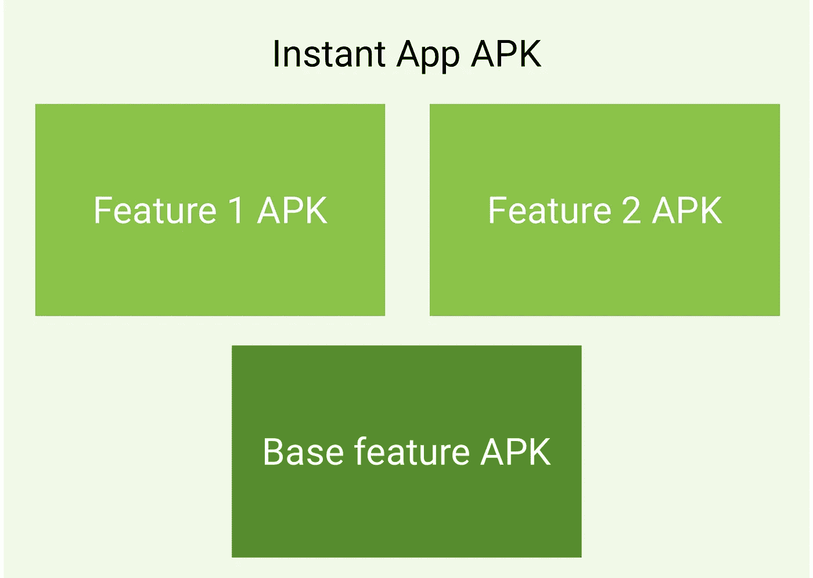
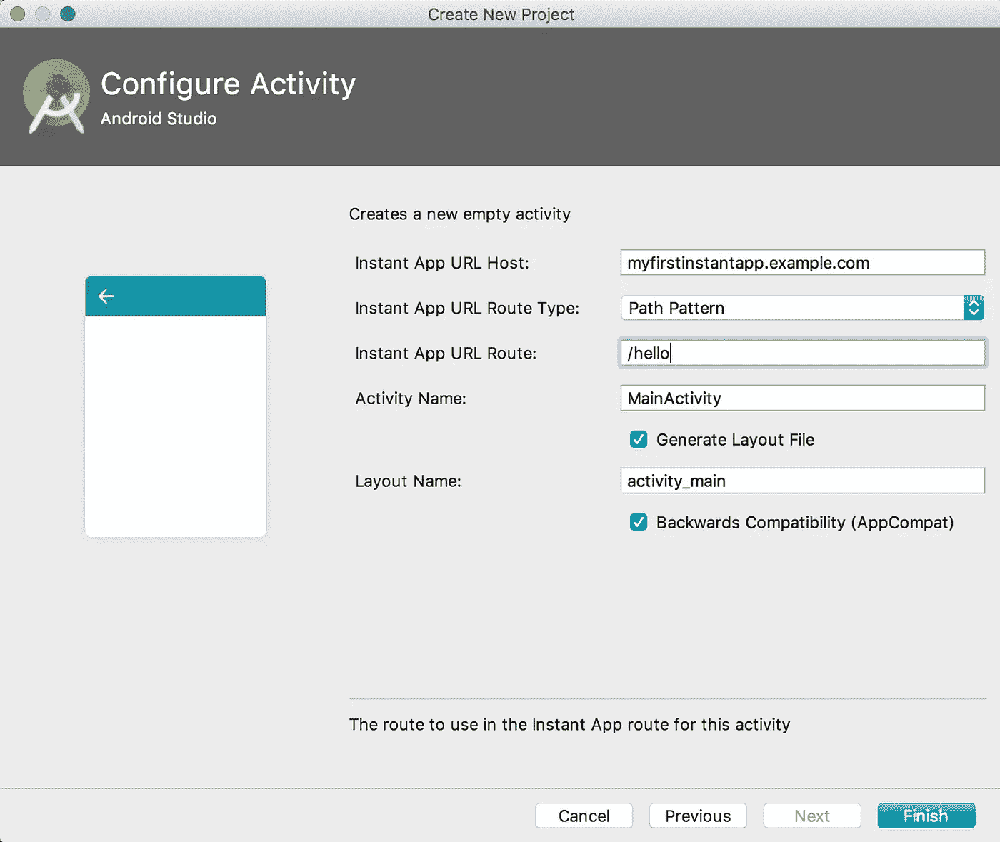

# 安卓即时应用，你需要知道的一切..

> 原文：<https://medium.com/hackernoon/android-instant-apps-all-you-need-to-know-about-d392a6e10584>


Google I/O 2017

> 原生 Android 应用，无需安装。

**1。什么是安卓即时应用？**

作为一个开发者，你曾经想过让用户更快更容易地进入你的应用程序吗？

Android Instant Apps 允许 Android 用户即时运行您的应用程序，无需安装。Android 用户只需轻轻一点，就能体验他们喜欢的应用程序——快速而漂亮的用户界面、高性能和强大的功能。

**2。为什么你需要制作安卓即时应用？**

你可以让用户不用安装就能试用你原生应用的一些功能，他们可以在需要的时候下载可安装的版本。所以这给你的应用带来了更多的客户。

**3。如何制作安卓即时应用？**

> **注意** :Android 即时应用程序只能在运行 Android 6.0 (API 等级 23)或更高版本的 Android 设备上运行

Android Instant Apps 使原生 Android 应用程序能够在启动 URL 时运行，而无需安装应用程序。即时应用程序可以使用许多 Android APIs，您可以使用 Android Studio 来构建它们。

## Android 即时应用的开发环境

*   JDK 1.8
*   [Android Studio 版本 **3.0 或更高版本**](https://developer.android.com/studio/preview/index.html)
*   Android SDK 6.0+
*   Android SDK 构建工具 26.x 或更高版本
*   Android SDK Tools 25.x 或更高版本
*   Android SDK 平台工具 25.x 或更高版本

**即时应用开发 SDK** 。

1.  点击**工具> Android > SDK 管理器**打开 Android SDK 管理器。
2.  点击 **SDK 工具**选项卡。
3.  从列表中选择**即时应用开发 SDK** 。
4.  点击**应用**。
5.  点击**完成**。

进入**谷歌>即时应用**，在设备的设置应用中选择加入安卓即时应用。请注意，如果您不选择加入，开发者模式将无法在设备上运行。第一次导航到即时应用程序时，系统会自动要求您选择加入。

使用 Android 即时应用程序，用户可以使用应用程序的单个功能，而不必安装应用程序的所有其他功能。即时应用程序中的每个特性应该至少有一个活动作为该特性的入口点。你需要把你的应用分成更小的模块，并把它们重构为*功能模块*。

每个即时应用程序必须有一个(且只有一个)*基本功能 APK* 。如果你的即时应用有更多的功能，除了你的*基本功能* APK，你还可以有功能 APK。

当用户从即时应用程序请求一个功能时，他们会获得两个功能 APK:相应的功能 APK 和基本功能 APK。如果同一个用户从同一个即时应用程序请求另一个功能，他们可能只会收到功能 APK，因为他们已经下载了基本功能 APK。当然，如果即时应用程序只有一个功能，因此只有一个基本功能 APK，用户只会收到基本功能 APK。



source: developer.android.com

要从 Google Play 下载一个即时应用程序的功能，用户只需点击一个链接。在 Google Play 找到与用户请求的链接匹配的即时应用程序后，Google Play 会将该功能的相应功能 apk 发送到用户的设备，然后 Android 系统会启动该功能。如果 Google Play 找不到匹配，它会提醒 Android 系统。然后，系统向系统广播处理该 URL 的意图。

出于这个原因，即时应用程序中的每个入口点活动都需要是*可寻址的*:它需要对应一个唯一的 URL 地址。为了给每个功能提供唯一的 URL 地址，即时应用程序为每个功能在域下指定了不同的路径。

*Ex:
特写《新闻》:*[*http://example.com/new*](http://example.com/news)*s
特写《八字》:*[*http://example.com/*](http://example.com/news)*八字*

假设您的应用程序显示特定城市的新闻，在这种情况下，您的 URL 匹配

*Ex:
所有新闻:[http://example.com/news](http://example.com/news)班加罗尔新闻:[http://example.com/news/bangalore.](http://example.com/news/bangalore.)*

CityNews 活动的 URL 地址类似于 AllNews 活动，只是 CityNews 活动在 URL 后面附加了一个城市。

特性的清单需要指定每个活动的路径和活动的优先级顺序，以防出现多个匹配。

1.活动名称:AllNewsActivity，url 地址:[http://example.com/news](http://example.com/news)，优先级:1
2。活动名称:CityNewsActivity，url 地址:[http://example.com/news](http://example.com/news)/Bangalore，优先级:100

如果 Google Play 收到对 URL“http://example . com/[news](http://example.com/news)/abab”的请求，它将匹配 AllNews 和 CityNews 活动。Google Play 需要从这两个活动中选择一个作为该功能的起点。因为即时应用程序指定 CityNews 活动的优先级高于 AllNews 活动，所以 Google Play 指定系统从 CityNews 活动启动该功能

所以你的清单会像

```
<application>
    <activity android:name=".AllNewsActivity">
        <intent-filter android:order="1">
            <action android:name="android.intent.action.VIEW" />
            <category android:name="android.intent.category.BROWSABLE" />
            <category android:name="android.intent.category.DEFAULT" />
            <data android:host="[*example.com/new*](http://example.com/news)*s*"
                android:path="/"
                android:scheme="https" />
        </intent-filter>
        <intent-filter>
            <action android:name="android.intent.action.MAIN" />
            <category android:name="android.intent.category.LAUNCHER" />
        </intent-filter>
    </activity>
</application>
```

在这里，“安卓:秩序”是优先的。
为了在 Android studio 中创建即时应用，

1.  开始一个新项目

2.在**最低 SDK** 列表中，选择 **API 23: Android 6.0(棉花糖)**。


source: developer.android.com

3.在**最低 SDK** 列表下，勾选**包含 Android 即时应用支持**。

4.选择一项活动。



source: developer.android.com

5.在**配置活动**窗口中，执行以下操作:

*   在**即时应用 URL 主机**框中，输入“myfirstinstantapp.example.com”。
*   在**即时应用网址**路由框中，输入“/hello”。

6.做完就跑。

关于创建功能模块的更多细节，你可以查看[谷歌代码实验室](https://codelabs.developers.google.com/codelabs/android-instant-apps/#0)。

> **注意:**当您在本地设备或仿真器上运行应用程序时，Android 系统会显示应用程序的默认占位符图标。将即时应用程序 APK 部署到 Google Play 控制台后，即时应用程序启动时会显示相应的图标。

Android Instant Apps 使用 Android 6.0 中引入的运行时权限模型(API level 23)。即时应用程序可以使用下面列表中显示的 Android 权限。列表中未显示的任何权限对即时应用程序不可用。

*   演员表
*   访问 _ 粗略 _ 位置
*   访问 _ 精细 _ 位置
*   访问网络状态
*   照相机
*   INSTANT_APP_FOREGROUND_SERVICE 仅限 Android O。
*   因特网
*   仅在 Android O 中读取 _PHONE_NUMBERS。
*   录音 _ 音频
*   颤动

> **注 1** :所有来自即时 app 内部的[网络](https://hackernoon.com/tagged/network)流量必须使用 HTTPS。即时应用程序不支持 HTTP。
> 
> **注 2** :基本特性和特性 APK 之和必须小于 4MB。
> 
> **注 3** :由于应用链接是常规网址，应用可以强制在应用内浏览器内打开。考虑使用 [Firebase 动态链接](https://firebase.google.com/docs/dynamic-links/)来包装你的 URL，并保证点击你的链接总是把用户带到你的即时应用。

## 您可以遵循 google 提供的示例代码

1.  这个示例应用程序演示了如何构建一个具有相同行为的已安装应用程序和即时应用程序。[在 GitHub 上下载](https://github.com/googlesamples/android-instant-apps/tree/master/hello)
2.  *Hello multi feature module 示例应用程序*
    这个示例应用程序构建在 Hello World 示例应用程序的基础上，将它的代码移动到两个功能模块中。这些模块可以独立运行。[在 GitHub 上获取](https://github.com/googlesamples/android-instant-apps/tree/master/hello-feature-module)
3.  *多功能模块示例应用* 这个示例应用演示了如何构建具有相同行为的已安装应用和即时应用。即时应用程序的功能分为两个功能，您可以在设备上单独启动。[在 GitHub 上获取](https://github.com/googlesamples/android-instant-apps/tree/master/multi-feature-module)
4.  这个示例应用程序演示了如何构建具有相同行为的已安装应用程序和即时应用程序。即时应用程序的功能分为两个功能，您可以在设备上单独启动。该示例还使用了构建风格的概念，提供了该应用程序的“付费”和“免费”版本。[在 GitHub 上获取](https://github.com/googlesamples/android-instant-apps/tree/master/flavors)
5.  这个示例应用程序演示了如何构建一个具有相同行为的已安装应用程序和即时应用程序。该应用程序将 Google Analytics for Firebase 事件日志记录集成到已安装和即时应用程序中，演示了如何区分两个版本的应用程序中引发的事件。[在 GitHub 上获取](https://github.com/googlesamples/android-instant-apps/tree/master/analytics)

如果你喜欢我的故事，请点击拍手图标，如果你想阅读我与 Android 开发相关的未来故事，请跟我来。