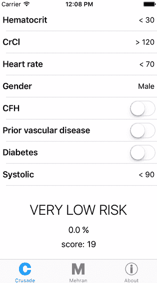
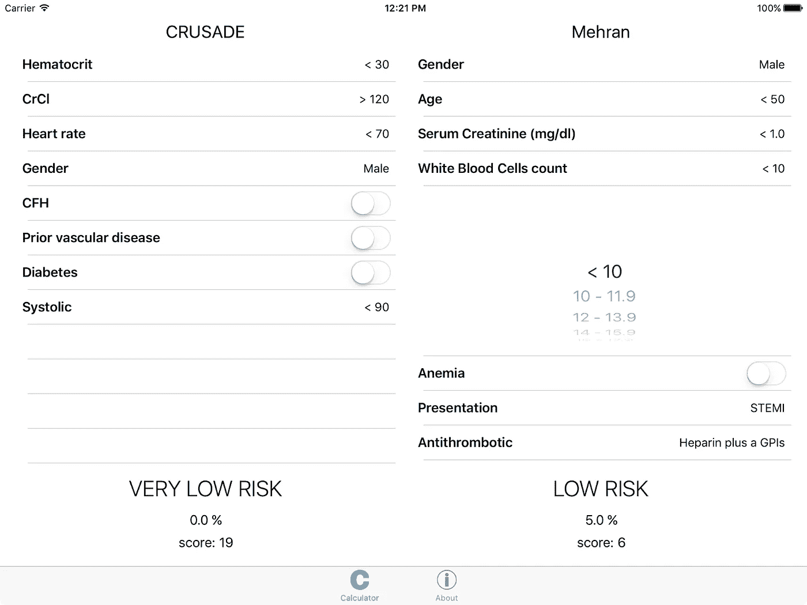

# 安卓很难

> 原文：<https://medium.com/hackernoon/android-is-hard-b7a5a5549655>

## **TL；我推出了我的第一款安卓应用！**

 [## 讨伐流血分数 Google Play 上的 Android 应用程序

### 帮助心脏病专家估计患者的院内大出血风险。

play.google.com](https://play.google.com/store/apps/details?id=net.morpheu5.bleedingscorecalculator) 

## **背景故事**

2011 年，我被要求开发一个免费的 iOS 应用程序，实现一个基于几篇医学论文的电子表格。我完成后，客户没兴趣了，也不付我钱了，我就把它作为付费 app 发布了。

 [## 应用商店上的十字军出血分数计算器

### 阅读评论，比较客户评级，查看截图，并了解更多关于十字军东征出血分数计算器…

itunes.apple.com](https://itunes.apple.com/us/app/crusade-bleeding-score-calculator/id454062627?mt=8) 

嗯，没有。我最初免费发布了一段时间，看着数字上升，然后删除了广告，并开始以 0.99 美元出售。这个数字一直在上升，我现在每个月赚 15 到 35 欧元:足够支付我的开发者账户费用。

这个应用程序成为我最喜欢的项目，旨在让我了解不断变化的 iOS 基础知识。我最终开发了一个 iPad 版本，稍微修改了一下用户界面——这让价格有点上涨。我集成了 Crashlytics，现在是 [Fabric](http://fabric.io) ，这对维护和设备智能有很大帮助。最近，我推出了一个苹果电视版本，尽管它仍然独自坐在 App Store 的货架上，所以这并没有推高价格，因为嘿。

# **进入安卓**

今年早些时候，我买了我的第一部智能手机——我知道——和一部安卓手机。我一直想尝试一些 Android 开发很长一段时间，但总是推迟，因为 Android 模拟器的性能很差，所以我甚至不能尝试。但现在我有了这部手机，所以移植我的宠物项目应用程序似乎是一个让我开始并跟踪 Android 开发的好主意。我读了一些相关的资料，安装了 [Android Studio](https://developer.android.com/studio/index.html) ，并创建了我的项目。

> 我很清楚 iOS 和 Android 在用户界面约定和 UX 方面有一些显著的不同[，所以我首先开始研究这些。](https://webdesign.tutsplus.com/articles/a-tale-of-two-platforms-designing-for-both-android-and-ios--cms-23616)

## 编写代码

在 iOS 上，小屏幕版本有三个选项卡，前两个是基于两篇科学论文的两种不同计算，第三个是关于应用程序的一些信息。

iOS 上的选项卡出现在屏幕底部。Android 上的标签倾向于出现在屏幕的顶部，尽管[事情正在发生变化](https://material.google.com/components/bottom-navigation.html)。我决定坚持使用屏幕顶部，因为在很长一段时间里这是安卓大陆的主要选择，所以我想大多数人会习惯它。

令人困惑的是，Android 并没有一个直接等同于 UITabBarController 的插件，在这个插件中，您可以插入各种定义的所有 UIViewController 子控件。相反，您必须扩展一个 FragmentPagerAdapter，并在其上粘贴一个 TabLayout。让事情变得更有趣的是，片段显然太新了，不能成为一等公民，而且让事情变得更加令人困惑的是，当 iOS 上的每个 UIViewController 都可以作为任何其他 UIViewController 的孩子插入并过着漫长而幸福的生活时，我为什么还要区分片段和活动呢？顶端的樱桃:Compat 图书馆。如果你想支持旧版本的 Android，没问题！只需导入向后兼容库 et voilà，你就可以将所有最新最棒的玩具实现为不同程度的完整性、功能性和稳定性，一直到 Android 2——相比之下，我们现在是第 7 版，苹果基本上放弃了所有不能升级到 iOS 8 的东西，这意味着这些东西是四年前制造的。所有这些都没有提到[一些新玩具直接在 compat 中结束，没有看到非 Compat 等价物](http://stackoverflow.com/a/39747063/554491)。简而言之:你被 Compat 卡住了，而 Compat 甚至不总是有意义的。从哲学上讲，这不是一个很好的起点。

This is more or less how it felt.

设计 iOS 版本的应用程序非常容易，尽管在 iOS 中唯一明智的方法是使用带有自定义单元格的 UITableView。不是最好的，但也没什么大不了的:用了一点力气，我就完成了。我不想假装不合适的观点很容易处理。事实上，设置一个足够接近系统偏好的屏幕来提供最不令人惊讶的体验可能是一场噩梦，所以当我得知 Android 有一个这样的片段时，我松了一口气。除了我花了整整一周的时间自行设置 FragmentPagerAdapter 和 TabLayout 之外，甚至不要让我开始插入 PreferenceFragment 显然你需要使用 Compat 版本才能为地球上任何地方都没有出售的古老设备提供服务——但是，嘿，[有人可能仍然在 386](https://news.vice.com/article/windows-31-is-still-alive-and-it-just-killed-a-french-airport) 上使用 Windows 3.11，对吗？

> **进一步的免责声明:**请记住，我是在业余时间做这件事的，当我在 2011 年第一次专业地开始做这件事时，我花了一个月的时间来理解 iOS，之前我在嵌入式开发方面的经验非常有限。

反正我手机屏幕上终于有东西了！成功！我决定休息一下，在继续实现业务逻辑之前设计信息页面。

## 工具

我第一次研究工具是在 Android 非常年轻的时候，你能做的最好的就是 Eclipse。随着时间的推移，情况有所改善，Android Studio 现在也不完全令人不快。Android Studio 是建立在 IntelliJ IDEA 之上的，这是一个不错的 IDE，尽管有些笨拙。调试器没有我想象的一半糟糕，构建过程也很好地集成了，尽管有时非常慢。我只想说，当我开始的时候，Xcode 是一团糟，但随着时间的推移，它已经成为一个非常好的功能性 IDE。Android Studio…还没到那一步。但我对你有信心，谷歌。

我开始设计信息屏幕，那时我知道 Android 现在有了自己的基于约束的布局。我喜出望外！如果你不知道我在说什么，基于约束的 UI 设计是一种通过描述对象之间以及对象本身之间的空间关系来将对象放置在屏幕上的方法。类似于“*这个标签必须在这个按钮的右边，它们的水平距离不能短于 10 点，也不能长于 20 点*”。苹果在他们的约束引擎方面做得非常出色，而 Android 正在…向那个方向发展。

> iOS 屏幕类和约束一起工作的方式使得整个事情很好地移动，但是，嘿，在 Android 中有一件事我没有抱怨！

无论如何，整个“设计信息页面”的过程相对来说并不痛苦，如果不是令人愉快的话。至少，它比苹果公司开始的时候不那么令人沮丧。

## Java 语言(一种计算机语言，尤用于创建网站)

我是一个憎恨者，我承认。我讨厌 Java。我讨厌 Java 的一切。自从 2002 年第一次接触 Java，我就一直讨厌它，从那以后我就尽可能地避免它。我不打算解释我的仇恨背后的原因，因为这篇文章不是关于 Java 的，所以:Java 是我的克星，[而且我并不孤单](https://en.wikipedia.org/wiki/Criticism_of_Java)。

显然，当谷歌设计 Android 时，Java 对他们来说一定很有意义。您计划在一系列完全不同的体系结构上进行部署，而您不打算对这些体系结构进行控制。你不想强迫每个开发人员仅仅为了它而建立十个、二十个不同的工具链。使用 Java，应用程序开发人员只需为一个已知的伪架构编译一次代码，您就可以构建一个虚拟机来运行您的代码，该虚拟机会伪装成所说的伪架构。每个设备制造商都应该负责编译虚拟机，以便它能够在他们选择的架构上正确运行。这个计划有一些缺陷，但我可以看到谷歌是如何做出这个选择的。我知道。

这并不意味着 Java 是完美的，人们试图修复它，并把它弄得完全，巨大，不合逻辑，以至于有些人说“*嘿，Java 是一塌糊涂，但整个虚拟机并不完全愚蠢，* [*让我们只是制造更好的语言，忘记 Java*](https://en.wikipedia.org/wiki/List_of_JVM_languages) *！*”。谷歌肯定没有注意到这份备忘录，并在此过程中与 Java 所有者陷入了一场巨大的法律战。并且不得不开发他们自己的虚拟机。

## 发布应用程序

我在网上搜索了“如何在 Google Play 上发布应用程序”,我期待着一个关于如何准备发布应用程序(检查)、如何设置开发者帐户(cheeeh…ck)以及如何构建和签署提交应用程序(eeeh…)的详细分步指南。

几分钟之内，我就在一个我不想要的国家拥有了一个商业账户，因为显然谷歌是从我的支付卡中推断出来的，现在我无法更改它(至少不容易)，我仍然不知道如何签署我的应用程序，也不知道我的签名是否足够安全，以及它基于什么协议。

相比之下，苹果公司会让你经历更多的麻烦，但至少他们会检查你是不是你所说的那个人，并在每一步都彻底解释一切。你必须通过在线互动程序创建一个证书，你必须照顾它，并为所有在一年内到期的应用程序生成单独的签名，因此你更多地参与到这个过程中，并了解这一切。这还没有考虑到 Xcode 负责整个过程，从构建和签名，到提交到 App Store，而 Android Studio 几乎不会给你编译好的二进制文件，谁知道怎么签名，然后由你决定。

> 你知道他们怎么说让事情变得简单，但不会比他们需要的更简单？那是因为否则人们会不小心做了很难的事情，弄得一团糟。

是的，我明白只有一个应用商店，而安卓商店有几十个，但是嘿，安卓工作室连 Google Play 都不支持！

# 最后

总之，我成功发布了我的应用程序。它在这里。

 [## 讨伐流血分数 Google Play 上的 Android 应用程序

### 帮助心脏病专家估计患者'发生院内大出血的风险。

play.google.com](https://play.google.com/store/apps/details?id=net.morpheu5.bleedingscorecalculator) 

很便宜。如果你是心脏病专家，你可能会想看看它。如果你认识心脏病专家，你可能想让他们知道。我可以提醒你，我也有一个苹果电视版本——也可以在 iPhones、iPods、iPads 上运行，所有的都可以。

iPad version

Apple TV version

所以，享受吧！

# **下一集**

 [## 科特林对我不忠…

### …但我没意见。

hackernoon.com](https://hackernoon.com/kotlin-is-cheating-on-me-e048cde4f66) 

# 书籍的末页

我在 Medium 上还有其他帖子，包括

*   [我如何搞砸了我的 artsy 应用的发布](/@morpheu5/how-i-messed-up-my-artsy-apps-launch-e684111de532)
*   [我如何制作一个基于科学的艺术应用](/@morpheu5/how-i-made-an-artsy-app-based-in-science-a3690164a9ce)
*   [创业场景需要长时间认真审视自身](/@morpheu5/the-startup-scene-has-to-take-a-long-hard-look-at-itself-6d77a9531814)
*   [最近欧洲的迁徙自由被撤销了吗？](/@morpheu5/has-the-freedom-of-movement-in-europe-been-revoked-recently-24cf11613139)

如果你敢读，就按那个绿色心形按钮！💚

> [黑客中午](http://bit.ly/Hackernoon)是黑客如何开始他们的下午。我们是 [@AMI](http://bit.ly/atAMIatAMI) 家庭的一员。我们现在[接受投稿](http://bit.ly/hackernoonsubmission)，并乐意[讨论广告&赞助](mailto:partners@amipublications.com)机会。
> 
> 如果你喜欢这个故事，我们推荐你阅读我们的[最新科技故事](http://bit.ly/hackernoonlatestt)和[趋势科技故事](https://hackernoon.com/trending)。直到下一次，不要把世界的现实想当然！

