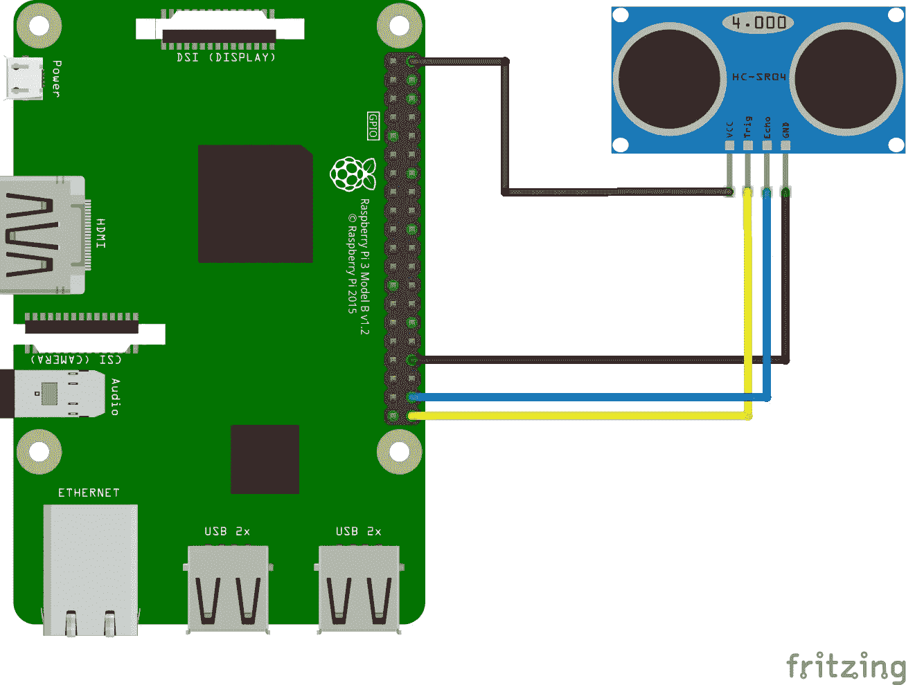
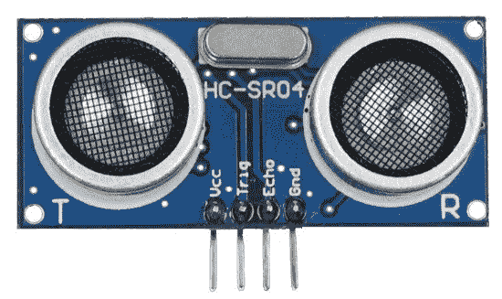
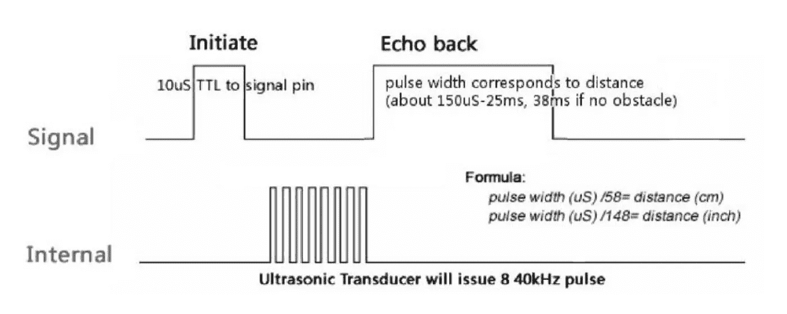

# 安卓事物基础:用超声波传感器测量距离

> 原文：<https://medium.com/hackernoon/android-things-basics-measure-distance-with-ultrasonic-sensor-3196fe5d7d7c>

在这个 Android Things 项目中，我们将使用一个带有 Raspberry Pi 3 的超声波传感器来测量距离。

我们将使用标准的 [GPIO](https://hackernoon.com/tagged/gpio) 读写方法，我们将学习如何使用传感器发送超声波，并且我们将发现一些问题。

# 要求

我们用的是预装了 [Android Things 开发者预览版](https://developer.android.com/things/preview/download.html)(版本 1)的[树莓 Pi 3](https://www.raspberrypi.org/products/raspberry-pi-3-model-b/) 。

传感器是一个 **HC-SR04 超声波传感器**。(我是从[亚马逊](https://www.amazon.de/gp/product/B00R2U8HK6/ref=oh_aui_detailpage_o03_s00?ie=UTF8&psc=1)订购的。)

> HC-SR04 超声波传感器像蝙蝠或海豚一样使用声纳来确定到物体的距离。它在一个易于使用的封装中提供了高精度和稳定读数的出色的非接触式范围检测。从 2 厘米到 400 厘米或 1 英寸到 13 英尺。它的操作不受阳光或黑色物质的影响。

从[这里](https://docs.google.com/document/d/1Y-yZnNhMYy7rwhAgyL_pfa39RsB-x2qR4vP8saG73rE)你可以下载传感器的数据表。

# 设置

和[上一个项目](https://hackernoon.com/android-things-basics-obstacle-avoidance-sensor-with-led-feedback-9127e13f2e76)一样，我建议按照 Google 的教程来准备你的 Raspberry Pi 3，用于 Android 的东西开发。

请遵循以下步骤:

 [## 树莓派 3 |安卓的东西

### Raspberry Pi 3 Model B 是世界上最流行的单板计算机的最新迭代。它提供了一个四边形…

developer.android.com](https://developer.android.com/things/hardware/raspberrypi.html) 

# 接线

现在是时候将传感器连接到我们的树莓派了。

如图所示，**超声波传感器**有 4 个引脚。
**VCC**需要接 5V 电源引脚， **GND** 显然要接地引脚， **Trig(触发)**和 **Echo** 引脚接 GPIO。

我是这样把它和我的树莓派联系起来的:

*   **VCC** → 5V(针脚 2)
*   **触发** → GPIO 21 (BCM21，引脚 40)
*   **回应** → GPIO 20 (BCM20，针脚 38)
*   **GND** → GND(针脚 34)

这是它在一起的样子:
(在左侧，您可以看到一个引脚排列图，显示了 Raspberry Pi 3 板的分线连接器暴露的可用端口的位置)

# 软件

要配置一个新的项目，你可以遵循来自 Google 的(已经提到的)教程，或者你可以使用并修改我们的[以前的应用程序](https://hackernoon.com/android-things-basics-obstacle-avoidance-sensor-with-led-feedback-9127e13f2e76)的源代码。

 [## 创建一个 Android 事物项目| Android 事物

### Things 应用程序使用的结构与为手机和平板电脑设计的结构相同。这种相似性意味着您可以修改您的…

developer.android.com](https://developer.android.com/things/training/first-device/create-studio-project.html) 

在我们开始实现必要的代码之前，我先解释一下超声波传感器的工作原理:

*   要开始测量，**Trig(Trig)**引脚必须接收到一个**高电平** (5V)的脉冲至少 10us (10 微秒)
*   这将启动传感器，它将以 40kHz 发射出 8 个周期的超声波脉冲，并等待反射的超声波脉冲
*   当传感器检测到超声波时，它会将 **Echo** 引脚设置为 **HIGH** (5V)并延迟一个与距离成比例的周期(宽度)。
*   为了获得距离，我们需要测量回波脉冲的**宽度。**

这是它在时序图上的样子:

The timing diagram of HC-SR04 ([source](https://docs.google.com/document/d/1Y-yZnNhMYy7rwhAgyL_pfa39RsB-x2qR4vP8saG73rE/))

让我们看看代码！

首先，我们声明 GPIO 引脚:

然后我们需要设置 **Echo** 引脚( **BCM20** )进行读取:

和**触发** ( **BCM21** )引脚进行写操作:

现在好戏开始了。

我们需要**发送一个 10us 脉冲**到**触发**引脚，并且**监听回声**以获得响应脉冲的开始和结束。

我将向您展示两种方法，因为我在某些情况下发现了一些性能问题。(在执行不充分的代码中，我的实现可能不正确)

## 1.履行

第一个是**“老派方式”**，你如何在 Arduino 设备上，或在 C 或 [Python](https://hackernoon.com/tagged/python) 中完成，例如在 Linux 操作系统下的 Raspberry Pi 上。这是一种通用的、同步的、过程化的方式，你没有回调、异步的方法。这段代码执行得很好，就像你用 C 或 Python 实现它一样好。

你可以用不同的方式运行这个代码，用一个*处理程序*，或者只是在一个新的*线程*中，等等…

我现在在一个单独的*线程*中运行它:

工作正常。
你可以在传感器前面放一个东西，把它移动得更远更近，你就会在控制台里看到以厘米为单位的距离。

(我将在 ***调查结果*** 部分提到注释行)

## 2.履行

第二种方式是 Android Things API 提供的**异步** *GpioCallback()* **方式**。

为了使用回调，我们需要在 **ECHO** 引脚上注册我们的监听器:

我还定义了一个回调*处理程序*，因为它对测量有影响。
我花了很多时间来获得异步实现的正确结果，这也很有帮助。

通常你只需用*registerGpioCallback(GpioCallback callback)*方法注册你的回调。这意味着您的监听器将在您调用 register 方法的同一个*线程*上被调用。有时候(在很多基本的例子中)这就是 UI *线程*。UI 的缓慢会影响你的回调。

在我们的案例**中，距离测量的准确度**受到 1.5 厘米 **的影响。**

让我们准备好*处理器*:

下面是我们异步“读取”距离的方法:

基本上它什么也不做，除了触发传感器上的测量。
真正的计算发生在回调中:

要运行整个计算，我们也可以使用我们在 1 中使用的分离的*线程*方式。实现，或者我们可以使用一个*处理器*来执行我们的计算:

完成了。
运行您的代码并检查 ADB 日志中的测量值。它工作得相当好。

(哦，对了，如果不需要的话，不要忘记关闭这两个实现中的资源)

## 调查的结果

*   在两种实现中，测量结果的精度是相同的(在一定范围内)。
*   与 1 的最小可测距离。实施在 8cm 左右。(与用 C 或 Python 编写代码一样)
*   与 2 的最小可测距离。实施在 12cm 左右。
*   如果我们在回调中使用大量计算，在**回波**高/低脉冲的捕捉之间，这将影响您的测量。
    您会看到许多注释日志行。如果你把它们放回去，最小可测量距离将是 20 厘米左右，因为设备需要一些时间来处理你的记录。如果你用纳秒来衡量你的时间，这很重要！
*   您还可以体验这些方法的持续时间。
    在 *while 循环*的第一个实现中，如果你把时间记录方法放回去，你会看到。
    处理一个 *Log.d()* 方法比给一个变量赋值要多花将近 10 倍的时间。
*   避免从 UI 线程。
    例如，如果您在 UI 线程上结合了繁重的计算或日志记录和回调，您将会看到对您的测量的巨大影响。最小可测距离可以轻松跳到 30cm 以上。

## 笔记

*   示例应用程序中不处理错误案例。
*   传感器的测量能力是不同的。我从亚马逊订购了一包 HC-SR04 传感器(一包 3 个，相同的传感器)，例如，其中一个只能正确测量 160 厘米，另一个可以正确测量 240-300 厘米。
*   如果您想正确测量，您需要首先用尺子或卷尺验证距离，然后修改您的代码。
*   当您测量距离时，我建议进行 2-3 次测量并计算平均值，因为结果有 1-2 厘米的偏差。
*   务必检查传感器的数据表，以实现正确的算法

我无法在 2 中重现同样的表现。第一个例子中的实现。

也许我错过了一些东西，我以错误的方式实现了一些东西，或者这是 Android 中的一个 API 问题。

我还不确定。我仍在不断地思考和测试，希望我能弄明白。

如果您有任何想法，任何意见，请随时发表评论或给我发电子邮件，或者修改项目来源:

 [## danesz/Android things-超声波传感器

### 在 GitHub 上创建一个帐户，为机器人-超声波传感器的发展做出贡献。

github.com](https://github.com/Danesz/AndroidThings-UltrasonicSensor) 

> [黑客中午](http://bit.ly/Hackernoon)是黑客如何开始他们的下午。我们是 [@AMI](http://bit.ly/atAMIatAMI) 家庭的一员。我们现在[接受投稿](http://bit.ly/hackernoonsubmission)并乐意[讨论广告&赞助](mailto:partners@amipublications.com)机会。
> 
> 如果你喜欢这个故事，我们推荐你阅读我们的[最新科技故事](http://bit.ly/hackernoonlatestt)和[趋势科技故事](https://hackernoon.com/trending)。直到下一次，不要把世界的现实想当然！

