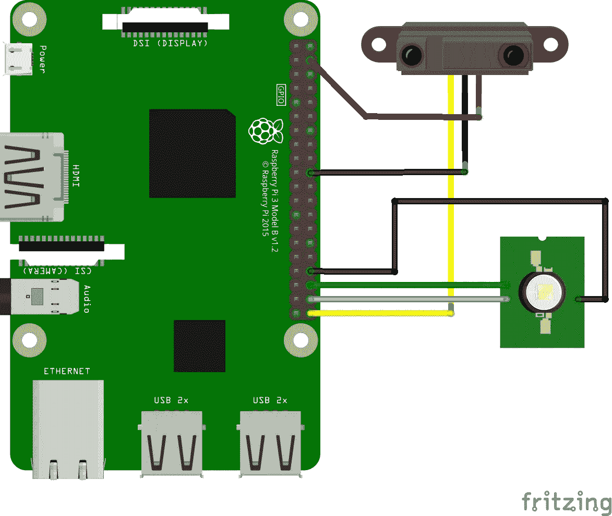
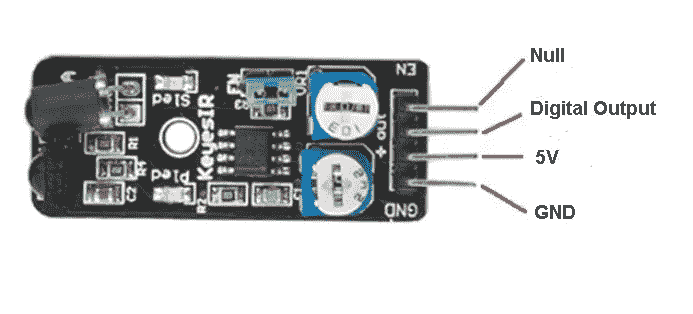
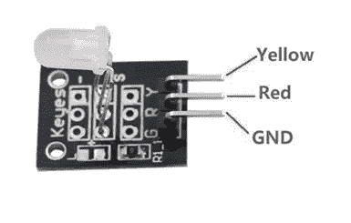
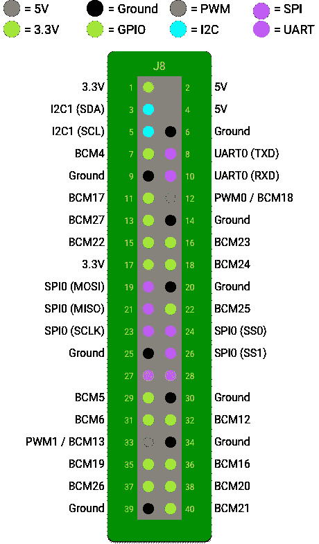

# Android 事物基础:带 LED 反馈的避障传感器

> 原文：<https://medium.com/hackernoon/android-things-basics-obstacle-avoidance-sensor-with-led-feedback-9127e13f2e76>

在这个项目中，当障碍物过于靠近我们的传感器时，我们将使用一个 [LED](https://hackernoon.com/tagged/led) 作为通知。

我们将了解标准 I/O 如何与 Android 中的 GPIO 一起工作。

# 要求

我们用的是预装了 [Android Things 开发者预览版](https://developer.android.com/things/preview/download.html)(版本 1)的[树莓 Pi 3](https://www.raspberrypi.org/products/raspberry-pi-3-model-b/) 。

我这个项目有一个便宜的[避障传感器](http://www.ebay.com/itm/Infrared-Sensor-Obstacle-Avoidance-Module-Probe-for-Robot-Smart-Car-A950-YG-/142076972192)和一个[双色共阴极 LED](https://guide.alibaba.com/shop/ad-011-5mm-two-colour-red-and-green-led-common-cathode-module-dual-colour-for-arduino-avr-pic_61250507.html) 。
你可以使用任何你想要的 LED，我家里只有这个。

# 设置

谷歌有一个真的很好的教程，如何准备你的树莓 Pi 3 进行 Android 的东西开发，我不想再描述了。

请遵循以下步骤:

 [## 树莓派 3 |安卓的东西

### Raspberry Pi 3 Model B 是世界上最流行的单板计算机的最新迭代。它提供了一个四边形…

developer.android.com](https://developer.android.com/things/hardware/raspberrypi.html) 

# 接线

让我们看看我们的传感器。

**避障传感器**有 4 个引脚，我们只使用其中的 3 个。第 4 个(空)，最上面的一个没有使用。

如图所示，底部的一个需要连接到 Pi 上的**地** ( **GND** )引脚，显然 **5V** 需要连接到 5V 电源引脚，而**数字输出**引脚需要连接到 GPIO。

如果障碍物太近，数字输出引脚会向我们的开发板发送信号。

LED 模块稍微简单一点。

它只有 3 个引脚，我们将使用其中的 2 个，但当然，您可以将所有 3 个连接到您的 Pi 进行测试。

**GND** 连接到您的 Pi 上的一个接地引脚，而**黄色**(或某些模块上的绿色)和**红色**输入引脚需要连接到您板上的一个 GPIO (1 引脚- 1 GPIO)。(对于这个项目，一个输入引脚足以连接。)

(如果您有一个简单的 LED，您只有 2 个引脚，1 个接地和 1 个输入引脚。)

下面是我如何将**避障传感器引脚**与树莓 Pi 连接:

*   **空值** →
*   **数字输出** → GPIO 21 (BCM21，引脚 40)
*   **5V** → 5V(针脚 4)
*   **GND** → GND(针脚 20)

下面是 **LED 引脚**如何连接到 Pi:

*   **GND**→GND(34 脚)
*   **黄色** → GPIO 16 (BCM16，针脚 36)
*   **红色** → GPIO 20 (BCM20，针脚 38)

这是它在一起的样子:
(在左侧，您可以看到一个引脚排列图，显示了 Raspberry Pi 3 板的分线连接器暴露的可用端口的位置)

# 软件

Google 也有一个很好的教程，如何在 Android Studio 中配置你的 Android Things 项目。

请遵循以下步骤:

 [## 创建一个 Android 事物项目| Android 事物

### Things 应用程序使用的结构与为手机和平板电脑设计的结构相同。这种相似性意味着您可以修改您的…

developer.android.com](https://developer.android.com/things/training/first-device/create-studio-project.html) 

现在你有了一个基本的、可编译的、工作的 Android Things 应用程序，所以我们可以开始添加必要的代码了。

在我们的主要活动中，我们可以设置 GPIO 引脚:

然后我们初始化**避障传感器**的引脚( **BCM21** )作为**输入**(我们从该引脚读取):

将 LED 引脚( **BCM16** 、 **BCM20** )配置为**输出**(我们写入这些引脚):

还有我们的 **GpioCallback()** ，它有魔力:(当障碍物太近时，闪烁 led)

如果你不需要这些资源，不要忘记关闭它们:

就是这样！最终结果是:

我希望你喜欢 Android 的树莓派黑客。

Github 上有完整的项目:

 [## danesz/AndroidThings-障碍物避免传感器

### 通过在 GitHub 上创建一个帐户，为 Android things-obstacle avoidance sensor 的开发做出贡献。

github.com](https://github.com/Danesz/AndroidThings-ObstacleAvoidanceSensor) 

> [黑客中午](http://bit.ly/Hackernoon)是黑客如何开始他们的下午。我们是 [@AMI](http://bit.ly/atAMIatAMI) 家庭的一员。我们现在[接受投稿](http://bit.ly/hackernoonsubmission)并乐意[讨论广告&赞助](mailto:partners@amipublications.com)机会。
> 
> 如果你喜欢这个故事，我们推荐你阅读我们的[最新科技故事](http://bit.ly/hackernoonlatestt)和[趋势科技故事](https://hackernoon.com/trending)。直到下一次，不要把世界的现实想当然！

