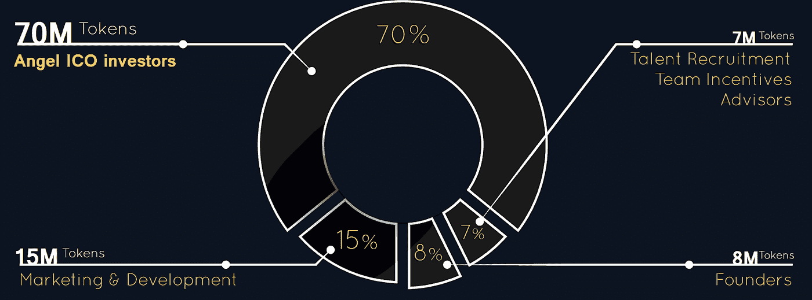

# 天使令牌 ICO 评论

> 原文：<https://medium.com/hackernoon/angel-token-ico-review-530ea200f8b6>

Before reading this article, please read our full disclaimer found [here](https://thebestoficos.com/disclaimer.html) and at the bottom of this page

## Altcoin 投资平台

# 介绍

天使令牌(Angel Token)是一个平台和社区，致力于购买 altcoins 并出售它们以获取利润。他们不知何故声称不出售证券。该公司没有透露他们的总部在哪里，他们的 ICO 将于 12 月 19 日关闭。截至 12 月 13 日，他们已收到近 50 万美元的资金(735 ETH)。

这个令牌有趣的地方在于，他们向投资者承诺，可以在 2018 年 3 月 7 日之前退还投资。我们认为，随着 ICO 世界变得更加标准，这将成为一种普遍的做法。

> “在 2018 年 3 月 7 日之前，任何天使令牌 ICO 投资者都不可能损失超过其以太投资的 20%,无论交易所的天使令牌价格如何变化”

——天使令牌白皮书 3.0 版第 3 页

# 这个想法

随着加密货币领域的蓬勃发展，每天似乎都有新的令牌承诺成为新的以太坊，或取代比特币。不可能跟踪所有这些隐藏的宝石。Angel Token 的匿名团队决定解决这个问题。

这个想法是创建一个专门投资替代硬币的社区。然后，该社区集中其营销和技术技能，以一系列方法(除了抽水和倾倒计划)来帮助提高其投资组合中替代硬币的价值。

用他们的话说:

> “我们相信，我们为增强这些加密货币/资产所做的工作，加上天使基金会的加密资本支持，将大大提高这些加密货币/资产的交易价格和市值”

——天使令牌白皮书 3.0 版第 5 页

# 牵引力

没有任何迹象表明有任何，或该产品以任何方式存在。我们对战略、技术、MVP，甚至是谁建造了技术方面的任何信息的缺乏都是极度怀疑的。

# 令牌

为了成为“活跃天使令牌持有者”，用户必须拥有至少 10，000 个天使令牌，目前售价为 0.7924 ETH 或约 380 美元(由于 ICO 奖金，价格略有延迟)。[这类似于 trade.io 会员投资。](https://hackernoon.com/trade-io-white-paper-review-e0a5e7eec587)如果用户持有的天使令牌少于此数量，他们对社区的访问将被自动取消。

令牌的价格将保持不变，为每 1 个天使令牌 0.00079 ETH，尽管没有解释他们将如何保持价格稳定。正如我们在以前的文章中提到的，创建和维护一个稳定的令牌非常困难。因为公司通常不得不购买实物资产，如黄金，并将其存放在金库中，以便有一项资产可以依靠，并保持稳定的资产价格。

每当用户购买令牌时，也会立即创建令牌。留给我们的问题是，为什么要制造令牌，而仅仅使用 ETH。

# 资金用途

Token distribution taken from [Angel Token website](https://angelinvestors.io/)

Angel Token 计划将他们的 Angel Token ICO 收入的 80%存放在一个金库中，作为投资者在平台募集之前卖出其令牌的担保。他们还计划将 ICO 收入的 70%用于进一步投资，15%用于营销，8%用于创始人(出于什么原因？)和 7%的 I 人才招聘。

没有迹象表明或详细的战略，人员，创始人，或什么人才招聘将被利用。所以我们没有办法评估这些数字是否真实，甚至一开始就有意义。

# ICO 详细信息

天使令牌的 ICO 目前是活的。他们的 ICO 从 11 月 27 日开始，到 2017 年 12 月 19 日结束。他们目前已经从 31，ETH 中筹集了 735.55 ETH(约 50 万美元)。投资者目前用 1 以太兑换 1262 天使币。

Angel Token 的 ICO 限制来自美国、英国、新加坡、中国的投资者参与(他们的白皮书也包括新西兰，但不包括他们的网站)。它们没有说明为什么会出现这种情况，也没有说明它们的总部在哪里，或者它们属于什么立法或税务管辖区。

在接下来的 5 个月里，80%的 ICOs 股份由第三方托管。这样做的目的是使投资者能够与创始人以及社区进行交谈，并在他们决定退出项目时下定决心。

# 团队

Angel Token 的团队自称是“一群诚实且经验丰富的营销人员”。该网站不包括一个部门团队，这让我们对产品及其质量产生了难以置信的怀疑。没有迹象表明这个团队有经营一家公司所必需的技能，更不用说把他们的脸放在他们的产品上了。

创始人用以下理由来解释团队的缺失:

> “我们希望我们的提议不言自明，我们不认为暴露我们的身份会给这项提议增加任何重要价值。我们认为，一个人的名字并不能保证什么，在加密资产目前存在的快速变化和基本上不受监管的环境中，我们认为投资者或创始人完全公开他们的身份没有什么好处”

—天使令牌白皮书 3.0 版第 37 页

这句话给梅杰公司敲响了警钟，他们不知道谁拥有这笔钱，他们是如何操作这笔钱的，他们管理公司的技能是什么(如果有的话)。

# 透明度

Angel Token 声称将公布他们投资组合的月度估值。同时添加以下免责声明:

> “公布任何加密货币/资产的确切持有量不是我们的政策。我们的政策也不包括申报我们进行的每一笔交易或市场进出”

—天使令牌白皮书 3.0 版第 31 页

象征性股息(以乙醚的形式)将按季度发放，但仅限于迄今为止投资组合估值最高的季度。他们的论文声称这将增加长期决策，但它似乎只是激励投资者每季度适度增加估值，并确保每个季度都比上一季度略高。

该公司对于他们想要建造什么、如何建造以及由谁来建造都含糊不清。他们自称是专家，并使用人工智能，但没有提供关于他们使用这些技术的细节，或“专家”是谁。

> “我们有一个专家团队不断研究加密货币市场，以寻找巨大的机会。我们将使用最新的分析工具，以及一些更有趣的人工智能产品，这些产品可以用作投资潜力和交易时机的重要指标。然而，我们也将受到投资俱乐部的领导”

—天使令牌白皮书 3.0 版第 15 页

也不清楚社区将如何做出投资决策，或者这些决策将如何管理或发展。甚至不清楚该产品是否存在于任何级别或谁开发了它。唯一简单提及的是基于股权证明的投票系统。

对于一份信息量如此之少的论文来说，他们 38 页的论文长得令人难以置信。

# 结论

这个 ICO 有多个可疑的地方。出于多种原因，我们对这个 ICO 持极度怀疑的态度。最重要的是，他们的联合创始人都没有出现在网站或白皮书上。我们不知道 Angel Tokens 是否成立了公司，或者在哪里成立，他们的白皮书和网站中有许多不一致的地方，他们的网站上也使用了股票照片。

该平台承诺为其投资者进行 altcoin 投资。然而，它没有解释它将如何能够实现这一点。尤其是当所有声誉良好的交易所都要求提供购买资产者的身份时。在当前的环境下，天使令牌的匿名投资者大军甚至无法兑现一美元。

此外，没有迹象表明该平台将最终完成，甚至在 ICO 于 3 月 7 日截止日期前收回 80%资金时完成。我们不明白为什么他们甚至要求做一个令牌。

这个 ICO 充满了疑问、匿名、含糊不清和不完整的承诺，当然也有很多风险和不确定性。

想帮忙吗？
**永远支持我们！**

***想了解 ICOs 的最新动态吗？* ***在*** [***拜访我们，https://thebestoficos.com***](http://thebestoficos.com/)**

***有有趣的故事吗？* ***写我们在 info@bestoficos.com*****

# **放弃**

**本网站由 Durata Inc .(以下简称“Durata”“ICOs 中的佼佼者”“我们”“我们”“我们”)运营，dura ta 是一家在安大略省注册的加拿大公司。通过阅读并继续使用我们的网站和博客(统称或单独称为“网站”)，您保证您已经阅读、理解并同意我们的免责声明。我们对免责声明所做的任何更改将在我们将修改后的免责声明发布到我们的网站后立即生效。更新时间:2017-11-30**

## **做你的研究**

**本网站的内容仅供使用，且只能用于一般信息目的。进行任何投资之前，考虑您的个人情况并进行自己的分析非常重要。此外，在进行财务投资或决策之前，您应该寻求合格专业人士的独立财务建议。您或您的合格金融专业人士应采取措施，在做出任何投资决定或其他决定之前，独立研究和验证您在我们网站上发现的或希望依赖的任何信息。**

## **无投资建议**

**该网站是一个金融数据和新闻门户、一个博客和一个内容聚合器。最好的 ico 不是经纪人/交易商，我们不是投资顾问，我们不能获得关于上市公司的非公开信息。本网站不是提供或接受财务建议或投资决策建议的地方。我们不受安大略证券委员会、美国证券交易委员会或任何其他类型的监管性金融机构或机关的监管。**

**我们是一个教育论坛，旨在分析、学习和讨论与密码货币、密码货币投资和投资策略相关的一般信息。网站上的任何内容都不构成——或应被理解为构成——投资建议，或作为参与任何证券交易或参与所展示的任何投资策略的建议。对于 ICO 或任何特定的投资方式是否适合特定个人的财务需求，我们不提供个性化的建议或意见。**

## **不是法律或税务建议**

**我们不是会计师。我们不是律师。本网站上的任何内容或信息都不构成或不应被理解为构成法律或税务建议。你应该聘请有执照的专业人士来提供这些方面的建议。**

## **个人授权，而不是牵手**

**虽然我们展示了我们已经筛选和研究过的投资，但研究结果只能作为进一步研究的候选，而不能作为“买入”名单或一组建议。筛选可能有助于缩小基于预定义标准的搜索范围，但它不能替代反映您个人投资/交易标准的独立研究和验证。**

**在我们提供估价工具的地方，这些工具仅用于信息和教育目的，以便用户可以轻松地运行他们自己的估价。任何预定义的值都只是基于我们在整个市场应用的全球假设的一个起点，用户应该修改他们认为合适的数字，而不是将其视为自己判断或自己研究和验证的替代品。任何由此产生的估价结果都必须是通用的，并没有得到 Best of ICOs 对给定股票的认可。**

## **不依赖**

**无论是在合同、侵权行为(包括疏忽)还是其他方面，对于您因访问本网站上的信息或材料或您可能依赖此类信息或材料而遭受的任何损害、费用或其他损失，我们都不承担责任。我们不对任何错误或遗漏负责，也不对使用本网站中的任何信息、内容或材料所产生的结果负责。本网站中的所有信息均按“原样”提供，不保证完整性、准确性或及时性。虽然我们努力保持我们的信息没有错误和完整，但并不保证它会如此，我们可以，但没有义务，纠正任何此类错误或补充任何不完整的信息。**

## **投资警告**

**加密货币的价值、加密货币投资以及从中获得的收入可以下降，也可以上升。新商业模式的出现可以为用户和投资者创造机会，但由于缺乏新项目的质量评估标准、可靠性和透明度，任何年轻的市场都对其所有参与者带来重大风险。过去的业绩不是未来业绩的可靠指标，投资者可能无法收回全部投资。**

## **对第三方网站不承担责任**

**本网站可能包含其他网站的链接。这些链接网站不受 Best of ICOs 的控制，我们不对任何链接网站的内容负责，包括但不限于链接网站中包含的任何链接，或链接网站的任何更改或更新。我们向您提供这些链接只是为了方便，包含任何链接并不意味着认可链接的网站或与其运营商有任何关联。**