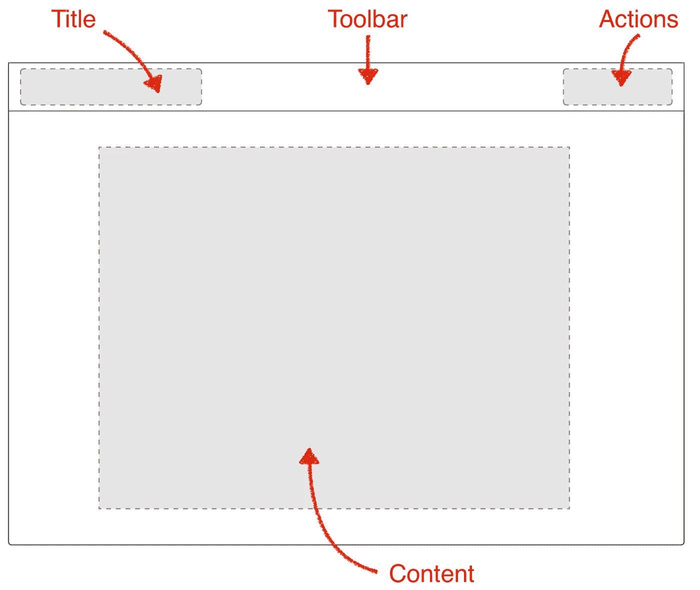
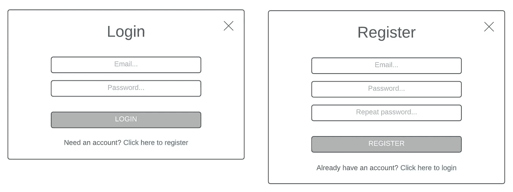
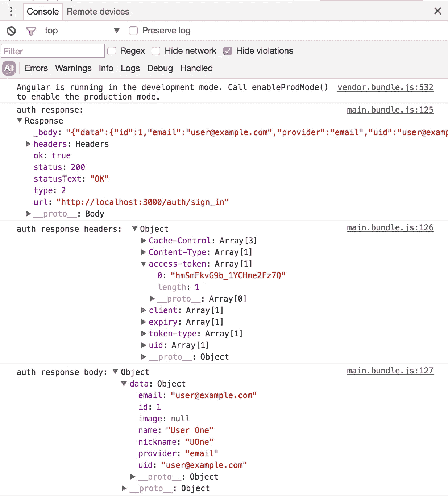

# Angular 2+和 Ruby on Rails 用户认证第 2 部分

> 原文：<https://medium.com/hackernoon/angular-2-and-ruby-on-rails-user-authentication-part-2-a0c40f427145>

## 本文是 [Angular 2+和 Ruby on Rails 用户认证第 1 部分:后端](/@avatsaev/angular-2-and-ruby-on-rails-user-authentication-fde230ddaed8#.tfr6zstyp)的后续文章


# 介绍

我将前端部分分成 3 个不同的子部分:

1.  概念&引导/配置项目
2.  建筑物登录/注册
3.  建筑剖面图及其路由器防护

所以在这一部分我们将做一些构思，然后引导并配置我们的项目，使用 [Angular CLI](https://cli.angular.io) 、[物化](http://materializecss.com)用于 UI，使用 [Angular2Token](https://github.com/neroniaky/angular2-token) 用于前端用户管理。

如果你不想/不需要做这些，我为你准备了一个引导和完全配置的项目，只需拉这个回购[https://github.com/avatsaev/angular-token-auth-seed](https://github.com/avatsaev/angular-token-auth-seed)直接跳到 [**第 3 部分**](/@avatsaev/angular-2-and-ruby-on-rails-user-authentication-part-3-d938fcb7a334#.itibi1vqc) 。


# **布局/UI**

我们的应用程序的 UI 非常简单，有一个封装了标题和动作的经典工具栏，还有一个显示当前页面内容的区域:



# **应用行为**

最初，应用程序将在内容区域显示一个欢迎页面。

**动作区**将有两种状态，当用户未登录时显示**登录&注册**动作，或者当用户登录时显示**显示简介&注销**动作，这些状态将在用户登录或注销时实时切换。

当用户点击**登录**或**注册**时，我们将显示一个带有适当表单的模态对话框(登录或注册自)。

当用户点击**个人资料**动作时，我们将在**内容区显示他的个人资料数据。**



当用户在登录和注册模式之间切换时，我们将在同一个对话框中显示适当的表单。

当用户成功登录或注册时，我们将自动关闭对话框，并将其重定向到他的个人资料页面。

非常简单明了的东西，所以让我们开始吧。

# 引导和配置前端

## 安装角度 CLI


Angular 团队开发了一个非常方便的工具，名为 [Angular CLI](https://cli.angular.io) ,允许我们在终端内轻松引导和管理 Angular 应用程序，并通过 NPM 在全球范围内安装它:

```
$ npm install -g @angular/cli
```

## 引导 Angular CLI 项目

```
$ ng new angular-token-auth --style=sass --skip-tests=true --routing=true
```

该命令将生成一个名为**Angular-device-token-auth 的新 Angular CLI 项目，**将使用 SASS 作为默认样式格式，出于本教程的目的，我们将禁用单元测试文件，并用路由模块初始化该项目，因为我们的应用程序中至少需要两条路由，**欢迎页面**和**配置文件页面**。

## 使用具有角度的 MaterializeCSS


为了构建我们的 UI，我们将使用[Materialize cs](http://materializecss.com)，好消息是，Materialize 组件可用于 Angular 的 [angular2-materialize](https://github.com/InfomediaLtd/angular2-materialize) 库，所以让我们安装它及其依赖项:

```
$ npm install materialize-css angular2-materialize jquery@^2.2.4 hammerjs font-awesome --save
```

在**中包含依赖关系和样式。/.angular-cli.json** 文件:


在**样式**数组中，我们需要物化样式表:

```
"styles": [
  "styles.sass",
 **"../node_modules/materialize-css/dist/css/materialize.css",
  "../node_modules/font-awesome/css/font-awesome.css"**
],
```

在**脚本**数组中，我们需要 jquery、hammerjs 和 materializejs:

```
"scripts": [
  **"../node_modules/jquery/dist/jquery.js",
  "../node_modules/hammerjs/hammer.js",
  "../node_modules/materialize-css/dist/js/materialize.js"**
]
```

这样，Angular CLI 将知道哪些额外的第三方库将编译到我们的最终捆绑包中。

接下来，我们需要将**物化模块**放到我们的 M **ain 应用模块**中，这样我们就可以在我们的应用**、**打开**中使用物化组件。/src/app/app.module.ts** 并导入实体化模块

```
import { MaterializeModule } from 'angular2-materialize';
```

然后将其添加到我们的 **AppModule** 的 **imports** 数组中:

```
@NgModule({
  declarations: [
    AppComponent
  ],
  imports: [
    BrowserModule,
    FormsModule,
    HttpModule,
    AppRoutingModule,
    **MaterializeModule**
  ],
  providers: [],
  bootstrap: [AppComponent]
})
export class AppModule { }
```

# **安装和配置 Angular2 令牌**


为了使前端的用户管理更容易，我们将使用 [angular2-token](https://github.com/neroniaky/angular2-token) 库，它被设计为与我们在 RoR 后端用于用户管理的 [DeviseAuthToken](https://github.com/lynndylanhurley/devise_token_auth) gem 一起工作。让我们安装并配置它:

```
npm install angular2-token --save
```

导入并注入到我们的**主 App 模块(。/src/app/app.module.ts):**

```
**import { Angular2TokenService } from 'angular2-token';**@NgModule({
  declarations: [
    AppComponent
  ],
  imports: [
    BrowserModule,
    FormsModule,
    HttpModule,
    AppRoutingModule,
    MaterializeModule,
  ],
  **providers: [ Angular2TokenService ],**
  bootstrap: [AppComponent]
})
export class AppModule { }
```

接下来，我们需要为它创建一个默认配置，考虑到生产和开发环境中的配置可能不同，我们将在**中使用 Angular CLI 的 env 配置文件。/src/environments** 文件夹。

在这个文件夹中，我们有两个文件， **environment.ts** 将在开发过程中用作默认配置存储，而 **environment.prod.ts** 将在您使用 Angular CLI 的 **prod** 标志( *ng build - prod* )构建应用程序时用于生产

Angular2Token 提供了不同的配置密钥，您可以在这里查看它们，但是我们只需要一个， **apiBase，**这是我们后端服务器的地址，考虑到 Rails 默认运行在端口 3000 上，地址将是 **http://localhost:3000** 。

让我们在**中创建配置。/src/app/environments/环境. ts**

```
export const environment = {
  production: false,
  **token_auth_config: {
    apiBase: 'http://localhost:3000'
  }**
};
```

# **初始化 Angular2Token**

现在我们需要用这个配置初始化令牌服务，打开**。/src/app/app.component.ts** 并导入 Angular2TokenService:

```
import {Angular2TokenService} from "angular2-token";
```

然后导入环境配置:

```
import {environment} from "../environments/environment";
```

将令牌服务注入到我们的**应用程序组件**中，并用我们的配置对其进行初始化:

```
export class AppComponent {
  title = 'app works!';
  **constructor(private authToken: Angular2TokenService){
    this.authToken.init(environment.token_auth_config);
  }**
}
```

您的 **AppComponent** 应该是这样的:

# 测试令牌服务

现在让我们看看是否可以用我们的默认用户登录，如果你记得他的电子邮件是**user@example.com**和密码**猴子 67。**

让我们使用**令牌服务**的 **signIn** 方法，该方法将带有**电子邮件**和**密码**密钥的对象作为参数，并返回一个 Obesevable <响应>，我们可以订阅该响应并注销结果(如果 RoR 后端尚未运行，不要忘记启动它):

运行以下命令启动我们的 Angular 应用程序:

```
$ ng serve
```

服务器将在 [http://localhost:4200](http://localhost:4200) 上启动

如果查看控制台，您会看到响应头中的 auth 令牌和正文中的用户数据:



在继续之前，不要忘记删除此登录测试，并清理您的浏览器缓存以从本地存储中删除身份验证令牌。

现在我们的前端已经启动并运行，我们可以开始构建我们的 Angular 应用程序，[**让我们开始第 3 部分**](/@avatsaev/angular-2-and-ruby-on-rails-user-authentication-part-3-d938fcb7a334#.u9pzluw9j) 寻找有趣的东西。

> [第 3 部分:前端，登录/注册](/@avatsaev/angular-2-and-ruby-on-rails-user-authentication-part-3-d938fcb7a334#.itibi1vqc)