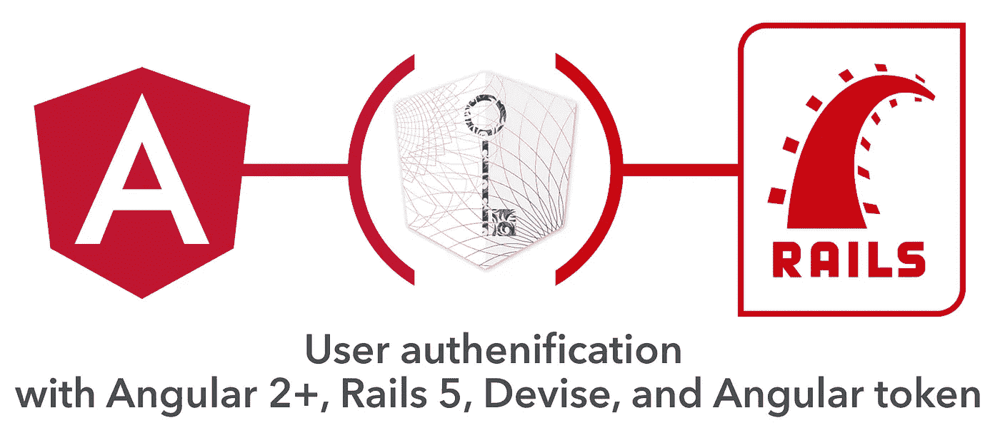
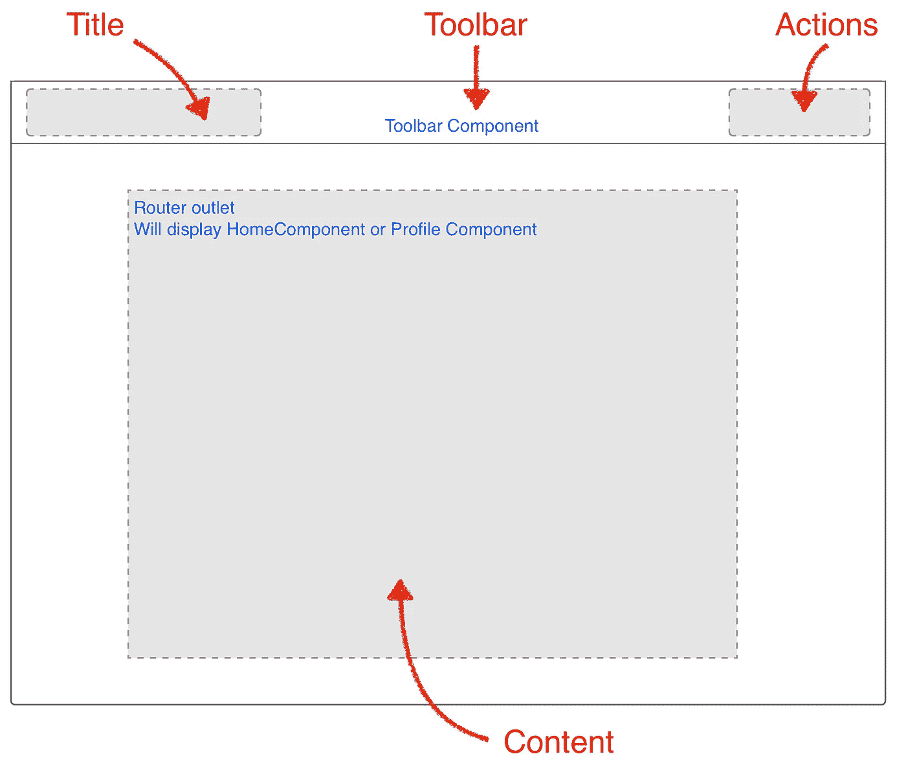
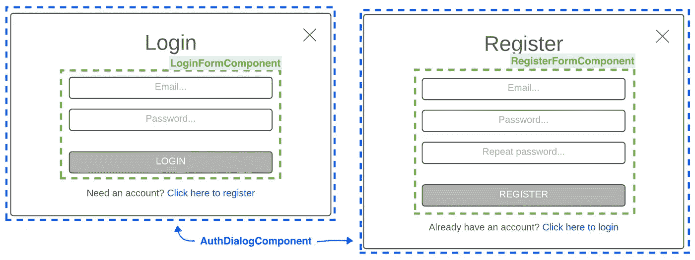
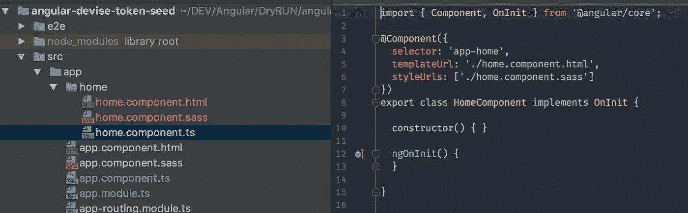
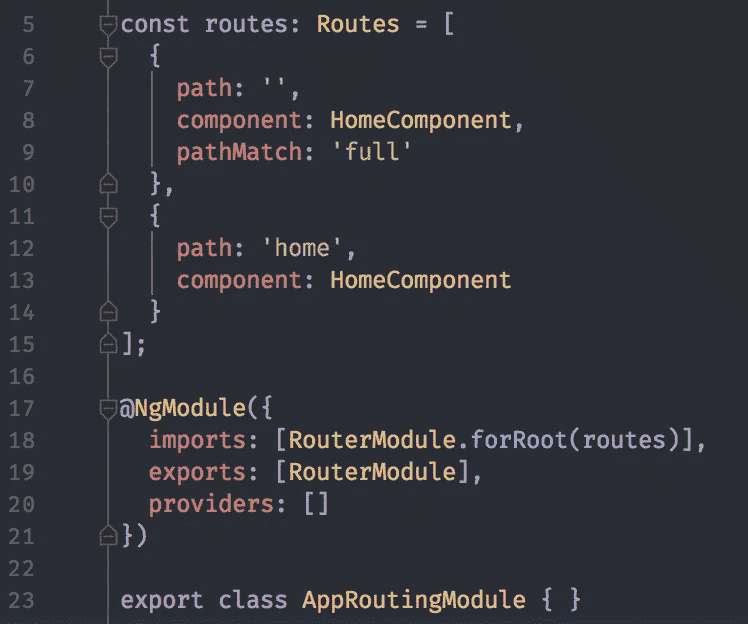
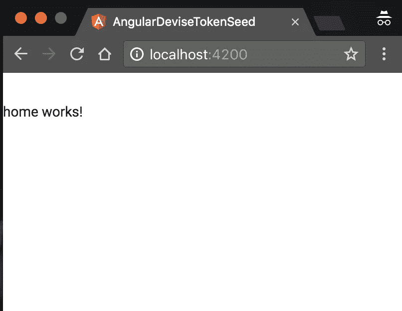
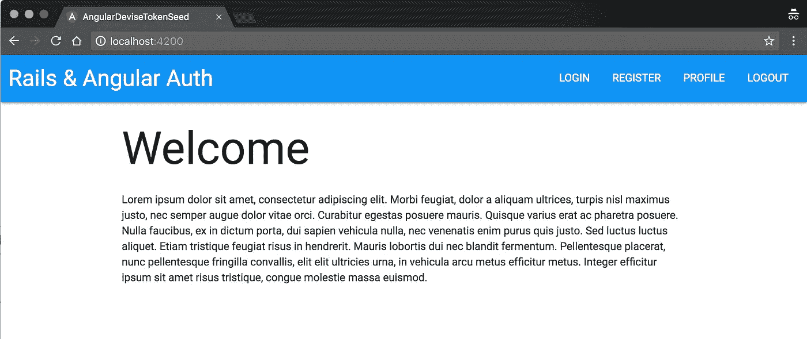
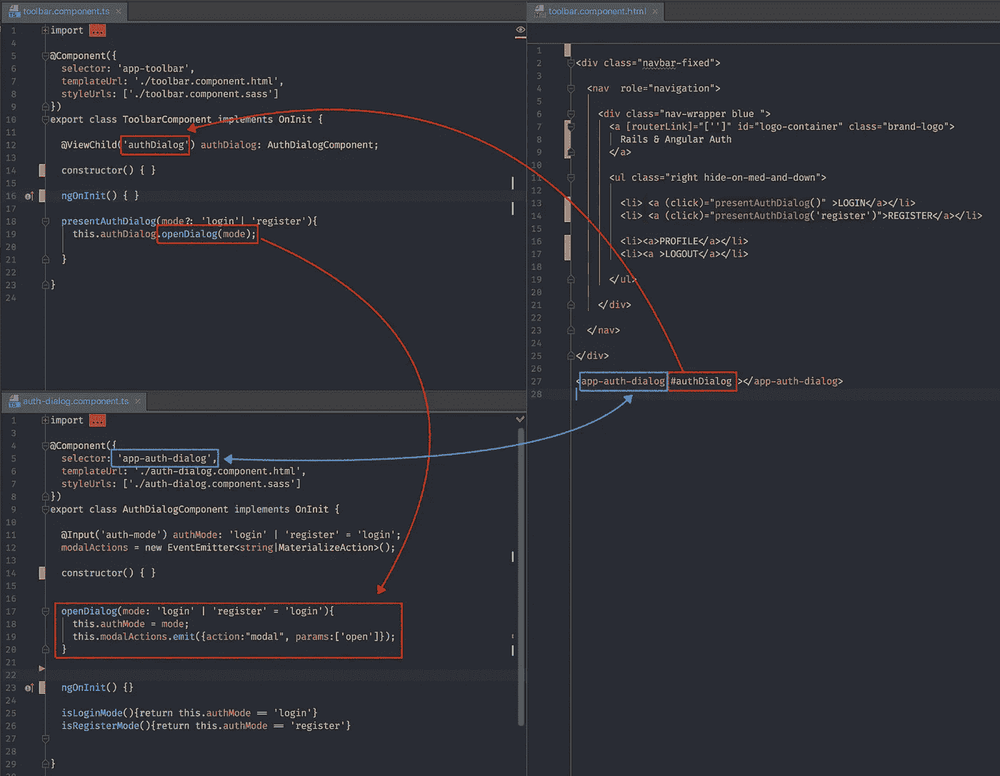
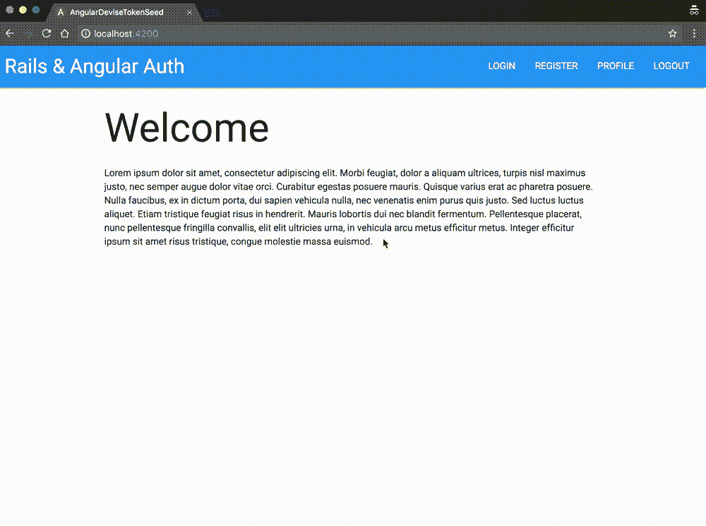
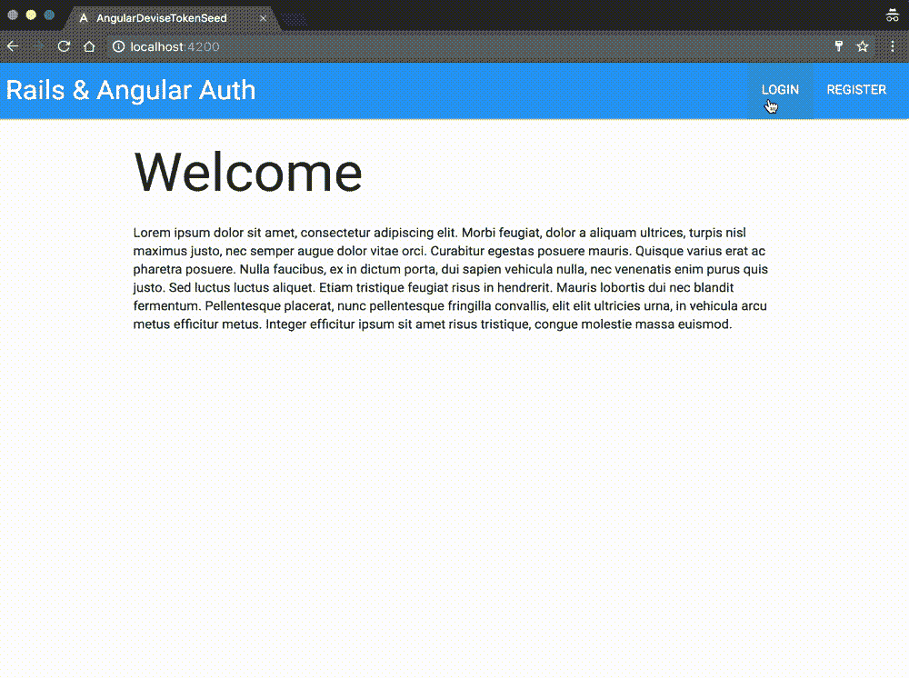

# Angular 2+和 Ruby on Rails 用户认证第 3 部分

> 原文：<https://medium.com/hackernoon/angular-2-and-ruby-on-rails-user-authentication-part-3-d938fcb7a334>

## 本文是 [Angular 2+和 Ruby on Rails 用户认证](/@avatsaev/angular-2-and-ruby-on-rails-user-authentication-fde230ddaed8#.p1u4kqz5e)的后续文章



# 应用架构

## 成分

*   *首页组件(欢迎页面)*
*   *工具栏组件*
*   *认证对话框组件*
*   *从组件*登录
*   *登记表组件*
*   *剖面组件*



将登录和注册表单分成不同的组件是有用的，因为如果需要，我们可以在其他页面中重用它们(例如，没有对话框的专用登录和注册页面)

## 路线

*   *回家路线*
*   *轮廓路线*

## 路线守卫

*   *Profile route guard* :将检查用户是否登录，如果没有，将重定向到主页

## 服务

*   *TokenAuthService* :将管理登录、注册、注销、用户配置文件数据，验证令牌真实性，并检查用户是否登录


# 家用元件和家用布线

让我们从使用 Angular CLI 生成第一个组件 Home 开始:

```
$ ng g c home
```

> g =生成，c =组件

这将创造。/src/app/ **home** 文件夹包含 home 组件类、其模板和样式表，Angular CLI 还会自动将其添加到主应用程序模块的声明数组中。



现在我们需要为它创建一条路线，打开**。/src/app/app-routing . module . ts**

导入家庭组件:

```
import {HomeComponent} from "./home/home.component";
```

并将归属路由添加到路由数组:

```
const routes: Routes = [
  {
    path: '',
    children: []
  },
  **{
    path: 'home',
    component: HomeComponent
  }**
];
```

我们还会将它设为默认路由:

```
const routes: Routes = [
  {
    path: '',
    component: HomeComponent,
    pathMatch: 'full'
  },
  {
    path: 'home',
    component: HomeComponent
  }
];
```



现在，如果我们转到[http://localhost:4200](http://localhost:4200)home component 将默认显示



# 工具栏组件

工具栏组件的相同程序:

```
$ ng g c toolbar
```

设置工具栏的 html 模板:

现在我们将显示所有动作，稍后我们将实现条件状态。

更换**。/src/app/home/home . component . html**来点更吸引人的:

编辑**。/src/app/app . component . html**显示我们的工具栏，并将路由器出口包装在*容器*类中:

这是我们目前得到的信息:



# **认证对话框**

现在我们需要创建 **AuthDialogComponent** ，它将显示登录/注册表单:

```
$ ng g c auth-dialog
```

让我们在**中编辑 AuthDialogComponent 文件。/src/app/auth-dialog/auth-dialog . component . ts**

验证对话框组件将有一个**输入**装饰器(第 11 行)**验证模式**，它有两个可能的值，“登录”或“注册”，这将允许我们选择对话框出现时显示的初始表单(登录或注册表单)。此输入的默认值是“登录”。

**modalActions** (第 12 行)是一个事件发射器，物化对话框指令需要它，我们将在它上面发射事件来打开或关闭我们的对话框。

**openDialog** (第 18 行)方法以一个 **mode** 为参数，将设置当前的 auth 模式并显示对话框，如果没有传递参数，默认为 login。

**isLoginMode** 和 **isRegisterMode** 方法将帮助我们有条件地显示登录或注册表单。

编辑此对话框的模板**。/src/app/auth-dialog/auth-dialog . component . html**:

在第 2 行，我们使用**物化模态指令**，并为其**物化动作**输入传递**模态动作**事件发射器，以便能够通过在对话框上发射事件来控制对话框。

现在这个对话框在第 17 行显示的是它的当前模式，以及在第 23 和 26 行切换模式的能力。 ***ngIf** 结构指令采用布尔表达式，如果表达式为 *true* ，则显示节点，否则隐藏节点(从 DOM 中移除)。

让我们在单击工具栏中的注册或登录操作时显示此对话框。

在**中。/src/app/toolbar/toolbar . component . html**包含 auth-dialog 组件，并在登录和注册操作时创建 click 事件以打开 auth 对话框:

**#authDialog** (第 24 行)是对工具栏组件视图的 AuthDialogComponent 的引用，它将允许我们从工具栏组件类访问 AuthDialogComponent 类。

**。/src/app/toolbar/toolbar . component . ts:**

```
import {Component, OnInit, **ViewChild**} from '@angular/core';
**import {AuthDialogComponent} from "../auth-dialog/auth-dialog.component";**

@Component({
  selector: 'app-toolbar',
  templateUrl: './toolbar.component.html',
  styleUrls: ['./toolbar.component.sass']
})
export class ToolbarComponent implements OnInit {

  **@ViewChild('authDialog') authDialog: AuthDialogComponent;**

  constructor() { }

  ngOnInit() {
  }

 **presentAuthDialog(mode?: 'login'| 'register'){
    this.authDialog.openDialog(mode);
  }**

}
```

**ViewChild** decorator 将从我们的模板中引用 **AuthDialogComponent** ，这样我们就可以直接从我们的 **ToolbarComponent** 类中访问它的方法和属性。

**presentAuthDialog** 方法带一个**可选** *模式*参数**(注意问号)**，AuthDialogComponenet 的 **openDialog** 方法默认模式为“登录”，所以如果我们想打开登录对话框，我们可以不带任何参数调用 **presentAuthDialog()** 。



到目前为止，这是我们从 Auth 对话框中得到的结果:



我们将使用**令牌服务**根据用户是否通过身份验证来显示工具栏中的正确操作，为此，我们可以使用[**userSignedIn()方法**](https://github.com/neroniaky/angular2-token#usersignedin) 返回用户登录时的 true。

将 **Angular2TokenService** 导入并注入到我们的**工具栏组件**中:

现在我们可以在工具栏模板上使用它来有条件地隐藏/显示动作，我们还将把 **signOut** 方法附加到它的动作上:

# 登录和注册表单

我们快完成了。让我们生成登录和注册表单组件。

```
$ ng g c login-form$ ng g c register-form
```

## 登录表单模板

我们有两个文本输入(电子邮件和密码)，这两个都是表单拥有有效状态所必需的。我们在第 12 行和第 24 行使用 Angular 的双向数据绑定将输入值绑定到组件类中的 signInUser 对象，这意味着当用户在 HTML 表单中修改这些值时，这些值将被更新，如果在组件类中以编程方式修改这些值，这些值也会在视图中更新。

提交按钮(第 31 行)将处于禁用状态，除非表单生效(第 32 行)。

## 登录表单组件

登录表单将有一个输出 **onFormResult** (第 16 行)，这是一个在登录请求完成时触发的事件，因此父组件可以监听并对其进行操作。

我们将把**令牌服务**注入到我们的组件中(第 17 行),并在提交表单时使用它的**登录**方法。当登录动作完成时，我们将在 **onFormResult** 输出上发出一个事件，带有包含结果的有效负载(第 31 和 37 行)，这将通知父组件。

## 注册表单模板

非常类似于登录，但有一个额外的密码确认文本字段及其验证。

## 注册表单组件

与登录表单类似，注册表单也有一个输出事件发射器 **onFormResult** ，它在注册请求完成时触发。

## 在验证对话框中连接输出

在 auth dialog 组件类中，为**登录**和**注册**表单组件发出的 **onFormResult** 事件创建事件处理程序，如果登录/注册成功，则关闭对话框，否则在警告窗口中显示我们的 ror 服务器返回的错误:

## 最终验证对话框

请注意，当用户登录和注销时，工具栏动作会自动更新它们的状态。



> 该器件的最终源代码可从 Github 获得:[https://Github . com/avatsaev/angular-token-auth-seed/tree/final](https://github.com/avatsaev/angular-token-auth-seed/tree/final)

[**第 4 部分:用户配置文件、认证服务和认证路由器防护。**](/@avatsaev/angular-2-and-ruby-on-rails-user-authentication-part-4-49d550c5869a#.bpxr54ano)

[](http://bit.ly/HackernoonFB)[](https://goo.gl/k7XYbx)[](https://goo.gl/4ofytp)

> [黑客中午](http://bit.ly/Hackernoon)是黑客如何开始他们的下午。我们是 [@AMI](http://bit.ly/atAMIatAMI) 家庭的一员。我们现在[接受投稿](http://bit.ly/hackernoonsubmission)并乐意[讨论广告&赞助](mailto:partners@amipublications.com)机会。
> 
> 如果你喜欢这个故事，我们推荐你阅读我们的[最新科技故事](http://bit.ly/hackernoonlatestt)和[趋势科技故事](https://hackernoon.com/trending)。直到下一次，不要把世界的现实想当然！

