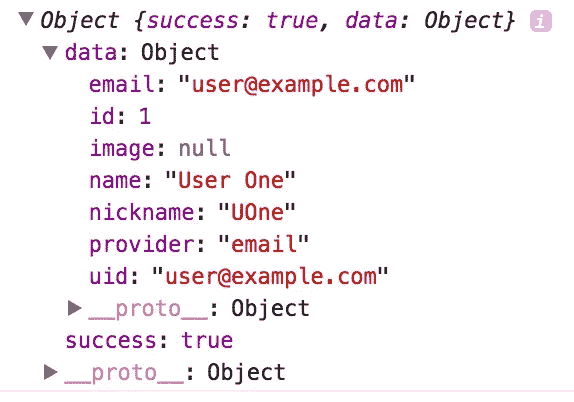
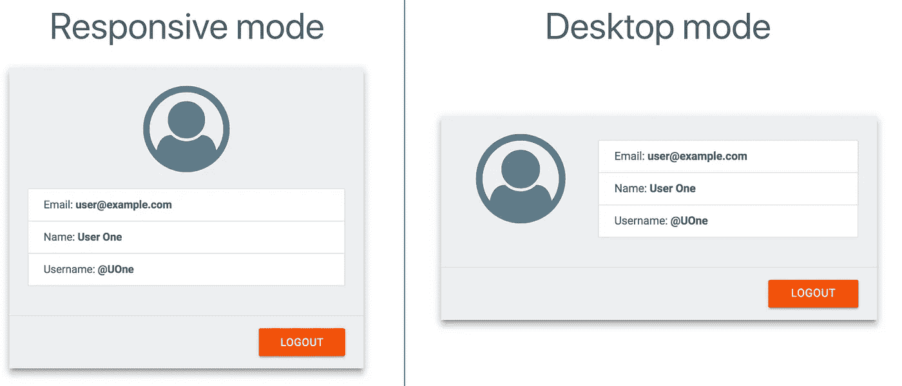
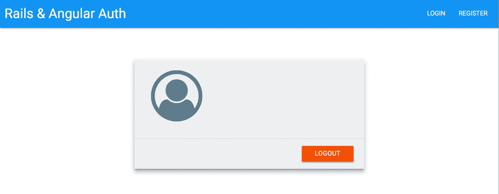
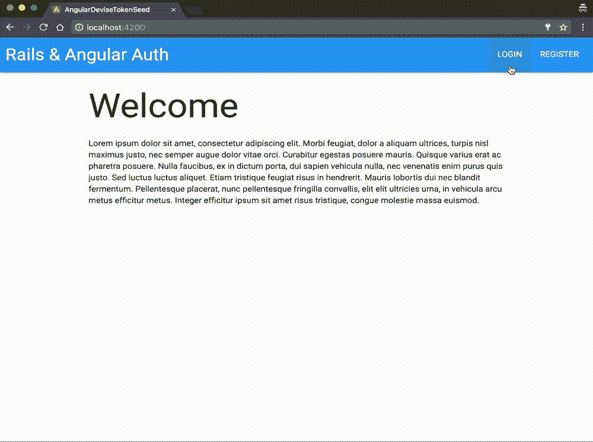

# Angular 2+和 Ruby on Rails 用户认证第 4 部分

> 原文：<https://medium.com/hackernoon/angular-2-and-ruby-on-rails-user-authentication-part-4-49d550c5869a>

## 本文是 [Angular 2+和 Ruby on Rails 用户认证第 1 部分:后端](/@avatsaev/angular-2-and-ruby-on-rails-user-authentication-fde230ddaed8#.tfr6zstyp)的后续文章


# 用户配置文件、授权服务和授权路由器保护

# 介绍

前提是在 **/profile** 路线上显示用户资料信息(姓名、昵称、电子邮件等)并对其进行保护，因此当有人试图未经认证就访问它，被重定向到**家**路线时，我们还将编写一个**认证服务**来将所有与认证相关的东西打包在一个地方。


# 授权服务

首先，我们需要创建一个**身份验证服务**，它将在一个地方包装所有与身份验证相关的状态和动作，特别是**登录/注销动作**和用户**身份验证状态**(用户已登录/注销)，并作为一个流(请注意 RxJS 正在传入)**异步提供所有这些。**

```
ng g s services/auth
```

> s =服务

这是我们的认证服务(**)。/src/app/services/auth . service . ts**):

乍看起来令人生畏，但相信我，这并不复杂，所以让我们来分解一下:

**第 9 行:** userSignedIn$是一个 [**RxJs Subject**](https://github.com/Reactive-Extensions/RxJS/blob/master/doc/gettingstarted/subjects.md) (布尔类型)，这意味着它同时是一个**观察者**和一个**可观察对象**，这意味着我们可以在我们的服务中控制它的值，并在服务之外观察它的变化。

我们的构造函数将通过使用 TokenService 的 **validateToken()** 方法初始化登录状态，该方法将根据 Rails 后端验证当前令牌(如果存在)，该操作是异步的，并在其主体中返回一个如下所示的对象:



所以我们可以使用 ***成功*** 键来确定用户是否使用有效的令牌登录(第 14 行)。

*名字末尾的美元符号($)是一个约定，用来说明这不是一个简单的变量，而是一个随时间变化的可观察的数据流。*

*   我们的 **logOutUser()** 方法不带参数并返回一个响应的**可观察值，我们将在 **Angular2TokenService** 上调用 **signOut()** ，但在返回其响应之前，我们将通过映射将 **userSignedIn$** 值更改为 **false** (第 19 行)，以便通知我们的观察者用户已成功注销，然后返回**
*   logInUser 方法获取一个带有电子邮件和密码密钥的对象，并使用它从 Angular2TokenService signIn()方法登录。同样，在返回响应之前，我们将修改 **userSignedIn$** 值为 **true，**这将通知观察者用户成功登录**。**
*   **registerUser** 方法类似于 loginUser，但是我们在输入对象中有一个额外的密码确认属性。

让我们不要忘记将它注入到我们的主 AppModule 的提供者中(**)。/src/app/app.module.ts** ):

```
...**import {AuthService} from "./services/auth.service";**@NgModule({
  declarations: [
    AppComponent,
    HomeComponent,
    ToolbarComponent,
    AuthDialogComponent,
    LoginFormComponent,
    RegisterFormComponent,
    ProfileComponent
  ],
  imports: [
    BrowserModule,
    FormsModule,
    HttpModule,
    AppRoutingModule,
    MaterializeModule,
  ],
  providers: [ Angular2TokenService, **AuthService**],
  bootstrap: [AppComponent]
})
export class AppModule { }
```

# 重构登录和工具栏组件以使用 AuthService

现在我们需要对我们的**登录**和**工具栏**组件做一些小的改动，以便直接使用 AuthService 而不是 Angular2TokenService。

## 重构工具栏

先说工具栏组件类(**)。/src/app/toolbar/toolbar . component . ts**):

正如你所看到的，我们去掉了 **Angular2TokenService** 并注入了我们的自定义 **AuthService** (第 16 行)，我们还创建了一个 **logOut()** 方法，该方法将在我们的 **AuthService** 上调用 **logOutUser** 动作，并使用 Angular 路由器，在注销动作完成时将用户重定向到 **home** (第 21 行)。

现在让我们改变工具栏的模板(**)。/src/app/toolbar/toolbar . component . html**):

现在我们使用我们的 AuthService 的 **userSignedIn$** Subject 来改变用户登录或注销时工具栏的状态，考虑到 **userSignedIn$** 不是一个简单的值，而是一个随时间变化的异步值流，我们需要使用 Angular 的异步管道来监听它的变化(第 11、12、14、15 行)。我们还将把**注销按钮**上的 click 事件链接到我们之前创建的 toobar 组件的 **logOut()** 方法(第 15 行)。

## 重构来自的登录

对登录表单的修改将会非常小，我们只需要修改 LoginFormComponent 类(**)。/src/app/log in-form/log in-form . component . ts**

我们唯一需要做的就是去掉 **Angular2TokenService** ，用我们的 **AuthService** 和它的 **logInUser** 方法来代替它。

> **不要忘记对 RegisterFormComponent 应用相同的更改**

就这样，重构结束了。

# 用户个人资料页面

## 分学科实现目标

第一步很明显，让我们生成显示当前用户信息的 **ProfileComponent** :

```
ng g c profile
```

组件应该自动导入到 AppModule 的声明中。

## 轮廓路线

在我们的路由器模块中(**)。/src/app/app-routing . module . ts**)，我们来声明一下概要路由:

导入配置文件组件:

```
import {ProfileComponent} from "./profile/profile.component";
```

宣布路线:

```
...const routes: Routes = [
  {
    path: '',
    component: HomeComponent,
    pathMatch: 'full'
  },
  {
    path: 'home',
    component: HomeComponent
  },
  **{
    path: 'profile',
    component: ProfileComponent
  }**
];
...
```

## 用户界面

至于个人资料页面的设计，这将非常简单，我们将在一个[物化卡](http://materializecss.com/cards.html)中显示用户的电子邮件、姓名和用户名，并使用其页脚添加一个注销按钮。

让我们将 Angular2TokenService 注入到我们的 ProfileComponent 中，并添加一个注销方法(**)。/app/profile/profile . component . ts**):

我们将使用 **Angular2TokenService** 来显示用户的个人信息，使用 **AuthService** 来实现注销操作，使用 **Router** 在注销完成后进行重定向，因此我们需要将这些注入到我们的 **ProfileComponent** 中(第 14–16 行)

Nn 第 18 行，我们有一个**注销**动作，当它完成时将用户重定向到 home。

> 为每个组件重新实现**注销**动作似乎是重复的，但这实际上是有用的，因为我们可以为每个组件实现不同的注销后行为，例如重定向到某个其他路由而不是家。

配置文件组件的模板，(**)。/src/app/profile/profile . component . html)**

Angular2TokenService 的 **currentUserData** 属性提供了用户登录时的信息(电子邮件、姓名、昵称等。)，当用户未登录时，其值为*未定义*。

第 15 行，我们使用了 ***ngIf** 结构指令来测试是否有数据要显示，如果没有，我们不会显示用户信息卡。

在第 31 行我们还有一个注销按钮，链接到我们的 **ProfileComponent** 类的**注销**方法。

一定要给**添加一个 cleafix 类。/src/app/profile/profile . component . sass**因为 Materialize 不实现它。

```
.clearfix
  overflow: auto
```

这是我们登录后导航到 **/profile** 路线时得到的结果:



User info card

# 授权路由保护

现在的问题是，即使我们没有登录，我们仍然可以导航到 **/profile** 路线:



Angular 的路线守卫可以帮助我们解决这个问题。

Route Guards 非常容易理解，这是一个简单的类，它实现了 **CanActivate** 接口，这个接口要求我们实现一个 **canActivate()** 方法**，**，该方法返回一个布尔值(*或一个布尔类型的可观察值，尽管我无法让它们正常工作*)，根据这个布尔值，路由器将允许或禁止路由的激活，逻辑由我们来实现，所以让我们这样做吧。

在(**中创建一个 AuthGuard 类。/src/app/guards/auth . guard . ts**):

如你所见，我们的 AuthGuard 类实现了 **CanActivate** 接口及其 **canActivate()** 方法，逻辑很简单，Angular2TokenService 的 userSignedIn()方法返回一个 single 布尔值，我们将使用它来确定用户是否登录，如果是，我们通过返回 true 来允许激活，否则，我们将重定向到 home 并通过返回 false 来禁止激活。

不要忘记在我们的 AppModule 的提供者中注入它:

```
...**import {AuthGuard} from "./guards/auth.guard";**

@NgModule({
  declarations: [
    AppComponent,
    HomeComponent,
    ToolbarComponent,
    AuthDialogComponent,
    LoginFormComponent,
    RegisterFormComponent,
    ProfileComponent
  ],
  imports: [
    BrowserModule,
    FormsModule,
    HttpModule,
    AppRoutingModule,
    MaterializeModule,
  ],
  providers: [ Angular2TokenService, AuthService, **AuthGuard**],
  bootstrap: [AppComponent]
})
export class AppModule { }
```

现在让我们保护我们的**/侧面**路线，打开**。/src/app/app-routing . module . ts**并设置 profile route 的守卫:

```
import { NgModule } from '@angular/core';
import { Routes, RouterModule } from '@angular/router';
import {HomeComponent} from "./home/home.component";
import {ProfileComponent} from "./profile/profile.component";
import {AuthGuard} from "./guards/auth.guard";

const routes: Routes = [
  {
    path: '',
    component: HomeComponent,
    pathMatch: 'full'
  },
  {
    path: 'home',
    component: HomeComponent
  },
  {
    path: 'profile',
    component: ProfileComponent,
    **canActivate: [AuthGuard]**
  }
];

@NgModule({
  imports: [RouterModule.forRoot(routes)],
  exports: [RouterModule],
  providers: []
})

export class AppRoutingModule { }
```

**canActivate** 键接受一组守卫，如果你在一条路线上有几个守卫，为了激活这条路线，他们都必须返回 **true** 。

现在，当我们在没有登录的情况下进入 **/profile** 时，我们将被重定向到 home，任何以/profile 作为路由的路由器链接，在点击时都不会产生任何效果。

就这样，一个个人资料页面，被一个路线守卫保护着。



> 你可以在 GitHub 上获得这部分的最终代码:[**https://GitHub . com/avatsaev/angular-token-auth-seed/tree/profile**](https://github.com/avatsaev/angular-token-auth-seed/tree/profile)

如果您对本教程有任何意见，请告诉我，如果有什么不清楚的地方，我很乐意帮助并纠正:)

> 感谢你阅读这个系列，在 Twitter 上关注我([https://twitter.com/avatsaev](https://twitter.com/avatsaev))了解更多关于 Angular 2+和 Rails 的有趣内容。

[](http://bit.ly/HackernoonFB)[](https://goo.gl/k7XYbx)[](https://goo.gl/4ofytp)

> [黑客中午](http://bit.ly/Hackernoon)是黑客如何开始他们的下午。我们是 [@AMI](http://bit.ly/atAMIatAMI) 家庭的一员。我们现在[接受投稿](http://bit.ly/hackernoonsubmission)，并乐意[讨论广告&赞助](mailto:partners@amipublications.com)机会。
> 
> 如果你喜欢这个故事，我们推荐你阅读我们的[最新科技故事](http://bit.ly/hackernoonlatestt)和[趋势科技故事](https://hackernoon.com/trending)。直到下一次，不要把世界的现实想当然！

