# Angular 4 入门

> 原文：<https://medium.com/hackernoon/angular-4-bare-intro-900baf811f33>

拖延了一年，我终于决定学习新的改良版 Angular——被称为 Angular 2——哎呀，它已经是 **Angular 4 了。**现在你知道我已经懒到开始使用这个基于组件的新版本 angularjs 有多久了。

如果你是那些对 Angular JS 感到舒服的人之一，并且有学习 Angular 2(现在是 Angular 4)的计划，那么你来对地方了。让我们开始吧，让棱角分明的火车动起来。这并不像人们到处提到的那样是一个巨大的飞跃。毕竟，我觉得最新的风格比我们通常在 Angular 1.x 应用程序中使用的方式更有条理。

由于本文假设您是一名前端开发人员，并且精通**节点**和 **npm** ，所以我不会详细讨论如何获得 npm 和其他幼稚的细节。

好了，现在你的机器上已经有了 npm 继续安装 Angular 4 的命令行界面，它的名字是 **@angular/cli**

```
npm install -g @angular/cli
```

这将安装 cli [工具](https://hackernoon.com/tagged/tool)来开始使用 Angular 4，它附带了一组广泛的指令来创建和组织您的项目。让我们开始创建一个项目。

## 创建新的 Angular 4 项目

随着 angular cli 的安装，您将能够访问名为 **ng 的新命令。**要创建一个新项目，使用 ***new*** 子命令，后跟您的项目名称。

```
ng new myapp
```

为了让你有怀旧的感觉，这个命令会生成你的项目文件，就像你在 Angular 1.x 中使用过的视图文件、css 文件和其他 javascript 文件一样——但是它们中的大多数都可以通过扩展名**看到。ts** ，这意味着它们是在 typescript 而不是 javascript 中。

**不要惊慌—** Typescript 就像 javascript 一样，但有点像超级集合。这意味着您的所有 javascript 语法在 typescript 中都可以很好地工作，而且它可以做得更多。然而，为了让我们的浏览器理解，它需要被转换成 JavaScript——这被称为***trans pilling***，完成这一转换的工具是 ***transpiler。***

因为我们才刚刚开始，所以忽略它——我们可以稍后再了解它。目前，您的 js 语法工作正常。

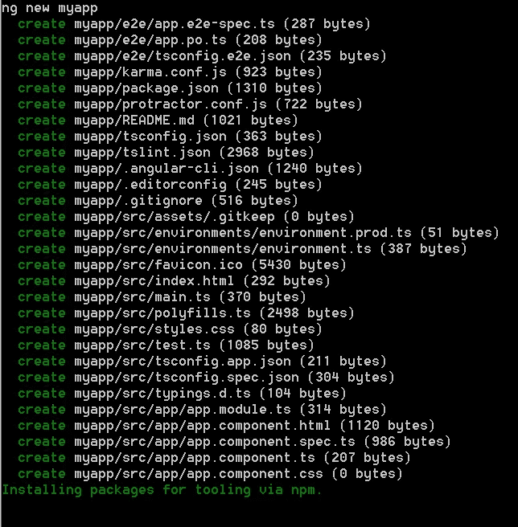

Bootstrapping angular project using ‘ng new’

这需要一些时间，因为它会尝试安装所有的依赖项。喝杯咖啡，很快回来..

**！！如果命令行没有响应**，请按下“Ctrl+C”来帮自己一个忙。如果你没有终止它，它自己又回来了，那么你就没事了。ng 已经安装了这个项目所需的所有依赖项。但是，如果您已经终止并退出了等待循环，那么您需要执行额外的步骤，即手动安装依赖项。不要诅咒我——我只是想让你的生活轻松些！

现在，使用以下命令安装依赖项

`npm install`

现在，它开始安装基于 package.json 文件中提到的依赖项。由于我们已经使用 **ng** 命令行界面引导(创建)了应用程序，它通过将所有最佳实践放在适当的位置代表我们做了大量工作。

作为一名前端开发人员，你可能已经有了一个 IDE/文本编辑器的选择，但我更喜欢 **Sublime Text** ，他们有一个非常酷的更新和稳定的生产版本 3。如果你是开放的，那么我建议把它作为 javascript 开发的首选编辑器。

使用 **File** 菜单项中的 *open folder* 选项或者使用 **Project** 菜单项中的 *Add folder to project* 来添加之前创建的项目所在的目录，两者都会将项目目录添加到 Sublime Text 的侧边栏中。

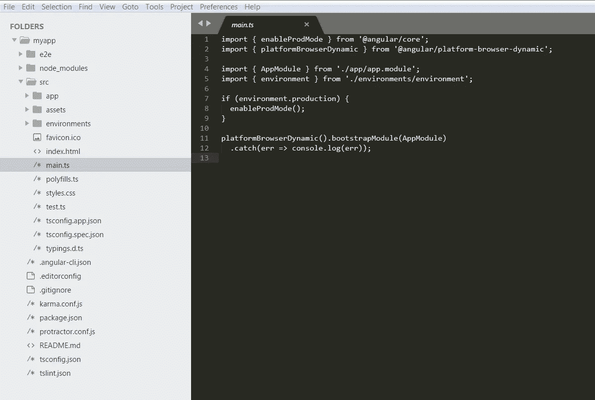

Screenshot to demonstrate the project structure

现在，如我们所见，main.ts 文件被选中，文件内容看起来很简单，没有任何语法突出显示。这对于我们 UI 开发人员来说很难理解，他们的创造性思维依赖于视觉吸引力和图片记忆。因此，让我们得到所需的插件。

由于上面的文件是 typescript 文件，我们需要安装 Typescript 插件。为此，在 Mac 上使用 Command+Shift+P 组合键，在 Windows 上使用 Ctrl+Shift+P 组合键，得到任务命令框—输入“*安装包*”，当“包控制:安装包”项聚焦在过滤项中时，按回车键选择选项。这将弹出一个框来选择插件，键入`Typescript`来过滤可用的插件，并再次使用 enter/return 来选择。你可以在左下角的状态栏上看到状态。如果需要，重新启动编辑器。

一旦插件安装完毕，使用组合键 Commnd(Ctrl)+Shift+P 来打开命令栏并键入 Typescript，选择选项`Set Syntax: TypeScript`,它的语法高亮显示开始生效，并使你的文件看起来更有趣。

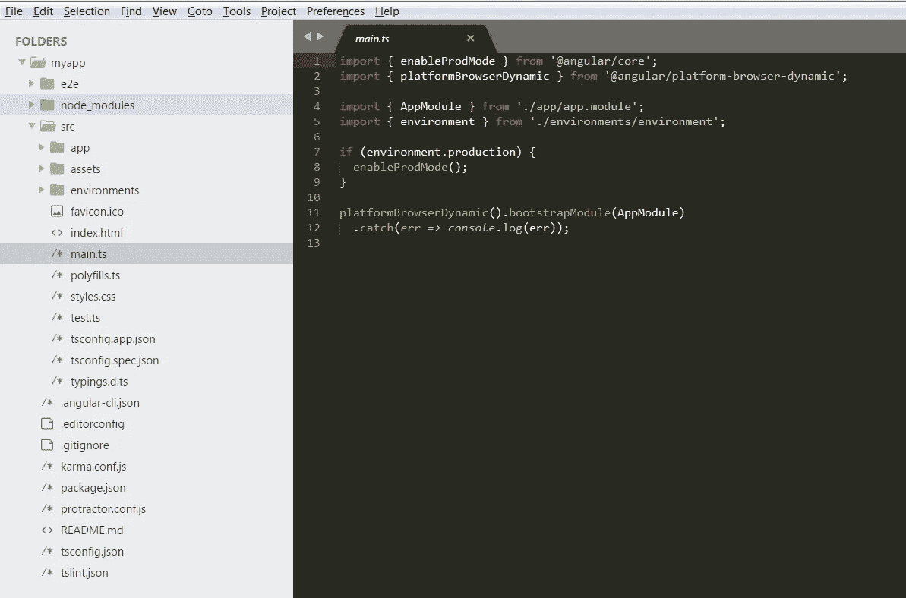

Screenshot: TypeScript Syntax Highlighting

## 运行您的项目

不要担心文件是什么和它们的内容。让我们运行项目，看看`ng new`是否正常工作。

为了运行 Angular4 项目，angular cli 给出了一个子命令`serve`，它在`[http://localhost:4200](http://localhost:4200.)` [上运行我们的项目。给它一个`open`会让它在浏览器中自动打开(当你不知道它运行在哪个端口时，这很有用)。所以命令是](http://localhost:4200.)

`ng serve --open`

Tada！你的全新`myapp`正在浏览器中呈现。耶！你已经在 Angular4 中创建了一个项目，并在几分钟内运行它。这是一个巨大的飞跃，你已经拖延了 6 个多月才学会这个。

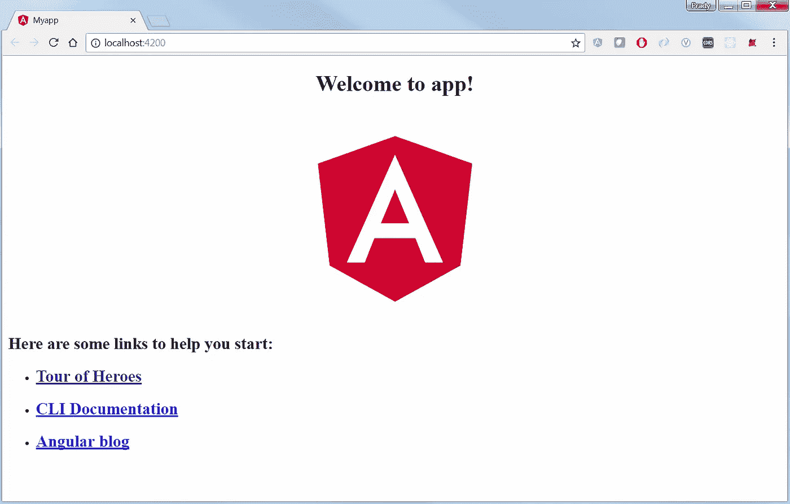

First look of the application.

现在这看起来不错，让我们进入细节，了解这里发生了什么。

## 文件夹结构

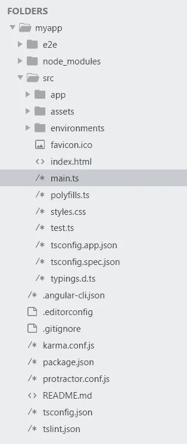

Folder structure as seen in Sublime Text editor

在我们开始深入挖掘之前，让我们先看看`README.md`。从`README.md`开始熟悉平台总是好的。

```
# **Myapp**This project was generated with [Angular CLI]([https://github.com/angular/angular-cli](https://github.com/angular/angular-cli)) version 1.4.5.## **Development server**Run `ng serve` for a dev server. Navigate to `[http://localhost:4200/`](http://localhost:4200/`). The app will automatically reload if you change any of the source files.## **Code scaffolding**Run `ng generate component component-name` to generate a new component. You can also use `ng generate directive|pipe|service|class|guard|interface|enum|module`.## **Build**Run `ng build` to build the project. The build artifacts will be stored in the `dist/` directory. Use the `-prod` flag for a production build.## **Running unit tests**Run `ng test` to execute the unit tests via [Karma]([https://karma-runner.github.io](https://karma-runner.github.io)).## **Running end-to-end tests**Run `ng e2e` to execute the end-to-end tests via [Protractor]([http://www.protractortest.org/](http://www.protractortest.org/)).## **Further help**To get more help on the Angular CLI use `ng help` or go check out the [Angular CLI README]([https://github.com/angular/angular-cli/blob/master/README.md](https://github.com/angular/angular-cli/blob/master/README.md)).
```

> D 以上文件内容，如果没有耐心看一遍的话，我会整理出来。

1.  自述文件的主要内容是在`4200`端口提供应用程序。
2.  要生成一个组件，你不必每次都谷歌复制和粘贴的东西，但有一个很酷的生成器从命令行界面。

```
ng generate directive|pipe|service|class|guard|interface|enum|module
```

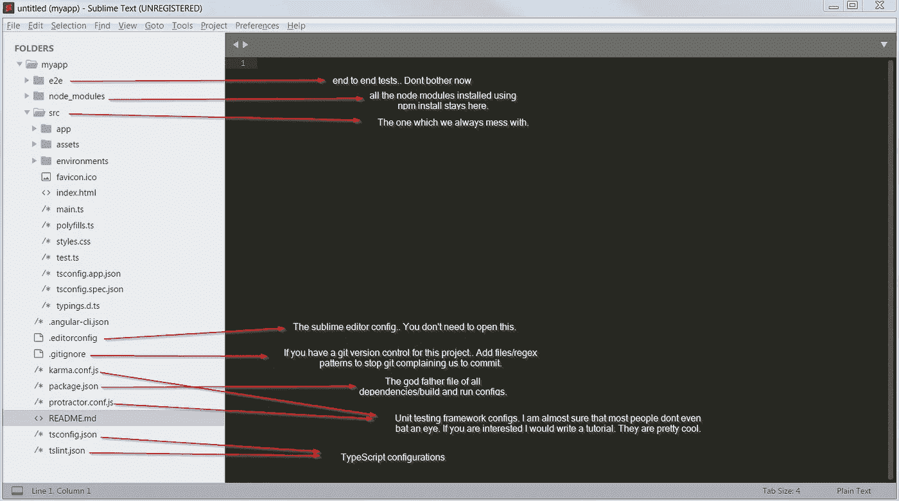

Folder descriptions in a simple language.

# 这一切都从 index.html 开始

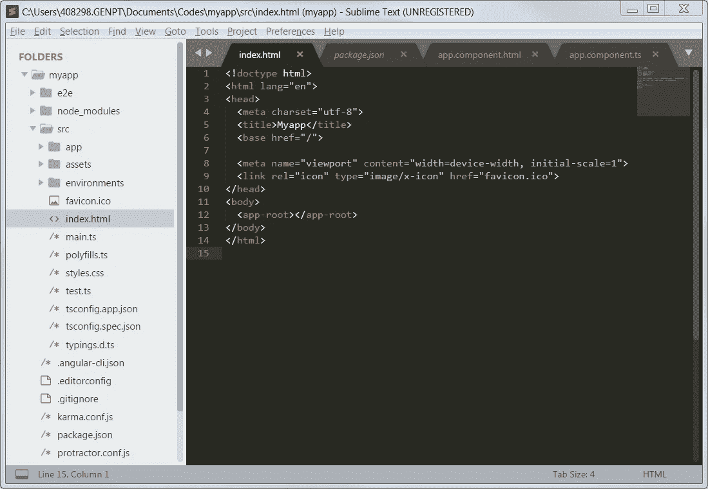

index.html

总是从 index.html 启动前端应用程序。这是几十年来开发人员遵循的方式(我只是虚构一些东西:P)。

让我们观察一下 index.html。

唯一奇怪的标签是 **app-root** ，并且没有脚本标签来支持这个额外的标签。现在让我们看看在 localhost:4200 上生成的 html

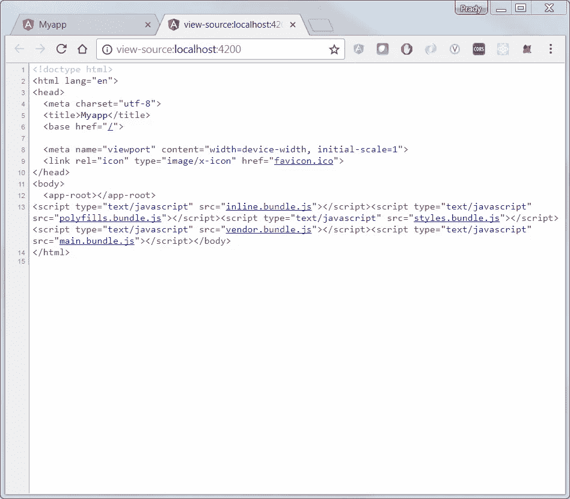

localhost:4200 source

这就是 html 的不同之处，所有的脚本标签都是在构建之后生成的。

main.bundle.js 拥有支持 app-root 标签的所有 Angular 组件代码。

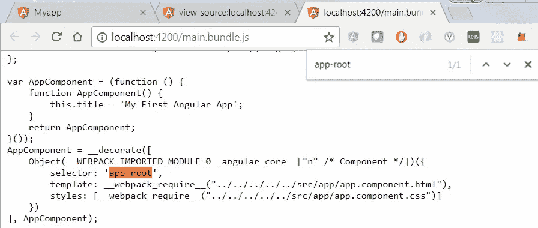

main.bundle.js

# 应用流程

**main.ts** 是你 app 的主入口。

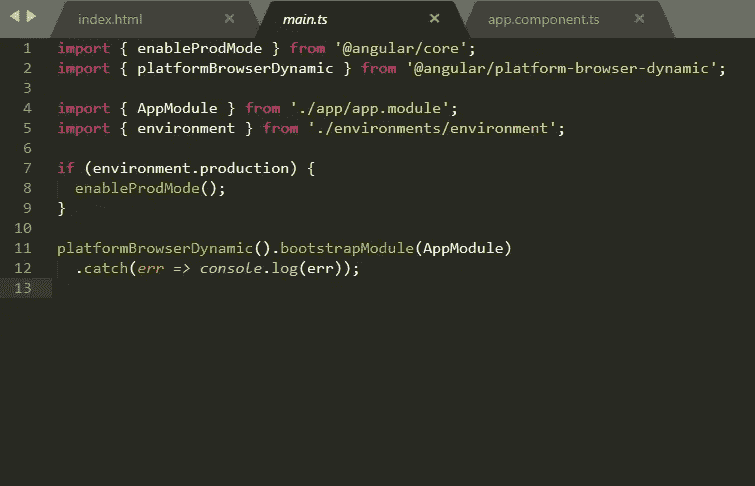

main.ts

在第 11 行，我们可以看到应用程序正在使用 AppModule 进行引导(初始化),它实际上是从第 4 行导出的。/应用程序/应用程序/模块

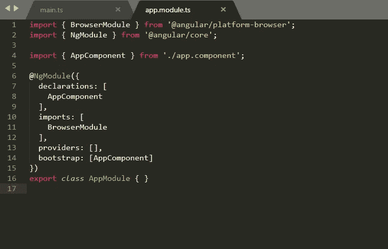

app.module.ts

> gModules 有助于将应用程序组织成内聚的功能块。—[https://angular.io/guide/ngmodule](https://angular.io/guide/ngmodule)

用 laydev(开发人员的外行)的话来说，应用程序被划分和细分为独立的功能模块。这将在许多方面提高质量和可重用性。

在第 14 行，我们可以看到 AppComponent 用于启动这个模块，它是在第 4 行从 app.component 获得的。

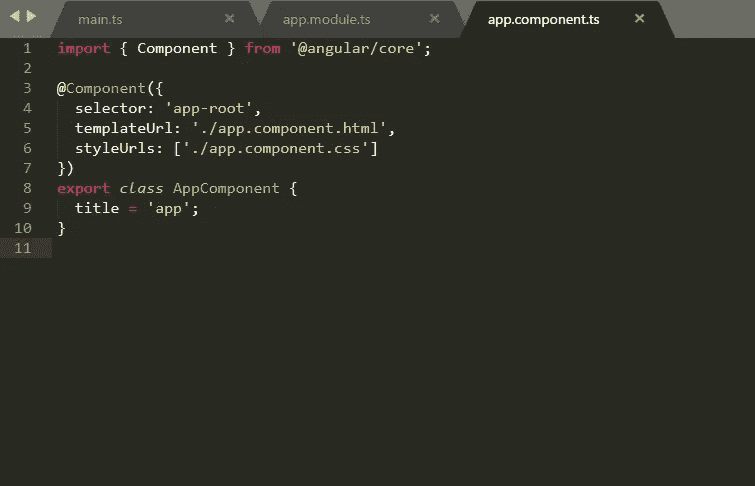

app.component.ts

最后我们看到了一些我们可以联系到的东西。

*   **app.component.html**正在查看
*   **app.component.css** 是造型文件。
*   **标题**是在 html 文件中使用的范围变量。

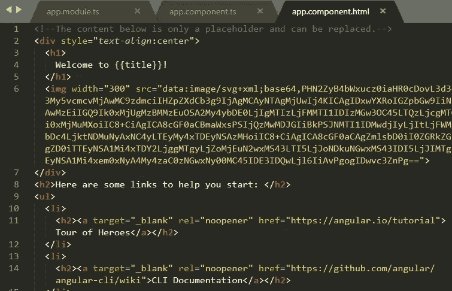

app.component.html

# 更新默认消息

让我们把标题改成“MyApp”(写你想看的东西)。

```
// app.component.ts
title = "MyApp";
```

给标题 h1 标签添加一些颜色。

```
// app.component.css
h1 {
 color : red;
}
```

# 二轮放映

或者我应该说这是第一个教程的最终运行？

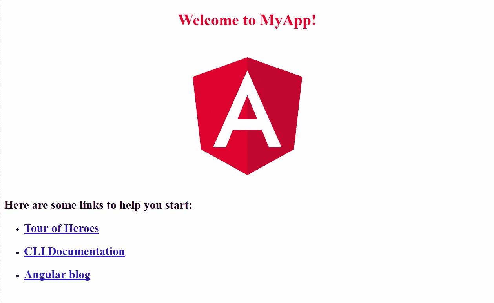

Final output

如果你做到了这一点，你就成功了！！祝您愉快！

***【Prady |***[***@ pradyumna _ d***](https://twitter.com/pradyumna_d)***|****文件加密货币税使用**[***bear tax***](https://bear.tax)***！”****