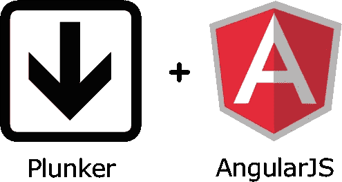

# 角度 4(通过示例)

> 原文：<https://medium.com/hackernoon/angular-4-by-examples-1dc9eb98be2>



credit: [http://mean.ghost.io/sandbox-eval-plunker-and-angularjs/](http://mean.ghost.io/sandbox-eval-plunker-and-angularjs/)

[](https://embed.plnkr.co/p9vMvlzEwUOOlcP2FsUG/) [## 角 4 由例子-扑通

### 创建于 Plnkr:帮助开发者建立网络。

embed.plnkr.co](https://embed.plnkr.co/p9vMvlzEwUOOlcP2FsUG/) 

学习编程的最佳方式是看代码运行:

我保留了以下笔记以备将来参考:

Angular CLI 帮助开发人员调试、测试和部署 Angular 应用程序。

术语如下:

`angular-cli` -指角度 2

`@angular/cli` -指角度 4

安装`npm install -g @angular/cli`

使用的底层语言是`typescript`，使用`babel`将其翻译成 [javascript](https://hackernoon.com/tagged/javascript) 。

Angular CLI 使用的任务管理器(像`gulp`、`grunt`)是`webpack`。

旧的应用程序是以页面为中心的，现代的应用程序是基于组件的。

# 4 根角柱 4

1.  组件—封装模板(html)、数据(变量)，但不封装数据源和视图的行为(函数)。
2.  指令—弥合后端和前端之间的差距。用于 DOM 操作。
3.  路由器—负责组件之间的导航。
4.  服务——主要用于操作 DOM 元素的可重用标签

# 添加组件

创建一个`mycomp.component.ts`文件

```
import {Component} from '[@angular/core](http://twitter.com/angular/core)'[@Component](http://twitter.com/Component)({
selector:'my-component',
template:'welcome to my custom component'
})export class MyComponent{

}
```

并在`@NgModule`的`declarations`参数中添加对`app.module.ts`的组件引用

```
import { MyComponent } from './mycomp.component';[@NgModule](http://twitter.com/NgModule)({
  declarations: [
    AppComponent, MyComponent
  ],
  imports: [
    BrowserModule
  ],
  providers: [],
  bootstrap: [AppComponent]
})
```

# 向组件添加模板文件

创建一个文件`footer.component.html`并替换组件`templateUrl:'./footer.component.html'`的`@Component`中的`template`键。

# 单向绑定

向组件类添加属性:

```
export class FooterComponent {title = "welcome to footer component"courses = ['Angular', 'React', 'jQuery']}
```

像这样把它们绑起来:

```
<li *ngFor="let course of courses">

</li>
```

# 添加服务

添加一个文件`course.service.ts`

```
import { Injectable } from '[@angular/core](http://twitter.com/angular/core)'[@Injectable](http://twitter.com/Injectable)()export class CourseService {getCourses() {
        return ['Angular', 'React', 'jQuery'];
    }
}
```

在`app.module.ts`的`@NgModule`中添加引用

`providers: [CourseService]`

通过组件的构造函数将其注入到组件中:

```
constructor(cs: CourseService) {
        this.courses = cs.getCourses();
    }
```

# 从 CLI 创建组件

发出命令`ng g c newComponent`。

支持 5 种类型的绑定

1.  属性绑定`[]`——将 ts 组件属性与 html 模板属性绑定
2.  事件绑定`()` -将 html 模板事件绑定到 ts 组件
3.  双向数据绑定`[()]` -组件到模板的数据绑定，反之亦然
4.  类绑定—例如:[class.active]。用于添加/删除 CSS 类
5.  样式绑定—用于设置 CSS 样式规则

# 属性绑定

将属性添加到类`profilePic = "http://lorempixel.com/400/200"`

使用组件``中的属性

# 向 Angular 应用程序添加引导程序

在撰写本文时，Bootstrap 最稳定的版本是 3.3。因此，前往[http://getbootstrap.com/docs/3.3/getting-started/#download](http://getbootstrap.com/docs/3.3/getting-started/#download)和引导 CDN 下的 et CDN 链接，如下所示:

`<link rel="stylesheet" href="https://maxcdn.bootstrapcdn.com/bootstrap/3.3.7/css/bootstrap.min.css" integrity="sha384-BVYiiSIFeK1dGmJRAkycuHAHRg32OmUcww7on3RYdg4Va+PmSTsz/K68vbdEjh4u" crossorigin="anonymous">`

把这个加到`index.html`

# 使用事件绑定

添加一个这样的按钮:

`<button class="btn btn-danger" (click)="clickHandler($event)">click me</button>`

及其在组件中对应的事件处理程序:

```
clickHandler($event) {
        console.log($event);
}
```

# 使用双向数据绑定

`<input type="text" [(ngModel)]="currentCity" />`

这类似于

`<input type="text" [value]="currentCity" (input)="currentCity=$event.target.value" />`

# 类绑定

如果组件中有一个 isActive 属性，则此

`<button class="btn btn-danger" [class.active]="isActive" >automatic active - click me</button>`

等于

`<button class="btn btn-danger active" >manually active - click me</button>`

# 样式绑定

我们可以使用样式属性来设置元素的样式属性

`<button class="btn btn-danger" [style.backgroundColor]="isActive?'green':'red'" >click me</button>`

# 输入

在子组件中设置输入属性

```
[@Component](http://twitter.com/Component)({
    selector: 'header-component',
    template: 'welcome to header component ',
    inputs: ['dataFromParentComponent']
})export class HeaderComponent {

    dataFromParentComponent = ""; //or [@Input](http://twitter.com/Input) dataFromParentComponent = "";}
```

请注意，`dataFromParentComponent`没有赋值。

在父组件中，使用其自己的属性设置此输入的值:

```
[@Component](http://twitter.com/Component)({
    selector: 'my-component',
    template: `<header-component [dataFromParentComponent]="myComponentData" ></header-component>`
})export class MyComponent {myComponentData = "Parent data"}
```

*最初发布于*[*xameeramir . github . io*](http://xameeramir.github.io/Angular-4-by-examples/)*。*