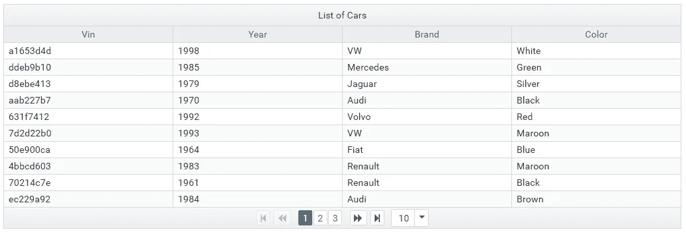
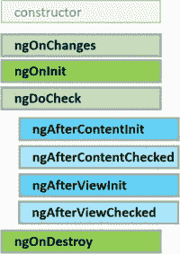

# 角度应用程序性能修复—故事#1

> 原文：<https://medium.com/hackernoon/angular-application-performance-fixes-story-1-9bfa353d0fc4>

你知道，从事编程工作意味着——偶尔——你会遇到一个 Bug——我称之为 ***幻影 Bug*** 。解决这样的错误实际上是编程故障排除的乐趣之一——剔除所有误报并锁定真正的罪魁祸首的有趣旅程。

The mirage… by [Michael](https://flic.kr/p/556Uvk)

今天我有幸遇到并解决了一个这样的海市蜃楼 bug..所以我想我也会和你一起分享这段旅程。

今天，我的一个团队成员联系我，说他们的应用程序——使用[预处理数据表](https://www.primefaces.org/primeng/#/datatable)在 IE11 *上速度慢得不合理,“一旦数据表呈现*！

Demo of PrimeNg Datatable Angular Component..

他向我展示了他的分析，其中引用了大量 github 问题，声称 PrimeNg Datatable 存在性能问题(即使行数和列数较少)。这是一个 IE11 角度性能问题的季节，这个特殊的分析让我担心。我已经爱上了 PrimeNg 图书馆和它的简单。这大大打击了我对图书馆信念！

在一次屏幕分享会上，开发者向我展示了他的 IE 窗口令人难以置信的困境..在呈现一个简单的数据表的负荷下，简直是晕头转向..而且……我相信这个错误确实存在于数据表中，不知何故 PrimeNg 一个非常好的库——不知何故在设计他们的数据表时做了一个超级劣质的工作——它甚至不能加载 20 行 x 6 列的表而不阻塞浏览器！！

当他演示这个问题时，我忽略了我应该注意的其他迹象。例如，在点击为数据表带来数据的按钮之前，他必须选择几个下拉菜单..当他试图打开下拉菜单从中选择一个项目时，应用程序似乎有点迟钝。如果我质疑这种行为——我可能会节省 3-4 个小时的时间..但是我想我最后不会像现在这样兴奋！

因此..因为我在 IE 上找不到数据表这种行为的任何问题/原因..我请求我的开发者允许我在我的小角落里做我自己的调试。在花了 2-3 个小时阅读了各种 github 问题描述以准备数据表并分析了数据表性能问题之后..所有的问题似乎都在 4.1.0 版中解决了，而我们已经在 4.1.2 版中了，这就是困扰我的地方。

最后我拿出了我武器库中的最后一个工具——***分而治之*** 。我知道如果这个不行，那就没什么可以了！我开始清除数据表的所有特性，复选框列，内嵌编辑，选择..怀疑其中一个导致 IE 绊倒！但是不管我在做什么，IE 都在口吃，我的机器的 CPU 使用率也在飙升。甚至在我没有碰 IE 的时候！ ***哒哒！几分钟后，我突然意识到..如果我找错了人，找错了地方怎么办？如果是 IE 的高 CPU 使用率(由于其他原因)导致的呢*是影响 IE 中数据表渲染的*罪魁祸首吗？***

现在我开始检查触发 IE 高 CPU 使用率的确切事件，我很害怕看到 IE 在主页渲染中的高 CPU 使用率——几乎没有 2 个按钮以及一堆静态文本和图像(除了页眉和页脚)。忘记 PrimeNg 数据表吧，我现在真的开始怀疑 Angular 本身在 IE11 上的表现了！！

同样，我继续我的*分而治之*策略，最终将问题隔离在我整个应用程序中最差劲的组件——页脚组件——一个只有 4-5 个链接的组件！如果我注释掉这个组件..世界又变成了一个快乐的地方！

上帝，世界上正在发生什么！我们究竟能在无害的页脚组件中写些什么呢？！我开始焦急地查看页脚的模板和组件代码..它就在那里…耐心地坐着等我，发现他在嘲笑我。

The Angular Lifecycle hooks!

`ngAfterViewChecked`如果组件属性改变，角度渲染引擎会自动调用。这个特定的实现通过`setTimeout()`改变了一个组件属性，从而触发了对`ngAfterViewChecked`的另一个调用..这又引起了另一个对`ngAfterViewChecked`的呼叫，如此等等..无限循环！

我只是简单地调整了实现，使其在没有`ngAfterViewChecked`的情况下也能工作，然后，我们就开始工作了！世界又变成了一个快乐的地方！角度应用程序在 IE 中运行良好，没有任何故障！PrimeNG Datatable 是一个高质量的组件，对于像我们这样的简单用例来说没有呈现问题！是我们自己的 6 行代码让我们的生活变得痛苦不堪！

我在解决这个问题的过程中得到了乐趣，我希望你也一样！

我会回来为 Angular App 带来更多这样的性能提升/修复的故事..继续读。订阅我的频道，了解我的新故事！

哦，尽你所能地打*来鼓励我多写点！*