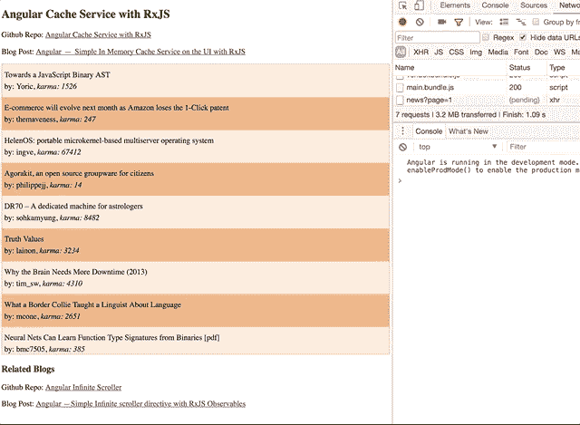

# Angular —使用 RxJS 的简单内存缓存服务

> 原文：<https://medium.com/hackernoon/angular-simple-in-memory-cache-service-on-the-ui-with-rxjs-77f167387e39>

这篇文章是关于一种实验性的方法，我相信有其他方法可以解决类似的问题。如果有，请评论这篇文章。

演示:[https://ashwin-sureshkumar . github . io/angular-cache-service-blog/](https://ashwin-sureshkumar.github.io/angular-cache-service-blog/)*注:打开开发者控制台查看日志消息*

github Repo:[https://github . com/ashwin-sureshkumar/angular-cache-service-blog](https://github.com/ashwin-sureshkumar/angular-cache-service-blog)

Stackblitz 编辑器:[https://stack blitz . com/edit/angular-simple-cache-service-with-rxjs](https://stackblitz.com/edit/angular-simple-cache-service-with-rxjs)

## 我们上下文中的缓存是什么？

缓存是一种简单的数据存储，用于存储数据，以便下次需要相同信息时可以更快地访问数据，从而提高性能和用户体验。这里，数据可以是从应用程序的不同部分导出/计算的值或复制的数据/请求。

## 对我们的缓存服务有什么要求？

1.  可注入的缓存服务
2.  能够为每个项目设置到期时间。
3.  基于可观察的服务
4.  能够跟踪进行中的请求，因此不会出现重复的请求。

## 我们实现了什么来使用这个缓存服务？

我们将从 Hackernews API 构建一个简单的故事列表，以显示其主页上的热门故事，并实现无限滚动以加载更多数据。

为了让事情变得有趣，我想显示每篇文章作者的*因果报应*，但是因果报应不会在 stories API 调用中返回。必须通过单独的 API 调用为每个用户获取它。因此，当我们加载列表时，我们将选择作者并进行 API 调用来填充用户的 karma。因此，如果列表中重复出现同一个用户，我们将在没有任何缓存服务的情况下进行多次调用。

*注意:这是一个虚构的场景，用来演示缓存服务的使用。*

我们将看到缓存服务代码、实现的演示，然后将代码分成几个部分进行演示。

***在上面的 gif 中，我正在记录 API 调用(紫色)，通知正在进行的观察(蓝色)以及何时从缓存接收到数据(绿色)。***

演示:[https://ashwin-sureshkumar . github . io/angular-cache-service-blog/](https://ashwin-sureshkumar.github.io/angular-cache-service-blog/)*注:打开开发控制台记录消息*

## 打破它！

我们为服务初始化了三个属性，

1.  用给定的键保存缓存数据的映射
2.  为我们的飞行中的可观测物保存一个主题的地图
3.  缓存数据的默认最长期限。

让我们来看看`get`的方法

方法做的事情很少，

*   如果请求的键存在于缓存中，则返回缓存的数据
*   如果存在正在进行的请求，则返回该键的主题
*   如果提供了回退，那么设置正在运行的主题并返回带有副作用(`do`)方法链的回调，该方法链调用 set 方法。
*   最后抛出一个错误

`set`方法非常简单，在缓存中设置给定的数据，并用数据通知所有订户。

`notifyInFlightObservers`检查密钥是否存在于正在运行的 Observables 中，以及该密钥是否有订户。

## 如何使用缓存服务？

这非常简单，我用`id`(缓存的键)和`fallback`调用`cacheService.get`作为 API 调用，就这样。

这是 UI 层缓存服务的一个简单实现。希望这能带来一些想法和其他实现思路。

如果你喜欢这篇文章，请分享，评论和推荐。

## 相关文章

angular-带有 RxJS 观察值的简单无限滚动条指令:[*https://code burst . io/angular-2-Simple-Infinite-scroller-directive-with-RxJS-Observables-a 989 b 12d 4 FB 1*](https://codeburst.io/angular-2-simple-infinite-scroller-directive-with-rxjs-observables-a989b12d4fb1)

使用 RxJS Observables 的反应式编程中的 Naive 无限滚动[*https://hacker noon . com/naive-Infinite-scroll-in-Reactive-Programming-using-RxJS-Observables-4a 605d 3146 E8*](https://hackernoon.com/naive-infinite-scroll-in-reactive-programming-using-rxjs-observables-4a605d3146e8)