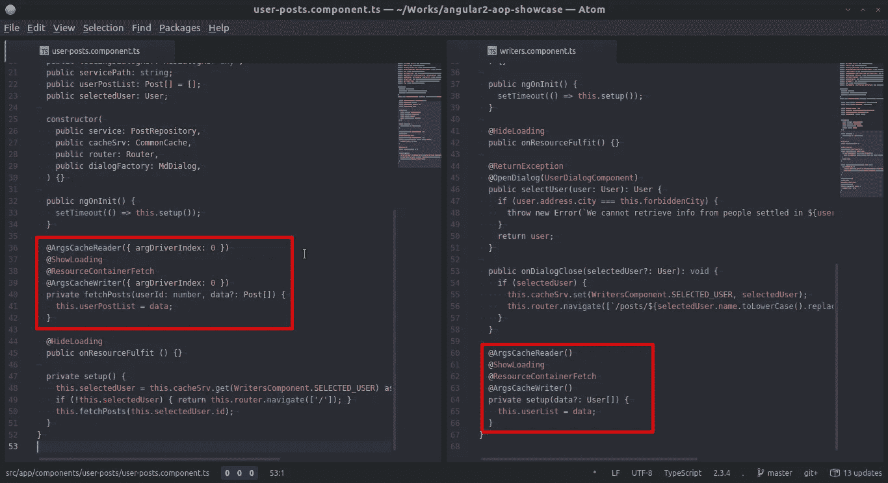

# Angular 教程:使用 ES7 装饰器分离关注点

> 原文：<https://medium.com/hackernoon/angular-tutorial-separation-of-concerns-using-es7-decorators-ed6c9756265>

本[教程](https://hackernoon.com/tagged/tutorial)旨在创建一个简单的 [Angular](https://hackernoon.com/tagged/angular) 应用程序，该应用程序驱动一个“OOP 范例中的常见问题”,即现实世界中常见的代码重复和隐藏模式，这些问题可以使用控制反转技术来解决，并允许我们执行*声明式编程*。

## 资源(这篇文章是关于什么的):

*   [https://github.com/k1r0s/angular2-srp-showcase/tree/master](https://github.com/k1r0s/angular2-srp-showcase/tree/master)
*   [https://github . com/k1r0s/angular 2-SRP-showcase/tree/normal-OOP](https://github.com/k1r0s/angular2-srp-showcase/tree/normal-oop)

# 该应用程序

*   该应用程序应该在其主页中加载一个用户列表。
*   如果一个列表元素被点击，将会出现一个对话框
*   这个对话框应该有一个关于所选用户的简介和两个按钮
*   一个按钮应该可以关闭对话框
*   其他按钮应加载用户特定的“帖子页”
*   点击来自“南猫王”的用户将会触发一个随机异常
*   应缓存异常，应显示错误对话框[2]
*   帖子页面应呈现所选用户的特定**帖子**

[1]用户对话格式/内容不属于本教程的范围

[2]错误对话框格式/内容不属于教程的范围

规则

*   每次我们执行一个 ajax 请求时，我们必须显示一个加载对话框
*   出于缓存目的，所有 ajax 请求都应该被存储

技术细节

用户(作家)资源放在这里:[https://jsonplaceholder.typicode.com/**用户**](https://jsonplaceholder.typicode.com/users)

帖子资源放在这里:[https://jsonplaceholder.typicode.com/**帖子**](https://jsonplaceholder.typicode.com/posts)

# 我们开始吧

你可以按照这些指示，一步一步来。

**准备好你的工作空间**

*   `$ git clone https://github.com/k1r0s/angular2-srp-showcase.git`
*   `$ git checkout normal-oop`
*   `$ npm install`

**运行代码**

*   `$ npm start`
*   浏览本地主机:4200

**读取代码**

好的，让我们从打开`src/app/components/writers/writers.component.ts`开始。该部分具有以下职责:

*   调用服务来获取用户
*   呈现用户列表
*   监听用户列表上的点击
*   调用一个服务来存储用户请求结果和要加载到“帖子屏幕”上的选定用户
*   调用服务以构建一个对话框来呈现所选用户
*   如果所选用户来自“南猫王”，则处理异常

现在我们来看看`src/app/components/user-posts/user-posts.component.ts`。这个人有以下责任:

*   从缓存中抓取选定的用户
*   调用服务来获取用户的特定帖子
*   呈现帖子列表
*   调用服务来存储特定用户帖子请求结果

## 常见的 OOP 驱动重复:

我们来看看[https://github . com/k1r0s/angular 2-SRP-showcase/blob/normal-OOP/src/app/components/writers/writers . component . ts # L41](https://github.com/k1r0s/angular2-aop-showcase/blob/normal-oop/src/app/components/writers/writers.component.ts#L41)的代码

大多数情况下，应该描述业务操作的方法体与根本没有描述该操作的代码纠缠在一起。比如打开一个对话框，捕捉异常，订阅关闭事件等等。

在 OOP 中，我们试图通过声明实体(类)来分离关注点，这些实体(类)将描述**什么业务想要发生以及在哪里发生(域说话)**的动作(方法)分组。方法描述事情应该如何完成。

OOP 范例中的一个常见问题是，为了复制一个行为，代码也必须被复制。有时类扩展是不够的，因为你的行为并不总是发生在同一个地方，或者你根本没有足够的时间来改变整个应用程序架构。例如，必须在一些方法调用结束时调用日志服务，打印方法的参数和结果，但就域问题而言，实现并不重要**，这意味着代码正在污染你的应用**。你能用类扩展处理日志调用吗？没有。

12 个开发人员用不同的实现编写相同行为的项目怎么样？那是隐藏的图案。例如，当一个开发人员习惯于添加一个与以前的功能相似或相同的功能时，他们中的大多数人会在代码基础上寻找以前的实现，以查看“如何处理相同的问题”,或者简单地将代码粘贴到他们的功能中，改变与特定屏幕或功能的上下文相关的一些变量，而一些开发人员会实现他们自己的代码来解决相同的问题。我们不关心哪个实现是最好的。同一个问题的不同实现会产生 bug，代码更难维护，等等。解决这个问题的一个简单方法是所有开发者都必须同意的接口定义。但是重复仍然在蔓延。

身份验证、Ajax 解析、UX 动作调用、异常处理……几乎任何与业务逻辑无关的东西都可能在几个地方被调用，而这些实现可能会污染您的领域逻辑。

# 例子

让我们回到作者组件

在*设置*时`writers.component.ts`到底在做什么？

[阅读代码我们可以得出结论:](https://github.com/k1r0s/angular2-aop-showcase/blob/normal-oop/src/app/components/writers/writers.component.ts#L78)

*   如果资源已经完成(如果列表已分配)，则从缓存中读取，并跳过下面的所有步骤
*   如果缓存为空:我们必须显示一个加载对话框[2]并获取用户资源
*   然后，我们应该通过调用服务将资源存储在缓存中
*   然后我们应该隐藏加载对话框
*   然后我们应该指定组件要呈现的列表

随着代码的执行，会出现许多问题。就域而言，这只是简单的**获取和呈现用户列表**。有几个域规则适用于此，**捕捉资源，在请求资源时显示加载对话框** …

这种行为也会在`user-posts.component.ts`上复制。但是在这种情况下，之前有一个域问题:*从缓存中获取选择的用户*。

有一种方法可以将我们从组件特定领域中抽象出来并编码实现吗？是啊！

我们已经定义了一些`writers.component.ts`和`user-posts.component.ts`共享的接口:`LoadingDialog, ResourceContainer<T>, LoadingDialog, CacheContainer`。我们也保证没有隐藏的模式。

*   这两个组件在创建时都必须获取一些资源
*   两个组件都必须随时显示加载对话框
*   两者都必须从缓存中写/读一些东西

因此，我们可以在两个组件上实现这一点:

请注意，相同的行为需要在不同的位置和不同的上下文/参数中调用。

[writers.component.ts(代码)](https://github.com/k1r0s/angular2-aop-showcase/blob/master/src/app/components/writers/writers.component.ts)

[user-post . component . ts(代码)](https://github.com/k1r0s/angular2-aop-showcase/blob/master/src/app/components/user-posts/user-posts.component.ts)

而且这个管用，相信我[(跑分例子)](https://angular2-kaop.firebaseapp.com)。

*提示>* `argsDriverIndex` *param 为* `@ArgsCacheReader` *其只是一个规范，其中方法* ***参数*** *索引将作为* ***序列化键*** *从缓存中读取/写入。这意味着* `user-posts.component.ts` *将先访问缓存中的* `fetchPosts` *自变量。因此，它不会两次调用同一个资源。*

重要的是要知道这些装饰器可以被导入到任何地方，并且是完全独立的(这取决于你)。这意味着你可以在不弄乱调用栈**的情况下移除其中一些，而在普通的 OOP 实现中你会面临副作用**。

# 结论

方法和类装饰器是防止重复的强大工具，它还提供了现代应用程序所需的抽象层。我们已经通过使用声明性编程从组件中清除了基础设施代码，声明性编程的目标是:

*“通过描述****程序在*** [***问题域***](https://en.wikipedia.org/wiki/Problem_domain) *方面必须完成什么来消除副作用，而不是描述**如何作为编程语言* [*原语*](https://en.wikipedia.org/wiki/Language_primitive) *的序列来完成它”。*

我们的代码一清二楚，易于维护。

我们必须明白**我们已经与两个组件**建立了紧密的联系，这两个组件在不久的将来会变得非常不同。因此，如果我们的抽象由于某种原因被否决了，我们必须从不再匹配模式(接口)的组件中移除这个装饰器，粘贴它的实现并编码差异。

# 奖金

## 为什么是装修工？

装饰器是现代库中的面包和黄油，比如 Angular、 [Vue (addon)](https://github.com/vuejs/vue-class-component) ，同样在后端，例如 [Nest framework](https://github.com/nestjs/nest) 提供了许多内置的装饰器来增强你的开发体验，提高可读性，分离关注点..等等。

Decorators 很好，因为它为您提供了一种语言特性，允许您添加/删除/管理丰富的实现，而不会弄乱语言原语。

也许在不久的将来，decorators 将被用作“独立插件”，可以下载并插入到你的代码中，提供特性([例子](https://www.npmjs.com/package/decorator-log))。

例如，angular 的`@Component` decorator 是一种将您的类作为 web 组件注册到 Angular 样板文件中的好方法。那么，为什么你不为自己的需要定义一些呢？

## 如何在 Typescript/Babel 中@？

*Babel 不支持接口处理* ***隐藏模式*** *，但是* [*它支持方法和类装饰器*](http://babeljs.io/docs/plugins/transform-decorators/) *。*

目前**如果你需要写一个需要在某些类的特定构造函数之前被调用的函数**你需要处理 [ES7 decorators API](https://github.com/wycats/javascript-decorators) 这在 [TS 文档](https://www.typescriptlang.org/docs/handbook/decorators.html)中有很好的解释。

我创建了一个[库](https://github.com/k1r0s/kaop-ts/),使得定义你自己的方法/类装饰器变得非常容易。它将允许你非侵入性地改变、扩展、修改方法和构造函数的行为。当然，本教程示例是使用该库制作的。

试试吧！