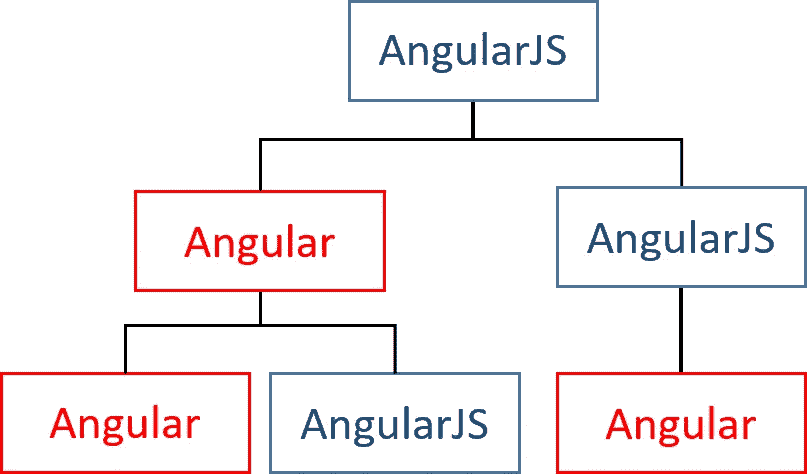

# Angular v4:混合升级应用

> 原文：<https://medium.com/hackernoon/angular-v4-hybrid-upgrade-application-73d5afba1e01>

***本*条** ***原本出现在*** [***条***](https://dormoshe.io/articles/es8-was-released-and-here-are-its-main-new-features-15) ***条上。io***

Angular 版本 4 已经推出，现在我们可以享受它的好处了。正如[探索 Angular 4 的 8 大资源](https://hackernoon.com/top-8-resources-to-explore-angular-4-ff2c1b42020a)中所解释的，版本的优势是巨大的。它包含性能改进、更好的错误消息、更小的模块、全新的特性以及对 v1-v4 混合应用程序的许多改进。版本 4 带来了升级和降级过程中的变化，以支持混合应用程序的 AOT 编译。

在本文中，我们将介绍一种将应用程序从 AngularJS 升级到 Angular v4 的新方法。为了适应新的方式，我们将构建一个包装器来简化我们的编码。

成功升级的关键之一是增量升级，在同一个应用程序中并排运行两个框架，并将 AngularJS 组件一个接一个地移植到 Angular。这使得在不中断其他业务的情况下升级甚至大型和复杂的应用程序成为可能，因为这项工作可以协作完成并在一段时间内完成。Angular 中的升级模块旨在实现无缝的增量升级。

# 老方法—升级适配器

直到 2.2.0 版本，为了构建混合 app，我们使用了升级适配器。升级适配器需要用主 app @NgModule 进行实例化。所有升级和降级过程都是通过适配器完成的。有时过于复杂，导致循环依赖，而 forwardRef 函数解决了这一问题。

Upgrade adapter instantiation — the old way

自举看起来是这样的:

Bootstrapping the application using the upgrade adapter

# 新方法——升级模块和静态函数

版本 **2.2.0** 为我们带来了用于引导应用程序的模块，并允许 AngularJS 和 Angular v4 组件在混合升级应用程序中一起使用，支持 **AOT** 编译。此模块名为 UpgradeModule，需要通过@NgModule.imports 数组导入。

因此，我们需要通过 npm 安装@angular/upgrade 包，并在 system.config 文件中为@angular/upgrade/static 包添加一个映射:

A configuration of system.js for the static folder of the upgrade npm

升级模块是一个非常有用的工具，除了最小的应用程序。有了它，我们可以在同一个应用程序中混合和匹配 AngularJS 和 Angular components，并让它们无缝互操作。这意味着我们不必一次完成所有的升级工作，因为在产品化期间，两个框架会自然共存。

App module file — import the UpgradeModule and use ngDoBootstrap lifecycle hook

我们需要添加一个覆盖来防止 Angular 以 **ngDoBootstrap** 空类方法的形式引导自己。

自举看起来是这样的:

Bootstrapping the application using the UpgradeModule

# 杂交助手

为了对构建模块(服务、提供者、工厂、指令、组件)进行升级和降级，angular 为我们带来了静态函数和一个要扩展的基类。静态函数和基类是@angular/upgrade/static 的一部分。

Building blocks tree — mix, mix and mix

因为混合过程的变化，我决定构建名为 HybridHelper 的 helper。助手是角度升级和降级 API 的包装器。这有助于我们把我们的应用从角混合过程的变化中分离出来。此外，它给我们带来了可读性，并作为我们的目的黑盒使用。

HybridHelper interface

# 降级组件

当你有一个 v4 组件并且你想在 v1 模板中使用它(通过另一个组件、指令或路由)时，你应该降级这个组件。

这是我们的文档组件。您可以看到有 4 个输入和 3 个输出。

v4 component with inputs and outputs

以及组件在 NgModule 中的注册:

v4 module with entryComponent metadata

由于这个组件是从 v1 模块中使用的，并且是我们的 Angular 应用程序的入口点，我们还需要将它添加到我们的 Angular 模块的`entryComponents`中。

降级操作使用`downgradeComponent`功能。

`downgradeComponent(moduleName: string, componentSelector: string, componentClass: any, options?: IComponentUpgradeOptions): IHybridHelper`

*   `moduleName` —v1 模块名称
*   `componentSelector` —v1 分量选择器
*   `componentClass` —组件类类型
*   `options` —输入和输出的可选字段。
*   `options.inputs` —指定组件接受哪些输入的字符串数组
*   `options.outputs` —指定组件接受什么输出的字符串数组

component downgrading using the helper

您可以看到，我们必须提供有关被降级的组件的信息。这是因为一旦 AOT 编译器已经运行，所有关于组件的元数据已经从代码中删除，因此不能被推断。

# 降低注射剂的质量

当你有一个 v4 可注入(像一个服务)并且你想通过依赖注入机制(通过另一个组件、服务或提供者)在 v1 中使用它时，你应该降级服务。

这是我们的文件服务。服务或 NgModule 中没有变化。

v4 service

以及组件在 NgModule 中的注册:

v4 module for registering a service

降级操作使用`downgradeProvider`功能。

`downgradeProvider(moduleName: string, providerName: string, providerClass: any): IHybridHelper`

*   `moduleName` — v1 模块名称
*   `providerName` —v1 供应商名称
*   `providerClass` —提供商类别类型

downgrading v4 service

这么简单……:)

# 升级提供商

当您有一个 v1 服务/工厂/提供者，并且您想通过依赖注入机制(在另一个提供者或组件中)在 v4 中使用它时，您应该升级服务。

以下是我们的文档转换器服务:

v1 service for upgrading

与降级过程不同，升级提供程序需要使用工厂方法构建提供程序对象。HybridHelper 对此进行了包装，以简化这些步骤。

所以升级操作使用 NgModule 文件中的`buildProviderForUpgrade`函数。

`buildProviderForUpgrade(ng1Name: string, ng2Name?: string): FactoryProvider`

*   `ng1Name` — v1 提供者名称
*   `ng2Name`—v4 提供者名称的可选参数(默认:`ng1Name`值)

v4 module with registration of upgraded v1 service

# 升级组件

当你有一个 ng1 组件，并且想在 ng4 模板中使用它(通过另一个组件、指令或路由)时，你应该升级这个组件。

以下是我们的 stars v1 指令文档:

v1 directive for upgrading

我们可以使用`UpgradeComponent`类*将*这个组件升级到 v4。通过创建一个新的 v4 **指令**来扩展`UpgradeComponent`并在它的构造函数中进行`super`调用，我们有了一个完全升级的 v1 组件来在 Angular 中使用。

我们可以将这个组件升级到 v4，在升级指令中注释输入和输出，然后使用 v4 模板语法提供输入和输出。

upgrading v1 directive via v4 directive by class inheritance

升级后的组件是 v4 **指令**，而不是**组件**，因为 Angular 不知道 AngularJS 会在其下创建元素。就 Angular 所知，升级后的组件只是一个指令——一个标签——v4 不必关心它的子组件。

剩下的工作就是将它添加到 AppModule 的声明数组中:

v4 module with registering of upgraded v1 directive

# HybridHelper —代码

下面是包装器的代码

HybridHelper full code

如您所见，降级函数返回 HybridHelper 实例以支持链接。下面是一个混合降级文件的示例，演示了链接功能的使用:

File contains some downgrading components and services with chaining

# 结论

版本 4 包含了很多针对混合应用程序的改进和可行的更改。这个版本支持静态方式，并且向后兼容升级适配器。旧方式的文档已经从 angular.io 中移除，所以你可以猜测他们更喜欢我们什么。

示例的源代码可以在我的 [GitHub 库](https://github.com/dormd/angularjs-to-angular4)中找到。

***您可以关注我关于***[***dormo she . io***](https://www.dormoshe.io)***或***[***Twitter***](https://twitter.com/DorMoshe)***阅读更多关于 Angular、JavaScript 和 web 开发的内容。***