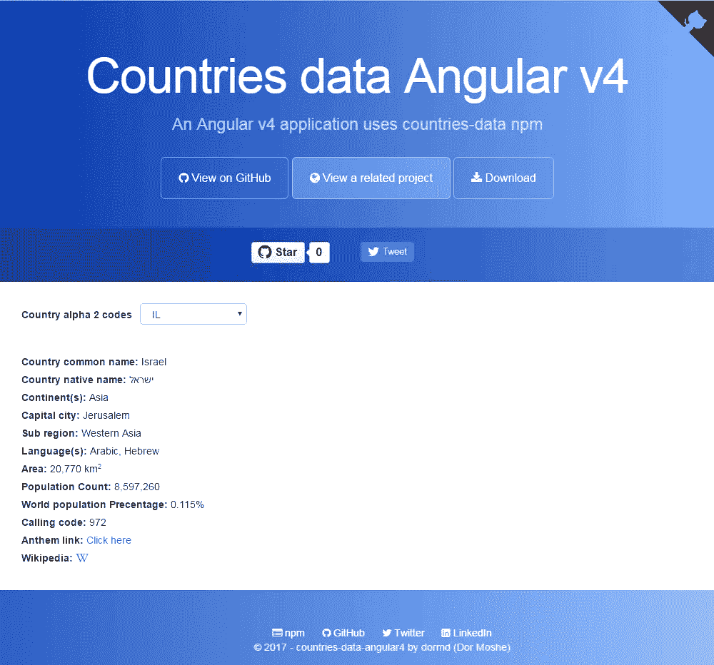

# 角度 v4:实际国家应用

> 原文：<https://medium.com/hackernoon/angular-v4-practical-countries-application-f866b567ead1>

***本*条** ***原本出现在***[***dormoshe . io***](https://dormoshe.io/articles/angular-v4-practical-countries-application-3)

countries-data 项目提供了关于国家概况、语言和国歌的 JSON 数据。该项目托管在 GitHub 存储库中，并在 npm 中发布。存储在 typescript 文件中并准备在项目中使用的数据。

在本文中，我们将回顾国家数据结构，查看示例并展示如何通过 Angular v4 应用程序使用它。此外，我们将学习如何使用 InjectionToken。

可以玩[演示应用](https://dormd.github.io/countries-data-angular4/)。

# 装置

`npm install countries-data`

# ISO 3166–1 alpha-2 代码

国家数据基于[**ISO 3166-1 alpha-2**](https://en.m.wikipedia.org/wiki/ISO_3166-1_alpha-2)(本文中的 a2)国家代码。a2 代码是 ISO 3166-1 定义的两个字母的国家代码，是国际标准化组织(ISO)发布的 ISO 3166 标准的一部分，用于表示国家、附属领土和特殊地理区域。它们是 ISO 发布的使用最广泛的国家/地区代码，在互联网国家/地区代码顶级域名中使用最为广泛。

# 国家数据结构

每个国家的数据包含许多细节，如国家的名称(普通，官方，本土)，居民，首都，其他代码，语言，国家的名称翻译，地理数据(经度，纬度，大陆，地区，面积，边界国家)，拨号信息，人口，维基百科链接等..

Part of Israel’s object

你可以在 GitHub 的 readme 文件中看到[的完整数据结构](https://github.com/dormd/countries-data/blob/master/README.md#data-structure)和一个[国家的例子](https://github.com/dormd/countries-data#example-israel)。在现实生活中，如此大量的数据通常保存在数据库中，但对于我们的迷你应用程序，我们可以尽情发挥。

# 语言数据结构

每个语言数据包含完整的语言名称、说话者(如果母语说话者存在于 [responsivevoice.js](https://responsivevoice.org) 服务中)、备选说话者和说话者性别限制。这将在以后的文章中讨论。

Some languages objects

你可以在 GitHub 知识库自述文件中看到[的完整数据结构](https://github.com/dormd/countries-data/blob/master/README.md#data-structure-1)和一个[国家示例](https://github.com/dormd/countries-data/blob/master/README.md#example-hebrew)。

# 花药数据结构

每个 anthem 数据包含一个在线音频 anthem 文件和文件来源的链接(如 [Wikimedia](https://www.wikimedia.org/) )。

Israel’s anthem object

你可以在 GitHub repository 自述文件中看到[完整的数据结构](https://github.com/dormd/countries-data/blob/master/README.md#data-structure-2)和[国家示例](https://github.com/dormd/countries-data/blob/master/README.md#example-israel-1)。

# 代码示例:角度 4 应用程序

为了展示国家数据 npm 的用法，我使用 Angular v4 构建了一个应用程序。这个应用程序由 Angular-CLI 初始化，使用 bootstrap 和 font-awesome。

## 令牌创建

安装 npm 后，我们想要访问国家的数据，这可以通过 v4 [InjectionToken](https://blog.thoughtram.io/angular/2016/05/23/opaque-tokens-in-angular-2.html#injectiontoken-since-angular-4x) 来完成。InjectionToken 是 Angular v2 OpaqueToken 的改进版本([v4](https://hackernoon.com/top-8-resources-to-explore-angular-4-ff2c1b42020a)的变化之一)。它允许我们创建基于字符串的令牌，而不会在依赖注入机制中遇到任何冲突。创建 InjectionToken 很容易。

我们使用三个注入令牌，分别用于国家、语言和国歌。创建令牌后，我们可以使用`useValue`选项创建提供者。

Data tokens and tokens providers

## 数据访问服务

创建提供者后，我们可以在服务的构造函数中注入带有`@Inject`注释的数据。这是我们的数据访问服务。他的角色是数据访问层。我们可以看到在他的构造函数中注入了标记。

The data access service

这些方法通过 a2 代码提供数据。在`getCountryObjByA2`中，我们可以看到如何通过 a2 检索特定国家的对象。很简单。获取对象后，我们可以访问他的属性，如维基链接，面积，人口，资本等。`getCountryNativeName`有点棘手，因为这个国家的本地名字对象的结构。例如，下面是以色列(IL)对象。

The name part of Israel country object

根据通用语言，一个国家可以有一个以上的本土名称。下一部分中的方法使用对象中的第一种语言(对于 IL 是 heb)。

## 组件类

所以我们有一个公开我们需要什么的服务。所以让我们用它来画我们的组件。它包含一个选择框，用于选择 a2 代码和所选国家的详细信息。

Part of the app component class

正如我们所看到的，数据访问服务被注入到组件中。`ngOnInit`生命周期钩子为选择框询问国家字母 2 代码。此外，它用默认国家 a2 (IL)调用`onA2Changed`方法。当用户选择另一个 a2 时，选择框用新的 a2 调用`onA2Changed`。然后 a2 被保存，国家的详细信息被服务获取。

## 组件 Html

该视图包含 a2 代码选择框。被选择的 a2 被`ngModel`指令绑定，当新的 a2 被选择时，`ngModelChange`输出调用处理程序。第二部分包含该国的细节。

Part of the app component html

正如我们所看到的，视图使用了`ngIf`指令作为可选属性。还有一个到国歌的链接和一个到该国网页的维基百科图标链接。

## AppModule

现在，只需在 AppModule 中注册服务、组件和令牌提供者，就可以将所有这些放在一起了。

The app module

# 参考

以下是一些有用的链接:

*   [演示应用](https://dormd.github.io/countries-data-angular4/)。
*   GitHub [资源库](https://github.com/dormd/countries-data-angular4)中的示例代码项目
*   国家数据 [GitHub 知识库](https://github.com/dormd/countries-data)
*   国家-数据[国家预防机制](https://www.npmjs.com/package/countries-data)
*   使用该 npm 的项目:[ng2-管道](https://github.com/dormd/ng2-pipe)&[ng2-国家](https://github.com/dormd/ng2-countries)

***您可以关注我的***[***dormo she . io***](https://www.dormoshe.io)***或***[***Twitter***](https://twitter.com/DorMoshe)***阅读更多关于 Angular、JavaScript 和 web 开发的内容。***