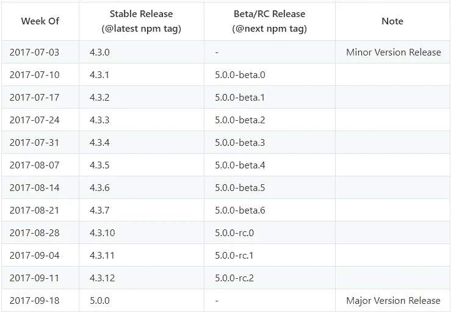
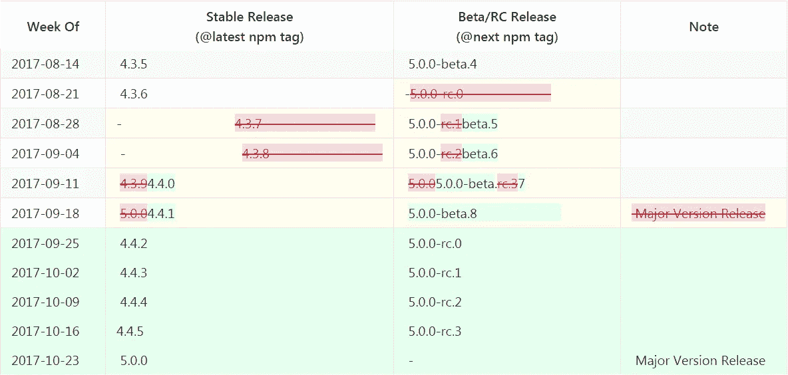
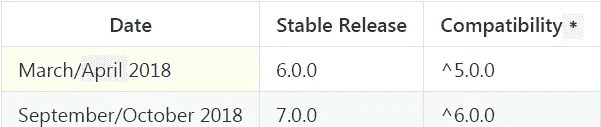

# Angular 版本 5 的发布被推迟

> 原文：<https://medium.com/hackernoon/angular-version-5-release-was-delayed-e7b5c26b0624>

## v5 的新发布时间表

Picture: sauvieislandacademy.org

***本文原载于***[***dormoshe . io***](https://dormoshe.io/articles/angular-version-5-release-was-delayed-21)

几个月前，Angular 团队根据语义版本介绍了 Angular 版本 5 的**暂定**计划。发布的截止日期是 18 年 9 月。

The old tentative release schedule of 4.3.x-5.0.0 versions

4.3.0 版本发布于 14 年 7 月，而不是 3 年 7 月。Angular 接下来的稳定版和 beta 版一个接一个的推迟发布。beta-6 版本发布于 9 月 3 日，而不是 8 月 21 日。这个版本的继任者是 beta-6 和 beta-7 **，而不是计划发布的候选版本**。最新的测试版在几天前(13 年 8 月)登陆，有一些突破性的变化和特性。

稳定发布线也被推迟。都是 4.3。取消了[7+]版本，发布了 4.4.1 版本。代替它们，Angular 增加了一些新的稳定版本(4 . 4 . 2–4 . 4 . 5 ),将在接下来的几周内发布。这些新版本将在常规延迟发布候选版本附近发布。

> 新的到期日是 10 月 23 日

The changes in the schedule of version 5

另一个冷消息是，版本 6 的发布将很可能延迟到 2018 年 4 月，而不是 3 月。

The change to the next major version

[Angular version 4](https://hackernoon.com/top-8-resources-to-explore-angular-4-ff2c1b42020a) 仅延迟一天发布，但现在我们有一个月的延迟(六个月方法的 16%)。绝对 **OK！我们需要高兴的是，Angular 团队可以随意改变时间表**。我们更希望得到一个稳定的、零 bug 的版本，我们可以依赖它，并确保一切都运行良好。即使这只是一个暂定的时间表，如果下次我们能得到一个早期的更新，那就太好了。

第 5 版集中在渐进式网络应用方法和更多其他新的品牌特性和能力。根据语义版本化策略，v4 的许多弃用的 API-s，如`OpaqueToken,` `NgProbToken`和模板标签将在 v5 中被移除/更改。在即将到来的版本发布之前，我们可以读到 v4 的次要版本以及 v5 的预期。

 [## Angular v5 有什么值得期待的？

### 当我们忙于学习和探索 Angular v4 时，Angular 的团队正在展望和规划第五版…

hackernoon.com](https://hackernoon.com/what-to-expect-for-in-angular-v5-6e0fc9c4b13e)  [## Angular 的状态和版本 5 的到期日

### 对 4 . x-5.0 版本状态的高级观察

hackernoon.com](https://hackernoon.com/the-state-of-angular-and-the-due-date-of-version-5-68374002267f) 

***你可以关注我上的*** [***中的***](/@dormoshe) ***或*** [***推特***](https://twitter.com/DorMoshe) ***了解更多关于 Angular 和 JavaScript 的内容。***