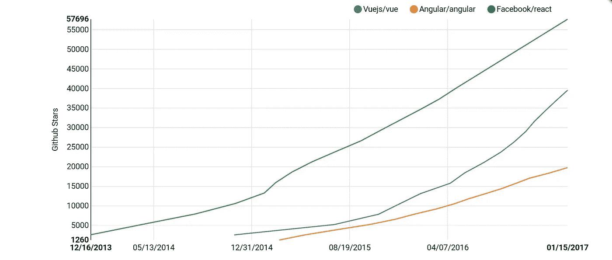

# 角度与反应——交易的破坏者

> 原文：<https://medium.com/hackernoon/angular-vs-react-the-deal-breaker-7d76c04496bc>

## 一个真实的，极端的框架比较

Angular 是一个完整的框架，在它的基础上设计了所有的工具和最佳实践。适合一个，讨厌另一个。另一方面，React 只是一个小的视图库，你可以在制作应用程序时使用。这可能是一件好事，也可能是一件坏事，这篇文章会帮助你最终做出正确的选择。

## 图书馆

以下是我将记住的主要库:

*   有角的
*   反应
*   某视频剪辑软件

# 学习曲线

我们假设你非常了解 JavaScript + ES2015。接下来学什么图书馆最容易？

1.  如果你想要一个简单易学的框架，Vue 可能是最好的选择。
2.  **React** 使用最少的抽象，然而它将花费更多的时间来学习最佳实践，因为有很多方法可以让你做同样的事情或者出错。
3.  **angular** 排在第三位，虽然在你学习 Angular 之后，你应该知道其他所有与它相关的东西(typescript，MVC…)，Angular 本身是一个巨大的库，需要更多的时间来学习。

# 可量测性

1.  得益于其设计和强大的 CLI，Angular 易于扩展。
2.  ***React*** 声称比 vue 更可测试，因此更可扩展，我认为这部分是对的。
3.  Vue 仅次于 react，这是一个不错的选择，但是它缺乏最佳扩展实践的列表，导致了大量杂乱无章的代码。

# 第三方库兼容性

1.  **反应**。尽管它不支持 DOM，但它是纯 JavaScript 逻辑，其受欢迎程度甚至连基于 DOM 的库在 React 中都有替代品。
2.  Vue 对于 DOM 和 JavaScript 都能完美地工作，并且仅次于它，因为它有较少的特定于框架的库，这对其他人来说可能是件好事。
3.  如果不是 Typescript 要求每个库都有类型定义，Angular 会做得更好。

# 工具作业

1.  **反应过来，棱角分明，vue** 。他们都有很好的 CLI，可以使用任何类似 webpack 的工具。

# 社区和受欢迎程度

1.毫无疑问 **React** 在 2016 年的英语前端和全栈社区中最受欢迎。它也正在成为原生 JavaScript 移动甚至桌面应用的一个好选择。

2. **Vue** 和 **Angular** 。Vue 是因为它发展如此之快，angular 是因为它是由谷歌和它的前身 angular 1 制作的，angular 1 在过去非常成功。

# 乔布斯

1.  **反应**和**角度**，取决于你在哪里，这些框架中的一个会稍微占优势。
2.  Vue 不太受欢迎，没有大公司支持，因此企业选择 angular 和 react。

# 表演

这个没有排名，因为他们都是可比的。当它完全支持纤程时，React 可能会快一点，但现在我们仍处于测试阶段，对此无能为力。

# 公司的观点

1.  **Angular** 拥有免费开源许可。它得到了谷歌的支持，这可能是一家公司的最佳选择，因为不同角度的实践之间的差异也较少。
2.  **反应**过去有一个专利条款，对一些企业来说是一个相当大的问题，但最近他们转向了麻省理工学院。
3.  **Vue** 不是一个大公司的孩子，它是一个由一个人开始的非常成功的副业项目，因此公司往往会忽略它，然而在我看来，它们不应该。

# 超越网络

这是有很多可谈的地方；原生渲染。所有的库都能够做到这一点，但是有些库比其他库表现得更好。

1.  **react** —有了 react native、react sketchapp 和 next.js，当它
2.  得益于阿里巴巴 weex，vue 是喜欢原生移动开发的 vue 开发者的最佳选择。
3.  **angular** 自带 ionic 2 和 nativescript，但这两个移动框架都无法让 angular 达到 react native 的性能。

# 简单性+代码长度

1.  **vue** 带有预建的数据绑定和 MVC 模型，与 react 和 angular 相比，它更容易设置。
2.  react 很容易理解，但实际上建立 react 项目需要很长时间。
3.  **棱角分明**一点都不简单。它的复杂性经常导致许多混乱和特定的第三方库和语法

# 程序调试时间

1.  Vue 当然很容易设置，不需要太多的修改和语法，这也是人们喜欢它的原因；它是为了解决疲劳而设计的。
2.  反应需要更长的时间来设置，但之后你可以开始制作一个应用程序，添加新功能应该相对容易。
3.  虽然 angular 非常有竞争力，但是它需要大量不必要的语法来完成简单的事情，这使得 Angular 排在了最后。

# 大小

1.  **vue** 最小，也包含很多。事实上，你可能认为这没关系，但对一部廉价的 android 3g 智能手机说这话，我不认为你会这么肯定。
2.  **react** 比 vue 大，但还是比 angular 小。这就是我要说的。
3.  angular 要大得多，导致手机的加载时间和性能问题更长。

# 未来/ 2017

以下是我对 2017 年所有这些框架的预测:

*   Vue 会越来越受欢迎，更多的开发者会转向它。它可能会影响一家不同的大公司来推广 vue 并鼓励公司使用它。还有一件事，原生平台应该在 2017 年初出现。
*   **反应**团队将引入纤维，使反应方式比 vue 和 angular 更快。
*   **Angular** 团队会试图鼓励更多人使用 Angular，在我看来他们会惨败。

# 那么什么最适合你呢？

总而言之，从来没有完美的解决方案，将来也不会有。然而，这里有一个有用的列表可以帮助你做出决定:

*   如果你是一个充满激情的开发者，尝试所有，但是在 vue 和 react 之间选择，让你的直觉做决定
*   如果你是一家初创企业，要么选择 react，要么选择 vue。
*   对于拥有大型团队的公司来说，Angular 是一个更好的选择
*   谷歌-> angular
*   如果你喜欢简单，就买 vue。
*   如果你喜欢使用模板，选择 vue 或 angular。
*   如果你更喜欢 JavaScript 和 JSX，尝试一切。
*   《如果你》💙打字稿，用 angular 或者 maybe，maybe vue。

总而言之，尽快选择你的框架，不要犹豫不决。我吃了几个月，不好玩。我决定牺牲受欢迎的程度，去追求我的想法告诉我的最好的，目前 vue。

[**funfunfunfunction**](https://m.youtube.com/channel/UCO1cgjhGzsSYb1rsB4bFe4Q)**(YouTuber)**说了我听过最好听的关于 **JS 框架疲劳**:

> “在你的编程生涯中，有一个时刻，你意识到没有最好的工具”

说到这里，我想鼓励你们继续学习和探索；每件事都会教会你一些东西，这里没有对错之分，只管去做吧。

> [黑客中午](http://bit.ly/Hackernoon)是黑客如何开始他们的下午。我们是阿妹家庭的一员。我们现在[接受投稿](http://bit.ly/hackernoonsubmission)并乐意[讨论广告&赞助](mailto:partners@amipublications.com)的机会。
> 
> 如果你喜欢这个故事，我们推荐你阅读我们的[最新科技故事](http://bit.ly/hackernoonlatestt)和[趋势科技故事](https://hackernoon.com/trending)。直到下一次，不要把世界的现实想当然！

