# Angular2 -HackerNews 克隆 Firebase 设置，可实时观察

> 原文：<https://medium.com/hackernoon/angular2-hackernews-clone-firebase-setup-with-observables-realtime-247121f955e0>


这是用 Angular 2，Angular Material 和 Firebase 构建 HackerNews 克隆系列的第三篇文章。在这篇文章中，我们将设置 firebase，我们将拉进并显示热门故事，来自黑客新闻的新故事。

以前的帖子:

1.  [使用 Angular CLI 设置 Angular2 和 Angular Material。](/@Sureshkumar_Ash/setting-up-an-angular-2-application-with-angular-cli-and-angular-material-f131d42fa5e4#.zf4wr4m47)
2.  [组件和路由器—初始设置](/@Sureshkumar_Ash/angular-2-components-and-router-angular-material-dbfea4f1415e#.7pfgrs0gc)

下一篇文章:

[动态组件、路由参数和重构](/@Sureshkumar_Ash/angular-2-hackernews-clone-dynamic-components-routing-params-and-refactor-340773d82e6f#.apyjoyjbi)

在这里用 [Firebase](http://console.firebase.google.com) 创建一个帐户，并创建一个新项目，我们现在只需要这个项目的 API 密钥。创建项目后，点击`Add firebase to web app`从项目中获取 API 密钥。

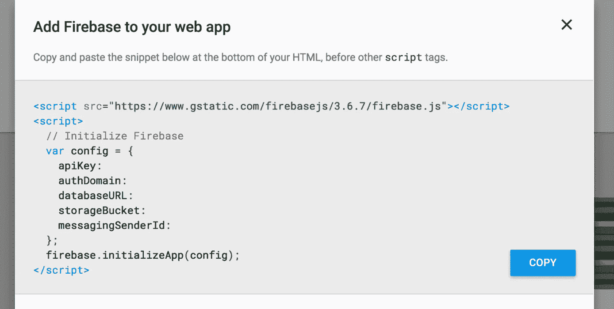

我们将使用[angular fire 2](https://github.com/angular/angularfire2)——Firebase 和 Angular2 的官方库。我们将使用矩和二阶矩进行日期时间操作。

下面是我们将在本帖中做的设置，

1.  为我们的应用程序配置角火，火基，矩和角 2 矩
2.  创建一个与 HackerNews Firebase API 交互的服务
3.  将我们的服务注册到应用模块
4.  在“共享”下为共享组件创建一个新模块(*要在模块间共享的故事组件，如热门故事、最新故事)*
5.  为热门故事创建一个新模块，并从服务中提取 100 个热门故事
6.  更新最新的模块，用共享的组件和服务来获取最新的故事。
7.  更新`app.routing.ts`以默认加载头条新闻。

**#第一步**

```
npm install angularfire2 firebase moment angular2-moment --save 
```

打开`app.module.ts`导入依赖项并配置 AngularFire。For databaseURL 将使用[文档中提供的 HackerNews Firebase 数据库 URL。花些时间浏览 API 文档，理解 API 很重要。](https://github.com/HackerNews/API)

```
**import { AngularFireModule } from 'angularfire2';
import * as firebase from 'firebase';
import * as moment from 'moment';**[@NgModule](http://twitter.com/NgModule)({
  declarations: [
    AppComponent,
    HeaderComponent
  ],
  imports: [
    BrowserModule,
    MaterialModule.forRoot(),
    RouterModule.forRoot(routes),
    **AngularFireModule.initializeApp({
      apiKey: '<API_KEY>',
      databaseURL: '**[**https://hacker-news.firebaseio.com'**](https://hacker-news.firebaseio.com')**,
      authDomain: '<AUTH_DOMAIN>'**
 **})**,
    NewestModule
  ],
  providers: [],
  bootstrap: [AppComponent]
})
```

**#第二步**

在`/src/app`下，我们将创建`shared`文件夹，该文件夹将存放我们应用程序的共享代码，如实用程序、服务等。，现在我们正在创建我们的 hackernews 服务。

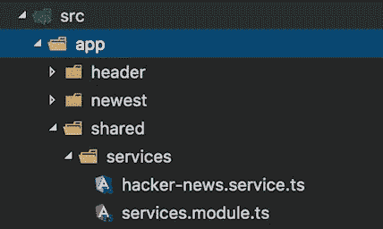

当我们在应用程序模块中注册 AngualrFire 时，配置将可在整个应用程序中访问。打开`hacker-news.service.ts`

```
import { Injectable } from '[@angular/core](http://twitter.com/angular/core)';
import { AngularFire, FirebaseListObservable } from 'angularfire2';[@Injectable](http://twitter.com/Injectable)()
export class HackerNewsService {constructor(private af: AngularFire) { }getNewestStories(limit: number) {
    return this.af.database.list('/v0/newstories', {
      query: {
        limitToFirst: limit,
        orderByKey : true
      }
    });
  }getItem(id: number) {
    return this.af.database.object('/v0/item/' + id);
  }}
```

这里我们用三个方法创建了一个`injectable`类。

`getTopStories` —返回超过限制的最新故事的 id

`getNewestStories` —返回超过限制的最新故事的 id。

`getItem` —返回单个项目对象。

`this.af.database.list('v0/newstories')`——*这是在访问什么数据库？*因为配置是跨应用程序的。我们在我们的`app.module.ts`中配置 AngularFire 来访问 Firebase 上的 HackerNewsAPI([docs](https://github.com/HackerNews/API))。

*angular fire 2 中很酷的一点是你可以通过一个****Observable****来查询极限等属性。，而不是一个数字—*[](https://github.com/angular/angularfire2/blob/master/docs/4-querying-lists.md)

***#第三步***

*在我们的服务模块中注册我们的 hacknews 服务。*

```
*import { NgModule } from '[@angular/core](http://twitter.com/angular/core)';
import { HackerNewsService } from './hacker-news.service';[@NgModule](http://twitter.com/NgModule)({
  imports: [],
  exports : [],
  declarations: [],
  providers: []
})
export class ServicesModule{
  static forRoot() {
    return {
      ngModule: ServicesModule,
      providers: [
        HackerNewsService
      ]
    }
  }
}**export {
  HackerNewsService
}***
```

**最后三行是我编写的一个助手，这样我就可以从这个模块访问应用程序中的所有服务，而不是转到 import 语句中的单个文件夹。您可以在步骤 4 中看到 HackerNewsService 的 import 语句。**

*# **第四步***

*在`shared`文件夹下生成一个模块`Components`并生成一个组件`ng g component story`*

*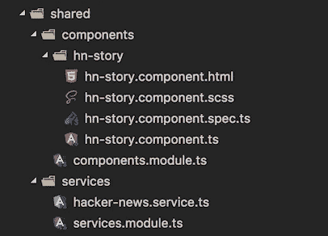*

*我们将创建一个组件，它将`id`作为输入——从`HackerNewsService`中检索项目并呈现它。*

*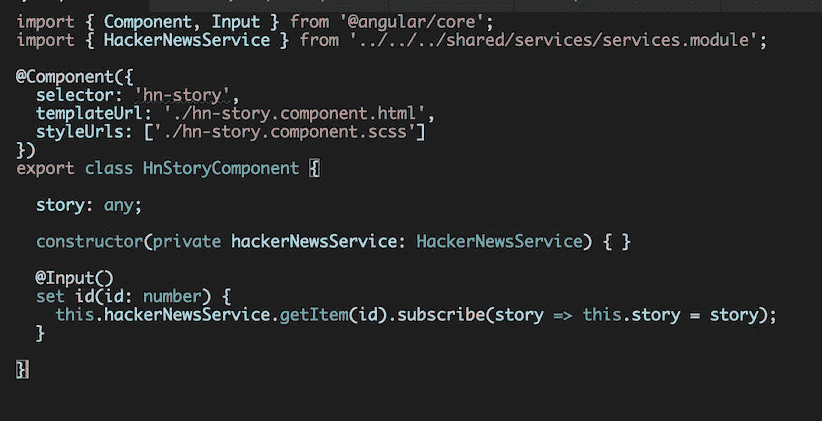*

*我们有一个用于属性 id 的`setter`方法，当 id 改变时，我们调用`HackerNewsService`来检索新的故事。*

**

*从`angular2-moment`导入`MomentModule`，从`angular-material`导入`MdCardModule`。我们将使用来自`angular-material`的`md-card`组件来显示我们的故事。下面是我们的模板文件，我使用 angular2-moment 中的`pipes`来显示时间。*

*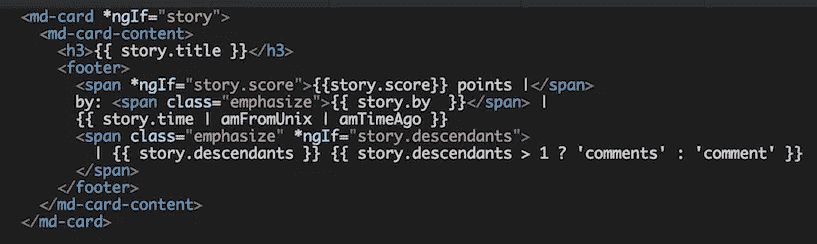*

*故事组件的样式*

*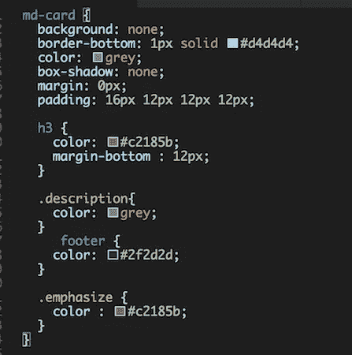*

***#第五步***

*为头条新闻创建一个新的模块和组件——参考[之前的博文](/@Sureshkumar_Ash/angular-2-components-and-router-angular-material-dbfea4f1415e#.7pfgrs0gc)*

**

*我将首先展示组件和标记，然后我们将一个接一个地看它做什么。我正在粘贴代码的截图，所以它的格式很好。*

*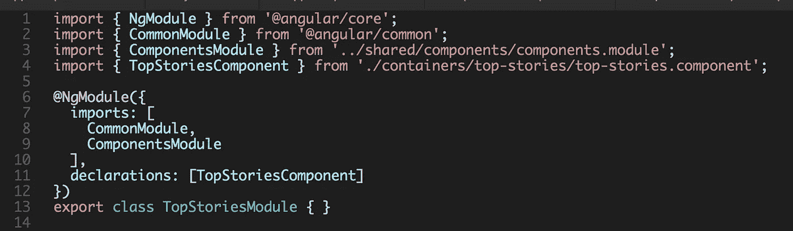*

**我们正在* `*topstories.module.ts*` *中导入 MdCardModule，因为我们将在模板中使用它来显示每个故事**

*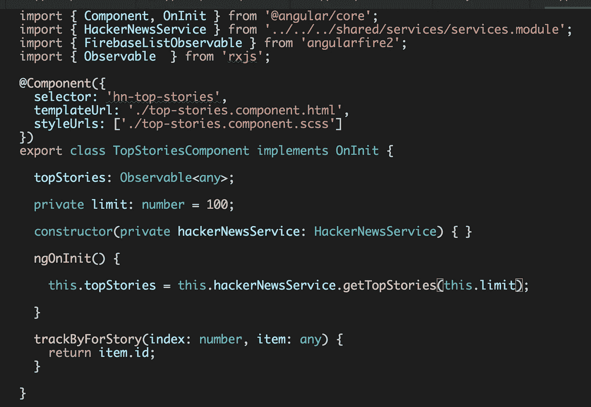*

*所以我们从各自的模块中导入`HackerNewsService, FirebaseListObservable` 。*

*我从 hackernews 中的 top stories 中获取了前 100 个故事，这些故事目前配置在我们组件内的`limit`属性中。*

*在`ngOnInit`——我们给`HackerNewsService`打电话，获得前 100 个故事。*

*`trackByForStory`方法——用于我们模板中`ngFor`的`[trackBy](https://angular.io/docs/ts/latest/api/common/index/NgFor-directive.html)`部分。*

*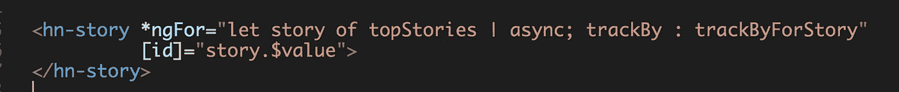*

***#第六步***

*对 top stories 执行类似的步骤来更新`newest component`。*

***#第七步***

*打开`app.routing.ts`并更新路径以重定向到`topstories`并添加新路线。*

*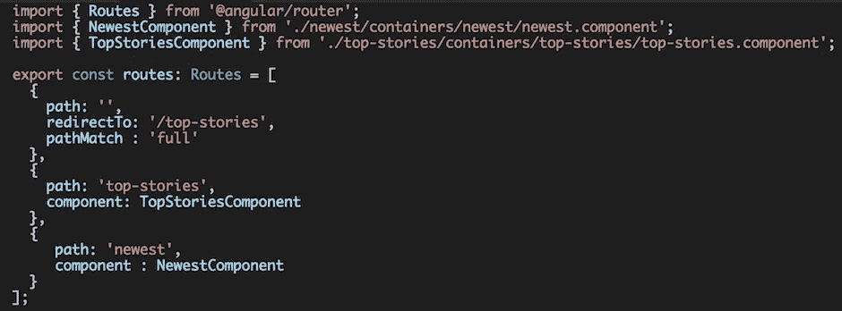**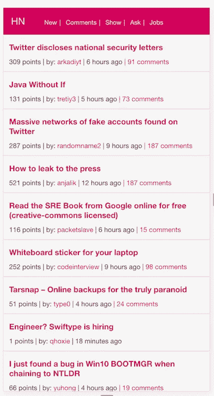*

*这是头条新闻。*

*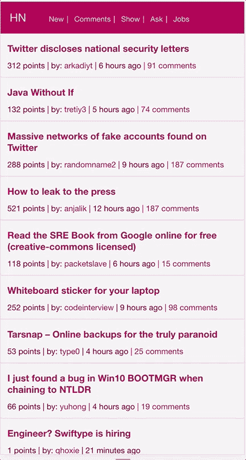*

*该应用程序部署在 firebase 主机(另一篇文章)。网址是 https://hackernews-clone.firebaseapp.com/的。回购也在积极进行。*

*[](http://bit.ly/HackernoonFB)**[](https://goo.gl/k7XYbx)**[](https://goo.gl/4ofytp)*

> *[黑客中午](http://bit.ly/Hackernoon)是黑客如何开始他们的下午。我们是这个大家庭的一员。我们现在[接受投稿](http://bit.ly/hackernoonsubmission)并乐意[讨论广告&赞助](mailto:partners@amipublications.com)机会。*
> 
> *如果你喜欢这个故事，我们推荐你阅读我们的[最新科技故事](http://bit.ly/hackernoonlatestt)和[趋势科技故事](https://hackernoon.com/trending)。直到下一次，不要把世界的现实想当然！*

**