# Angularjs —学习[初学者]

> 原文：<https://medium.com/hackernoon/angularjs-learning-for-beginners-aab3c1a02390>

AngularJS 是一个非常强大的 JavaScript 框架。它用于单页应用程序(SPA)项目。它还用额外的属性扩展了 HTML DOM，并使它对用户动作的响应更快。AngularJS 是开源的，完全免费，被全球成千上万的开发者使用。它根据 Apache 许可证版本 2.0 获得许可

AngularJS 将静态 HTML 改为动态 HTML。它还通过添加内置属性和组件扩展了 HTML 的功能，并提供了使用简单的 JavaScript 创建自定义属性的能力

# 角度示例:

下面是一个简单的 AngularJS 示例，它将标签更改为您在 textbox 中键入的任何内容。

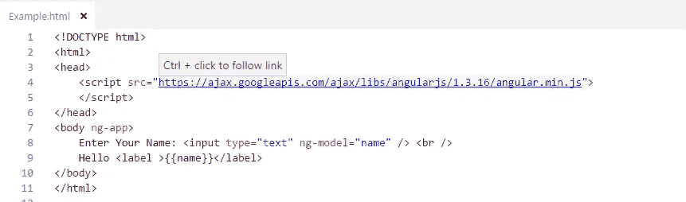

**结果**

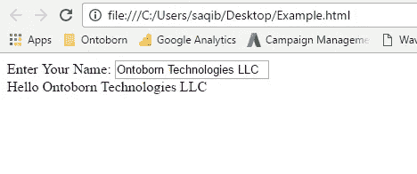

# AngularJS 的优势:

1.  开源 JavaScript MVC 框架。
2.  由谷歌支持
3.  不需要学习另一种脚本语言。只是纯 JavaScript 和 HTML。
4.  通过使用 MVC 设计模式支持关注点分离。
5.  内置属性(指令)使 HTML 变得动态。
6.  易于扩展和定制。
7.  支持单页应用程序。
8.  使用依赖注入。
9.  易于单元测试。
10.  休息友好。

# 第一次 AngularJS 应用:

让我们一步一步地创建一个简单的 AngularJS web 应用程序，并了解 AngularJS 的基本构建块。

1.  首先，创建一个包含和元素的 HTML 文档，如下所示。

# 示例:HTML 模板

1.  在 head 部分包含 angular.js 文件

# 示例:包括 AngularJS 库

<title>首次成角应用</title>

1.  这里，我们将创建一个简单的加法应用程序，它将两个数字相加并显示结果。用户将在两个单独的文本框中输入两个数字，结果将立即显示，如下所示。

# 首次 AngularJS 应用

下面是上面加法示例的带 AngularJS 的 HTML 代码。

**例如:**

# 首次 AngularJS 应用

<title>首次成角应用</title>

ng-app

# 第一次角度应用

输入要添加的数字:ng-model = " num 1 "/>+<输入 type = " text "**ng-model = " num 2 "**/>=**{ { num 1+num 2 } }**

上面的例子看起来像 HTML 代码，带有一些奇怪的属性和括号，如 ng-app、ng-model 和{{ }}。AngularJS 中的这些内置属性称为指令。

# 模板:

在 AngularJS 中，模板是带有附加标记的 HTML。AngularJS 编译模板并呈现结果 HTML。

# 指令:

指令是 DOM 元素上的标记(属性),告诉 AngularJS 将特定行为附加到该 DOM 元素上，甚至转换 DOM 元素及其子元素。

AngularJS 中的大多数指令都是以 **ng** 开头的。它代表棱角分明。在上面的例子中，我们已经应用了 ng-app 和 ng-model 指令。

**ng-app**:ng-app 指令是一个起点。如果 AngularJS 框架在 HTML 文档中的任何地方找到 ng-app 指令，那么它会引导(初始化)自己，并且还会编译 HTML 模板。

**ng-model**:ng-model 指令将 HTML 元素绑定到 [$scope](http://www.tutorialsteacher.com/angularjs/angularjs-scope) 对象的属性上。稍后您将了解这个模型，但是现在让我们把它看作一个模型属性。

在上面的例子中，我们已经将 ng-model 指令包含到两个具有不同名称 Num1 和 Num2 的文本框中。AngularJS framework 将在作用域中创建两个名为 Num1 和 Num2 的属性，还将分配一个值，我们在文本框中键入该值。

# 表情:

表达式就像 JavaScript 代码，通常用双花括号括起来，如{{ expression }}。AngularJS 框架对表达式求值并产生结果。在上面的例子中，{{ Num1 + Num2}}将简单地显示 Num1 和 Num2 的和。

下表列出了 AngularJS 中的所有重要概念。

**概念描述**带附加标记的模板 HTML 指令用自定义属性和元素扩展 HTML 模型在视图中向用户显示的数据，用户通过这些数据进行交互查看存储模型的上下文，以便控制器、指令和表达式也可以访问它表达式执行括号内的 JavaScript 代码{{ }。编译器解析模板并实例化指令和表达式筛选器格式化表达式的值以显示给用户视图用户看到的内容(DOM)数据绑定模型和视图之间的同步数据控制器维护应用程序数据和业务逻辑模块容器用于应用程序的不同部分，包括控制器、服务、筛选器、配置注入器服务可重用业务逻辑的指令，独立于视图依赖注入创建和连接对象和函数注入器依赖注入容器

在下一节中了解 ng-app 指令。

# ng-app 指令:

**ng-app** 指令是 AngularJS 应用的起点。它自动初始化 AngularJS 框架。AngularJS framework 将在整个文档加载后首先检查 HTML 文档中的 ng-app 指令，如果找到 ng-app，它将启动自身并编译 HTML 模板。

通常，ng-app 指令应该放在 HTML 文档的根位置，例如或标签，这样它就可以控制整个 DOM 层次结构。但是，您也可以将它放在任何 DOM 元素中。AngularJS 框架将只处理应用了 ng-app 指令的 DOM 元素及其子元素。考虑下面的例子。

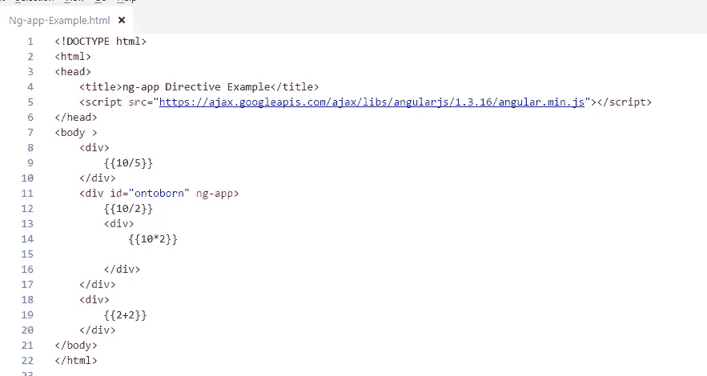

**结果**

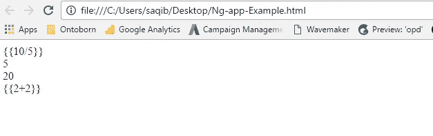

在上面的例子中，ng-app 指令放在 id 为“ontoborn”的 div 元素中。所以 AngularJS 只会编译 myDiv 及其子元素。它不会编译 myDiv 的父元素或同级元素。

# 模块名称为的 ng-app:

ng-app 指令还可以指定应用程序模块名称。这个应用程序模块还分离了应用程序的不同部分，如控制器、服务、过滤器等。

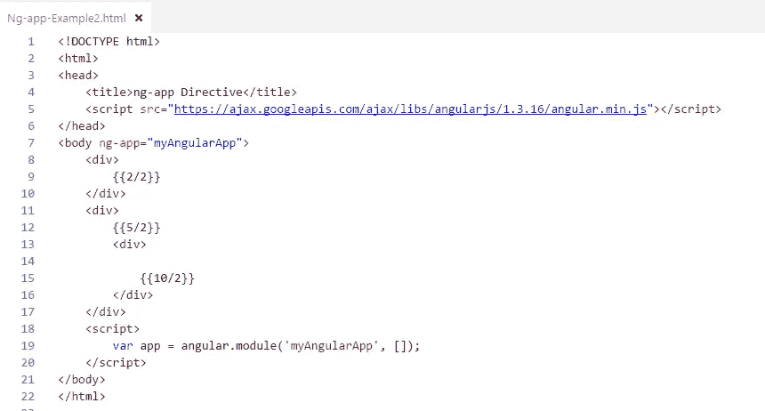

**结果**

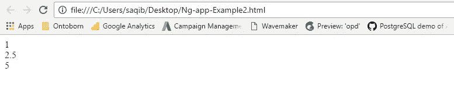

在上面的例子中，我们在标签中使用 ng-app = 'myAngularApp '指定了一个模块名，然后我们在

# AngularJS 表情:

角度表达式就像用大括号括起来的 JavaScript 表达式— {{ expression }}。AngularJS 计算指定的表达式，并将结果数据绑定到 HTML。

表达式可以包含文字、操作符以及变量，如 JavaScript 表达式。例如，表达式{{8/2}}将产生结果 4，并将被绑定到 HTML。

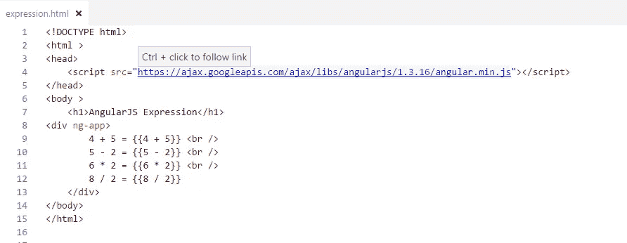

**结果**

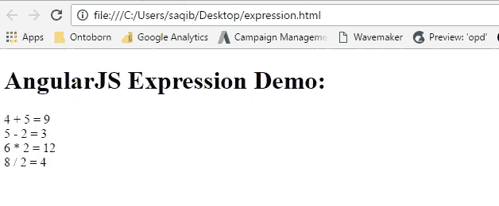

# AngularJS 指令:

指令是 DOM 元素上的标记，告诉 AngularJS 将指定的行为附加到该 DOM 元素上，甚至转换 DOM 元素及其子元素。简言之，它扩展了 HTML。

AngularJS 中的大多数指令都是以 ng 开始的——其中 ng 代表 Angular。AngularJS 还包括各种内置指令。除此之外，您还可以为您的应用程序创建自定义指令。

下表列出了重要的内置 AngularJS 指令。

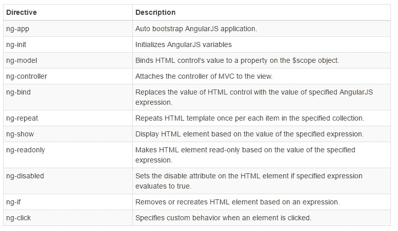

# 天然气应用程序:

ng-app 指令初始化 AngularJS，并使指定的元素成为应用程序的根元素。

# ng-init:

ng-init 指令可用于初始化 AngularJS 应用程序中的变量。

以下示例演示了初始化字符串变量的 ng-init 指令。

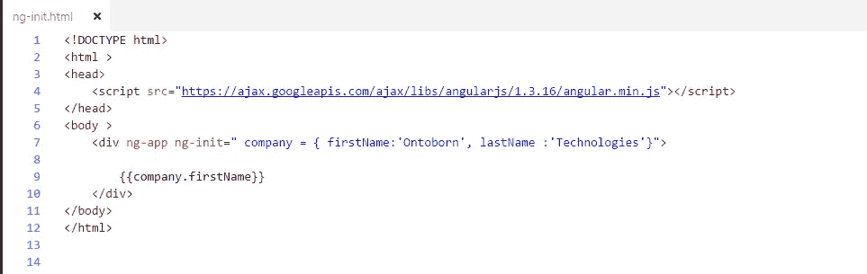

**结果**

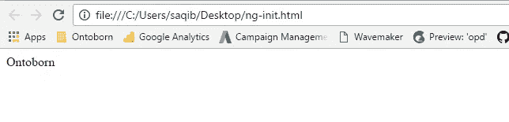

在上面的例子中，我们初始化了字符串、数字、数组和对象的变量。这些变量也可以在声明它们的 DOM 元素层次结构中的任何地方使用。

# 天然气型号:

ng-model 指令用于 AngularJS 中的双向数据绑定。它还将、<select>或</select><textarea>元素绑定到$scope 对象上的指定属性。因此，元素的值将是属性的值，反之亦然。</textarea>

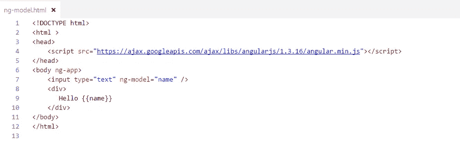

**结果**

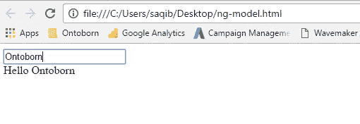

可以使用$scope 对象在控制器中访问通过 ng-model 设置的属性

# ng 绑定:

ng-bind 指令将通过$scope 或 ng-model 指令声明的模型属性或表达式的结果绑定到 HTML 元素。如果表达式的值发生变化，它也会更新元素。

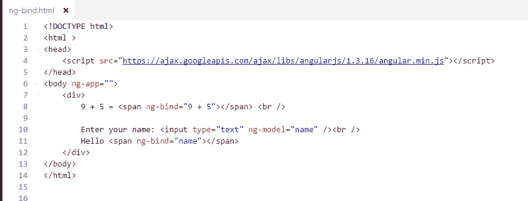

**结果**

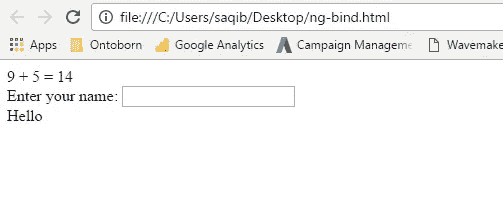

在上面的例子中，ng-bind 指令将表达式“5 + 5”的结果绑定到。同样，它将模型属性“name”的值绑定到。“name”属性的值也将是文本框中输入的值。

# ng-重复:

ng-repeat 指令对指定数组集合中的每个项目重复 HTML 一次

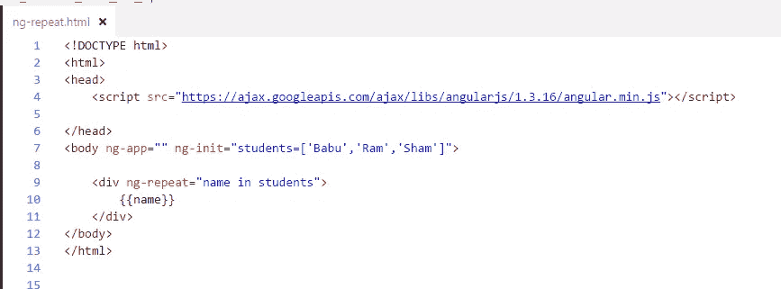

**结果**

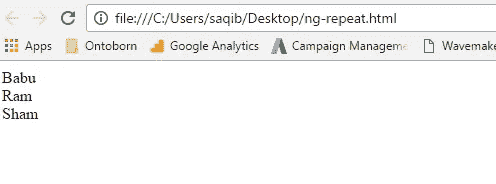

在上面的例子中，ng-repeat 用于学生数组。它为学生数组中的每一项创建了

*   元素。用同样的方法重复元素。

# AngularJS 控制器:

AngularJS 中的控制器是一个 JavaScript 函数，使用$scope 对象维护应用程序数据和行为。

您还可以将属性和方法附加到控制器函数内的$scope 对象，这反过来将添加/更新数据并将行为附加到 HTML 元素。$scope 对象是控制器和 HTML 之间的粘合剂。

ng-controller 指令还用于指定 HTML 元素中的控制器，该控制器将在 HTML 元素及其子元素中添加行为或维护数据。

下面的示例演示如何将属性附加到控制器内的$scope 对象，然后在 HTML 中显示属性值。

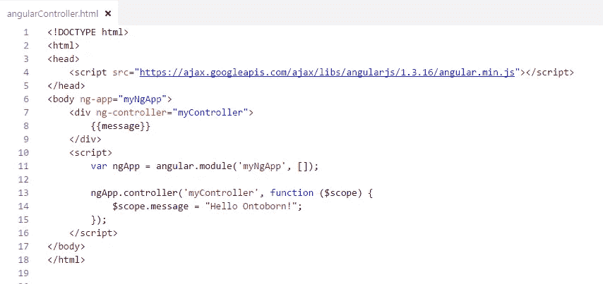

结果

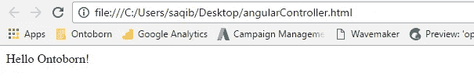

在上面的例子中，ng-controller="myController "指令应用于

元素，其中" myController "是控制器的名称。在 div 元素中，我们指定了{{message}}表达式。

# 角度范围:

AngularJS 中的$scope 是一个内置对象，它也包含应用程序数据和方法。您可以为控制器函数中的$scope 对象创建属性，并为其分配一个值或函数。

$scope 是控制器和视图(HTML)之间粘合剂。它将数据从控制器传输到视图，反之亦然。

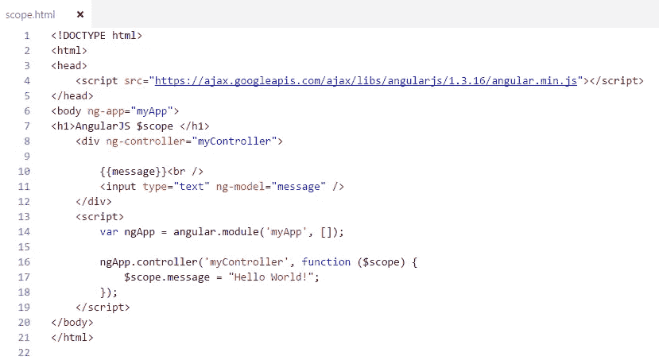

结果

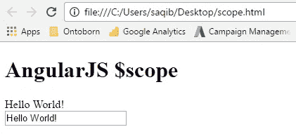

AngularJS 为应用程序中的每个控制器创建并注入不同的$scope 对象。因此，在一个控制器中附加到$scope 的数据和方法不能在另一个控制器中访问。对于嵌套控制器，子控制器将继承父控制器的范围对象。因此，子控制器也可以访问父控制器中添加的属性，但父控制器不能访问子控制器中添加的属性。

*ng-model 指令用于双向数据绑定。它将数据从控制器传输到视图，反之亦然。表达式和 ng-bind 指令也将数据从控制器传输到视图，但不是相反。*

# $rootScope:

AngularJS 应用程序只有一个$rootScope。所有其他$scope 对象都是子对象。

所有控制器都可以使用附加到$rootScope 的属性和方法。

以下示例演示了$rootScope 和$scope 对象。

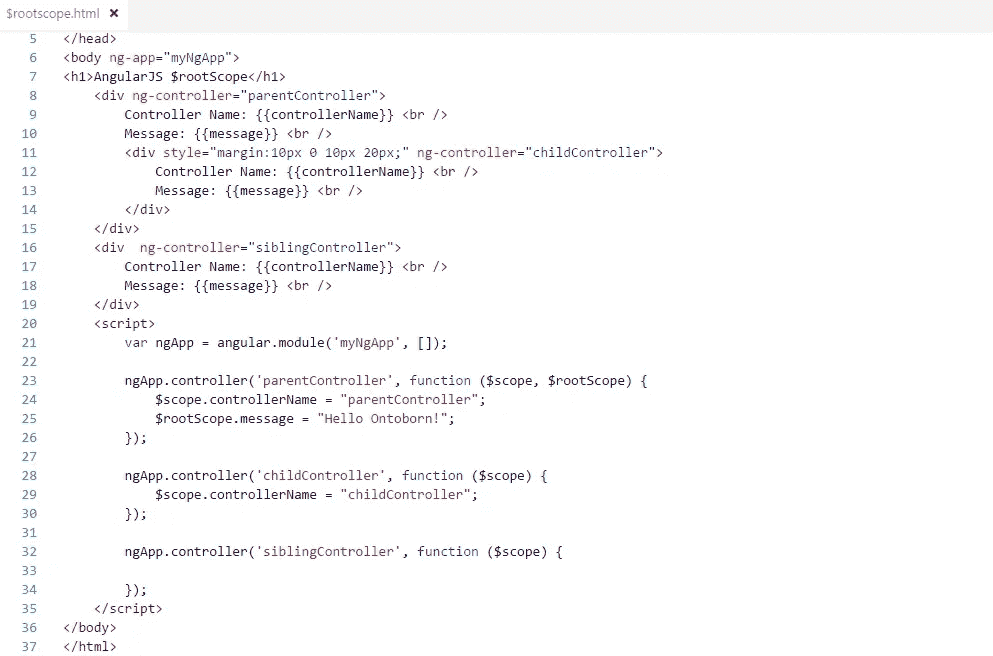

**结果**

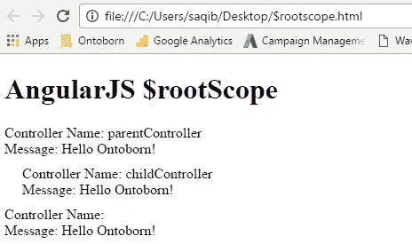

根据上面的例子，在$rootScope 中添加的属性在所有控制器中都可用。

# AngularJS 事件:

AngularJS 还包括一些指令，可用于提供各种 DOM 事件的定制行为，如 click、dblclick 等。

# ng 点击:

ng-click 指令用于为 click 事件提供事件处理程序。

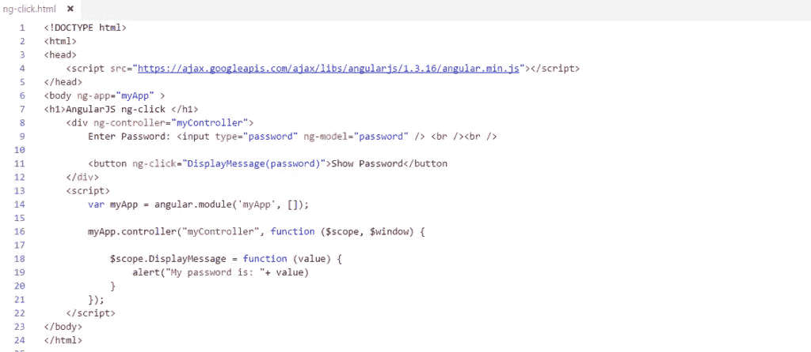

结果

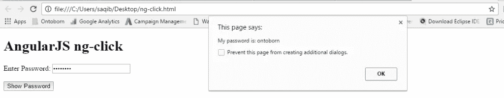

在上面的示例中，ng-click 指令用于在用户单击按钮时调用带有“password”参数的 DisplayMessage()函数。“密码”是使用输入框中的 ng-model 指令定义的模型属性。DisplayMessage()函数附加到 myController 中的 scope 对象，因此当按钮位于 myController 下时，也可以通过单击按钮来访问它。$window 服务用于显示警报。

# 参考

[辅导课老师](http://www.tutorialsteacher.com/angularjs/angularjs-tutorials)

# 雇佣 AngularJS 开发商

你可以在 http://ontoborn.com[的](http://ontoborn.com/)雇佣 Angularjs 开发者，按小时、周或月计算

> [黑客中午](http://bit.ly/Hackernoon)是黑客如何开始他们的下午。我们是 [@AMI](http://bit.ly/atAMIatAMI) 家庭的一员。我们现在[接受投稿](http://bit.ly/hackernoonsubmission)并乐意[讨论广告&赞助](mailto:partners@amipublications.com)机会。
> 
> 如果你喜欢这个故事，我们推荐你阅读我们的[最新科技故事](http://bit.ly/hackernoonlatestt)和[趋势科技故事](https://hackernoon.com/trending)。直到下一次，不要把世界的现实想当然！

