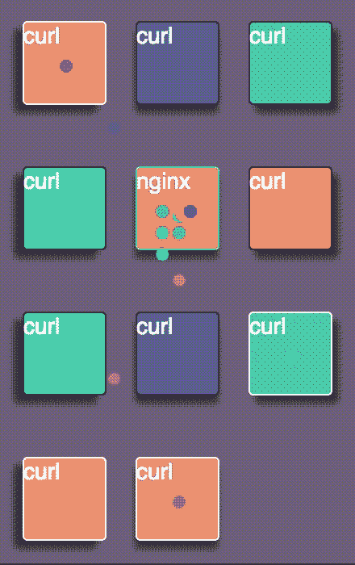
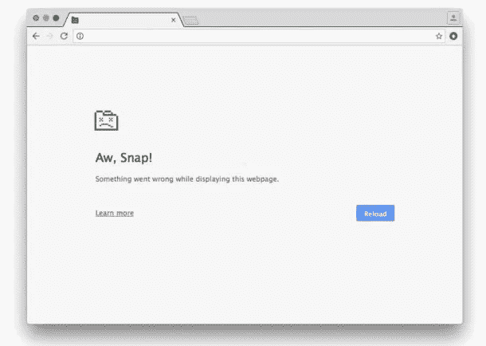

# 使用反应运动制作粒子动画

> 原文：<https://medium.com/hackernoon/animating-particles-using-react-motion-dcded1895f17>

在做一个个人开源项目[容器配置单元](https://github.com/saada/container-hive)时，我面临了不少挑战，要让粒子在每个 Docker 容器之间正确动画。Container Hive 试图帮助您可视化您的服务之间的一切是如何组合在一起的。这是它目前的样子…



每个粒子是一个 SVG 圆，看起来像…

```
<svg width='8' height='8'>
  <circle cx='4' cy='4' r='4' fill='darkcyan' />
</svg>
```

既然我用的是 [React](https://hackernoon.com/tagged/react) ，我自然倾向于尝试 [React Motion](https://github.com/chenglou/react-motion) 。

## **挑战 I —在 DevTools 崩溃时调试漏洞**

当你刷新页面的时候，过了一段时间，你会看到…



这确实令人沮丧，因为不仅 tab 崩溃了，DevTools 窗口本身也崩溃了。我尝试了许多方法来分析我的脚本，最终得出了一个有趣的方法。我打开控制台，时机成熟的时候，我键入 ***调试器*** 然后嘣！我暂停了一切。所有的动画停止，反应生命周期，反应运动，一切！我还确保在 DevTools 中打开了**时间轴**标签，以便在页面刷新时开始记录性能。我能够查看我的脚本的所有度量和调试性能，以及任何 CPU/内存泄漏。

## **挑战二——transition motion 的默认样式不起作用(bug)**

使用 *TransitionMotion* 非常适合处理多个动画元素，并控制每个组件的安装和卸载。但我无法使用 react-motion@0.4.7 让它工作。我最初的做法是使用*默认样式*作为每个粒子的初始位置，然后从*默认样式*开始设置*样式*作为最终的过渡样式。

```
<TransitionMotion
  defaultStyles={particles.map(particle => ({
    key: particle.key,
    style: {
      translateX: particle.x1,
      translateY: particle.y1,
      opacity: 0
    }
  }))}
  styles={particles.map(particle => ({
    key: particle.key,
    style: {
      translateX: spring(particle.x2, particleSpring),
      translateY: spring(particle.y2, particleSpring),
      opacity: spring(1, particleSpring)
    }
  }))}>
  {interpolatedStyles =>
    <div>
      {interpolatedStyles.map(({key, style: {opacity, translateX, translateY}}) => {
        return <svg key={key} width='8' height='8' style={{
          transform: `translate3d(${translateX}px, ${translateY}px, 0) scale(1)`,
          marginTop: `${(50 / 2) - borderWidth / 2}px`,
          marginLeft: `${(50 / 2) - borderWidth / 2}px`,
          opacity: opacity,
          position: 'absolute',
          zIndex: 1000
        }}>
          <circle cx='4' cy='4' r='4' fill='yellow' />
        </svg>
      })}
    </div>
  }
</TransitionMotion>
```

所发生的是粒子会停留在最终位置，根本不会经历动画阶段。几乎就像 *defaultStyles* 并没有真正做什么。

**解决方案:**经过三天各种方案的尝试，奏效的是使用 *willLeave* 道具，通过在其回调中返回最终状态来执行所有动画。实际上，忽略了*默认样式*属性。下面是工作片段。

```
<TransitionMotion
  willLeave={particle => {
    return {
      translateX: spring(particle.data.x2, particleSpring),
      translateY: spring(particle.data.y2, particleSpring),
      opacity: spring(1, particleSpring)
    }
  }}styles={particles.map(particle => ({
    key: particle.key,
    data: particle,
    style: {
      translateX: particle.x1,
      translateY: particle.y1,
      opacity: 0.5
    }
  }))}>
  {interpolatedStyles =>
    <div>
      {interpolatedStyles.map(({key, style: {translateX, translateY, opacity}}, index) => {
        return <svg key={key} width='8' height='8' style={{
          transform: `translate3d(${translateX}px, ${translateY}px, 0) scale(1)`,
          marginTop: `${(50 / 2) - borderWidth / 2}px`,
          marginLeft: `${(50 / 2) - borderWidth / 2}px`,
          opacity: opacity,
          position: 'absolute',
          zIndex: 1000
        }}>
          <circle cx='4' cy='4' r='4' fill={allColors[index % allColors.length]} />
        </svg>
      })}
    </div>
  }
</TransitionMotion>
```

通过完全去掉*默认样式*并将*样式*作为动画的初始状态，一切都完美地工作了。我在下面的 Github 上提出了这个问题。

[](https://github.com/chenglou/react-motion/issues/416) [## 过渡运动默认样式不反映动画问题#416 成楼的初始状态…

### react-motion -解决动画问题的弹簧。

github.com](https://github.com/chenglou/react-motion/issues/416) 

**结论**

React Motion 非常棒，为动画提供了非常强大的工具，但它仍然有一些问题和文档需要解决。如果你在堆栈中使用 Docker，试试[容器 Hive](https://github.com/saada/container-hive) 。这是一个有趣有趣的景象，让你对微服务网络有了直觉。

[](http://bit.ly/HackernoonFB)[](https://goo.gl/k7XYbx)[](https://goo.gl/4ofytp)

> [黑客中午](http://bit.ly/Hackernoon)是黑客如何开始他们的下午。我们是 [@AMI](http://bit.ly/atAMIatAMI) 家庭的一员。我们现在[接受投稿](http://bit.ly/hackernoonsubmission)并乐意[讨论广告&赞助](mailto:partners@amipublications.com)机会。
> 
> 如果你喜欢这个故事，我们推荐你阅读我们的[最新科技故事](http://bit.ly/hackernoonlatestt)和[趋势科技故事](https://hackernoon.com/trending)。直到下一次，不要把世界的现实想当然！

