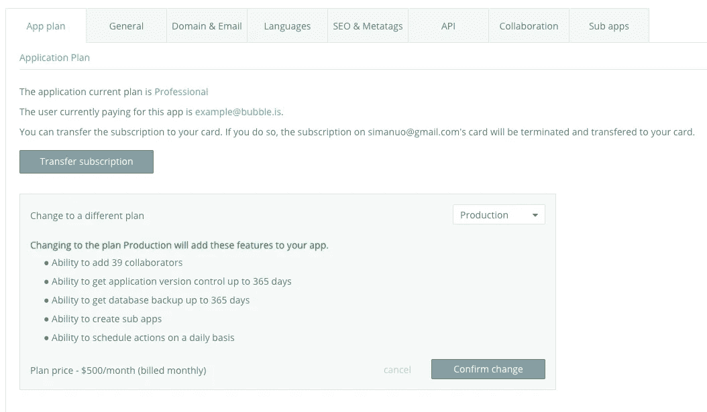
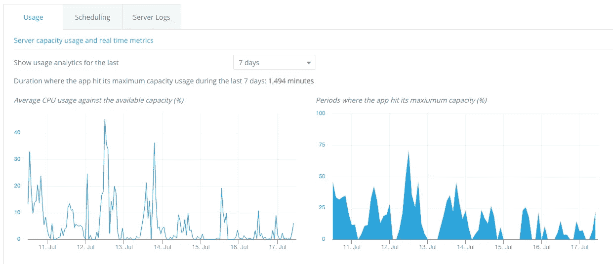

# 宣布新的价格

> 原文：<https://medium.com/hackernoon/announcing-a-new-pricing-78b35a7c9db3>

来自[泡泡](https://bubble.is/)的问候！今天我们宣布一个新的、更简单的[定价](http://bubble.is/pricing)。

我们在下面详细解释这些变化。简而言之，我们的新定价提供了无限的私人应用程序，所有应用程序的 SSL 证书，以及购买额外服务器容量的能力。我们不限制工作流程的运行。新系统是基于应用程序的，而不是基于账户的。

对于我们现有的付费客户来说，除非你想换，否则什么都不会改变！只要你愿意，你可以保持目前的计划，但我们希望你能在新系统中看到更多价值。

# 新计划

计划现在是基于每个应用程序的。这让您可以为需要的应用程序获得所需的功能。因此，计划现在在应用程序编辑器中的 Settings 选项卡下进行控制。付款方式和发票可以照常进入[账户](https://bubble.is/account)页面。

您可以在我们的[定价页面](http://bubble.is/pricing)中找到我们定价的详细信息。以下是主要变化:

1.  私人应用程序现在在任何账户上都不受限制。这将让你在所有应用程序上增加一层额外的安全。
2.  免费计划的应用程序在运行模式下会有一个泡泡标志。
3.  所有付费计划都在自定义域上提供 SSL。
4.  我们不限制工作流程的运行。
5.  专业计划及更高级别的应用程序可以购买更多容量以获得更好的性能。
6.  你可以通过年度会员来省钱，或者选择每月计划来获得更大的灵活性。

我们现有的付费客户在迁移之前会保留当前的设置和功能(更多详细信息请参见“切换到新系统”)。专用客户不会受到这一变化的影响。

# 按需添加容量

Bubble 允许您在我们的服务器上运行高级编程操作。在专业计划及以上，我们为您的应用预留服务器容量，以确保您的应用快速运行。每个具有预留容量的应用程序从 2 个单位开始，这决定了应用程序在给定时间间隔内可以消耗的服务器和数据库 CPU 时间。您只需每月支付 20 美元(最多 10 个额外单元)购买额外单元，即可扩展您的应用以适应您的应用增长。

如果您的应用程序暂时超出其容量，我们会限制其运行速度，使其保持在阈值以下。您可以从应用程序编辑器中实时监控您的使用情况。

# 切换到新系统

虽然我们认为我们现有的付费用户会喜欢我们新系统提供的价值，但我们让他们可以灵活选择何时转换。你可以想呆多久就呆多久。在迁移之前，您可以访问与现有计划相同的功能集。如果您使用的是传统付费计划，您将拥有保留的服务器容量，但在迁移到新系统之前，您无法增加容量。

由于每个计划都附带一定数量的私人应用程序，因此包含在您之前的计划应用程序限制中的所有私人应用程序都将包含在同一计划中，包括新创建的应用程序(如果您未达到私人应用程序的最大数量)。

您可以在“设置”选项卡的“计划”部分下更改计划，然后单击“迁移到新系统”。这将显示一个弹出窗口，列出您拥有的应用程序，您可以为每个应用程序定制计划。一旦完成，你就可以享受新的计划了！

# 其他新闻

除了我们关于新计划的主要更新，我们还想分享一些在过去 4 周内推出的产品更新。如果你关注论坛，你会看到[公告](http://forum.bubble.is/c/announcements)的完整列表，你会看到自从我们上一封邮件以来的[发布说明](https://bubble.is/roadmap?from=1497499200000)。以下是我们添加的一些有趣内容的亮点:

*   当你用 webhook 触发 API 工作流请求数据(包括处理嵌套对象)时，对它们进行[智能检测](https://manual.bubble.is/using-the-bubble-api/how-to-use-the-api.html#automatic-detection)。
*   定义[动态颜色](https://forum.bubble.is/t/new-feature-dynamic-colors/14800)的能力；颜色现在可以是动态的表达，这使得你的用户可以自己定制他们的设计。
*   我们与 neer ja[一起进一步壮大了团队，Neerja](https://bubble.is/about) 将与我们的用户合作，帮助他们充分利用 Bubble！

# 感谢您在 Bubble 上的构建！

很高兴看到我们的社区成长(超过 [80，000 bubbler](https://bubble.is/community)！)并在[论坛](http://forum.bubble.is/)上互相帮助。每天都有越来越多的应用程序推出，我们非常感谢您的信任，并很高兴看到您可以用 Bubble 做些什么。

干杯，
泡泡队