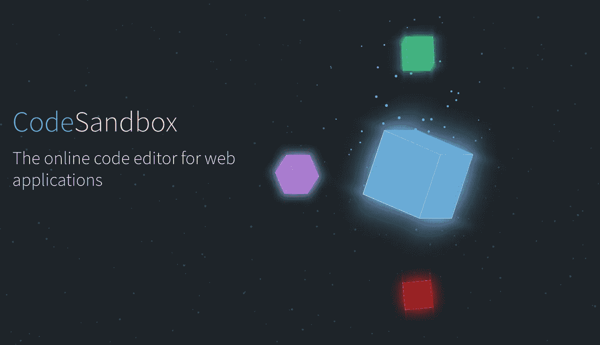
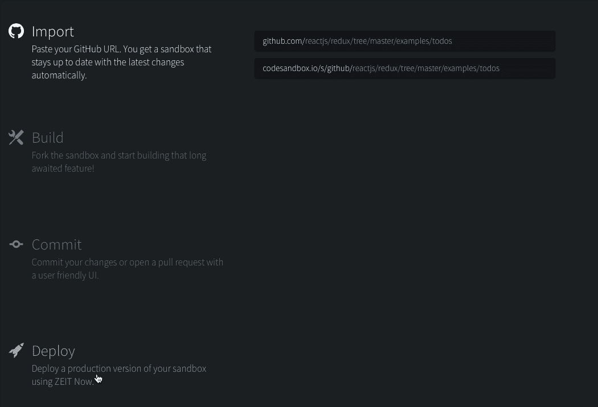
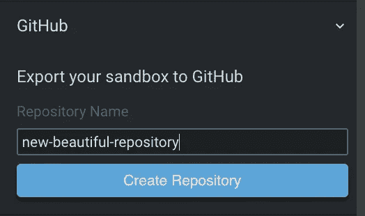
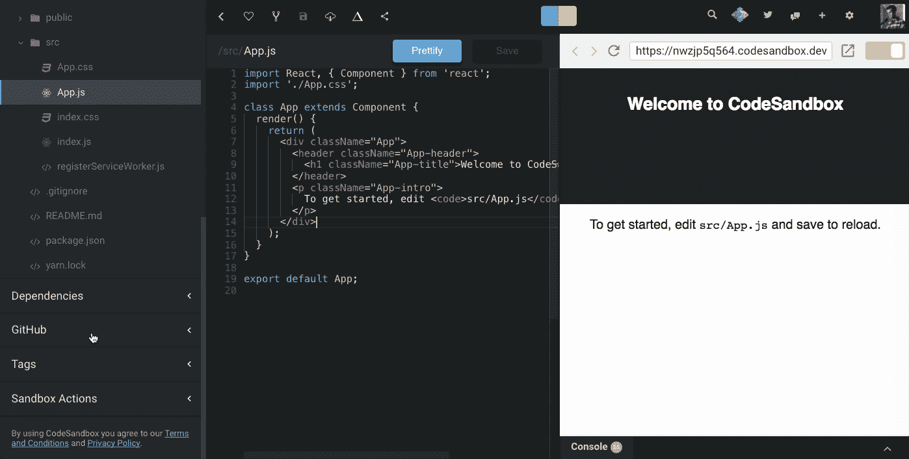
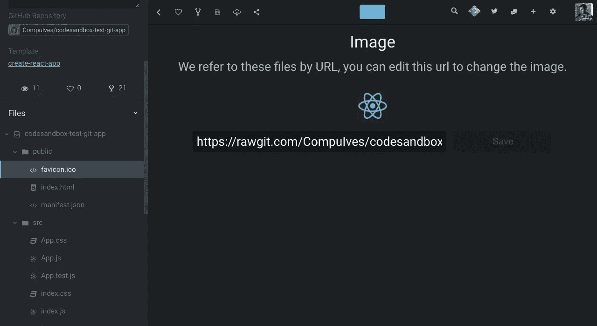

# 宣布 CodeSandbox 2.0

> 原文：<https://medium.com/hackernoon/announcing-codesandbox-2-0-938cff3a0fcb>

自从[我们宣布 CodeSandbox](https://hackernoon.com/codesandbox-an-online-react-editor-b8945ce095d2) 已经过去了 7 个月，自从我做出[第一次提交](https://github.com/CompuIves/codesandbox-client/commit/c5f43786fe6a4e54c3b7729d8992dba5a4adeeaf)已经过去了一年。你能想象吗？这当然值得庆祝，我们决定做一个大的更新！我花了 2 周的时间在 CodeSandbox 上全职工作，我们完成了很多工作。
我们开始吧！

# 新主页

自第一次发布以来，我们已经向 CodeSandbox 添加了许多东西。给你一个想法:我们发布了没有嵌入的 CodeSandbox！发生了很多变化，我们不再是 React only 的编辑，我认为我们已经超越了游乐场的定义。所有这些变化，但主页没有收到一个更新。这造成了混乱，因为人们不知道我们建造的东西。是时候做点什么了。我们现在已经使用 Gatsby 从头开始设计和构建了主页。[这里可以看到](https://codesandbox.io)！非常感谢 Danny Ruchtie 帮助我们完成设计。

还有更多的网页在制作中，比如文档和精选的例子。我们还想为登录的用户显示一个更加个性化的页面。基础现在就在这里，所以将来扩展到这一点会更容易。

# GitHub 提交和打开 PRs

从第一天开始，最受欢迎的功能就是提交到 GitHub。开始时，我们无法解决这个问题，因为需要先建立基础。基础已经建立，从现在开始，你可以提交，创建仓库和打开拉请求的权利，从代码沙盒！直接从你的浏览器向 GitHub 提交修改感觉真的很不可思议。

## 创建存储库

这是一个非常简单的过程。你现在可以将任何普通的沙盒导出到 GitHub，只需输入名称并点击侧边栏中的“创建 Repo”。这将创建一个存储库，然后将您重定向到沙箱的 Git 版本。

## 提交和打开 PRs

要提交到您的存储库，您需要首先导入它。您可以通过将 GitHub URL 附加到 codesandbox.io/s/github.来导入任何 GitHub 存储库，例如，对于我的测试存储库，URL 应该是:[codesandbox.io/s/github/CompuIves/codesandbox-test-git-app](https://codesandbox.io/s/github/CompuIves/codesandbox-test-git-app)。下一步是创建这个沙盒的一个分支并进行更改，从那时起，您可以通过单击侧边栏中的按钮来提交或打开一个 PR。

Create a commit or open a PR

我们首先尝试提交，如果失败，我们尝试合并提交。当合并提交也失败时，我们就退回到打开一个拉请求。合并冲突解决是我们接下来要在 CodeSandbox 中构建的。

Committing some changes 😃

您只能提交您拥有写权限的存储库，您可以打开任何存储库的 PR。

## 其他变化

为了在 CodeSandbox 中正确支持 GitHub，我们必须做出一些改变。我们现在为 git 存储库导入所有文件(如`.gitignore`和`package.json`)。我们还为二进制文件(如图像)实现了定制的“编辑器”。这对我来说感觉很棒，因为你现在在 CodeSandbox 中工作，就像你在本地工作一样。再也没有转变发生了。下一个特性也有助于这一点

An Image view

# 静态文件托管

本地开发服务器和 CodeSandbox 之间最大的区别之一是`index.html`和`public`文件夹的行为。CodeSandbox 没有托管`public`文件夹中的文件，这一点直到现在都令人困惑。从这次更新开始，我们将托管所有来自`public`(或者 Vue 的`static`)目录的文件。许多令人兴奋的可能性随之而来。例如，您现在可以添加 web workers、静态图像、模拟 API 调用响应。你也从现在开始完全控制`index.html`！

下面是一个沙盒示例:

We download test.json from the public folder

# 将来的

这一新的更新增加了许多先进的功能，也开辟了许多新的东西来建立。我期待着在不久的将来在这些方面进行工作(以及计划中的现有特性)。

## UI 大修

用户界面变得有点混乱，需要一些重组。我正在做一个 UI 的大改动，我不能适应这个更新，但是我当然希望尽快部署。新的 UI 受 vscode 的启发，将把所有高级功能(如部署和 GitHub 支持)放在自己的位置上。

## 差异视图

Git 集成目前缺少提交的 diff 视图。这非常重要，是我要解决的首要问题。这一变化将伴随着用户界面的彻底改变。

## 真理的配置来源

既然我们导入了像`package.json`这样的文件，我们需要在 CodeSandbox 配置和文件配置之间做一些冲突解决。我们想让像`package.json`这样的文件成为依赖关系的真实来源，并显示一个 UI 来配置这些文件。这给了用户灵活性，我们仍然保持 UX 非常用户友好。

# 结论

过去的 7 个月很棒，开发 CodeSandbox 从一开始到现在都很有趣。我们没有预料到的一件事是我们开源时得到的支持。开源社区真的很棒，我们所有的贡献者都值得特别感谢。

如果你喜欢我们正在做的事情，考虑成为[赞助人](https://codesandbox.io/patron)。过去的两个星期太棒了，我想在 CodeSandbox 上做更多的全职工作。但这只有在我买得起食物的情况下才有可能😃。