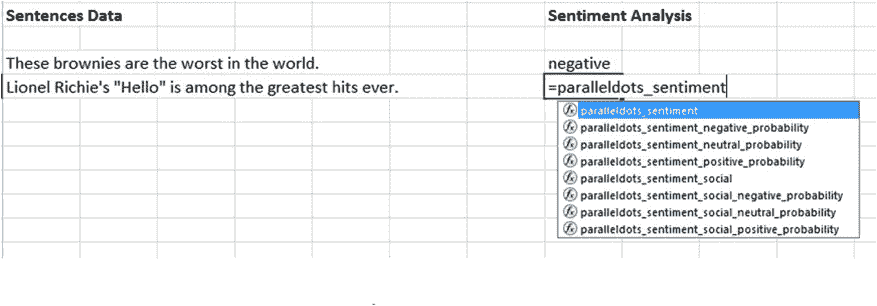
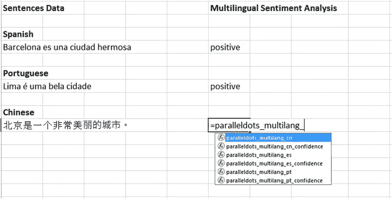
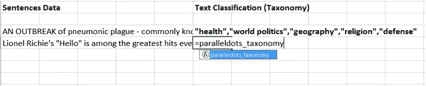
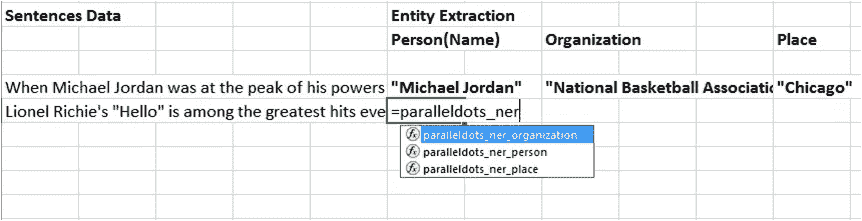
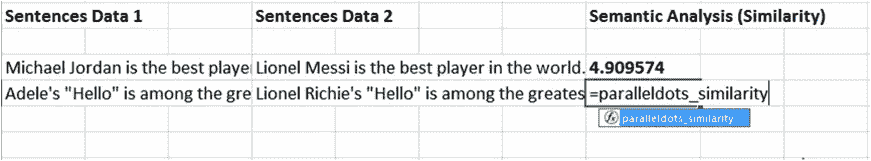
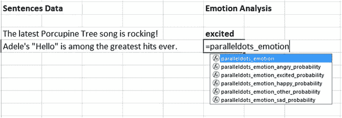
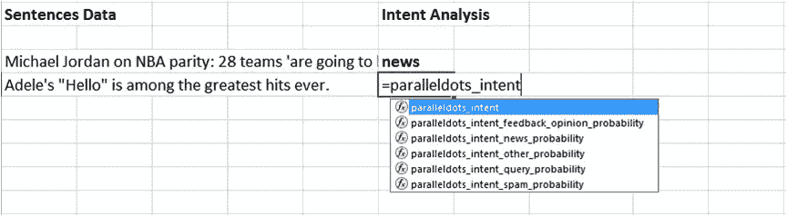
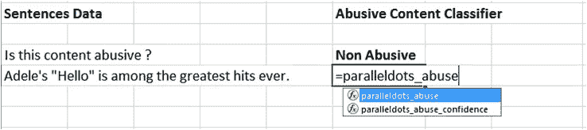

# 宣布用于并行程序 AI APIs 的 Excel 外接程序

> 原文：<https://medium.com/hackernoon/announcing-excel-add-in-for-paralleldots-ai-apis-6df9d4c3ba3f>

我们的 Excel 插件提供了最先进的文本分析功能，无需编写任何代码。当您需要在大型文本语料库上批量运行文本分析并发现其中的见解(如社交媒体活动中的用户生成内容、收入电话会议记录、开放式用户反馈等)时，该插件也很方便。).您可以从您使用的任何 BI 工具中导出 xlsx(或 CSV 格式)的所有数据，并安装我们的插件，用情绪、情感、意图等来注释数据。并在舒适的电子表格中进行分析。

在本帖中，我们将向您展示如何使用我们的 Excel 插件为您的文本分析和文本挖掘功能添加一个重要的工具。

# 安装和使用加载项

在开始使用 Excel 插件之前，你需要[注册](https://www.paralleldots.com/)一个免费的 ParallelDots AI APIs 账户。填写我们网站上的表格并验证您的电子邮件后，您将在收件箱中收到一个 API 密钥。请将 API 密钥存放在安全的位置，因为未经授权访问您的 API 密钥将导致您的配额提前用完。如果你觉得你丢失了你的 API 密匙或者其他人可能得到它，请发电子邮件到 support@paralleldots.com 的[我们会立即使你的旧 API 密匙失效并为你生成一个新的。](mailto:support@paralleldots.com)

收到 API 密钥后，[下载](https://www.paralleldots.com/excel-plugin)Excel 插件，并按照屏幕上的说明安装插件。成功安装插件后，您的 excel 屏幕顶部导航栏中应该有一个 ParallelDots 按钮，如下所示:

单击显示/隐藏窗格后，您可以切换设置屏幕来激活您的加载项帐户。在任务窗格中输入上一步中生成的 API 密钥，然后单击 submit 开始分析数据。

就是这样，现在您可以使用我们的插件带来任何类型的非结构化文本内容并进行分析。在下一节中，我们将解释插件中可用于执行不同类型的文本分析的不同功能。

# 文本分析功能

我们的 excel 插件允许您访问以下 API:

**情感分析**

使用 Excel 进行情感分析可以通过调用函数**paralledots _ perspective**进入，如下图截图所示:

如果您需要知道上面的**parallel dots _ sensition**函数返回情感标签的概率，您可以通过调用函数**parallel dots _ sensition _<sensition _ label>_ probability**来实现，其中，sensition _ label 可以是中性的、正的或负的。

情感分析 API 的详情可以在[这里](https://www.paralleldots.com/sentiment-analysis)找到。

**多语言情感分析**

我们的情感分析算法还支持除英语之外的其他三种语言，即西班牙语、葡萄牙语和中文。可以通过分别调用 **paralleldots_multilang_es、paralleldots_multilang_pt 和 paralleldots_multilang_cn** 函数来调用对这些语言的分析。还可以通过在每种语言的函数后面附加“_confidence”来检索它们的置信度得分，如下图所示:

**关键词提取**

可以通过调用 **paralleldots_keywords** 函数来调用。返回输入文本中重要关键字的列表。此功能的详细信息可以在[这里](https://www.paralleldots.com/keyword-generator)找到。

文本分类

可以通过调用 **paralleldots_taxonomy** 函数来调用。返回文本可能属于的类别列表。关于此功能的更多细节可在[这里](https://www.paralleldots.com/text-classification)找到。

实体提取

可以通过调用**parallel dots _ ner _ organization、paralleldots_ner_person** 或 **paralleldots_ner_place** 来调用，分别提取组织名称或人员或地点。

关于这个功能的更多细节可以在这里[找到。](https://www.paralleldots.com/named-entity-recognition)

语义分析

可以通过调用**parallel dots _ similarity**来调用。输出是 0-5 之间的分数，其中接近 5 的分数表示两个句子的意思非常接近(语义相似)，而接近 0 的分数表示两个句子的意思非常不同。

注意，为了使用这个函数，你需要在两个句子上运行它，更多细节和用例可以在[这里](https://www.paralleldots.com/semantic-analysis)找到。

情感分析

可以通过调用 paralleldots_emotion 得到情绪标签，调用**parallel dots _ emotion _<label>_ probability**得到不同情绪的概率得分，如下图所示:

更多关于情感功能的细节请点击查看[。](https://www.paralleldots.com/emotion-detection)

意图分析

可以通过调用 paralleldots_intent 来查找输入文本的意图，并调用 parallel dots _ intent _

更多关于意图功能的细节可以在[这里](https://www.paralleldots.com/intent-analysis)找到。

滥用内容分类器

可以通过调用**paralleldots _ abuse**来将输入文本分类为滥用或不滥用。置信度得分(概率得分)可以通过调用**parallel dots _ abuse _ confidence**得到。

更多详情请点击[这里](https://www.paralleldots.com/abusive-content)。

**安全和隐私**

Excel 插件建立在我们的 API 上，这意味着您的数据在我们的服务器上处理，以获得最终输出。我们非常重视用户隐私，我们的隐私政策可以在这里[访问](https://www.paralleldots.com/terms-and-conditions)。所有用户数据都根据我们的隐私政策进行存储，以确保高标准的安全性。

然而，在某些情况下，由于合同义务或其他原因，用户可能希望将数据保存在内部，在这种情况下，我们可以在内部部署这些算法，并相应地构建插件。请[向我们发送一个请求](https://www.paralleldots.com/contact-us)，要求我们在内部部署这些 API 以及您希望我们构建的任何自定义功能。

Excel 插件是开始向您的分析添加尖端智能的一种强大且经济高效的方式。我们的 excel 插件可以让你每天免费分析每个函数的 100 个句子，而无需提供你的信用卡详细信息。我们希望这将让您了解插件中提供的不同功能，并在升级到我们的大规模使用付费计划之前了解使用案例。

如有任何疑问或反馈，请给我们 apis@paralleldots.com 公司写信。

> [parallel dots AI API](https://www.paralleldots.com/)，是由 [ParallelDots Inc](https://paralleldots.xyz/) 提供的深度学习支持的 web 服务，可以理解大量的非结构化文本和视觉内容，为您的产品提供支持。你可以查看我们的一些文本分析应用程序接口(API )( T20 ),在这里填写表格(T21)或者给我们写信(apis@paralleldots.com)。