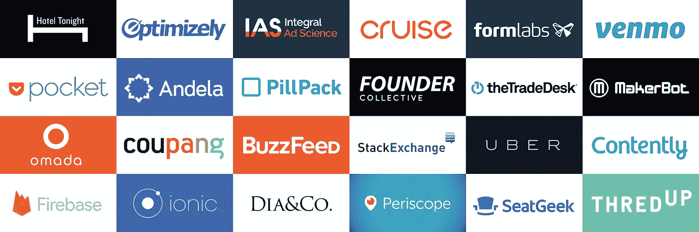

# 宣布创始人集体三

> 原文：<https://medium.com/hackernoon/announcing-founder-collective-iii-6fad299bb2b1>

今天，我们自豪地宣布，我们的第三只基金以 7500 万美元的总资本承诺结束。这一新基金的总规模与 Founder Collective II*相同，将允许我们继续我们的使命，为处于种子阶段的创始人建立最一致的基金。坚持编织有时看起来很无聊，但我们继续我们从第一天开始实践的相同精神——让创始人结盟成为我们的最高优先事项，保持小规模，热爱怪异和美好。

# 我们以结盟和同理心开始和结束

Founder Collective 的理念是“点对点投资”对创业者有巨大的好处。方正集体的每个人都开了一家公司。我们经历了好事:筹资、产品发布、团队建设；坏消息是:裁员、压力和孤独。我们在这里是合作伙伴、朋友和传声筒——同时也提供资本。

我们不是生命周期投资者。我们在种子阶段投资 20 万至 20 万美元 2M，通常会在首轮融资中出具一份支持支票。这些投资不是未来融资轮的选项。我们不买期权，这样我们的创始人可以拥有更多的期权。通过与我们的创始人一起稀释，他们知道我们在做出未来融资决策时与他们有相同的利益。

# 风险投资应该是一种工具，而不是毒品

我们为自 2009 年大衰退期间创办方正集体以来的发展感到自豪。我们的前两只基金的表现超出了我们的高预期，这要感谢一群了不起的投资组合公司。

我们的投资者渴望投入更多资金，并鼓励我们筹集更大规模的基金，但我们有目的地选择保持 Founder Collective III 与 Founder Collective II 相同的规模，因为我们渴望实践高效的企业家精神。我们认为，我们无法与创始人保持一致，也无法在更大的资金配置压力下管理更大的基金。

更多的资本并不会让企业家变得更聪明，正如我们最近对 [71 家近期科技公司 IPO](https://techcrunch.com/2016/10/15/overdosing-on-vc-lessons-from-71-ipos/)的研究显示，过多的资金会损害企业，我们相信种子投资者也是如此。我们也要多吃拉面，少吃牛排。

# 我们喜欢怪异和奇妙的东西

方正集团仍然自豪地反对主题。我们关注阶段，不区分行业。从历史上看，这让我们投资了从[广告技术](http://www.wsj.com/articles/the-trade-desk-surges-in-first-day-of-trading-1474499560)到[自动驾驶汽车](http://fortune.com/2016/03/11/gm-buying-self-driving-tech-startup-for-more-than-1-billion/)的广泛行业。[速溶咖啡](http://www.nytimes.com/2016/07/05/t-magazine/food/gourmet-instant-coffee-san-francisco.html?_r=0)和[寄售](http://www.forbes.com/sites/ryanmac/2015/09/10/thredup-seller-of-secondhand-clothes-bags-81-million-from-goldman-sachs/)。[药丸输送](https://www.wired.com/2014/02/pillpack-uses-design-thinking-become-pharmacy-future/)以及[加大码时尚](http://www.recode.net/2016/9/13/12902170/sequoia-dia-co-funding-20-million)。[拼车](http://www.bloomberg.com/news/features/2016-08-18/uber-s-first-self-driving-fleet-arrives-in-pittsburgh-this-month-is06r7on)和[实时 web 开发](https://techcrunch.com/2014/10/21/google-acquires-firebase-to-help-developers-build-better-realtime-apps/)。[演唱会门票](https://www.washingtonpost.com/lifestyle/magazine/seatgeek-is-a-smart-way-to-buy-sports-and-concert-tickets/2016/06/02/2ad17ae6-13a2-11e6-81b4-581a5c4c42df_story.html)和[码校](http://money.cnn.com/2016/06/16/technology/andela-24-million-chan-zuckerberg-foundation/)。我们寻找杰出的创始人，他们激励我们，并清晰地阐述令人信服的用例。今天怪异的用例成为明天的热门主题。

# 我们是自己最大的投资者

风险基金投资者的一个典型抱怨是，风险投资更多地扮演了代理人而非委托人的角色。在大多数风险基金中，创投资本家本身只占基金资本的很小一部分，他们的行为很可能像基金经理。我们是校长。我们，合伙人，是创始人集体 III 的最大投资者，因此在结构上的定位与典型的风险投资不同。就是这样。据我们所知，这在风险行业是独一无二的。

正如我们自 2009 年 FC 成立以来所做的那样，全职投资团队自豪地加入了一批创始人合伙人。SeatGeek 的 [Jack Groetzinger](https://twitter.com/jackgretz) 、Firebase 的 [James Tamplin](https://twitter.com/JamesTamplin) 、Bloomreach 的 [Raj De 达塔](https://twitter.com/rdedatta)、Flickr 和 Hunch 的 [Caterina Fake](https://twitter.com/Caterina) 以及 DIY 和 Vimeo 的 [Zach Klein](https://twitter.com/zachklein) 提供了宝贵的观点，并让我们的团队在作为创始人每天练习他们的技能时，能够脚踏实地地建立一个伟大的公司。

如果你正致力于改变世界的事情，或大或小，请联系 Contact@FounderCollective.com 的我们，并在 Twitter 上关注我们，电话: [@fcollective](https://twitter.com/fcollective) 。

附:查看我们的[新网站](http://www.foundercollective.com/)，由我们的投资组合公司 [B12](https://b12.io/) 设计！

*|*为了清晰和法律一致性，每只基金的资本承诺总额约为 7500 万美元，由一只主要基金和一只平行基金组成。*

> [黑客中午](http://bit.ly/Hackernoon)是黑客如何开始他们的下午。我们是 T21 家庭的一员。我们现在[接受投稿](http://bit.ly/hackernoonsubmission)并乐意[讨论广告&赞助](mailto:partners@amipublications.com)机会。
> 
> 如果你喜欢这个故事，我们推荐你阅读我们的[最新科技故事](http://bit.ly/hackernoonlatestt)和[趋势科技故事](https://hackernoon.com/trending)。直到下一次，不要把世界的现实想当然！

