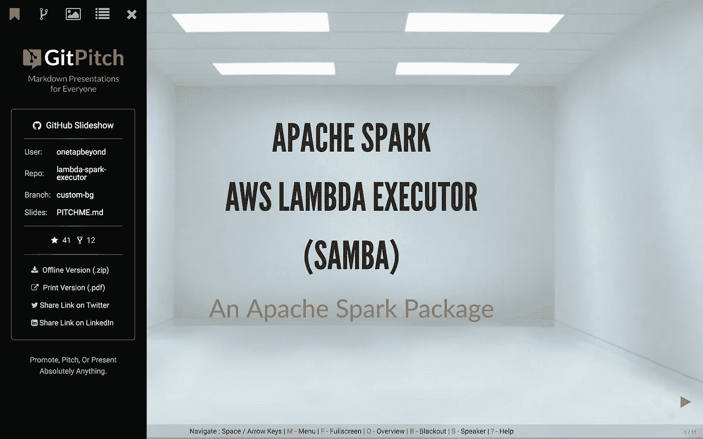
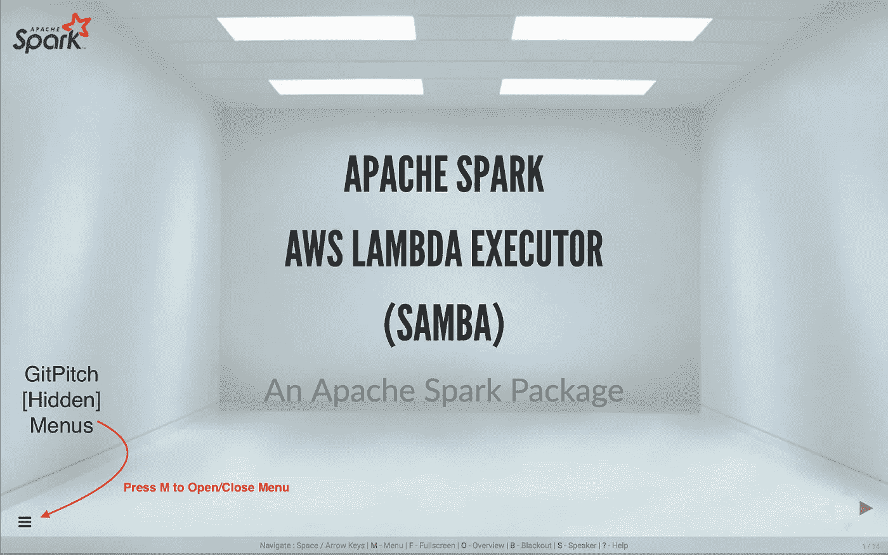
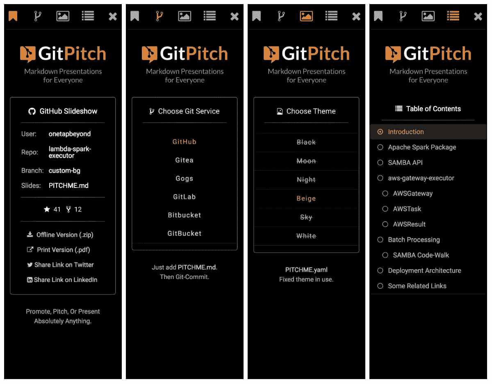
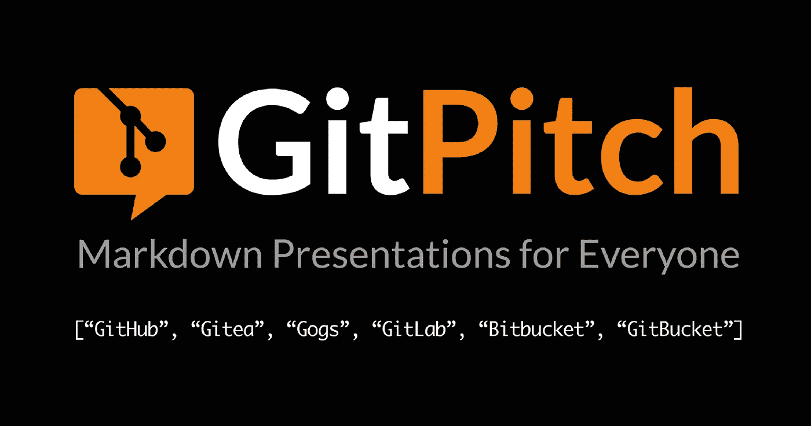

# 发布 GitPitch 2.0

> 原文：<https://medium.com/hackernoon/announcing-gitpitch-2-0-27b10627a984>

> Git 上面向所有人的降价演示。*

今天，我很高兴地宣布一个重要的新 GitPitch 版本:2.0。这一版本代表了自 2016 年 8 月我第一次[开源](https://github.com/gitpitch/gitpitch) GitPitch (1.0)并推出[GitPitch.com](https://gitpitch.com)以来一年多工作的高潮。

受到来自 GitPitch 社区的巨大反馈的启发，我对 2.0 的关注很明确。我想做些改变，让**把你的演示内容** *放在最突出的位置*。

所以事不宜迟，向全新的 GitPitch 2.0 问好:

[ GitPitch 2.0 Sample Presentation ] — Click To Launch

单击上面的屏幕截图启动并探索示例演示。2.0 中的一些**新特性**包括:

1.  git pitch[隐藏]菜单
2.  GitPitch 幻灯片目录
3.  GitPitch 通知栏

以下是 2.0 版本的一些亮点的简要总结。最后，我想谈谈 GitPitch 的未来。

# 2.0 中的新功能:git pitch[隐藏]菜单

此次发布的主要目标是**将您的演示内容** *放在最突出的位置*。下一张截图展示了这一设计目标的实践:

如你所见，我已经从页面上移除了所有的 GitPitch 品牌和功能菜单。这可以确保你的演示内容占据中心位置，并让你的观众关注对你来说最重要的事情。

这并不是说 GitPitch 为支持您的演示而提供的所有优秀特性都不再可用了。事实上，2.0 *扩展了*的特性列表，增加了一些很棒的新特性。

这些功能现在可以从 git pitch[隐藏]菜单中获得。您可以通过点击汉堡菜单图标或按键盘上的`M`键来访问这些功能。

以下示例截图显示了四个新菜单面板中的每一个:

[ GitPitch 2.0 Sample Presentation Menus ] — Click To Launch

如您所见，您喜欢的所有 GitPitch 特性仍然可用。另外，最后一个菜单面板引入了一个全新的 2.0 特性，可用于所有在线和离线演示。现在让我们仔细看看这个新特性。

# 2.0 中的新功能:GitPitch 幻灯片目录

这项新功能引入了一种**的新方式来浏览和导航**您的演示文稿。作为一个演示文稿作者，您可以坐下来享受这个功能，这要归功于一点点 GitPitch 的魔力。

GitPitch 现在会为每个演示文稿自动生成一个目录。当你更新你的演示内容时，GitPitch 会自动为你更新目录。

[ GitPitch 2.0 Sample Table-of-Contents ] — Click To Launch

一个额外的特性允许演示文稿作者为任何演示文稿定制目录。TOC 定制很简单，在 GitPitch Wiki [这里](https://github.com/gitpitch/gitpitch/wiki/Table-Of-Contents)有详细描述。

# 2.0 中的新功能:GitPitch 通知栏

在每个演示文稿的页脚添加一个新的通知栏，现在以多种方式添加了**特定于幻灯片的及时上下文**。

## 1.帮助通知

在每个演示文稿的第一张幻灯片上，GitPitch 会显示键盘快捷键和相关链接。这些快速提醒帮助每个人充分利用他们的 GitPitch 体验。

## 2.脚注通知

对演示文稿中自定义脚注的支持已经有一段时间了。他们可以显示版权通知或与内容、产品、服务等相关的链接。

在 2.0 版本中，GitPitch 现在在通知栏中显示前置和居中。

如果没有自定义脚注，GitPitch 会向您的演示观众显示有用的上下文，例如:

## 3.代码呈现通知

新通知栏中我最喜欢的一项是与 GitPitch [代码展示](https://github.com/gitpitch/gitpitch/wiki/Code-Presenting)的结合。

当呈现代码时，您可以单步执行任意数量的块、函数或整个源代码流控制。代码展示通知现在让每个人都能清楚地感受到每个代码幻灯片的进度:

# 通往 2.0 的道路:一些个人亮点

在过去的一年里，我推出了许多新的 GitPitch 特性，并使用 GitPitch 博客向社区介绍了其中的一些特性。以下是一些热门帖子的快速列表:

*   [[博客]演讲嘉宾——给大家的笔记](/@gitpitch/presentation-speaker-notes-for-everyone-19bdc67b1910)
*   [【博客】让你的代码说话](https://hackernoon.com/let-your-code-do-the-talking-983906a3a587)
*   [【博客】让你的博客来说话](https://hackernoon.com/let-your-gists-do-the-talking-fe4c2481f31)
*   [[博客]只需 60 秒就能完成降价演示](/@gitpitch/markdown-to-presentation-in-just-60-seconds-835ebb9cc5dc)

当 GitPitch 1.0 首次推出时，它支持任何在 [GitHub](https://github.com/) 、 [GitLab](https://gitlab.com/) 或 [Bitbucket](https://bitbucket.org/) 上拥有账户的人。从那以后，我继续添加对其他优秀开源 Git 解决方案的支持，包括 [GitBucket](https://github.com/gitbucket/gitbucket) 、 [Gitea](https://github.com/go-gitea/gitea) 和 [Gogs](https://github.com/gogits/gogs) 。

我对进一步扩展 GitPitch 的影响持开放态度，所以如果你知道任何有趣的 Git 提供商可能会享受到 [PITCHME.md](https://github.com/gitpitch/gitpitch/wiki) 的力量，请联系我。

看到 GitPitch 社区接受这项服务绝对是过去一年的亮点之一。您创建并分享了一些精彩的演示文稿。

为了庆祝这些演讲和他们的作者，我写了一系列博客，你可以在这里找到:

*   [【博客】GitPitch 每日系列演示](/search?q=GitPitch%20Presentation%20of%20the%20Day)

Samples Presentations from the GitPitch Community

这些帖子是学习如何使用 GitPitch 的好方法，所以我强烈推荐你去看看。

# 超越 2.0 的道路

> 描绘你的未来——但要用铅笔。——乔恩·邦·乔维

所以你有它。GitPitch 2.0 上线了！

从今天起，所有演示文稿将在[GitPitch.com](https://gitpitch.com)上自动显示为 GitPitch 2.0 演示文稿。

虽然过去的一年令人着迷，但我已经将注意力转向了未来的一年，以及这一年对 GitPitch 意味着什么。

> **展示未来:邀请 GitPitch 社区**

虽然我对 GitPitch 2.x 和更高版本有自己的想法，但是 GitPitch 的未来还没有写出来。但是这个过程即将开始。所以现在是你帮助塑造未来的机会。

这是对所有人的邀请。在塑造 GitPitch 未来的过程中发表您的意见。告诉我你的想法，无论大小。请随意使用下面的评论部分，或者直接在 [Twitter](https://twitter.com/gitpitch) 或通过电子邮件联系我。

最后一件事。我想说非常感谢社区中的每一个人，感谢他们帮助 GitPitch 成为 Git 上事实上的 markdown 展示工具。*谢谢！

正如他们所说，未来从今天开始。对于 GitPitch 来说，前进的道路是向上的。感谢您的阅读和愉快的演示。大卫。

**您可以在** [**Medium**](/@gitpitch) **或**[**Twitter**](https://twitter.com/gitpitch)**上关注我，了解 GitPitch 社区的更多新闻、技巧和独特创意。**