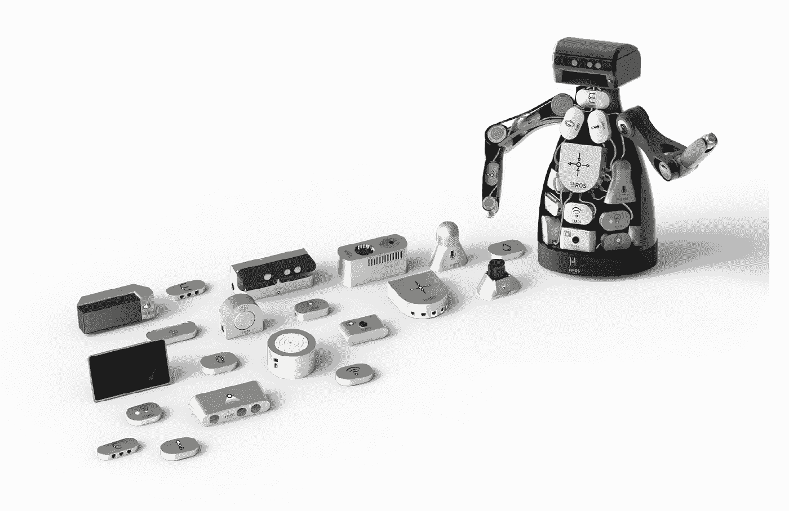
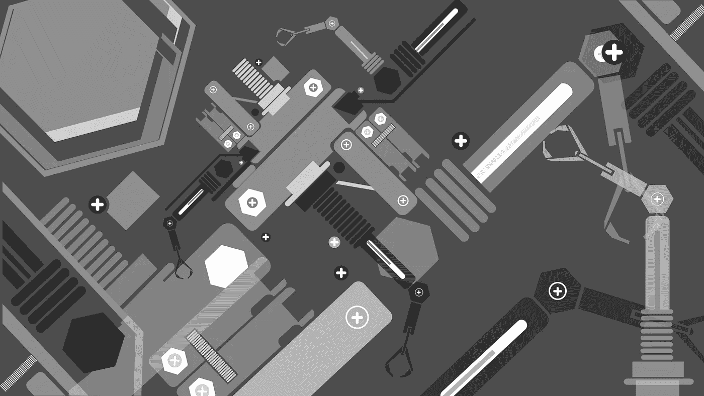

# 宣布 H-ROS:硬件机器人操作系统

> 原文：<https://medium.com/hackernoon/announcing-h-ros-the-hardware-robot-operating-system-c6054ee3f9eb>

## 标准化的软件和硬件基础设施，可轻松创建可重复使用和可重新配置的机器人硬件部件。

我很高兴地宣布一个新的改变游戏规则的建造机器人组件的标准， [H-ROS](http://www.h-ros.com) :硬件机器人操作系统。H-ROS 为制造商[提供工具](https://hackernoon.com/tagged/tools)，用于构建可互操作的机器人组件，这些组件可以在机器人之间轻松交换或替换。

> H-ROS 是关于支持机器人硬件组件的公共环境，其中制造商遵守基于 ROS 构建的标准接口。

H-ROS 由流行的机器人操作系统(ROS)提供动力，并在考虑到行业和开发人员的情况下建造了*，H-ROS 将机器人组件分为 **5 种类型** : ***传感*** —用于感知世界， ***驱动*** —允许与环境交互， ***通信*** —提供互联手段， ***认知*** —大脑这种积木式部件是可重复使用和可重新配置的组件，允许开发人员使用不同制造商的硬件轻松升级他们的机器人，并在几秒钟内添加新功能。*

**

# *动机和起源*

*建造机器人被认为是一项艰巨的任务，因此重用以前的工作来降低复杂性是有意义的。不幸的是，现在学术界和工业界都很少努力重用硬件。机器人通常由多学科团队(通常是整个研究小组或公司部门)制造，不同的工程师参与机械、电气和逻辑设计。大部分时间花在处理硬件/ [软件](https://hackernoon.com/tagged/software)接口上，很少投入到行为发展或真实世界场景中。现有的硬件平台虽然开始变得越来越普遍，但缺乏可扩展性。*

*在最近上市的几种商业和工业机器人中可以看到这样的例子，这些机器人已经包括一个通用的软件基础设施(通常是机器人操作系统(ROS))，但缺乏硬件标准。*

> *对于 H-ROS，建造机器人将是将 H-ROS 兼容的硬件组件放在一起，以构建新的机器人配置。制造机器人不会局限于少数具有高技术技能的人，而是会扩展到大多数对特定场景中所需的传感和驱动有一般理解的人。*

> *H-ROS 最初由美国国防高级研究计划局(DARPA)在 2016 年通过机器人快速通道计划资助，由[乐儿机器人](http://erlerobotics.com)开发。*

*H-ROS 现已面向**选定的行业合作伙伴**推出，并将很快面向更广泛的机器人社区发布。更多信息可通过其位于 https://h-ros.com/[的官方网页查询。](https://h-ros.com/)*

**H-ROS 将于韩国首尔*[*ROSCon 2016*](http://roscon.ros.org)*(10 月 8 日-9 日)正式展示和呈现。**

******

> *[黑客中午](http://bit.ly/Hackernoon)是黑客如何开始他们的下午。我们是阿妹家庭的一员。我们现在[接受投稿](http://bit.ly/hackernoonsubmission)并乐意[讨论广告&赞助](mailto:partners@amipublications.com)的机会。*
> 
> *如果你喜欢这个故事，我们推荐你阅读我们的[最新科技故事](http://bit.ly/hackernoonlatestt)和[趋势科技故事](https://hackernoon.com/trending)。直到下一次，不要把世界的现实想当然！*

**